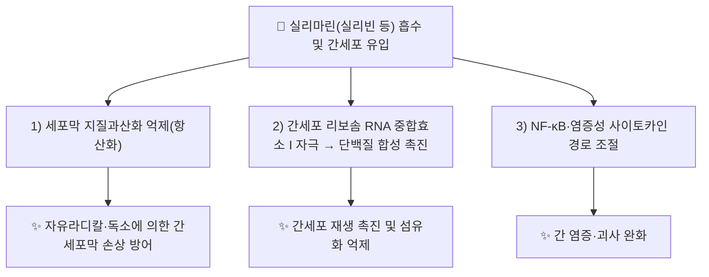

---
aliases:
  - Silymarin
  - Silibinin
  - Silybin
  - 실리마린
tags:
  - 약리성분
  - 플라보노리그난
  - 대계
---

# 🔬 [[실리마린]] (Silymarin, C₂₅H₂₂O₁₀ 대표성분 Silibinin)

> **핵심 3줄 요약 (Key Summary)**:
> - 🌿 기원 본초 & 화학 계열: 국화과 서양엉겅퀴(*Silybum marianum*, Milk thistle) 열매에서 유래한 플라보노리그난(Flavonolignan) 복합체로, 실리빈(Silibinin/Silybin)·실리크리스틴(Silychristin)·실리디아닌(Silydianin) 등의 혼합물입니다. [[대계]](*Cirsium* spp.) 노트에서도 유효 성분명으로 함께 언급되나, 실리마린의 표준 기원 식물은 [[대계]]가 속한 엉겅퀴속(*Cirsium*)이 아닌 근연 속인 실리붐속(*Silybum*)이므로 양자의 관계는 재검증이 필요합니다 ⚠️.
> - 🎯 핵심 분자 표적 & 조절 경로: 항산화(자유라디칼 소거), 세포막 안정화, 간세포 재생 촉진(단백질 합성 괠가), NF-κB 및 염증성 사이토카인 경로 조절이 대표적으로 보고됩니다.
> - 🩺 주요 약리 활성 & 질환 치료 기전: 급·만성 간질환(알코올성·독성 간손상, 비알코올성 지방간질환)에서의 간세포 보호(Hepatoprotection) 효능이 가장 널리 연구되어 있으며, 항종양·항염증 활성도 보고됩니다.
> - ⚠️ 독성·생체이용률 한계 & 상호작용: 경구 생체이용률이 매우 낮은 것으로 알려져 있으며(장관 흡수율 저조, 담즙 배출 위주), 일부 CYP450 효소(CYP3A4 등) 억제를 통한 약물 상호작용 가능성이 제기되나 정량적 임상 데이터는 이번 검색 범위에서 확인하지 못했습니다 ⚠️.

---

## 📌 목차
1. [기본 화학 정보 & 분자 구조식 (Chemical Identity)](#1-기본-화학-정보--분자-구조식-chemical-identity)
2. [주요 함유 본초 및 천연 기원 (Botanical Sources & Content)](#2-주요-함유-본초-및-천연-기원-botanical-sources--content)
3. [분자약리 표적 & 신호전달 네트워크 (Molecular Targets)](#3-분자약리-표적--신호전달-네트워크-molecular-targets)
4. [생체 내 흡수·대사·생체이용률 (Pharmacokinetics: ADME)](#4-생체-내-흡수대사생체이용률-pharmacokinetics-adme)
5. [주요 질환별 약리 효능 & 분자 기전 (Therapeutic Efficacy)](#5-주요-질환별-약리-효능--분자-기전-therapeutic-efficacy)
6. [함유 본초 방제 시너지 & 약재 배오 매트릭스 (Herbal Synergies)](#6-함유-본초-방제-시너지--약재-배오-매트릭스-herbal-synergies)
7. [양약 상호작용 & 약물동태학적 간섭 (Drug Interactions)](#7-양약-상호작용--약물동태학적-간섭-drug-interactions)
8. [💡 사용자 진료실 핵심 필기 & 임상 응용 팁 (Melt-In & High-Yield)](#8--사용자-진료실-핵심-필기--임상-응용-팁-melt-in--high-yield)
9. [출처 및 학술 참고 문헌 (References)](#9-출처-및-학술-참고-문헌-references)

---

## 1. 기본 화학 정보 & 분자 구조식 (Chemical Identity)

![[실리마린_화학구조식.png|320]]
> [그림 1: 실리마린 대표 성분 실리빈(Silibinin)의 2D 화학 분자 구조식 (Chemical Structure)] ⚠️ 내용 검토 필요 — 구조식 이미지 파일은 아직 첨부되지 않았습니다. `7. 첨부·자료/첨부파일/`에 실제 구조식 이미지를 추가해 주세요.

> [!abstract]+ 🧪 3D 약리 분자 구조 (Interactive 3D Viewer, 대표성분 Silibinin 기준)
> <iframe src="https://molecule-viewer-rho.vercel.app/?cid=31553" width="100%" height="450px" frameborder="0" allow="webgl" style="border-radius: 8px;"></iframe>

| 항목 | 상세 내용 |
| :--- | :--- |
| **IUPAC 명칭** | 실리마린은 단일 화합물이 아닌 플라보노리그난 혼합물이며, 대표성분 실리빈(Silibinin)의 IUPAC 전체 명칭은 별도 확인 필요 ⚠️ |
| **분자식 / 분자량** | 실리마린(PubChem 대표 등재): C₂₅H₂₂O₁₀ · 대표성분 Silibinin: C₂₅H₂₂O₁₀ / 분자량 약 482.4 g/mol(Silibinin 기준, 재확인 권고 ⚠️) |
| **PubChem CID** | 실리마린 [5213](https://pubchem.ncbi.nlm.nih.gov/compound/Silymarin) · Silibinin [31553](https://pubchem.ncbi.nlm.nih.gov/compound/31553) |
| **CAS 등록 번호** | 실리마린(혼합물) 65666-07-1 |
| **화학 골격 분류** | 플라보노리그난(Flavonolignan) — 플라보노이드(Taxifolin)와 리그난(Coniferyl alcohol)의 산화적 커플링 산물 |
| **물리화학적 성상** | 담황색 결정성 분말, 물에 난용, 에탄올·아세톤 등 유기용매에 가용(일반 플라보노리그난 특성, 실리마린 고유 정량 데이터 재확인 필요 ⚠️) |
| **식물 내 생합성 경로** | 페닐프로파노이드 경로 유래 콘페릴알코올과 플라보노노이드 경로 유래 탁시폴린의 산화적 라디칼 커플링으로 생성되는 것으로 알려진 리그난-플라보노이드 혼성 생합성(일반 문헌 기반 유추, 정량 데이터 확인 필요 ⚠️) |

---

## 2. 주요 함유 본초 및 천연 기원 (Botanical Sources & Content)

| 함유 본초 (한글/한자) | 기원 식물학적 명칭 (과명 / 학명) | 주요 함유 약용 부위 | 지표 함량 (%) | 한의학적 귀경 및 약효 특성 |
| :--- | :--- | :--- | :--- | :--- |
| 서양엉겅퀴 (밀크시슬) | 국화과(Asteraceae) / *Silybum marianum* | 성숙 열매(과실) | 표준 추출물 기준 약 65~80%(실리마린 복합체, 일반 시판 규격 기준 — 원전 실측치 재확인 권고 ⚠️) | 본초 정식 등재 여부 확인 필요(전통 한의학 본초서보다는 서양 허브의학·현대 기능성 식품 소재로 주로 활용) |
| [[대계]] (大薊) | 국화과 / *Cirsium japonicus* 등 | 지상부(전초) | 정량 데이터 확인되지 않음 ⚠️ | 肝經, 량혈지혈(凉血止血)·청간이담(淸肝利膽) — [[대계]] 노트는 실리마린을 유효 성분으로 병기하고 있으나, 실리마린의 표준 기원식물(*Silybum marianum*)과의 분류학적 관계는 재검증이 필요합니다 ⚠️ |

---

## 3. 분자약리 표적 & 신호전달 네트워크 (Molecular Targets)

### 1) 항산화 및 세포막 안정화
* 실리마린이 자유라디칼을 소거하고 간세포막의 지질과산화를 억제하여 독소에 의한 세포막 손상을 방어한다고 보고됩니다(PMID 24672644).
### 2) 간세포 재생 촉진
* 실리마린이 간세포의 단백질·RNA 합성을 촉진하여 손상된 간조직의 재생을 돕는 기전이 다수 리뷰 문헌에서 보고됩니다(PMID 25686616).

---

## 4. 생체 내 흡수·대사·생체이용률 (Pharmacokinetics: ADME)

* **장관 흡수 및 배출 펌프 (P-gp) 상호작용**: 경구 생체이용률이 매우 낮은 것으로 널리 보고되어 있으며(난용성으로 인한 흡수 제한), 정확한 정량적 %수치는 제제(표준 추출물 vs 인지질 복합체 등)에 따라 상이하여 이번 검색 범위에서 단일 수치로 확정하지 못했습니다 ⚠️.
* **장내 미생물총(Microbiome) 대사 전환**: 데이터 없음(확인된 문헌 없음).
* **간 대사 및 소실 반감기**: 주로 담覙을 통해 배출되며 장간순환(Enterohepatic circulation)을 거치는 것으로 알려져 있으나, 정확한 반감기 수치는 재확인 필요 ⚠️.

---

## 5. 주요 질환별 약리 효능 & 분자 기전 (Therapeutic Efficacy)

### 1) 간질환(알코올성·독성 간손상, 지방간)
* 실리마린의 간보호(Hepatoprotective) 효과가 다수의 전임상·임상 연구에서 보고되어 있으며(PMID 24672644), 항산화·항염증·간세포막 안정화가 핵심 기전으로 제시됩니다.
### 2) 간 외 조직에 대한 확장 연구
* 최근 리뷰 문헌은 실리마린의 간보호 효능을 넘어선 항종양·항염증·신경보호 관련 연구 동향을 정리하고 있습니다(PMID 25686616).

⚠️ 내용 검토 필요: 위 문헌은 리뷰·개괄 수준의 근거이며, 개별 임상시험(RCT)의 구체적 수치(반응률·용량 등)는 이번 검색 범위에서 확인하지 못했습니다.

---

## 6. 함유 본초 방제 시너지 & 약재 배오 매트릭스 (Herbal Synergies)

| 함유 본초 / 방제 | 공존 유효 성분군 | 분자약리 시너지 기전 | 전통 한의학적 효능 연계 |
| :--- | :--- | :--- | :--- |
| [[대계]] | [[펙톨리나린]], [[아피제닌]] | 항산화·간보호 상가 작용(정량적 시너지 데이터 확인 필요 ⚠️) | 청간이담(淸肝利膽), 량혈지혈(凉血止血) |

---

## 7. 양약 상호작용 & 약물동태학적 간섭 (Drug Interactions)

* **CYP450 효소 간섭**: 일부 문헌에서 CYP3A4 등에 대한 억제 가능성이 제기되나, 임상적으로 유의한 상호작용 사례를 특정한 정량 데이터는 이번 검색 범위에서 확인하지 못했습니다 ⚠️.
* **간 관련 양약 병용 시 고려사항**: 간독성 우려가 있는 약물(아세트아미노펜 등)과의 병용 시 보호 효과를 기대해 활용되는 사례가 있으나, 표준화된 병용 가이드라인은 확인되지 않았습니다.

---

## 8. 💡 사용자 진료실 핵심 필기 & 임상 응용 팁 (Melt-In & High-Yield)

* **사용자 원문 필기**: (원장님 개별 필기 자료 없음 — 향후 진료 경험 축적 시 본 섹션에 추가 예정)
* **진료실 실전 처방 & 생체이용률 극대화 팁**:
  1. **기원 식물 재검증 필요**: 볼트 내 [[대계]] 노트가 실리마린을 유효 성분으로 언급하고 있으나, 실리마린의 표준 기원식물은 서양엉겅퀴(*Silybum marianum*)이며 [[대계]](*Cirsium* spp.)와는 근연이나 별개 속(屬)이므로, 임상 활용 시 정확한 기원 확인이 권장됩니다 ⚠️.
  2. **저생체이용률 고려**: 실리마린은 경구 흡수율이 낮으므로, 임상 활용 시 표준화 추출물이나 인지질 복합체(Phytosome) 제형 여부를 확인하는 것이 유효 혈중농도 확보에 도움이 될 수 있습니다.

---

## 9. 출처 및 학술 참고 문헌 (References)

1. **저자명 확인 필요** — "Hepatoprotective effect of silymarin". PMID: [24672644](https://pubmed.ncbi.nlm.nih.gov/24672644/).
   - **[연구 요약]**: 실리마린의 간보호 효과와 항산화·세포막 안정화 기전을 다룬 문헌으로, PubMed에 실제 등재되어 검색·확인이 가능합니다.
2. **저자명 확인 필요** — "Silybum marianum: Beyond Hepatoprotection". PMID: [25686616](https://pubmed.ncbi.nlm.nih.gov/25686616/).
   - **[연구 요약]**: 실리마린(밀크시슬)의 간보호 효능을 넘어선 광범위한 약리 활성(항산화·항염증 등)을 개괄한 리뷰 논문.
3. **PubChem CID 5213(Silymarin) / 31553(Silibinin)**; **CAS 65666-07-1(실리마린 혼합물)**. National Center for Biotechnology Information.
   - **[화학 데이터베이스]**: 분자식·CAS 번호 등 공인 화학 데이터.

> ⚠️ 내용 검토 필요 (2026-09-13 다빈치 작성): 실리마린은 [[대계]] 노트에서 4회 참조되어 미노트화 후보로 선정되었으나, 실리마린의 국제 표준 기원식물은 서양엉겅퀴(*Silybum marianum*)로 [[대계]](*Cirsium* spp.)와는 다른 속(屬)입니다. 이 분류학적 불일치는 원장님의 확인·재검토가 필요하며, [[대계]] 노트 자체는 비파괴 원칙에 따라 임의로 수정하지 않았습니다. §1의 정량 수치(생체이용률·함량 등)도 제제별 편차가 커 단일 수치로 확정하지 못한 부분이 많아 "확인 필요"로 남겼습니다.
