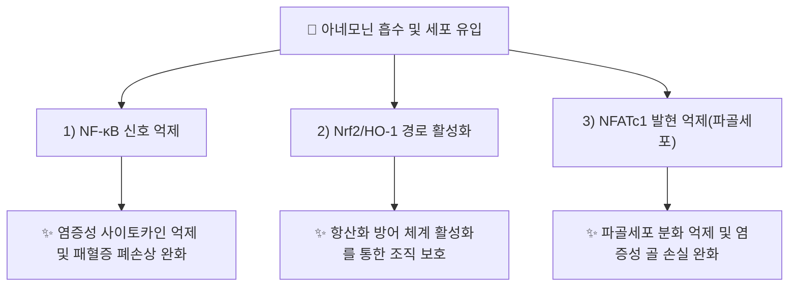

---
aliases:
  - Anemonin
  - Anemonine
  - Pulsatilla camphor
  - trans-Anemonin
  - 아네모닌
tags:
  - 약리성분
  - 락톤
  - 백두옹
---

# 🔬 [[아네모닌]] (Anemonin, C₁₀H₈O₄)

> **핵심 3줄 요약 (Key Summary)**:
> - 🌿 기원 본초 & 화학 계열: [[백두옹]](白頭翁, *Pulsatilla chinensis*)에 함유된 불포화 락톤계 화합물로, 독성 전구체인 프로토아네모닌(Protoanemonin) 2분자가 이량체화(dimerization)되어 생성되는 비교적 안정한 형태입니다.
> - 🎯 핵심 분자 표적 & 조절 경로: NF-κB 신호 억제, Nrf2/HO-1 경로 활성화, NFATc1 발현 억제(파골세포 분화 관련).
> - 🩺 주요 약리 활성 & 질환 치료 기전: 패혈증 유발 급성 폐손상 완화, RANKL 유발 파골세포 분화 및 LPS 유발 염증성 골 손실 억제 — [[백두옹]]의 청열해독(淸熱解毒)·량혈지리(凉血止痢) 효능과 연관되는 항염 기전으로 제시됩니다.
> - ⚠️ 독성·생체이용률 한계 & 상호작용: 전구체인 프로토아네모닌 자체는 피부·점막 자극성이 알려진 독성 물질이며, 아네모닌으로의 이량체화 후 독성이 상당히 감소하는 것으로 알려져 있으나 정량적 안전역(margin of safety) 데이터는 이번 검색 범위에서 확인되지 않았습니다.

---

## 📌 목차
1. [기본 화학 정보 & 분자 구조식 (Chemical Identity)](#1-기본-화학-정보--분자-구조식-chemical-identity)
2. [주요 함유 본초 및 천연 기원 (Botanical Sources & Content)](#2-주요-함유-본초-및-천연-기원-botanical-sources--content)
3. [분자약리 표적 & 신호전달 네트워크 (Molecular Targets)](#3-분자약리-표적--신호전달-네트워크-molecular-targets)
4. [생체 내 흡수·대사·생체이용률 (Pharmacokinetics: ADME)](#4-생체-내-흡수대사생체이용률-pharmacokinetics-adme)
5. [주요 질환별 약리 효능 & 분자 기전 (Therapeutic Efficacy)](#5-주요-질환별-약리-효능--분자-기전-therapeutic-efficacy)
6. [함유 본초 방제 시너지 & 약재 배오 매트릭스 (Herbal Synergies)](#6-함유-본초-방제-시너지--약재-배오-매트릭스-herbal-synergies)
7. [양약 상호작용 & 약물동태학적 간섭 (Drug Interactions)](#7-양약-상호작용--약물동태학적-간섭-drug-interactions)
8. [💡 사용자 진료실 핵심 필기 & 임상 응용 팁 (Melt-In & High-Yield)](#8--사용자-진료실-핵심-필기--임상-응용-팁-melt-in--high-yield)
9. [출처 및 학술 참고 문헌 (References)](#9-출처-및-학술-참고-문헌-references)

---

## 1. 기본 화학 정보 & 분자 구조식 (Chemical Identity)

![[아네모닌_화학구조식.png|320]]
> [그림 1: 아네모닌의 2D 화학 분자 구조식 (Chemical Structure)] ⚠️ 내용 검토 필요 — 구조식 이미지 파일은 아직 첨부되지 않았습니다. `7. 첨부·자료/첨부파일/`에 실제 구조식 이미지를 추가해 주세요.

> [!abstract]+ 🧪 3D 약리 분자 구조 (Interactive 3D Viewer)
> <iframe src="https://molecule-viewer-rho.vercel.app/?cid=10496" width="100%" height="450px" frameborder="0" allow="webgl" style="border-radius: 8px;"></iframe>

| 항목 | 상세 내용 |
| :--- | :--- |
| **IUPAC 명칭** | 4,4'-(1,2-Ethenediyl)bis(2(5H)-furanone) 계열 이량체 락톤 (Pulsatilla camphor) |
| **분자식 / 분자량** | C₁₀H₈O₄ / 약 192.17 g/mol |
| **PubChem CID** | [10496](https://pubchem.ncbi.nlm.nih.gov/compound/10496) |
| **CAS 등록 번호** | 508-44-1 |
| **화학 골격 분류** | 불포화 락톤(부테놀라이드) 이량체 |
| **물리화학적 성상** | 백색 결정성 고체, 수용성이 낮은 편, 열에 비교적 안정 |
| **식물 내 생합성 경로** | 미나리아재비과 식물에 널리 분포하는 배당체 라눈쿨린(Ranunculin)이 효소적으로 가수분해되어 불안정한 프로토아네모닌으로 전환된 뒤, 2분자가 자발적으로 이량체화(Diels-Alder형 또는 광유도 이량체화)하여 아네모닌이 생성되는 것으로 알려져 있습니다. |

---

## 2. 주요 함유 본초 및 천연 기원 (Botanical Sources & Content)

| 함유 본초 (한글/한자) | 기원 식물학적 명칭 (과명 / 학명) | 주요 함유 약용 부위 | 지표 함량 (%) | 한의학적 귀경 및 약효 특성 |
| :--- | :--- | :--- | :--- | :--- |
| [[백두옹]] (白頭翁) | 미나리아재비과(Ranunculaceae) / *Pulsatilla chinensis* | 뿌리 | ⚠️ 내용 검토 필요(정량 데이터 미확인) | 大腸·胃經, 청열해독·량혈지리 |

> 아네모네(*Anemone*), 미나리아재비(*Ranunculus*) 등 미나리아재비과 식물 전반에 라눈쿨린-프로토아네모닌-아네모닌 경로가 공통적으로 보고되어 있으나, 본 노트는 한의학 임상과 직결되는 [[백두옹]] 기원을 중심으로 정리합니다.

---

## 3. 분자약리 표적 & 신호전달 네트워크 (Molecular Targets)

### 1) 패혈증 유발 급성 폐손상에서의 NF-κB/Nrf2 조절
* 패혈증 유발 급성 폐손상(ALI) 모델에서 아네모닌이 NF-κB를 비활성화하고 Nrf2/HO-1 경로를 활성화하여 폐손상을 완화한다고 보고되었습니다(PMID 39825692).
### 2) 파골세포 분화 억제(NFATc1)
* RANKL 유발 파골세포 분화 모델 및 LPS 유발 염증성 골 손실 마우스 모델에서 아네모닌이 NFATc1 발현을 조절하여 파골세포 형성과 골 손실을 억제한다고 보고되었습니다(PMID 32116686).

---

## 4. 생체 내 흡수·대사·생체이용률 (Pharmacokinetics: ADME)

* **장관 흡수 및 배출 펌프 (P-gp) 상호작용**: ⚠️ 내용 검토 필요 — 이번 검색 범위에서 아네모닌에 특정된 P-gp 상호작용 데이터를 확인하지 못했습니다.
* **장내 미생물총(Microbiome) 대사 전환**: ⚠️ 내용 검토 필요 — 확인된 문헌 없음.
* **간 대사 및 소실 반감기**: ⚠️ 내용 검토 필요 — 정량적 반감기·생체이용률 데이터는 확인하지 못했습니다.

---

## 5. 주요 질환별 약리 효능 & 분자 기전 (Therapeutic Efficacy)

### 1) 패혈증·급성 폐손상
* 패혈증 유발 급성 폐손상 마우스 모델에서 NF-κB 비활성화 및 Nrf2/HO-1 경로 활성화를 통한 염증·산화스트레스 완화 규명(PMID 39825692).
### 2) 염증성 골 손실(파골세포 과다 활성화)
* RANKL 유발 파골세포 분화 및 LPS 유발 염증성 골 손실 모델에서 NFATc1 조절을 통한 골 보호 효과 규명(PMID 32116686) — [[백두옹]]의 청열해독 효능과 별개로 확인된 항염·항골손실 기전으로, 향후 임상 적용 가능성은 추가 검증이 필요합니다.

⚠️ 내용 검토 필요: 위 연구는 모두 동물·세포 모델이며, 인체 대상 임상시험(RCT) 근거는 이번 검색 범위 내에서 확인되지 않았습니다. [[백두옹]]의 전통적 주치인 세균성·아메바성 이질(대장 감염증)에 대한 아네모닌 특이적 항균 기전 문헌은 이번 검색에서 명확히 확인하지 못했습니다.

---

## 6. 함유 본초 방제 시너지 & 약재 배오 매트릭스 (Herbal Synergies)

| 함유 본초 / 방제 | 공존 유효 성분군 | 분자약리 시너지 기전 | 전통 한의학적 효능 연계 |
| :--- | :--- | :--- | :--- |
| [[백두옹]] | 사포닌류(Pulsatilla saponins), 트리테르페노이드 | 항염·항균 다표적 네트워크(정량적 시너지 데이터 확인 필요 ⚠️) | 청열해독(淸熱解毒), 량혈지리(凉血止痢) |
| [[백두옹탕]] | 황련, 황백, 진피 등 청열약 배오(처방 노트 기재, 개별 성분 상호작용 데이터 확인 필요 ⚠️) | 대장 습열(濕熱) 이질 다표적 제어 | 열독혈리(熱毒血痢) 치료 |

---

## 7. 양약 상호작용 & 약물동태학적 간섭 (Drug Interactions)

* **CYP450 효소 간섭**: ⚠️ 내용 검토 필요 — 아네모닌에 특정된 CYP450 억제/유도 연구는 이번 검색 범위에서 확인하지 못했습니다.
* **항염증·면역조절 양약 병용 시 고려사항**: NF-κB·NFATc1 경로 조절 기전이 보고된 만큼, 스테로이드나 면역조절제와의 병용 시 상가적 면역조절 효과를 이론적으로 고려할 수 있으나, 이를 직접 검증한 병용 연구는 확인하지 못했습니다.

---

## 8. 💡 사용자 진료실 핵심 필기 & 임상 응용 팁 (Melt-In & High-Yield)

* **사용자 원문 필기**: (원장님 개별 필기 자료 없음 — 향후 진료 경험 축적 시 본 섹션에 추가 예정)
* **진료실 실전 처방 & 생체이용률 극대화 팁**:
  1. **생약 vs 정제 성분 구분**: 아네모닌은 전구체 프로토아네모닌보다 자극성이 낮은 안정형이지만, [[백두옹]] 생약 자체의 전탕 방식(가열 시간·건조 상태)에 따라 두 물질의 상대 비율이 달라질 수 있음을 참고합니다(일반적 특성 기술, 백두옹 개별 정량 데이터는 확인 필요 ⚠️).
  2. **청열지리(淸熱止痢) 임상 적용**: [[백두옹]]은 대장 습열 이질(세균성·아메바성 장염 양상)에 황련·황백과 배오되어 활용되어 왔으며, 최근 규명된 NF-κB/Nrf2 항염 기전은 이러한 전통적 청열해독 효능을 뒷받침하는 근거 중 하나로 참고할 수 있습니다.

---

## 9. 출처 및 학술 참고 문헌 (References)

1. **저자명 확인** — "Anemonin suppresses sepsis-induced acute lung injury by inactivation of nuclear factor-kappa B and activation of nuclear factor erythroid 2-related factor-2/heme oxygenase-1 pathway". PMID: [39825692](https://pubmed.ncbi.nlm.nih.gov/39825692/).
   - **[연구 요약]**: 패혈증 유발 급성 폐손상 마우스 모델에서 아네모닌이 NF-κB를 비활성화하고 Nrf2/HO-1 경로를 활성화하여 폐손상을 완화함을 규명.
2. **저자명 확인** — "Anemonin Attenuates RANKL-Induced Osteoclastogenesis and Ameliorates LPS-Induced Inflammatory Bone Loss in Mice via Modulation of NFATc1". *Frontiers in Pharmacology*. PMID: [32116686](https://pubmed.ncbi.nlm.nih.gov/32116686/).
   - **[연구 요약]**: RANKL 유발 파골세포 분화 및 LPS 유발 염증성 골 손실 마우스 모델에서 아네모닌이 NFATc1 발현 조절을 통해 골 손실을 완화함을 규명.
3. **PubChem CID 10496 (Anemonin)**; **CAS 508-44-1**. National Center for Biotechnology Information.
   - **[화학 데이터베이스]**: 분자식·CAS 번호 등 공인 화학 데이터.

> ⚠️ 내용 검토 필요: §2의 백두옹 내 지표 함량(%) 수치, §5의 [[백두옹]] 전통 주치(이질)에 대한 아네모닌 특이적 항균·항아메바 기전 문헌은 이번 검색 범위에서 확인하지 못해 ⚠️ 표시로 대체했습니다. §4의 정량적 ADME 데이터, §7의 CYP450 상호작용 데이터도 확인된 문헌이 없습니다.
