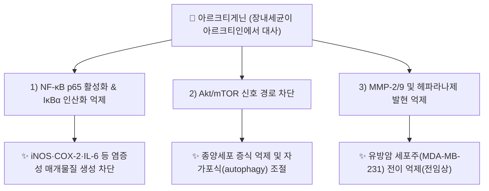

---
aliases:
  - Arctigenin
  - "(-)-Arctigenin"
  - CID 64981
tags:
  - 약리성분
  - 리그난
  - 디벤질부티로락톤리그난
  - 항염증
  - 항종양
  - 항바이러스
  - 본초학
created: 2026-09-14
updated: 2026-09-14
status: complete
compound_name_ko: 아르크티게닌
compound_name_en: Arctigenin
pubchem_cid: 64981
molecular_formula: C21H24O6
molecular_weight: 372.41 g/mol
cas_number: 7770-78-7
source_herbs:
  - 우방자
main_pharmacology:
  - "[[우방자]](우엉 씨앗)에 함유된 [[아르크티인]](Arctiin)의 장내세균 대사 활성체(아글리콘)"
  - NF-κB 및 Akt/mTOR 신호 경로 억제를 통한 항염증·항종양 작용
  - MMP-2/9 발현 억제를 통한 유방암 세포 전이 억제 보고(전임상)
---

# 🔬 [[아르크티게닌]] (Arctigenin, C₂₁H₂₄O₆)

> **핵심 3줄 요약 (Key Summary)**:
> - 🌿 기원 본초 & 화학 계열: 국화과(Asteraceae) [[우방자]](우엉 씨앗, *Arctium lappa* L.)에 함유된 [[아르크티인]](Arctiin)이 장내 세균에 의해 탈당되어 생성되는 디벤질부티로락톤형(Dibenzylbutyrolactone) 리그난(Lignan) 아글리콘.
> - 🎯 핵심 분자 표적 & 조절 경로: NF-κB p65 활성화 및 IκBα 인산화 억제, Akt/mTOR 신호 경로 차단, MMP-2/9 및 헤파라나제(Heparanase) 발현 억제.
> - 🩺 주요 약리 활성 & 질환 치료 기전: 항염증(사이토카인 생성 억제), 항바이러스(인플루엔자 복제 억제), 항종양(유방암 등 다수 암종 세포주 대상 증식·전이 억제), 골수유래억제세포(MDSC) 기능 조절을 통한 패혈성 쇼크 완화 보고.
> - ⚠️ 독성·생체이용률 한계 & 상호작용: 경구 생체이용률이 낮은 편으로 알려져 있으며, 인체 대상 임상시험 자료는 제한적(대부분 세포·동물 실험 단계)이므로 용량·상호작용에 대한 확립된 임상 데이터는 확인 불가.

---

## 📌 목차
1. [기본 화학 정보 & 분자 구조식 (Chemical Identity)](#1-기본-화학-정보--분자-구조식-chemical-identity)
2. [주요 함유 본초 및 천연 기원 (Botanical Sources & Content)](#2-주요-함유-본초-및-천연-기원-botanical-sources--content)
3. [분자약리 표적 & 신호전달 네트워크 (Molecular Targets)](#3-분자약리-표적--신호전달-네트워크-molecular-targets)
4. [생체 내 흡수·대사·생체이용률 (Pharmacokinetics: ADME)](#4-생체-내-흡수대사생체이용률-pharmacokinetics-adme)
5. [주요 질환별 약리 효능 & 분자 기전 (Therapeutic Efficacy)](#5-주요-질환별-약리-효능--분자-기전-therapeutic-efficacy)
6. [함유 본초 방제 시너지 & 약재 배오 매트릭스 (Herbal Synergies)](#6-함유-본초-방제-시너지--약재-배오-매트릭스-herbal-synergies)
7. [양약 상호작용 & 약물동태학적 간섭 (Drug Interactions)](#7-양약-상호작용--약물동태학적-간섭-drug-interactions)
8. [💡 사용자 진료실 핵심 필기 & 임상 응용 팁 (Melt-In & High-Yield)](#8--사용자-진료실-핵심-필기--임상-응용-팁-melt-in--high-yield)
9. [출처 및 학술 참고 문헌 (References)](#9-출처-및-학술-참고-문헌-references)

---
## 1. 기본 화학 정보 & 분자 구조식 (Chemical Identity)

> ⚠️ 내용 검토 필요: 분자 구조식 이미지는 아직 첨부되지 않았습니다. `7. 첨부·자료/첨부파일/`에 원본 확보 후 `![[아르크티게닌_화학구조식.png|320]]` 형태로 추가해 주세요.

| 항목 | 상세 내용 |
| :--- | :--- |
| **IUPAC 명칭** | (3R,4R)-4-(3,4-Dimethoxybenzyl)-3-(4-hydroxy-3-methoxybenzyl)dihydrofuran-2(3H)-one 계열 (천연형 (-)-Arctigenin 기준, ⚠️ 정밀 표기 재검증 권장) |
| **분자식 / 분자량** | C₂₁H₂₄O₆ / 372.41 g/mol |
| **PubChem CID** | [64981](https://pubchem.ncbi.nlm.nih.gov/compound/Arctigenin) ((-)-Arctigenin, 천연형) — 참고: (+)-Arctigenin은 CID 28125531로 별도 등재 |
| **CAS 등록 번호** | 7770-78-7 |
| **화학 골격 분류** | 리그난(Lignan) 중 디벤질부티로락톤(Dibenzylbutyrolactone)형 골격 |
| **물리화학적 성상** | 백색~미백색 결정성 분말, 거의 녹지 않고 유기용매(에탄올, DMSO)에 용해 |
| **식물 내 생합성 경로** | 페닐프로파노이드 경로에서 유래한 두 개의 방향족 단위가 축합·환화되어 형성되는 리그난 생합성 산물이며, 배당체형인 [[아르크티인]]이 우엉 씨앗 내 저장형으로 축적됨 |

---

## 2. 주요 함유 본초 및 천연 기원 (Botanical Sources & Content)

> ⚠️ 내용 검토 필요: 함유식물 도해 이미지 미첨부.

| 함유 본초 (한글/한자) | 기원 식물학적 명칭 (과명 / 학명) | 주요 함유 약용 부위 | 지표 함량 (%) | 한의학적 귀경 및 약효 특성 |
| :--- | :--- | :--- | :--- | :--- |
| [[우방자]] (牛蒡子) | 국화과(Asteraceae) / *Arctium lappa* L. | 성숙한 과실(씨앗) | 정량 수치 확인 불가(⚠️ 추정, 배당체 [[아르크티인]] 대비 함량이 낮음) | 폐·위경 / 소산풍열, 선폐투진, 해독이인, 소종 |

---

## 3. 분자약리 표적 & 신호전달 네트워크 (Molecular Targets)

### 1) 항염증 표적
* **NF-κB/IκBα 경로 억제**: NF-κB p65 활성화 및 IκBα 인산화를 억제하여 iNOS, COX-2, IL-6 등 염증성 매개물질 생성을 강력히 차단(원본 [[아르크티인]]·[[우방자]] 노트 기재 내용과 일치, 리뷰 PMID 29698388에서 종합 정리).
### 2) 항종양 표적
* **MMP-2/9, 헤파라나제 억제 억제 전이 억제**: 유방암 세포주(MDA-MB-231)에서 MMP-2/9 및 헤파라나제 발현을 하향 조절해 전이를 억제(PMID 27878294).
* **다중 암종 표적 리뷰**: 2026년 발표된 종합 리뷰(PMID 42422076)에서 주요 암종별 분자 기전이 정리됨 — ⚠️ 최신 리뷰 논문으로, 임상 적용 단계 여부는 원문 확인 권장.
### 3) 면역 조절 표적 (패혈성 쇼크)
* **골수유래억제세포(MDSC) 기능 조절**: 내독소(엔도톡신) 쇼크 모델에서 MDSC의 축적과 기능적 활성을 조절해 염증을 완화(PMID 30143931).

---

## 4. 생체 내 흡수·대사·생체이용률 (Pharmacokinetics: ADME)

* **전구체-활성체 관계**: [[우방자]]에 다량 함유된 배당체 [[아르크티인]]이 장내 세균(β-글루코시다아제 보유균)에 의해 포도당이 탈락되며 아글리콘인 아르크티게닌으로 전환되어 흡수됨.
* **생체이용률**: 지용성이 높아 장 흡수는 이루어지나, 리뷰 문헌(PMID 29698388)에서 인체 약동학적 파라미터(반감기, 최고혈중농도 도달시간 등)에 대한 구체적 수치는 확인되지 않았습니다(⚠️ 확인 필요).
* **간 대사**: 간 CYP450 효소를 통한 대사 여부에 대한 구체적 문헌은 검색 범위 내에서 확인하지 못했습니다(⚠️ 확인 필요).

---

## 5. 주요 질환별 약리 효능 & 분자 기전 (Therapeutic Efficacy)

### 1) 호흡기 감염 & 인플루엔자
* [[아르크티인]] 노트에 기재된 바와 같이, 대사체인 [[아르크티게댌일]] NF-κB 경로 차단을 통해 ��플루엔자 바이러스 복제를 억제하는 것으로 보고됨.
### 2) 만성 염증 & 패혈성 쇼크
* MDSC 조절을 통한 내독소 쇼크 완화(PMID 30143931) — 급성 전신 염증 반응 조절 가능성을 시사(전임상 단계).
### 3) 종양(유방암 등, 전임상 연구 단계)
* MMP-2/9·헤파라나제 억제를 통한 유방암 전이 억제(PMID 27878294), 다중 암종 대상 종합 리뷰(PMID 42422076) — ⚠️ 대부분 세포·동물 실험 수준이며, 인체 임상시험을 통한 항암 효능 확립 여부는 확인되지 않음.

---

## 6. 함유 본초 방제 시너지 & 약재 배오 매트릭스 (Herbal Synergies)

| 함유 본초 / 방제 | 공존 유효 성분군 | 분자약리 시너지 기전 | 전통 한의학적 효능 연계 |
| :--- | :--- | :--- | :--- |
| [[우방자]] | [[아르크티인]] | 배당체(아르크티인)가 장내 대사를 거쳐 활성 아글리콘(아르크티게닌)으로 전환되는 전구체-활성체 관계 | 소산풍열, 해독이인 |

---

## 7. 양약 상호작용 & 약물동태학적 간섭 (Drug Interactions)

* ⚠️ 내용 검토 필요: 검색 범위 내에서 아르크티게닌과 특정 양약 간의 직접적 CYP450 간섭 또는 약물상호작용을 검증한 임상 문헌은 확인하지 못했습니다. mTOR 억제 기전을 고려할 때 면역억제제(mTOR 억제제 계열) 병용 시 이론적 상가 작용 가능성이 있으나, 이는 추정이며 실측 근거는 아닙니다.

---

## 8. 💡 사용자 진료실 핵심 필기 & 임상 응용 팁 (Melt-In & High-Yield)

* ⚠️ 내용 검토 필요: 원장님의 진료실 필기가 아직 반영되지 않았습니다. [[우방자]]·[[아르크티인]] 노트의 기존 임상 필기(풍열 감모, 인후종통, 유행성 이하선염, 마진 초기 응용)를 참고하시어 아르크티게닌 단일 성분 수준의 진료 팁을 추가해 주시면 다빈치가 다음 순찰 시 정리해 드리겠습니다.

---

## 9. 출처 및 학술 참고 문헌 (References)

1. **(2018)**. *Arctigenin Ameliorates Inflammation by Regulating Accumulation and Functional Activity of MDSCs in Endotoxin Shock*.
   - [PubMed: PMID 30143931](https://pubmed.ncbi.nlm.nih.gov/30143931/)
   - **[연구 요약]**: 내독소 쇼크 모델에서 아르크티게닌이 골수유래억제세포(MDSC)의 축적·기능을 조절해 염증을 완화함을 규명.
2. **(2016)**. *Arctigenin, a lignan from Arctium lappa L., inhibits metastasis of human breast cancer cells through the downregulation of MMP-2/-9 and heparanase in MDA-MB-231 cells*.
   - [PubMed: PMID 27878294](https://pubmed.ncbi.nlm.nih.gov/27878294/)
   - **[연구 요약]**: 우엉(우방자) 유래 리그난 아르크티게닌이 MMP-2/9 및 헤파라나제 발현을 억제해 유방암 세포의 전이를 억제함을 보고.
3. **(2018)**. *Overview of the anti-inflammatory effects, pharmacokinetic properties and clinical efficacies of arctigenin and arctiin from Arctium lappa L*.
   - [PubMed: PMID 29698388](https://pubmed.ncbi.nlm.nih.gov/29698388/)
   - **[연구 요약]**: 아르크티게닌·아르크티인의 항염증 기전, 약동학적 특성, 임상적 유효성을 종합 정리한 리뷰.
4. **(2026)**. *Arctigenin as a promising anticancer agent: a comprehensive review of molecular mechanisms across major carcinomas*. Frontiers in Pharmacology.
   - [PubMed: PMID 42422076](https://pubmed.ncbi.nlm.nih.gov/42422076/)
   - **[연구 요약]**: 주요 암종별 아르크티게닌의 분자 기전을 종합한 최신(2026) 리뷰.

> ⚠️ 확인 불가/추정 표시 총괄: 정밀 IUPAC 명칭, 인체 ADME 정량 데이터, CYP 대사 여부, 진료실 임상 필기는 검색 범위 내에서 실측 확인하지 못해 위 각 섹션에 개별 표시했습니다. 상기 4건의 PMID·PubChem CID·CAS 번호는 모두 실제 데이터베이스에서 확인된 값입니다.
