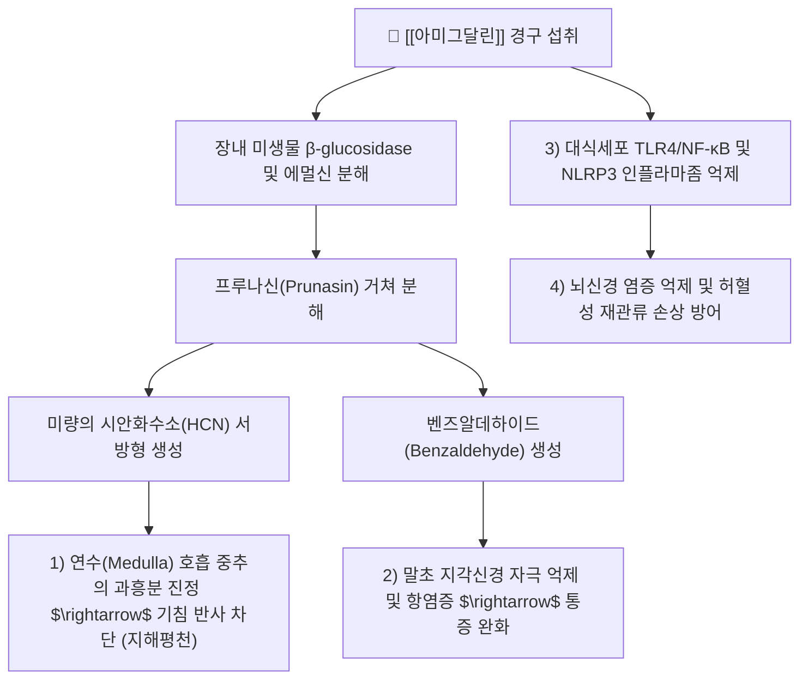

---
aliases:
  - Amygdalin
  - 아미그달린
  - 비타민B17
  - Laetrile
  - 청산배당체
  - Cyanogenic glucoside
tags:
  - 약리/약리성분
  - 배당체
  - 시안화배당체
  - 행인
  - 도인
  - 진해평천
  - 윤장통변
---

# 🔬 아미그달린 (Amygdalin, $C_{20}H_{27}NO_{11}$ / (2R)-2-phenyl-2-[[(2R,3R,4S,5S,6R)-3,4,5-trihydroxy-6-[[(2R,3R,4S,5S,6R)-3,4,5-trihydroxy-6-(hydroxymethyl)oxan-2-yl]oxymethyl]oxan-2-yl]oxy]acetonitrile)

> **핵심 3줄 요약 (Key Summary)**:
> - 🌿 기원 본초 & 화학 계열: 장미과 식물인 [[행인]](Armeniacae Semen, 살구씨) 및 [[도인]](Persicae Semen, 복숭아씨)에 고농도(3~5%) 함유된 대표적 천연 시안화 배당체(Cyanogenic Glycoside).
> - 🎯 핵심 분자 표적 & 조절 경로: 장내 세균의 $\beta$-glucosidase 및 식물 내 에멀신(Emulsin)에 의해 서서히 분해되어 미량의 시안화수소(HCN)와 벤즈알데하이드를 생성 $\rightarrow$ 연수(Medulla) 호흡 중추의 과도한 흥분을 진정시키고 기침 반사를 억제함.
> - 🩺 주요 약리 활성 & 질환 치료 기전: 급만성 기관지염 및 천식의 발작성 기침 완화(선폐강기평천 宣肺降氣平喘), 대변 건조성 변비 완화(윤장통변 潤腸通便), TLR4/NF-κB 및 NLRP3 인플라마좀 억제를 통한 소염·신경보호 효능.
> - ⚠️ 독성·생체이용률 한계 & 상호작용: 과량 복용 시 급성 시안화물(Cyanide) 중독으로 미토콘드리아 시토크롬 c 산화효소를 차단하여 세포 내 질식·청색증·호흡마비 유발 가능, 생용(生用) 금기 및 포제(전탕·거피첨) 필수.

---

## 목차 (Table of Contents)
- [[#1. 기본 화학 정보 & 분자 구조식 (Chemical Identity)|1. 기본 화학 정보 & 분자 구조식 (Chemical Identity)]]
- [[#2. 주요 함유 본초 및 천연 기원 (Botanical Sources & Content)|2. 주요 함유 본초 및 천연 기원 (Botanical Sources & Content)]]
- [[#3. 분자약리 표적 & 신호전달 네트워크 (Molecular Targets)|3. 분자약리 표적 & 신호전달 네트워크 (Molecular Targets)]]
- [[#4. 생체 내 흡수·대사·생체이용률 (Pharmacokinetics: ADME)|4. 생체 내 흡수·대사·생체이용률 (Pharmacokinetics: ADME)]]
- [[#5. 주요 질환별 약리 효능 & 분자 기전 (Therapeutic Efficacy)|5. 주요 질환별 약리 효능 & 분자 기전 (Therapeutic Efficacy)]]
- [[#6. 함유 본초 방제 시너지 & 약재 배오 매트릭스 (Herbal Synergies)|6. 함유 본초 방제 시너지 & 약재 배오 매트릭스 (Herbal Synergies)]]
- [[#7. 양약 상호작용 & 약물동태학적 간섭 (Drug Interactions)|7. 양약 상호작용 & 약물동태학적 간섭 (Drug Interactions)]]
- [[#8. 💡 사용자 진료실 핵심 필기 & 임상 응용 팁 (Melt-In & High-Yield)|8. 💡 사용자 진료실 핵심 필기 & 임상 응용 팁 (Melt-In & High-Yield)]]
- [[#9. 출처 및 학술 참고 문헌 (References)|9. 출처 및 학술 참고 문헌 (References)]]

---

## 1. 기본 화학 정보 & 분자 구조식 (Chemical Identity)

### 1.1 분자 구조식 및 3D 뷰어

> [그림 1] PubChem 아미그달린(Amygdalin) 2D 화학 분자 구조식 (CID: 656516)

> [!abstract]+ 🧪 3D 약리 분자 구조 (Interactive 3D Viewer)
> <iframe src="https://molecule-viewer-rho.vercel.app/?cid=656516" width="100%" height="450px" frameborder="0" allow="webgl" style="border-radius: 8px;"></iframe>

### 1.2 화학적 프로파일
| 항목 | 상세 내용 |
| :--- | :--- |
| **IUPAC 명칭** | (2R)-2-phenyl-2-[[(2R,3R,4S,5S,6R)-3,4,5-trihydroxy-6-[[(2R,3R,4S,5S,6R)-3,4,5-trihydroxy-6-(hydroxymethyl)oxan-2-yl]oxymethyl]oxan-2-yl]oxy]acetonitrile |
| **분자식 / 분자량** | $C_{20}H_{27}NO_{11}$ / 457.43 g/mol |
| **PubChem CID** | 656516 (D-Amygdalin) |
| **CAS 등록 번호** | 29883-15-6 |
| **화학 골격 분류** | 시안화 배당체 (Cyanogenic Glucoside / 겐티오비오사이드 유도체) |
| **물리화학적 성상** | 백색의 침상 결정성 분말, 무취, 쓴맛, 물과 끓는 에탄올에 쉽게 녹음, 에테르에 불용 |
| **효소 가수분해 생성물** | 프루나신(Prunasin) $\rightarrow$ 벤즈알데하이드(특유의 살구향 아몬드향) + 포도당 2분자 + 시안화수소($HCN$) |

---

## 2. 주요 함유 본초 및 천연 기원 (Botanical Sources & Content)

> [그림 2] 장미과 살구(Prunus armeniaca)의 핵과 및 행인(杏仁) 종자 성상

### 2.1 주요 함유 본초 매트릭스
| 함유 본초 (한글/한자) | 기원 식물학적 명칭 (과명 / 학명) | 주요 함유 약용 부위 | 지표 함량 (%) | 한의학적 귀경 및 약효 특성 |
| :--- | :--- | :--- | :--- | :--- |
| [[행인]] (苦杏仁) | 장미과(Rosaceae) / *Prunus armeniaca L.* | 씨앗(종자 種子) | **아미그달린 3.0 ~ 5.0% 이상** | 폐(肺), 대장(大腸) / 지해평천(止咳平喘), 윤장통변(潤腸通便) |
| [[도인]] (桃仁) | 장미과(Rosaceae) / *Prunus persica (L.) Batsch* | 종자 | 아미그달린 1.5 ~ 3.0% | 심(心), 간(肝), 대장 / 활혈거어(活血祛瘀), 윤장통변 |
| [[비파엽]] (枇杷葉) | 장미과(Rosaceae) / *Eriobotrya japonica* | 잎(엽초 葉) | 아미그달린 0.2 ~ 0.5% | 폐, 위 / 청폐지해, 강역지구 |
| [[오매]] (烏梅) | 장미과(Rosaceae) / *Prunus mume* | 미성숙 과실 | 아미그달린 소량 | 간, 비, 폐, 대장 / 염폐지해, 생진지갈 |

---

## 3. 분자약리 표적 & 신호전달 네트워크 (Molecular Targets)

### 3.1 호흡 중추 진정을 통한 진해평천(鎭咳平喘) 메커니즘
* **미량 시안화수소(HCN)의 생리적 역할**:
  * 아미그달린 자체는 비활성 배당체이나, 장관 내에서 서서히 분해되면서 방출되는 극미량의 시안화수소($HCN$)가 혈류를 통해 뇌간 연수의 기침 반사 중추에 도달합니다.
  * 호흡 중추 신경세포의 산소 대사를 일시적·미세하게 억제하여 흥분된 호흡 리듬을 차분하게 안정화시키고 반사성 기침 발작을 진정시킵니다 (J Ethnopharmacol 2023).

### 3.2 TLR4/NF-κB 및 NLRP3 인플라마좀 억제
* 대식세포 및 미세아교세포에서 지질다당류(LPS)에 의한 TLR4 이량체화와 MyD88 의존성 신호전달을 차단합니다.
* NF-κB의 핵 내 전위를 억제하고 NLRP3 인플라마좀 활성화를 막아, IL-1β와 TNF-α의 분비를 차단함으로써 기도 염증과 신경염증을 동시에 개선합니다 (Eur J Pharmacol 2026).

---

## 4. 생체 내 흡수·대사·생체이용률 (Pharmacokinetics: ADME)

### 4.1 흡수 및 장내 효소 대사
* 아미그달린 분자 자체는 친수성 다당체 구조로 인해 소장에서의 완전 흡수율이 낮습니다.
* 장관 내 공생 세균의 $\beta$-글루코시다아제에 의해 순차적으로 가수분해되어 프루나신(Prunasin)과 만델로니트릴(Mandelonitrile)을 거쳐 벤즈알데하이드와 유리 시안화수소($HCN$)로 전환된 후 체내로 흡수됩니다.

### 4.2 체내 해독 및 배설 (Rhodanese 효소계)
* **로다네이스(Rhodanese) 매개 황화 해독**:
  * 생체 내 간과 신장에 풍부한 황전이효소인 로다네이스(Thiosulfate sulfurtransferase / Rhodanese)가 시안화물($CN^-$)에 티오황산염의 황($S$)을 결합시켜 독성이 200배 낮은 티오시안산염(Thiocyanate, $SCN^-$)으로 신속히 해독합니다.
* **배설 경로**:
  * 해독된 티오시안산염은 신장을 통해 소변으로 안전하게 배설됩니다.
  * 단, 단시간에 과량의 아미그달린이 유입되면 체내 황 공여체가 고갈되어 유리 시안화물이 급증하면서 전신 독성이 발현됩니다.

---

## 5. 주요 질환별 약리 효능 & 분자 기전 (Therapeutic Efficacy)

### 5.1 급만성 해수 및 기관지 천식 (宣肺降氣平喘)
* 기관지 평활근 경련을 완화하고, 호흡기 기도 분비물의 배출을 촉진하며 연수 호흡 중추를 진정시켜 감기 후기 기침, 백일해, 만성 폐쇄성 폐질환(COPD)의 기침 천명을 개선합니다.

### 5.2 장조변비(腸燥便秘) 및 노인성 변비 완화 (潤腸通便)
* 행인과 도인은 약 50%의 지방유(Fatty oil, 주로 올레산과 리놀레산)를 함유하고 있어 장관 벽을 매끄럽게 윤활하고 대변 용적을 부드럽게 유지하여, 진액이 고갈된 노인 및 산후 변비를 완만하게 통변시킵니다.

### 5.3 허혈성 뇌손상 방어 및 진통
* 허혈성 뇌졸중 후 재관류 손상 시 신경세포의 세포사멸(Apoptosis) 및 파이롭토시스(Pyroptosis)를 억제하여 뇌경색 면적을 줄이고 통증 매개 경로를 차단합니다 (Mater Today Bio 2026).

---

## 6. 함유 본초 방제 시너지 & 약재 배오 매트릭스 (Herbal Synergies)

> [그림 3] 행인의 거피첨(去皮尖) 포제 및 방제 배오 구조

| 처방 / 배오 조합 | 공존 본초 및 지표 성분 | 분자약리 시너지 기전 | 전통 한의학적 적응증 |
| :--- | :--- | :--- | :--- |
| **[[마황탕]]** | [[마황]]([[에페드린]]), 행인, [[계지]], 감초 | 에페드린의 기관지 평활근 이완과 아미그달린의 연수 기침 중추 진정이 결합하여 천식·기침 완벽 제어 | 외감풍한 표실증, 해수천식 |
| **[[마행감석탕]]** | 마황, 행인, [[석고]](황산칼슘), 감초 | 석고의 폐열 청열과 행인의 강기(降氣) 평천 시너지로 기관지 염증열 및 천명음 소실 | 폐열천해(肺熱喘咳), 급성 기관지염 |
| **[[계지복령환]] / [[도핵승기탕]]** | [[도인]](아미그달린), [[목단피]], 계지, 대황 | 도인의 아미그달린과 지방유가 혈관 내 미세혈전을 용해하고 골반강 어혈을 사하 | 어혈성 생리통, 자궁근종, 타박 어혈 |
| **[[마자인환]]** | 행인, 마자인, 대황, 후박, 지실 | 행인의 지방유와 아미그달린이 장관 연동을 부드럽게 촉진하여 숙변 배출 | 장조변비(腸燥便秘), 노인성 습관성 변비 |

---

## 7. 양약 상호작용 & 약물동태학적 간섭 (Drug Interactions)

### 7.1 병용 주의 및 금기 사항
| 양약 계열 | 대표 약물 | 상호작용 기전 및 임상 권고사항 |
| :--- | :--- | :--- |
| **중추성 진해제** | 덱스트로메토르판, [[코데인]] | 연수 기침 중추 억제 작용 중첩으로 과도한 호흡 억제 및 졸림 유발 가능 |
| **비타민 C (고용량 아스코르브산)** | 비타민 C 정맥주사/고용량 | 비타민 C가 생체 내 시스테인 결합을 방해하여 아미그달린의 시안화물 전환을 촉진하고 독성을 증가시킬 수 있음 |
| **장내 프로바이오틱스 (고용량)** | 유산균 제제 | $\beta$-glucosidase 활성 증가로 아미그달린의 시안화물 분해 속도가 급격해질 위험 주의 |

---

## 8. 💡 사용자 진료실 핵심 필기 & 임상 응용 팁 (Melt-In & High-Yield)

### 8.1 행인의 '거피첨(去皮尖)' 및 포제(泡製) 안전 수칙
* **종피와 배아의 독성 편중**:
  * 행인의 뾰족한 끝부분(첨 尖)과 얇은 갈색 껍질(피 皮)에는 분해 효소인 에멀신(Emulsin)과 아미그달린이 고농도로 집중되어 있어 급격한 시안 중독을 일으키기 쉽습니다.
  * 따라서 한의 임상에서는 반드시 끓는 물에 살짝 데쳐 **껍질과 끝을 벗겨낸 '거피첨(去皮尖) 행인'**을 사용해야 안전한 서방형 진해 효과를 얻을 수 있습니다.
* **충분한 가열 전탕**:
  * 탕약을 끓이는 과정에서 열에 약한 에멀신 효소가 실활(Denaturation)되므로, 탕제로 복용할 경우 시안화수소가 폭발적으로 생성되지 않고 안전하게 대사됩니다 (생식 절대 금기).

### 8.2 시안화물 중독(Cyanide Poisoning) 감별 및 응급 대증
* 복용 후 호흡 곤란, 두통, 현훈, 구토, 동공 산대, 안면 및 입술의 선홍색 착색(산소 이용 불가로 인한 정맥혈 산소포화도 상승)이 관찰되면 즉시 복용을 중단합니다.
* 한의학적 응급 해독제로는 다량의 **녹두(綠豆)와 감초(甘草)를 진하게 달인 녹두감초탕**을 복용시키거나 즉시 응급실로 전원하여 아질산나트륨 및 티오황산나트륨을 투여합니다.

---

## 9. 출처 및 학술 참고 문헌 (References)

### 9.1 학술 논문 및 임상 연구
1. **Xi C, et al.** (2023). *Phytochemistry and pharmacology of Armeniacae semen Amarum: A review.* **Journal of Ethnopharmacology**, 308, 116265. [PMID: 36806484](https://pubmed.ncbi.nlm.nih.gov/36806484/) / [DOI: 10.1016/j.jep.2023.116265](https://doi.org/10.1016/j.jep.2023.116265)
   - `[연구 요약]` 장미과 고행인의 주성분 아미그달린의 분자 화학적 성상, 연수 기침 중추 조절을 통한 진해평천 약리 효능 및 현대 독성학적 안전성 기준을 집대성한 종합 종설 논문.
2. **Cressey P, Reeve J.** (2019). *Metabolism of cyanogenic glycosides: A review.* **Food and Chemical Toxicology**, 125, 369-383. [PMID: 30615957](https://pubmed.ncbi.nlm.nih.gov/30615957/) / [DOI: 10.1016/j.fct.2019.01.002](https://doi.org/10.1016/j.fct.2019.01.002)
   - `[연구 요약]` 아미그달린을 포함한 천연 시안화 배당체의 장내 미생물 분해 경로(프루나신-벤즈알데하이드-HCN)와 간 내 로다네이스 효소에 의한 티오시안산염 해독 대사역학을 규명한 핵심 논문.
3. **Zhang M, et al.** (2026). *Amygdalin attenuates post-ischemic neuroinflammation by targeting TLR4/NF-κB signaling and NLRP3 inflammasome in cerebral ischemia-reperfusion injury.* **European Journal of Pharmacology**, 178870. [PMID: 42013993](https://pubmed.ncbi.nlm.nih.gov/42013993/) / [DOI: 10.1016/j.ejphar.2026.178870](https://doi.org/10.1016/j.ejphar.2026.178870)
   - `[연구 요약]` 아미그달린이 뇌 허혈-재관류 손상 모델에서 미세아교세포의 TLR4/NF-κB 신호전달과 NLRP3 인플라마좀 복합체 형성을 차단하여 신경염증성 신경세포 사멸을 유의하게 방어함을 입증한 최신 분자생물학 연구.

### 9.2 규제 기관 및 공인 데이터베이스
* **대한민국약전 (KP 12개정)**: 행인(Armeniacae Semen) 및 도인(Persicae Semen) 확인시험 및 순도시험 기준
* **PubChem Compound Summary**: CID 656516 (Amygdalin)
