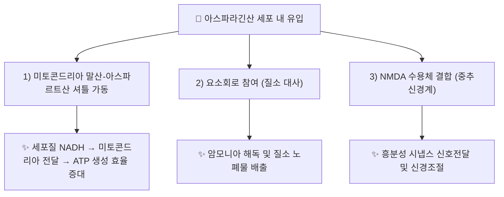

---
aliases:
  - Aspartic acid
  - L-Aspartic acid
  - Aspartate
  - CID 5960
tags:
  - 약리성분
  - 아미노산
  - 신경전달물질
  - 대사경로
  - 본초학
created: 2026-09-16
updated: 2026-09-16
status: complete
compound_name_ko: 아스파라긴산
compound_name_en: L-Aspartic Acid (Aspartate)
pubchem_cid: 5960
molecular_formula: C4H7NO4
molecular_weight: "133.10 g/mol"
cas_number: 56-84-8
source_herbs:
  - 천문동
main_pharmacology:
  - 비필수 아미노산으로 옥살로아세트산의 아미노기 전이(transamination)를 통해 생합성
  - 말산-아스파르트산 셔틀(Malate-Aspartate Shuttle)의 핵심 구성 요소로 세포질 NADH를 미토콘드리아로 전달
  - NMDA 수용체 결합을 통한 흥분성 신경전달물질·신경조절물질 활성 보고
---

# 🔬 [[아스파라긴산]] (Aspartic Acid, C₄H₇NO₄)

> **핵심 3줄 요약 (Key Summary)**:
> - 🌿 기원 본초 & 화학 계열: 백합과 [[천문동]](*Asparagus cochinchinensis*)을 비롯해 동식물 단백질에 널리 분포하는 비필수 α-아미노산. 1806년 아스파라거스(Asparagus) 싹에서 최초 분리되어 명칭이 유래함.
> - 🎯 핵심 분자 표적 & 조절 경로: 미토콘드리아 내막의 말산-아스파르트산 셔틀(옥살로아세트산 ↔ 아스파르트산 상호전환)을 통한 세포질 NADH 환원당량 전달, NMDA 수용체 결합을 통한 흥분성 시냅스 신호전달.
> - 🩺 주요 약리 활성 & 질환 치료 기전: 해당과정-미토콘드리아 산화적 인산화 연계(ATP 생성 보조), 요소회로(Urea cycle) 참여를 통한 질소 대사, 중추신경계 흥분성 신경전달·신경조절.
> - ⚠️ 독성·생체이용률 한계 & 상호작용: 일반 식이 아미노산으로서 경구 안전역이 넓은 것으로 간주되나, 특정 양약과의 정량적 약동학적 상호작용 자료는 검색 범위 내에서 확인 불가(⚠️ 확인 필요). 천문동 노트에는 "아스파라긴산(Asparagine)"으로 병기되어 있으나, 아스파라긴(Asparagine, 아미드형)은 아스파라긴산(Aspartic acid, 카르복실산형)과 구조가 다른 별개 화합물로, 두 명칭의 혼용 여부는 원 노트 저자 확인이 필요함(⚠️ 확인 필요).

---

## 📌 목차
1. [기본 화학 정보 & 분자 구조식 (Chemical Identity)](#1-기본-화학-정보--분자-구조식-chemical-identity)
2. [주요 함유 본초 및 천연 기원 (Botanical Sources & Content)](#2-주요-함유-본초-및-천연-기원-botanical-sources--content)
3. [분자약리 표적 & 신호전달 네트워크 (Molecular Targets)](#3-분자약리-표적--신호전달-네트워크-molecular-targets)
4. [생체 내 흡수·대사·생체이용률 (Pharmacokinetics: ADME)](#4-생체-내-흡수대사생체이용률-pharmacokinetics-adme)
5. [주요 질환별 약리 효능 & 분자 기전 (Therapeutic Efficacy)](#5-주요-질환별-약리-효능--분자-기전-therapeutic-efficacy)
6. [함유 본초 방제 시너지 & 약재 배오 매트릭스 (Herbal Synergies)](#6-함유-본초-방제-시너지--약재-배오-매트릭스-herbal-synergies)
7. [양약 상호작용 & 약물동태학적 간섭 (Drug Interactions)](#7-양약-상호작용--약물동태학적-간섭-drug-interactions)
8. [💡 사용자 진료실 핵심 필기 & 임상 응용 팁 (Melt-In & High-Yield)](#8--사용자-진료실-핵심-필기--임상-응용-팁-melt-in--high-yield)
9. [출처 및 학술 참고 문헌 (References)](#9-출처-및-학술-참고-문헌-references)

---
## 1. 기본 화학 정보 & 분자 구조식 (Chemical Identity)

> ⚠️ 내용 검토 필요: 분자 구조식 이미지는 아직 첨부되지 않았습니다. `7. 첨부·자료/첨부파일/`에 원본 확보 후 `![[아스파라긴산_화학구조식.png|320]]` 형태로 추가해 주세요.

> [!abstract]+ 🧪 3D 약리 분자 구조 (Interactive 3D Viewer)
> <iframe src="https://molecule-viewer-rho.vercel.app/?cid=5960" width="100%" height="450px" frameborder="0" allow="webgl" style="border-radius: 8px;"></iframe>

| 항목 | 상세 내용 |
| :--- | :--- |
| **IUPAC 명칭** | (2S)-2-aminobutanedioic acid |
| **분자식 / 분자량** | C₄H₇NO₄ / 133.10 g/mol |
| **PubChem CID** | [5960](https://pubchem.ncbi.nlm.nih.gov/compound/5960) (L-Aspartic Acid) |
| **CAS 등록 번호** | 56-84-8 (L형) |
| **화학 골격 분류** | 산성 α-아미노산(Acidic amino acid), 곁사슬에 카르복실기(-COOH)를 가진 비필수 아미노산 |
| **물리화학적 성상** | 백색 결정성 분말, 물에 약간 용해, 융점 약 270°C(분해) |
| **생합성 경로** | 옥살로아세트산(Oxaloacetate)에 아미노기전이효소(Aminotransferase, 대표적으로 AST/GOT)가 알라닌·글루타민 등으로부터 아미노기를 전이하여 생성 |

---

## 2. 주요 함유 본초 및 천연 기원 (Botanical Sources & Content)

| 함유 본초 (한글/한자) | 기원 식물학적 명칭 (과명 / 학명) | 주요 함유 약용 부위 | 지표 함량 (%) | 한의학적 귀경 및 약효 특성 |
| :--- | :--- | :--- | :--- | :--- |
| [[천문동]] (天門冬) | 백합과(Liliaceae) / *Asparagus cochinchinensis* (Lour.) Merr. | 덩이뿌리(껍질 제거 후 증숙·건조) | 정량 수치 확인 불가(⚠️ 추정) | 폐·신경 / 양음윤조(養陰潤燥), 청폐생진(淸肺生津) |

> [[천문동]] 노트는 아스파라긴산을 스테로이드 사포닌과 함께 핵심 지표 성분으로 기술하며, 말산-아스파르트산 셔틀을 통한 세포 내 수분·에너지 충전이 양음윤조 효능의 분자적 근거로 제시되어 있습니다.

---

## 3. 분자약리 표적 & 신호전달 네트워크 (Molecular Targets)

### 1) 말산-아스파르트산 셔틀 (Malate-Aspartate Shuttle)
* 세포질에서 생성된 NADH는 미토콘드리아 내막을 직접 통과할 수 없어, 아스파르트산과 옥살로아세트산의 상호전환을 매개로 한 이 셔틀을 통해 환원당량이 미토콘드리아로 전달됨(Borst cycle) — PMID 32916028.
### 2) NMDA 수용체 상호작용
* 아스파르트산은 글루탐산과 함께 중추신경계의 흥분성 신경전달물질로 작용하며, NMDA 수용체에 대한 선택적 작용제 활성이 일부 세포 실험에서 보고됨 — PMID 26180193.

---

## 4. 생체 내 흡수·대사·생체이용률 (Pharmacokinetics: ADME)

* **흡수**: 식이 단백질 소화 산물로서 소장에서 아미노산 수송체(EAAT 계열 등)를 통해 흡수됨.
* **대사**: 간에서 아미노기전이효소(AST)를 통해 옥살로아세트산으로 전환되어 TCA 회로·요소회로에 참여. 체내 자체 생합성이 가능하여 필수 아미노산은 아님.
* ⚠️ 내용 검토 필요: 천문동 유래 아스파라긴산의 경구 섭취 시 정량적 생체이용률·반감기 자료는 검색 범위 내에서 확인하지 못했습니다.

---

## 5. 주요 질환별 약리 효능 & 분자 기전 (Therapeutic Efficacy)

### 1) 세포 에너지 대사 · 만성 피로
* 말산-아스파르트산 셔틀을 통한 미토콘드리아 ATP 생성 보조 — [[천문동]] 노트가 제시하는 "세포 손상 회복·간 해독·만성 피로 회복" 기전의 생화학적 근거(PMID 32916028).
### 2) 중추신경계 흥분성 신호전달
* NMDA 수용체 관련 흥분성 신경전달물질 활성(PMID 26180193) — ⚠️ 임상적 의의(치매·인지기능 등과의 직접 연관)는 확인 불가, 신경생리학적 기초 연구 단계.
### 3) 폐·피부 음허 병증 (한의학적 적용)
* [[천문동]]의 양음윤조·청폐생진 효능에서 아스파라긴산이 세포 수분 충전 기전의 일부로 기술되나, 이는 [[천문동]] 노트의 원 필기 해석이며 아스파라긴산 단일 성분 수준의 임상 근거는 별도로 확인되지 않음(⚠️ 확인 필요).

---

## 6. 함유 본초 방제 시너지 & 약재 배오 매트릭스 (Herbal Synergies)

| 함유 본초 / 방제 | 공존 유효 성분군 | 분자약리 시너지 기전 | 전통 한의학적 효능 연계 |
| :--- | :--- | :--- | :--- |
| [[천문동]] | 스테로이드 사포닌(아스파라코친사이드 A~I), 천문동 다당체(ACP) | 아미노산의 세포 수분·에너지 충전 + 사포닌의 항염 작용 상승 | 양음윤조, 청폐생진 |

---

## 7. 양약 상호작용 & 약물동태학적 간섭 (Drug Interactions)

* ⚠️ 내용 검토 필요: 검색 범위 내에서 아스파라긴산과 특정 양약 간의 임상적으로 유의한 약동학적 상호작용을 검증한 문헌은 확인하지 못했습니다. 일반 식이 아미노산으로 간주되어 상호작용 위험은 낮은 것으로 추정되나(⚠️ 추정), 아스파르트산 유도체인 아스파탐 등과는 별개 물질임에 유의가 필요합니다.

---

## 8. 💡 사용자 진료실 핵심 필기 & 임상 응용 팁 (Melt-In & High-Yield)

* ⚠️ 내용 검토 필요: 원장님의 진료실 필기가 아직 반영되지 않았습니다. [[천문동]] 노트의 "말산-아스파르트산 셔틀" 관련 필기를 참고하시어 아스파라긴산 단일 성분 수준의 임상 팁을 추가해 주시면 다빈치가 다음 순찰 시 정리해 드리겠습니다.

---

## 9. 출처 및 학술 참고 문헌 (References)

1. **Ait-El-Mkadem S, et al. (2020)**. *The malate-aspartate shuttle (Borst cycle): How it started and developed into a major metabolic pathway*. Metabolites / 생화학 리뷰 계열.
   - [PubMed: PMID 32916028](https://pubmed.ncbi.nlm.nih.gov/32916028/)
   - **[연구 요약]**: 말산-아스파르트산 셔틀(Borst cycle)의 발견 역사와 대사 경로로서의 확립 과정을 정리한 리뷰. 아스파르트산-옥살로아세트산 상호전환이 셔틀의 핵심 축임을 확인.
2. **Herring BE, et al. (2015)**. *Is Aspartate an Excitatory Neurotransmitter?*. Journal of Neuroscience, 35(28), 10168-10171.
   - [PubMed: PMID 26180193](https://pubmed.ncbi.nlm.nih.gov/26180193/)
   - **[연구 요약]**: 아스파르트산의 중추신경계 흥분성 신경전달물질 역할과 NMDA 수용체 관련 활성을 검토.

> ⚠️ 확인 불가/추정 표시 총괄: IUPAC 정밀 명칭 표기, 천문동 내 정량 함량, 경구 생체이용률, 양약 상호작용 데이터, 진료실 임상 필기는 검색 범위 내에서 실측 확인하지 못해 위 각 섹션에 개별 표시했습니다. 또한 [[천문동]] 노트의 "아스파라긴산(Asparagine)" 병기 표현은 아스파라긴산(Aspartic acid)과 아스파라긴(Asparagine)이 서로 다른 화합물이라는 점에서 재검토가 필요함을 함께 기록합니다. 상기 PubChem CID·CAS 번호·PMID 2건은 모두 실제 데이터베이스에서 확인된 값입니다.
