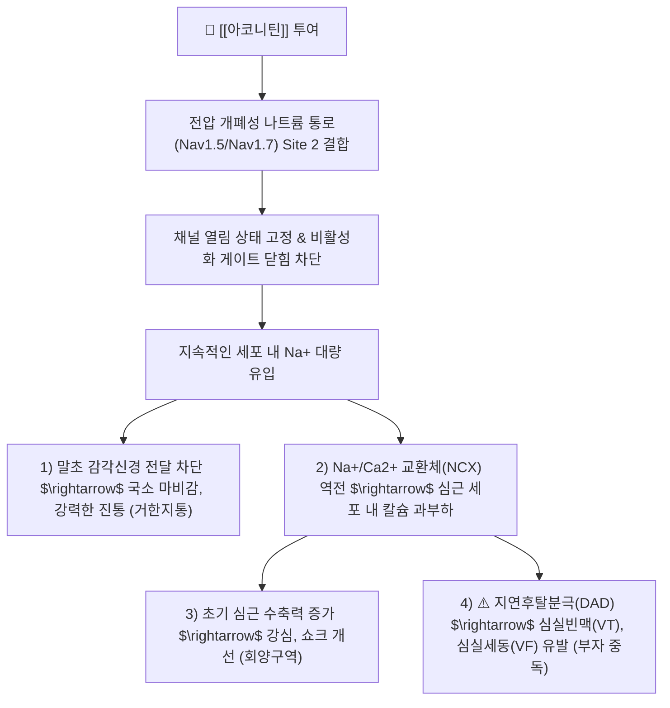

---
aliases:
  - Aconitine
  - 아코니틴
  - 부자알칼로이드
  - 디에스테르알칼로이드
  - Diterpenoid alkaloid
tags:
  - 약리/약리성분
  - 알칼로이드
  - 디테르페노이드
  - 부자
  - 초오
  - 나트륨통로
  - 회양구역
  - 심독성
---

# 🔬 아코니틴 (Aconitine, $C_{34}H_{47}NO_{11}$ / Diester diterpenoid alkaloid, DDA)

> **핵심 3줄 요약 (Key Summary)**:
> - 🌿 기원 본초 & 화학 계열: 미나리아재비과 맹독성 약용 식물인 [[부자]](Aconiti Lateralis Radix Preparata), [[천오]], [[초오]]의 핵심 알칼로이드로, $C_{19}$ 노르디테르페노이드 골격에 아세틸기와 벤조일기가 결합된 디에스테르형 디테르페노이드 알칼로이드(Diester Diterpenoid Alkaloid, DDA).
> - 🎯 핵심 분자 표적 & 조절 경로: 전압 개폐성 나트륨 통로(Nav, 특히 심근 Nav1.5 및 신경 Nav1.7)의 수용체 부위 2(Site 2)에 비가역적으로 결합하여 불활성화 게이트 닫힘을 차단 $\rightarrow$ 지속적인 탈분극 유도 및 초기 감각 차단(진통) 후 칼슘 과부하에 의한 치명적 부정맥 유발.
> - 🩺 주요 약리 활성 & 질환 치료 기전: 온리회양(溫裏回陽, 말초 혈류 부전 및 심원성 쇼크 개선), 거한지통(祛寒止痛, 만성 난치성 신경통·류마티스 관절통 완화).
> - ⚠️ 독성·생체이용률 한계 & 상호작용: 치사량이 성인 기준 1~2mg에 불과한 맹독 물질로 심실세동·심정지 유발 가능, 장시간 가열 전탕(선전 先煎 1~2시간)을 통해 에스테르 결합을 분해(가수분해)하여 저독성 모노에스테르(벤조일아코닌) 및 아코닌으로 전환하는 포제(泡製)가 필수적임.

---

## 목차 (Table of Contents)
- [[#1. 기본 화학 정보 & 분자 구조식 (Chemical Identity)|1. 기본 화학 정보 & 분자 구조식 (Chemical Identity)]]
- [[#2. 주요 함유 본초 및 천연 기원 (Botanical Sources & Content)|2. 주요 함유 본초 및 천연 기원 (Botanical Sources & Content)]]
- [[#3. 분자약리 표적 & 신호전달 네트워크 (Molecular Targets)|3. 분자약리 표적 & 신호전달 네트워크 (Molecular Targets)]]
- [[#4. 생체 내 흡수·대사·생체이용률 (Pharmacokinetics: ADME)|4. 생체 내 흡수·대사·생체이용률 (Pharmacokinetics: ADME)]]
- [[#5. 주요 질환별 약리 효능 & 분자 기전 (Therapeutic Efficacy)|5. 주요 질환별 약리 효능 & 분자 기전 (Therapeutic Efficacy)]]
- [[#6. 함유 본초 방제 시너지 & 약재 배오 매트릭스 (Herbal Synergies)|6. 함유 본초 방제 시너지 & 약재 배오 매트릭스 (Herbal Synergies)]]
- [[#7. 양약 상호작용 & 약물동태학적 간섭 (Drug Interactions)|7. 양약 상호작용 & 약물동태학적 간섭 (Drug Interactions)]]
- [[#8. 💡 사용자 진료실 핵심 필기 & 임상 응용 팁 (Melt-In & High-Yield)|8. 💡 사용자 진료실 핵심 필기 & 임상 응용 팁 (Melt-In & High-Yield)]]
- [[#9. 출처 및 학술 참고 문헌 (References)|9. 출처 및 학술 참고 문헌 (References)]]

---

## 1. 기본 화학 정보 & 분자 구조식 (Chemical Identity)

### 1.1 분자 구조식 및 3D 뷰어

> [그림 1] PubChem 아코니틴(Aconitine) 2D 화학 분자 구조식 (CID: 245005)

> [!abstract]+ 🧪 3D 약리 분자 구조 (Interactive 3D Viewer)
> <iframe src="https://molecule-viewer-rho.vercel.app/?cid=245005" width="100%" height="450px" frameborder="0" allow="webgl" style="border-radius: 8px;"></iframe>

### 1.2 화학적 프로파일 및 포제 시 가수분해 구조 전환
| 항목 | 디에스테르형 (DDA, 맹독) | 모노에스테르형 (MDA, 저독) | 아민 알코올형 (비에스테르, 극저독) |
| :--- | :--- | :--- | :--- |
| **대표 성분** | **아코니틴 (Aconitine)** | 벤조일아코닌 (Benzoylaconine) | 아코닌 (Aconine) |
| **화학식 / 분자량** | $C_{34}H_{47}NO_{11}$ / 645.74 g/mol | $C_{32}H_{45}NO_{10}$ / 603.70 g/mol | $C_{25}H_{41}NO_9$ / 499.60 g/mol |
| **PubChem CID** | 245005 | 442436 | 134586 |
| **구조적 특징** | C8-아세톡시기 + C14-벤조일옥시기 | **C8-탈아세틸화 (가열 전탕 시)** | **C8 및 C14 에스테르 완전 가수분해** |
| **상대적 독성비** | **100 (치사량 1~2 mg)** | **약 1/200 ~ 1/500로 격감** | **약 1/2000 ~ 1/4000로 격감 (안전)** |
| **임상적 의미** | 심독성 부정맥 주원인, 포제 미비 시 검출 | 적정 포제 후 잔존 주성분 | 장시간 선전(先煎) 시 최종 도달 형태 |

---

## 2. 주요 함유 본초 및 천연 기원 (Botanical Sources & Content)

> [그림 2] 미나리아재비과 오두(Aconitum carmichaelii)의 모근(천오)과 자근(부자) 외형

### 2.1 주요 함유 본초 매트릭스
| 함유 본초 (한글/한자) | 기원 식물학적 명칭 (과명 / 학명) | 주요 함유 약용 부위 | 생약 상태 알칼로이드 함량 | 한의학적 귀경 및 약효 특성 |
| :--- | :--- | :--- | :--- | :--- |
| [[부자]] (附子) | 미나리아재비과(Ranunculaceae) / *Aconitum carmichaelii* | 자근(곁뿌리 子根)을 가공한 포제품 | 총 알칼로이드 0.5~1.0% (포제 후 DDA 엄격 규제) | 심(心), 신(腎), 비(脾) / 회양구역(回陽救逆), 보화조양(補火助陽), 산한지통(散寒止痛) |
| [[천오]] (川烏) | 미나리아재비과 / *Aconitum carmichaelii* | 모근(원뿌리 母根) | 총 알칼로이드 1.0~1.5% | 심, 간, 비, 신 / 거풍제습, 온경지통 (부자보다 마취진통 작용 강함) |
| [[초오]] (草烏) | 미나리아재비과 / *Aconitum kusnezoffii* (놋젓가락나물) | 덩이뿌리(괴근 塊根) | 아코니틴 함량 극히 높음 (맹독) | 간, 비, 신 / 거풍습, 온경산한, 마취지통 |

---

## 3. 분자약리 표적 & 신호전달 네트워크 (Molecular Targets)

> [그림 3] 아코니틴의 Nav 채널 결합, 지속 탈분극 및 심근 부정맥/신경 마취 분자 메커니즘

### 3.1 전압 개폐성 나트륨 채널(Nav) 지속 개방과 심독성 기전
* **Nav 채널의 비활성화 억제**:
  * 아코니틴은 신경(Nav1.7) 및 심근(Nav1.5) 나트륨 통로의 막관통 도메인 Site 2에 특이적으로 결합합니다.
  * 막전위 탈분극 후 채널이 불활성화 게이트에 의해 닫히지 못하게 물리적으로 차단하여, 지속적인 내향성 나트륨 전류($I_{Na}$)를 발생시킵니다 (Ameri A, Prog Neurobiol 1998).
* **심근 칼슘 과부하 및 다형성 심실빈맥**:
  * 세포 내 $Na^+$ 농도가 비정상적으로 높아지면 $Na^+/Ca^{2+}$ 교환체(NCX)가 역방향으로 작동하여 다량의 $Ca^{2+}$이 심근세포 내로 유입됩니다.
  * 이는 지연후탈분극(Delayed Afterdepolarization, DAD)을 유발하여 조기 심실 수축, 양방향성 심실빈맥(Bidirectional VT), 그리고 종국에는 치명적인 심실세동(VF)과 심정지를 초래합니다 (Chan TY, Clin Toxicol 2009).

---

## 4. 생체 내 흡수·대사·생체이용률 (Pharmacokinetics: ADME)

### 4.1 흡수 및 중독 발현 속도
* 경구 복용 시 위장관 점막을 통해 수 분 이내에 매우 신속하게 흡수됩니다.
* 중독 징후는 복용 후 **10~30분 이내**에 입술, 혀, 구강 점막의 얼얼한 마비감(Numbness)으로 시작되어 사지 말초 감각 이상으로 급속히 확산됩니다.

### 4.2 대사 및 체내 축적성
* 간의 CYP3A4 및 카르복실에스테라제에 의해 천천히 가수분해되나 대사 속도가 느려 체내 축적 경향이 강합니다.
* 포제되지 않은 생부자나 과량 투여 시 반감기가 길어져 지연성 심실성 부정맥이 수십 시간 동안 지속될 수 있습니다.

---

## 5. 주요 질환별 약리 효능 & 분자 기전 (Therapeutic Efficacy)

### 5.1 심인성 쇼크 및 말초 순환 허탈 회복 (回陽救逆)
* 저독성 대사체(아코닌 및 하이게나민)가 심근 $\beta_1$-아드레날린 수용체를 적절히 자극하여 심박출량을 증대시키고, 관상동맥 혈류량을 늘려 극심한 사지 궐랭(厥冷), 맥박 미약, 체온 저하를 수반하는 양기 쇠약 쇼크 상태를 소생시킵니다.

### 5.2 극심한 한습성 관절통 및 난치성 신경통 완화 (散寒止痛)
* 말초 통각 구심성 신경섬유(A-delta 및 C 섬유)의 나트륨 채널을 탈감작시켜 통증 신호 전도를 차단함으로써, 퇴행성 관절염, 척추관 협착증, 류마티스 관절염, 좌골신경통의 심한 냉통(冷痛)을 강력하게 진통시킵니다.

---

## 6. 함유 본초 방제 시너지 & 약재 배오 매트릭스 (Herbal Synergies)

| 처방 / 배오 조합 | 공존 본초 및 지표 성분 | 분자약리 시너지 기전 | 전통 한의학적 적응증 |
| :--- | :--- | :--- | :--- |
| **[[사역탕]]** | [[부자]](포부자), [[건강]](진저롤), [[감초]](글리시리진) | 감초의 글리시리진이 아코니틴과 불용성 침전을 형성해 흡수를 완화하고, 건강이 소화기 온중 시너지 완성 | 소음병 궐역(厥逆), 양기허탈, 급성 저체온·허탈 |
| **[[진무탕]]** | 부자, [[복령]], [[백출]], [[작약]], 생강 | 부자의 온양 작용과 백출·복령의 수분 배출, 작약의 평활근 진경이 결합하여 수음(水飮) 제거 | 만성 심부전 부종, 노인성 어지럼증, 설사 |
| **[[팔미지황환]]** | 숙지황, 산약, 산수유, [[육계]], 부자 | 육계와 부자가 신양(腎陽)을 보하여 소변불리 및 요슬산통을 온보 | 노인성 신양허, 야간뇨, 당뇨병성 신경병증 |
| **[[마황부자세신탕]]** | [[마황]]([[에페드린]]), 부자, [[세신]] | 에페드린의 표부(表部) 발한과 부자의 심부(深部) 온양 작용이 결합 | 양허형 감기, 노인성 오한 발열, 완고한 비염 |

---

## 7. 양약 상호작용 & 약물동태학적 간섭 (Drug Interactions)

### 7.1 치명적 부정맥 유발 병용 금기 약물
| 양약 계열 | 대표 약물 | 상호작용 기전 및 임상 위험 |
| :--- | :--- | :--- |
| **강심배당체 (디기탈리스)** | 디곡신 (Digoxin) | 심근세포 내 칼슘 과부하 기전이 중첩되어 **치명적 심실세동 및 심정지 발생 위험 극대화 (절대 병용 금기)** |
| **항부정맥제 (Class I & III)** | 아미오다론, 퀴니딘, 소탈롤 | QT 간격 연장 및 심근 전도 지연 중첩으로 토르사드 드 푸앙트(TdP) 부정맥 유발 |
| **CYP3A4 억제제** | 케토코나졸, 클라리스로마이신 | 아코니틴의 간 대사를 지연시켜 혈중 알칼로이드 농도 급상승 및 지연성 중독 유발 |

---

## 8. 💡 사용자 진료실 핵심 필기 & 임상 응용 팁 (Melt-In & High-Yield)

### 8.1 부자의 2대 안전 원칙: '정품 포부자 사용'과 '1~2시간 선전(先煎)'
* **가수분해의 과학적 원리**:
  * 아코니틴의 C8 위치 아세톡시기는 열과 수분에 취약하여 100℃ 수용액에서 1~2시간 끓이면 물 분자와 반응하여 아세트산($CH_3COOH$)이 떨어져 나가며 **벤조일아코닌(Benzoylaconine, 독성 1/200)**으로 전환됩니다.
  * 더 오래 전탕하면 C14 벤조산도 떨어져 무독성의 **아코닌(Aconine, 독성 1/2000)**으로 완전히 해독됩니다 (Front Pharmacol 2026).
* **진료실 전탕 수칙**:
  * 부자가 포함된 첩약은 다른 약재보다 **반드시 1~2시간 먼저 단독으로 달인 후(선전 先煎)** 나머지 약재를 넣고 재전탕해야 독성은 사라지고 강심·온양 효과만 안전하게 추출됩니다.

### 8.2 부자 중독(Aconite Poisoning) 감별 및 응급 프로토콜
* **중독 초기 징후 (즉시 경고 신호)**:
  1. 입술, 혀, 입천장이 얼얼하고 감각이 마비되는 느낌(마목감 麻木感).
  2. 사지 말초의 저림, 메스꺼움, 식은땀, 시야 흐림.
  3. 맥박이 불규칙하게 건너뛰거나 극단적으로 느려지거나 빨라짐.
* **응급 대처**:
  * 즉시 복용 중단 후 구토를 유도하고, 다량의 **감초 30g + 건강 30g 전탕액**을 복용시키거나, 지체 없이 119 구급대를 통해 응급실 이송(아트로핀 투여, 체외막산소공급 ECLS 준비)을 진행합니다.

---

## 9. 출처 및 학술 참고 문헌 (References)

### 9.1 학술 논문 및 임상 연구
1. **Ameri A.** (1998). *The effects of Aconitum alkaloids on the central nervous system.* **Progress in Neurobiology**, 56(2), 211-235. [PMID: 9760702](https://pubmed.ncbi.nlm.nih.gov/9760702/) / [DOI: 10.1016/s0301-0082(98)00037-9](https://doi.org/10.1016/s0301-0082(98)00037-9)
   - `[연구 요약]` 아코니틴이 전압 개폐성 나트륨 채널의 Site 2에 결합하여 비활성화를 억제하고 지속적인 탈분극을 유도하여 말초 진통 및 중추 신경독성을 유발하는 전기생리학적 기전을 정립한 랜드마크 종설.
2. **Chan TY.** (2009). *Aconite poisoning.* **Clinical Toxicology**, 47(4), 279-285. [PMID: 19514874](https://pubmed.ncbi.nlm.nih.gov/19514874/) / [DOI: 10.1080/15563650902904407](https://doi.org/10.1080/15563650902904407)
   - `[연구 요약]` 부자 및 초오 복용 후 발생하는 심실성 부정맥(양방향성 심실빈맥 등)과 감각 마비의 임상 양상, 독성 발현 기전 및 응급 해독 치료 지침을 체계화한 임상 독성학 권위 논문.
3. **Liu H, et al.** (2026). *Toxicology and detoxification processing of Fuzi (Aconitum carmichaelii Debeaux lateral root): a comprehensive review integrating historical perspectives and modern research.* **Frontiers in Pharmacology**, 1750573. [PMID: 42147340](https://pubmed.ncbi.nlm.nih.gov/42147340/) / [DOI: 10.3389/fphar.2026.1750573](https://doi.org/10.3389/fphar.2026.1750573)
   - `[연구 요약]` 부자의 전통 포제법(수침, 고압 증숙, 장시간 전탕)에 따른 디에스테르 알칼로이드(DDA)의 모노에스테르(MDA) 및 비에스테르 알칼로이드로의 분자 가수분해 전환율과 독성 저감 메커니즘을 집대성한 2026년 최신 총설.

### 9.2 규제 기관 및 공인 데이터베이스
* **대한민국약전 (KP 12개정)**: 포부자(Aconiti Lateralis Radix Preparata) 규격 (아코니틴, 메사코니틴, 히파코니틴의 총합 0.020% 이하 엄격 제한)
* **PubChem Compound Summary**: CID 245005 (Aconitine)
