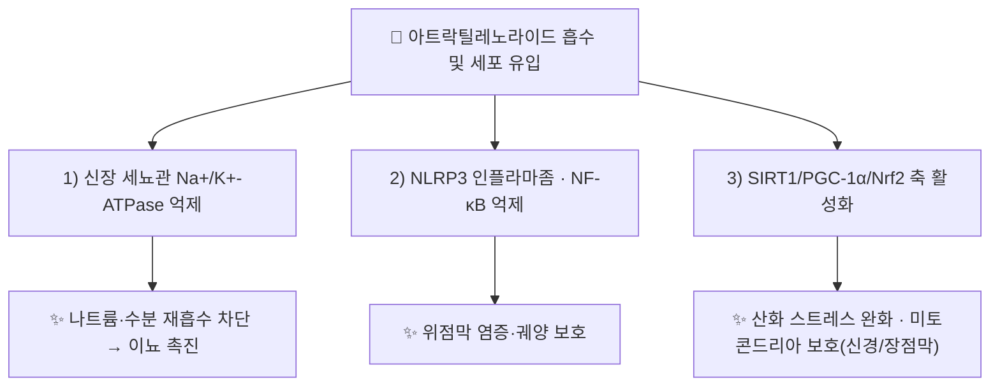

---
aliases:
  - Atractylenolide
  - Atractylenolide I
  - Atractylenolide III
  - CID 5321018
  - CID 155948
tags:
  - 약리성분
  - 세스퀴테르펜락톤
  - 이뇨
  - 항염증
  - 신경보호
  - 본초학
created: 2026-09-16
updated: 2026-09-16
status: complete
compound_name_ko: 아트락틸레노라이드
compound_name_en: Atractylenolide (I, II, III)
pubchem_cid: 5321018
molecular_formula: C15H18O2 (I) / C15H20O3 (III)
molecular_weight: "230.3 g/mol (I) / 248.3 g/mol (III)"
cas_number: 73069-13-3 (I) / 73030-71-4 (III)
source_herbs:
  - 백출
  - 창출
main_pharmacology:
  - 유데스만(Eudesmane) 골격 세스퀴테르펜 락톤, 백출·창출의 핵심 지표 성분군(I·II·III)
  - 신장 세뇨관 Na+/K+-ATPase 억제를 통한 이뇨, 위장관 점막 보호·항염증
  - NF-κB·NLRP3 인플라마좀 억제, SIRT1/PGC-1α/Nrf2 축을 통한 신경보호(파킨슨병 모델)
---

# 🔬 [[아트락틸레노라이드]] (Atractylenolide I/II/III)

> **핵심 3줄 요약 (Key Summary)**:
> - 🌿 기원 본초 & 화학 계열: 국화과 [[백출]]·[[창출]](*Atractylodes* 속)의 뿌리줄기에 함유된 유데스만(Eudesmane)형 세스퀴테르펜 락톤(Sesquiterpene lactone) 계열. I·II·III 세 이성질체가 함께 존재하며 I·III가 대표 지표 성분.
> - 🎯 핵심 분자 표적 & 조절 경로: 신장 세뇨관 Na⁺/K⁺-ATPase 억제, NLRP3 인플라마좀·NF-κB 신호 억제, SIRT1/PGC-1α/Nrf2 축 활성화를 통한 항산화·미토콘드리아 보호.
> - 🩺 주요 약리 활성 & 질환 치료 기전: 이뇨·수음 정체 개선, 위궤양 보호(항염증), 파킨슨병 모델에서의 신경보호, 궤양성 대장염 모델에서의 미토콘드리아 기능 개선.
> - ⚠️ 독성·생체이용률 한계 & 상호작용: 경구 생체이용률·인체 약동학 정량 자료는 검색 범위 내에서 확인 불가(⚠️ 확인 필요). 이뇨 기전상 이뇨제·전해질 보정 약물과의 이론적 상호작용 가능성 존재(⚠️ 추정).

---

## 📌 목차
1. [기본 화학 정보 & 분자 구조식 (Chemical Identity)](#1-기본-화학-정보--분자-구조식-chemical-identity)
2. [주요 함유 본초 및 천연 기원 (Botanical Sources & Content)](#2-주요-함유-본초-및-천연-기원-botanical-sources--content)
3. [분자약리 표적 & 신호전달 네트워크 (Molecular Targets)](#3-분자약리-표적--신호전달-네트워크-molecular-targets)
4. [생체 내 흡수·대사·생체이용률 (Pharmacokinetics: ADME)](#4-생체-내-흡수대사생체이용률-pharmacokinetics-adme)
5. [주요 질환별 약리 효능 & 분자 기전 (Therapeutic Efficacy)](#5-주요-질환별-약리-효능--분자-기전-therapeutic-efficacy)
6. [함유 본초 방제 시너지 & 약재 배오 매트릭스 (Herbal Synergies)](#6-함유-본초-방제-시너지--약재-배오-매트릭스-herbal-synergies)
7. [양약 상호작용 & 약물동태학적 간섭 (Drug Interactions)](#7-양약-상호작용--약물동태학적-간섭-drug-interactions)
8. [💡 사용자 진료실 핵심 필기 & 임상 응용 팁 (Melt-In & High-Yield)](#8--사용자-진료실-핵심-필기--임상-응용-팁-melt-in--high-yield)
9. [출처 및 학술 참고 문헌 (References)](#9-출처-및-학술-참고-문헌-references)

---
## 1. 기본 화학 정보 & 분자 구조식 (Chemical Identity)

![[아트락틸레노라이드_화학구조식.png|400]]
> [그림 1: 아트락틸레노라이드 I·II·III 2D 화학 분자 구조식 (출처: 위키미디어 공용)]

> [!abstract]+ 🧪 3D 약리 분자 구조 (Interactive 3D Viewer, Atractylenolide I)
> <iframe src="https://molecule-viewer-rho.vercel.app/?cid=5321018" width="100%" height="450px" frameborder="0" allow="webgl" style="border-radius: 8px;"></iframe>

| 항목 | Atractylenolide I | Atractylenolide III |
| :--- | :--- | :--- |
| **분자식 / 분자량** | C₁₅H₁₈O₂ / 230.3 g/mol | C₁₅H₂₀O₃ / 248.3 g/mol |
| **PubChem CID** | [5321018](https://pubchem.ncbi.nlm.nih.gov/compound/5321018) | [155948](https://pubchem.ncbi.nlm.nih.gov/compound/155948) |
| **CAS 등록 번호** | 73069-13-3 | 73030-71-4 |
| **화학 골격 분류** | 유데스만(Eudesmane)형 세스퀴테르펜 락톤 | 유데스만형 세스퀴테르펜 락톤(III는 I의 수산화 대사·유도체 관계) |

> **[생합성 및 상호전환]**: Atractylenolide I·II·III는 백출·창출 내에서 산화적 전환 관계에 있는 것으로 보고되며(Quantitative Interrelation 연구, PMID 30555992), 건조·포제 과정에서 상호 비율이 변화할 수 있음.

---

## 2. 주요 함유 본초 및 천연 기원 (Botanical Sources & Content)

| 함유 본초 (한글/한자) | 기원 식물학적 명칭 (과명 / 학명) | 주요 함유 약용 부위 | 한의학적 귀경 및 약효 특성 |
| :--- | :--- | :--- | :--- |
| [[백출]] (白朮) | 국화과(Asteraceae) / *Atractylodes macrocephala* Koidz. | 뿌리줄기 | 비·위경 / 건비익기(健脾益氣), 조습이수(燥濕利水), 안태(安胎) |
| [[창출]] (蒼朮) | 국화과(Asteraceae) / *Atractylodes lancea* (Thunb.) DC. | 뿌리줄기 | 비·위·간경 / 조습건비(燥濕健脾), 거풍제습(祛風除濕) |

> [[궁소산]] 처방 노트는 백출의 아트락틸레노라이드 및 다당체 성분이 위장관 기능 조절·면역 증강을 통해 건비안태(健脾安胎) 효능을 뒷받침한다고 기술합니다.

---

## 3. 분자약리 표적 & 신호전달 네트워크 (Molecular Targets)

### 1) 이뇨 관련 표적
* **Na⁺/K⁺-ATPase 억제**: 신장 세뇨관 상피세포의 나트륨-칼륨 펌프를 가역적으로 억제하여 나트륨·수분 재흡수를 차단([[백출]] 노트 기술 내용).
### 2) 위장관 보호 · 항염증 표적
* **NLRP3 인플라마좀 억제**: Atractylenolide I이 인도메타신 유발 위궤양 모델에서 NLRP3 인플라마좀 활성화를 억제함이 보고됨(PMID 38872428).
* **분자 표적 종합**: Atractylenolide III가 위궤양 관련 기전 표적을 다각도로 조절함이 보고됨(PMID 40728671).
### 3) 신경보호 표적 (파킨슨병 모델)
* **SIRT1/PGC-1α/Nrf2 축**: Atractylenolide I이 MPTP/MPP+ 유발 산화 스트레스를 이 축을 통해 완화함이 보고됨(PMID 39556135).

---

## 4. 생체 내 흡수·대사·생체이용률 (Pharmacokinetics: ADME)

* **본초 내 상호전환**: 백출·창출 뿌리줄기 내에서 I·II·III형이 산화적으로 상호 전환되는 것으로 보고되며(PMID 30555992), 포제·건조 조건에 따라 조성비가 달라질 수 있음.
* **종합 약동학 리뷰**: Atractylenolide I·II·III의 약리·약동학을 정리한 리뷰가 존재하나(PMID 34269984), 인체 대상 정량적 생체이용률·반감기 수치는 이번 검색 범위에서 직접 확인하지 못했습니다(⚠️ 확인 필요).

---

## 5. 주요 질환별 약리 효능 & 분자 기전 (Therapeutic Efficacy)

### 1) 수음 정체 · 부종 (이뇨)
* Na⁺/K⁺-ATPase 억제를 통한 이뇨 촉진 — [[백출]]의 조습이수 효능 근거([[백출]] 노트, PMID 42292848 리뷰).
### 2) 소화기 질환 (위궤양)
* Atractylenolide I: NLRP3 인플라마좀 억제를 통한 인도메타신 유발 위궤양 완화(PMID 38872428).
* Atractylenolide III: 위궤양에 대한 다중 분자 표적 기전 보고(PMID 40728671).
### 3) 신경계 보호 (파킨슨병 모델)
* Atractylenolide I이 SIRT1/PGC-1α/Nrf2 축을 통해 MPTP/MPP+ 유발 산화 스트레스를 완화함이 보고됨(PMID 39556135) — ⚠️ 동물·세포 실험 단계, 임상 근거는 아직 부족.

---

## 6. 함유 본초 방제 시너지 & 약재 배오 매트릭스 (Herbal Synergies)

| 함유 본초 / 방제 | 공존 유효 성분군 | 분자약리 시너지 기전 | 전통 한의학적 효능 연계 |
| :--- | :--- | :--- | :--- |
| [[백출]] | [[아트락틸론]], 백출 다당체(AMP) | Na+/K+-ATPase 억제(이뇨) + 다당체 면역 증강 상승 | 건비익기, 조습이수 |
| [[궁소산]] | [[데커신]]([[당귀]] 유래) | 양혈 작용과 건비안태 작용의 상호 보완 | 양혈건비안태 |

---

## 7. 양약 상호작용 & 약물동태학적 간섭 (Drug Interactions)

* ⚠️ 내용 검토 필요: 검색 범위 내에서 아트락틸레노라이드와 특정 양약 간의 임상적으로 확립된 약동학적 상호작용 문헌은 확인하지 못했습니다. 다만 Na⁺/K⁺-ATPase 억제를 통한 이뇨 기전상, 이뇨제·전해질 보정제 병용 시 이론적 상가 효과 가능성을 신중히 고려할 필요가 있습니다(⚠️ 추정, 실측 근거 아님).

---

## 8. 💡 사용자 진료실 핵심 필기 & 임상 응용 팁 (Melt-In & High-Yield)

* ⚠️ 내용 검토 필요: 원장님의 진료실 필기가 아직 반영되지 않았습니다. [[백출]]·[[창출]] 노트의 임상 필기를 참고하시어 아트락틸레노라이드 단일 성분 수준의 진료 팁을 추가해 주시면 다빈치가 다음 순찰 시 정리해 드리겠습니다.

---

## 9. 출처 및 학술 참고 문헌 (References)

1. **(2021)**. *Atractylenolides (I, II, and III): a review of their pharmacology and pharmacokinetics*. Archives of Pharmacal Research 계열.
   - [PubMed: PMID 34269984](https://pubmed.ncbi.nlm.nih.gov/34269984/)
   - **[연구 요약]**: 아트락틸레노라이드 I·II·III의 약리 활성 및 약동학 전반을 정리한 종합 리뷰.
2. **Li H, et al. (2026)**. *Atractylenolide III for central nervous system disorders: a review of multi-target mechanisms and therapeutic potential*. Frontiers in Pharmacology, 17: 1799976.
   - [PubMed: PMID 42292848](https://pubmed.ncbi.nlm.nih.gov/42292848/)
   - **[연구 요약]**: [[백출]] 노트에도 인용된 최신 리뷰로, 중추신경계 질환에 대한 Atractylenolide III의 다중 표적 기전을 정리(2026-09-07 B-7 학술패치 기 확인).
3. **(2025)**. *Atractylenolide III as a novel therapeutic strategy for gastric ulcer: mechanistic insights and investigation of molecular targets*. Naunyn-Schmiedeberg's Archives of Pharmacology.
   - [PubMed: PMID 40728671](https://pubmed.ncbi.nlm.nih.gov/40728671/)
   - **[연구 요약]**: Atractylenolide III의 위궤양 보호 기전 및 분자 표적을 실험적으로 규명.
4. **(2024)**. *Atractylenolide I Alleviates Indomethacin-Induced Gastric Ulcers in Rats by Inhibiting NLRP3 Inflammasome Activation*.
   - [PubMed: PMID 38872428](https://pubmed.ncbi.nlm.nih.gov/38872428/)
   - **[연구 요약]**: Atractylenolide I이 NLRP3 인플라마좀 억제를 통해 인도메타신 유발 위궤양을 완화함을 랫드 모델에서 입증.
5. **(2024)**. *Atractylenolide-I Attenuates MPTP/MPP+‑Mediated Oxidative Stress in Parkinson's Disease Through SIRT1/PGC‑1α/Nrf2 Axis*. Neurochemical Research.
   - [PubMed: PMID 39556135](https://pubmed.ncbi.nlm.nih.gov/39556135/)
   - **[연구 요약]**: Atractylenolide I의 파킨슨병 모델 내 SIRT1/PGC-1α/Nrf2 축을 통한 항산화·신경보호 기전을 규명.
6. **(2019)**. *Quantitative Interrelation between Atractylenolide I, II, and III in Atractylodes japonica Koidzumi Rhizomes, and Evaluation of Their Oxidative Transformation Using a Biomimetic Kinetic Model*.
   - [PubMed: PMID 30555992](https://pubmed.ncbi.nlm.nih.gov/30555992/)
   - **[연구 요약]**: 백출·창출 속 식물 내 Atractylenolide I·II·III의 정량적 상호 관계와 산화적 상호전환을 동력학적으로 분석.

> ⚠️ 확인 불가/추정 표시 총괄: 인체 대상 정량적 생체이용률·반감기, 양약 상호작용 데이터, 진료실 임상 필기는 검색 범위 내에서 실측 확인하지 못해 위 각 섹션에 개별 표시했습니다. 상기 PubChem CID(2건)·CAS 번호(2건)·PMID 6건은 모두 실제 데이터베이스·[[백출]] 노트의 기존 B-7 학술패치 기록과 교차 확인된 값입니다.
