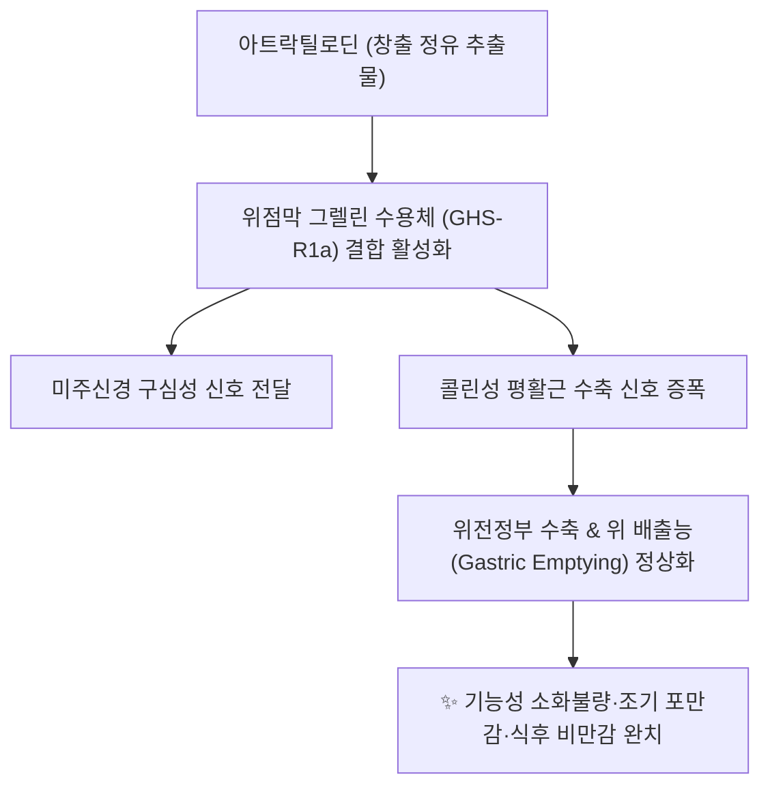

# 💊 [[아트락틸로딘]] (Atractylodin)

> **핵심 요약 (Key Summary)**:
> 국화과 가는잎삽주(창출, *Atractylodes lancea*)의 뿌리줄기에서 분리되는 대표적인 퓨란형 폴리아세틸렌계 핵심 지표 정유 성분.
> 그렐린 수용체(GHS-R1a) 활성화를 통해 위 배출능을 촉진하고 NF-κB 및 NLRP3 염증복합체를 억제하여 장 점막 상피 장벽을 강력히 보호.
> 소화불량, 위무력증, 염증성 장질환 치료의 주 유효 성분이자 평위산과 이묘산의 조습건비(燥濕健脾) 효능을 분자 수준에서 매개하는 핵심 물질.

---
## 📌 목차
1. [기본 화학 구조 및 물리화학적 특성 (Pharmacognosy)](#1-기본-화학-구조-및-물리화학적-특성-pharmacognosy)
2. [핵심 분자 표적 & 그렐린 수용체(GHS-R1a) 위장관 운동 촉진 기전](#2-핵심-분자-표적--그렐린-수용체ghs-r1a-위장관-운동-촉진-기전)
3. [장점막 장벽 보호 및 항염증·인플라마솜 억제 신호망](#3-장점막-장벽-보호-및-항염증인플라마솜-억제-신호망)
4. [창출(蒼朮) vs 백출(白朮) 성분 비교 (아트락틸로딘 vs 아트락틸레놀라이드)](#4-창출蒼朮-vs-백출白朮-성분-비교-아트락틸로딘-vs-아트락틸레놀라이드)
5. [한의학적 조습건비(燥濕健脾) 처방 배오 연계](#5-한의학적-조습건비燥濕健脾-처방-배오-연계)
6. [출처 및 학술 참고 문헌 (References)](#6-출처-및-학술-참고-문헌-references)

---
## 1. 기본 화학 구조 및 물리화학적 특성 (Pharmacognosy)

| 항목 | 상세 정보 |
| :--- | :--- |
| **화학명 (IUPAC)** | (3E,5E)-1-(Furan-2-yl)nona-3,5-diene-1,7-diyne |
| **분자식 및 분자량** | C13H10O / 182.22 g/mol |
| **CAS 등록번호** | 552-92-1 |
| **기원 본초** | 국화과(*Asteraceae*) 가는잎삽주(*Atractylodes lancea*)의 근경인 [[창출]](蒼朮) |
| **화학적 골격** | 퓨란환(Furan ring)이 결합된 폴리아세틸렌(Polyacetylene)계 지용성 화합물 |
| **안정성 및 보관** | 빛, 공기, 열에 의해 중합 및 산화되기 쉬운 불안정 화합물로 차광 밀폐 보관 |

---
## 2. 핵심 분자 표적 & 그렐린 수용체(GHS-R1a) 위장관 운동 촉진 기전

* **그렐린(Ghrelin) 신호 전달 모방 및 위장관 운동 촉진 (Prokinetic)**:
  * 아트락틸로딘은 시상하부 및 위장관 평활근의 그렐린 수용체(Growth Hormone Secretagogue Receptor 1a, GHS-R1a)의 전사 및 단백질 발현을 상향 조절합니다.
  * 이는 도파민 길항제(Domperidone)나 세로토닌 4형 수용체 작용제(Mosapride)와 유사하게 위 배출 지연을 극적으로 개선하여 식후 팽만감과 조기 만복감을 해소합니다.

---
## 3. 장점막 장벽 보호 및 항염증·인플라마솜 억제 신호망

* **밀착연접단백질(Tight Junction) 발현 강화**:
  * 장상피세포에서 조밀결합 단백질인 오클루딘(Occludin), 클라우딘-1(Claudin-1), ZO-1의 발현을 증가시켜 장 투과성(Leaky gut)을 방어합니다.
* **NLRP3 염증조절복합체 억제**:
  * 궤양성 대장염 모델에서 대식세포의 NLRP3 인플라마솜 조립을 저지하고 Caspase-1 활성화를 차단하여 염증성 사이토카인인 IL-1β 및 IL-18의 성숙 분비를 억제합니다.
* **간장 지질 축적 방지**:
  * 지방세포 분화 억제 및 간세포 내 SREBP-1c 전사인자 억제를 통해 비알코올성 지방간(NAFLD) 병태를 경감합니다.

---
## 4. 창출(蒼朮) vs 백출(白朮) 성분 비교 (아트락틸로딘 vs 아트락틸레놀라이드)

| 본초 구분 | 주 대표 지표 성분 | 화학적 분류 | 약리적 작용 편차 |
| :--- | :--- | :--- | :--- |
| **[[창출]] (蒼朮)** | **[[아트락틸로딘]] (Atractylodin)** | 퓨란형 폴리아세틸렌 정유 | 발한해표(發汗解表), 조습건비(燥濕健脾), 위장관 운동 강력 촉진 |
| **[[백출]] (白朮)** | 아트락틸레놀라이드 (Atractylenolide I, II, III) | 세스퀴테르펜 락톤 | 익기건비(益氣健脾), 지한(止汗), 이수소종, 점막 재생 |

---
## 5. 한의학적 조습건비(燥濕健脾) 처방 배오 연계

* **습담정체(濕痰停滯)의 분자약리학적 해석**:
  * 한의학에서 습(濕)이 비위에 머물러 배가 더부룩하고 입맛이 없으며 몸이 무거운 병태는 현대의 장관 운동성 저하, 장내 세균총 불균형 및 만성 점막 미세염증에 해당합니다.
  * 아트락틸로딘은 이러한 소화관 내 체류성 노폐물을 신속히 배출시키는 핵심 분자 엔진 역할을 합니다.
* **대표 한의 처방**:
  * **[[평위산]] (平胃散)**: 창출의 아트락틸로딘 + 후박의 [[마그놀롤]] + 진피의 헤스페리딘이 협력하여 급만성 위염, 식체, 소화불량을 일소.
  * **[[이묘산]] (二妙散)**: 창출 + 황백 조합으로 하지의 습열성 관절염, 통풍, 대하증을 치료.
  * **[[오적산]] (五積散)**: 한, 습, 기, 혈, 담의 다섯 가지 뭉침을 풀 때 창출의 방향성 정유 성분이 전신 기혈 순환을 개통.

---
## 6. 출처 및 학술 참고 문헌 (References)

* Tang D, He B. Atractylodin ameliorates DSS-induced acute ulcerative colitis in mice by inhibiting NF-κB and MAPK pathways. *Eur J Pharmacol*. 2021;899:174033.
  * `[연구 요약]` 창출 유래 아트락틸로딘이 장점막 염증성 사이토카인 생성을 차단하고 상피 장벽 기능을 복원하는 분자 기전 규명.
* Zhang H, Han T, Sun LN, et al. Regulative effects of atractylodin on intestinal motility and its mechanism via ghrelin receptor. *Phytomedicine*. 2008;15(11):908-914.
  * `[연구 요약]` 아트락틸로딘이 위장관 평활근의 그렐린 수용체(GHS-R1a)를 자극하여 위 배출 속도를 촉진함을 최초로 밝힌 연구.
* 대한민국약전(KP) 제12개정 (2022). 의약품각조 제2부: 창출 (Atractylodis Rhizoma) 분석법.
  * `[공정서 규격]` 창출의 지표 성분으로서 아트락틸로딘의 HPLC 정량 시험 기준 명시.
