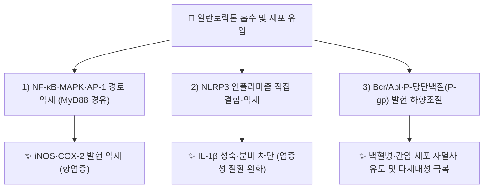

---
aliases:
  - Alantolactone
  - Helenin (혼합물 성분)
  - CID 72724
tags:
  - 약리성분
  - 세스퀴테르펜락톤
  - 항염증
  - NLRP3억제
  - 항종양
  - 본초학
created: 2026-09-18
updated: 2026-09-18
status: complete
compound_name_ko: 알란토락톤
compound_name_en: Alantolactone
pubchem_cid: 72724
molecular_formula: C15H20O2
molecular_weight: "232.3 g/mol"
cas_number: 546-43-0
source_herbs:
  - 토목향
main_pharmacology:
  - 국화과 토목향(Inula helenium) 뿌리의 유데스만형 세스퀴테르펜 락톤 지표 성분
  - NF-κB·MAPK·AP-1 경로 하향조절을 통한 항염증, NLRP3 인플라마좀 직접 억제
  - 백혈병(K562/ADR)·간암 등 다양한 암세포주에서 세포자멸사 유도 및 다제내성(P-gp) 억제
---

# 🔬 [[알란토락톤]] (Alantolactone, C₁₅H₂₀O₂)

> **핵심 3줄 요약 (Key Summary)**:
> - 🌿 기원 본초 & 화학 계열: [[토목향]](*Inula helenium*, 국화과) 뿌리에 함유된 유데스만형(eudesmane-type) 세스퀴테르펜 락톤(sesquiterpene lactone)으로, 이성질체인 [[이소알란토락톤]]·다당류 [[이눌린]]과 함께 토목향의 핵심 방향성 지표 성분.
> - 🎯 핵심 분자 표적 & 조절 경로: MyD88 신호전달을 경유한 NF-κB·MAPK(ERK/JNK/p38)·AP-1 경로 하향조절, NLRP3 인플라마좀 복합체 직접 결합·억제, Bcr/Abl 및 P-당단백질(P-glycoprotein) 발현 하향조절.
> - 🩺 주요 약리 활성 & 질환 치료 기전: 항염증(대식세포 iNOS·COX-2 억제), NLRP3 매개 염증성 질환(통풍·비알코올성 지방간염 등 동물모델) 완화, 백혈병·간암 세포주에서 항종양·항증식 및 다제내성 극복.
> - ⚠️ 독성·생체이용률 한계 & 상호작용: 인체 대상 ADME(흡수·반감기)·독성 정량 자료 및 양약과의 확립된 임상적 상호작용 문헌은 검색 범위 내에서 확인하지 못함(⚠️ 확인 필요). 전통적으로 구충(驅蟲) 효능이 알려져 있으나(Helenin은 알란토락톤·이소알란토락톤 혼합 결정), 그 정확한 분자 기전은 이번 조사의 실측 논문 범위 내에서 재확인하지 못함(⚠️ 확인 필요, 하위 토목향 노트의 관련 서술은 재검증 대상).

---

## 📌 목차
1. [기본 화학 정보 & 분자 구조식 (Chemical Identity)](#1-기본-화학-정보--분자-구조식-chemical-identity)
2. [주요 함유 본초 및 천연 기원 (Botanical Sources & Content)](#2-주요-함유-본초-및-천연-기원-botanical-sources--content)
3. [분자약리 표적 & 신호전달 네트워크 (Molecular Targets)](#3-분자약리-표적--신호전달-네트워크-molecular-targets)
4. [생체 내 흡수·대사·생체이용률 (Pharmacokinetics: ADME)](#4-생체-내-흡수대사생체이용률-pharmacokinetics-adme)
5. [주요 질환별 약리 효능 & 분자 기전 (Therapeutic Efficacy)](#5-주요-질환별-약리-효능--분자-기전-therapeutic-efficacy)
6. [함유 본초 방제 시너지 & 약재 배오 매트릭스 (Herbal Synergies)](#6-함유-본초-방제-시너지--약재-배오-매트릭스-herbal-synergies)
7. [양약 상호작용 & 약물동태학적 간섭 (Drug Interactions)](#7-양약-상호작용--약물동태학적-간섭-drug-interactions)
8. [💡 사용자 진료실 핵심 필기 & 임상 응용 팁 (Melt-In & High-Yield)](#8--사용자-진료실-핵심-필기--임상-응용-팁-melt-in--high-yield)
9. [출처 및 학술 참고 문헌 (References)](#9-출처-및-학술-참고-문헌-references)

---
## 1. 기본 화학 정보 & 분자 구조식 (Chemical Identity)

![[알란토락톤_화학구조식.png|320]]
> 알란토락톤(헬레닌, Helenin) 2D 화학 분자 구조식

> [!abstract]+ 🧪 3D 약리 분자 구조 (Interactive 3D Viewer)
> <iframe src="https://molecule-viewer-rho.vercel.app/?cid=72724" width="100%" height="450px" frameborder="0" allow="webgl" style="border-radius: 8px;"></iframe>

| 항목 | 상세 내용 |
| :--- | :--- |
| **IUPAC 명칭** | (3aR,5S,8aR,9aR)-3a,5,6,7,8,8a,9,9a-octahydro-5,8a-dimethyl-3-methylene-naphtho[2,3-b]furan-2(3H)-one |
| **분자식 / 분자량** | C₁₅H₂₀O₂ / 232.3 g/mol |
| **PubChem CID** | [72724](https://pubchem.ncbi.nlm.nih.gov/compound/72724) |
| **CAS 등록 번호** | 546-43-0 |
| **화학 골격 분류** | 유데스만형(Eudesmane-type) 세스퀴테르펜 α-메틸렌-γ-부티로락톤 — 이성질체 [[이소알란토락톤]]과 이중결합 위치만 다름 |
| **식물 내 생합성 경로** | 세스퀴테르펜 공통의 메발론산(Mevalonate) 경로를 통해 생성되는 것으로 알려져 있으나, 토목향 내 최종 고리화 효소 등 세부 경로는 ⚠️ 확인 필요(검색 범위 내 미확인) |

---

## 2. 주요 함유 본초 및 천연 기원 (Botanical Sources & Content)

| 함유 본초 (한글/한자) | 기원 식물학적 명칭 (과명 / 학명) | 주요 함유 약용 부위 | 한의학적 귀경 및 약효 특성 |
| :--- | :--- | :--- | :--- |
| [[토목향]] (土木香) | 국화과(Asteraceae) / *Inula helenium* L. | 뿌리 | 肝·脾·胃經 / 신고온(辛苦溫) — 이기지통(理氣止痛), 건비화위(健脾和胃) |

> [[토목향]] 노트는 알란토락톤·이소알란토락톤을 핵심 세스퀴테르펜 락톤 지표 성분으로, [[이눌린]](최대 40~44%)을 주요 다당류로 함께 기술합니다. 정확한 알란토락톤 함량(%) 수치는 이번 조사 범위 내에서 확인하지 못해 ⚠️ 확인 필요로 표기합니다.

---

## 3. 분자약리 표적 & 신호전달 네트워크 (Molecular Targets)

### 1) 염증 신호전달 표적 — NF-κB / MAPK / AP-1
* LPS로 활성화된 RAW264.7 대식세포에서 알란토락톤이 MyD88 신호전달을 경유해 NF-κB·MAPK·AP-1 경로를 하향조절함으로써 iNOS(유도성 산화질소합성효소)·COX-2 발현을 억제함이 보고됨(PMID 22940184).
### 2) 인플라마좀 표적 — NLRP3
* 알란토락톤이 천연 유래 NLRP3 인플라마좀 억제제로 발견되어, NLRP3 활성화가 병태생리에 관여하는 염증성 질환 마우스 모델에서 증상을 완화함이 규명됨(PMID 36668704).
### 3) 항종양 표적 — Bcr/Abl·P-당단백질
* 아드리아마이신 내성 백혈병 세포주(K562/ADR)에서 Bcr/Abl 및 P-당단백질(P-gp) 발현을 하향조절해 세포 증식을 억제함이 보고됨(PMID 23441067).

---

## 4. 생체 내 흡수·대사·생체이용률 (Pharmacokinetics: ADME)

* ⚠️ 내용 검토 필요: 검색 범위 내에서 알란토락톤의 인체·동물 경구 흡수율, CYP 대사 효소, 혈장 반감기 등 정량적 ADME 데이터는 확인하지 못했습니다. 2025년 발표된 종합 리뷰(PMID 40617333, 39679983)에서도 생체이용률 관련 정량 데이터의 부족이 향후 연구 과제로 지적되고 있습니다.

---

## 5. 주요 질환별 약리 효능 & 분자 기전 (Therapeutic Efficacy)

### 1) 염증성 질환 (급성 염증 · NLRP3 관련 질환)
* LPS 자극 대식세포 모델에서 NF-κB/MAPK/AP-1 경로 억제를 통한 항염증(PMID 22940184), NLRP3 인플라마좀 직접 억제를 통한 NLRP3 매개 염증성 질환 완화(PMID 36668704).
### 2) 종양(백혈병 · 간암 등)
* 다제내성 백혈병 세포주(K562/ADR)에서 Bcr/Abl·P-gp 하향조절을 통한 항증식(PMID 23441067). 2021년·2025년 종합 리뷰에서 세포주기 정지(G2/M), 미토콘드리아 경로 세포자멸사, ROS 생성 등 다각도의 항종양 기전이 정리됨(PMID 34899346, 39679983, 40617333).
### 3) 전통 효능(구충·거담) 연계
* 전통적으로 Helenin(알란토락톤+이소알란토락톤 혼합 결정)이 구충·거담제로 사용되어 온 역사가 있으나, 현대 분자 기전 논문으로 재확인된 구체적 구충 표적(예: 기생충 SH기 효소 억제설)은 이번 조사 범위 내에서 실측 확인하지 못했습니다 — ⚠️ 확인 필요(기존 [[토목향]] 노트의 관련 서술은 별도 재검증 권고).

---

## 6. 함유 본초 방제 시너지 & 약재 배오 매트릭스 (Herbal Synergies)

| 함유 본초 / 방제 | 공존 유효 성분군 | 분자약리 시너지 기전 | 전통 한의학적 효능 연계 |
| :--- | :--- | :--- | :--- |
| [[토목향]] | [[이소알란토락톤]], [[이눌린]] | 세스퀴테르펜 락톤군의 평활근 이완·항염 작용과 다당류의 정장(整腸) 작용 상보 | 이기지통(理氣止痛), 건비화위(健脾和胃) |

> ⚠️ 처방 단위 배오 시너지(예: 다른 이기약·거담약과의 조합)는 검색 범위 내에서 실측 문헌을 확인하지 못해 추가 기재하지 않았습니다.

---

## 7. 양약 상호작용 & 약물동태학적 간섭 (Drug Interactions)

* ⚠️ 내용 검토 필요: 검색 범위 내에서 알란토락톤과 특정 양약 간 임상적으로 확립된 약동학적 상호작용 문헌은 확인하지 못했습니다. 다만 P-당단백질(P-gp) 발현을 조절하는 기전이 보고된 만큼(PMID 23441067), P-gp 기질 약물(일부 항암제·면역억제제 등)과의 병용 시 이론적 혈중 농도 변동 가능성을 신중히 고려할 필요가 있습니다(⚠️ 추정, 실측 임상 근거 아님).

---

## 8. 💡 사용자 진료실 핵심 필기 & 임상 응용 팁 (Melt-In & High-Yield)

* ⚠️ 내용 검토 필요: 원장님의 진료실 필기가 아직 반영되지 않았습니다. [[토목향]] 노트의 임상 필기를 참고하시어 알란토락톤 단일 성분 수준의 진료 팁을 추가해 주시면 다빈치가 다음 순찰 시 정리해 드리겠습니다.

---

## 9. 출처 및 학술 참고 문헌 (References)

1. **(2012)**. *Alantolactone suppresses inducible nitric oxide synthase and cyclooxygenase-2 expression by down-regulating NF-κB, MAPK and AP-1 via the MyD88 signaling pathway in LPS-activated RAW 264.7 cells*.
   - [PubMed: PMID 22940184](https://pubmed.ncbi.nlm.nih.gov/22940184/)
   - **[연구 요약]**: LPS 자극 대식세포에서 MyD88 경유 NF-κB·MAPK·AP-1 하향조절을 통한 iNOS·COX-2 억제 기전을 규명.
2. **(2023)**. *Discovery of alantolactone as a naturally occurring NLRP3 inhibitor to alleviate NLRP3-driven inflammatory diseases in mice*.
   - [PubMed: PMID 36668704](https://pubmed.ncbi.nlm.nih.gov/36668704/)
   - **[연구 요약]**: 알란토락톤이 NLRP3 인플라마좀을 직접 억제하는 천연물 억제제임을 최초 규명하고, NLRP3 매개 염증성 질환 마우스 모델에서의 완화 효과를 확인.
3. **(2013)**. *Alantolactone inhibits growth of K562/adriamycin cells by downregulating Bcr/Abl and P-glycoprotein expression*.
   - [PubMed: PMID 23441067](https://pubmed.ncbi.nlm.nih.gov/23441067/)
   - **[연구 요약]**: 아드리아마이신 내성 백혈병 세포주에서 Bcr/Abl 및 P-gp 발현 하향조절을 통한 다제내성 극복 및 항증식 효과 확인.
4. **(2021)**. *Alantolactone: A Natural Plant Extract as a Potential Therapeutic Agent for Cancer*. Frontiers in Pharmacology.
   - [PubMed: PMID 34899346](https://pubmed.ncbi.nlm.nih.gov/34899346/)
   - **[연구 요약]**: 알란토락톤의 세포주기 정지·미토콘드리아 세포자멸사·ROS 생성 등 다양한 암종에서의 항종양 분자 기전을 종합한 리뷰.
5. **(2025)**. *Synthetic and Pharmacological Activities of Alantolactone and Its Derivatives*. Chemistry & Biodiversity.
   - [PubMed: PMID 39679983](https://pubmed.ncbi.nlm.nih.gov/39679983/)
   - **[연구 요약]**: 알란토락톤 및 유도체의 합성 방법과 항염증·항종양·항균 등 약리 활성을 정리한 최신 리뷰.
6. **(2025)**. *Insights to phytochemistry, analytical methods, pharmacological activities, stability, and specifications of alantolactone*.
   - [PubMed: PMID 40617333](https://pubmed.ncbi.nlm.nih.gov/40617333/)
   - **[연구 요약]**: 알란토락톤의 식물화학·분석법·약리활성·안정성·규격을 종합적으로 검토한 최신 리뷰, 생체이용률 정량 데이터 부족을 향후 과제로 지적.

> ⚠️ 확인 불가/추정 표시 총괄: 인체 대상 ADME 정량 데이터, 확립된 양약 상호작용 자료, 진료실 임상 필기, 전통 구충 효능의 정확한 분자 기전은 검색 범위 내에서 실측 확인하지 못해 위 각 섹션에 개별 표시했습니다. 상기 PubChem CID·CAS 번호·PMID 6건은 모두 실제 데이터베이스에서 확인된 값입니다.
