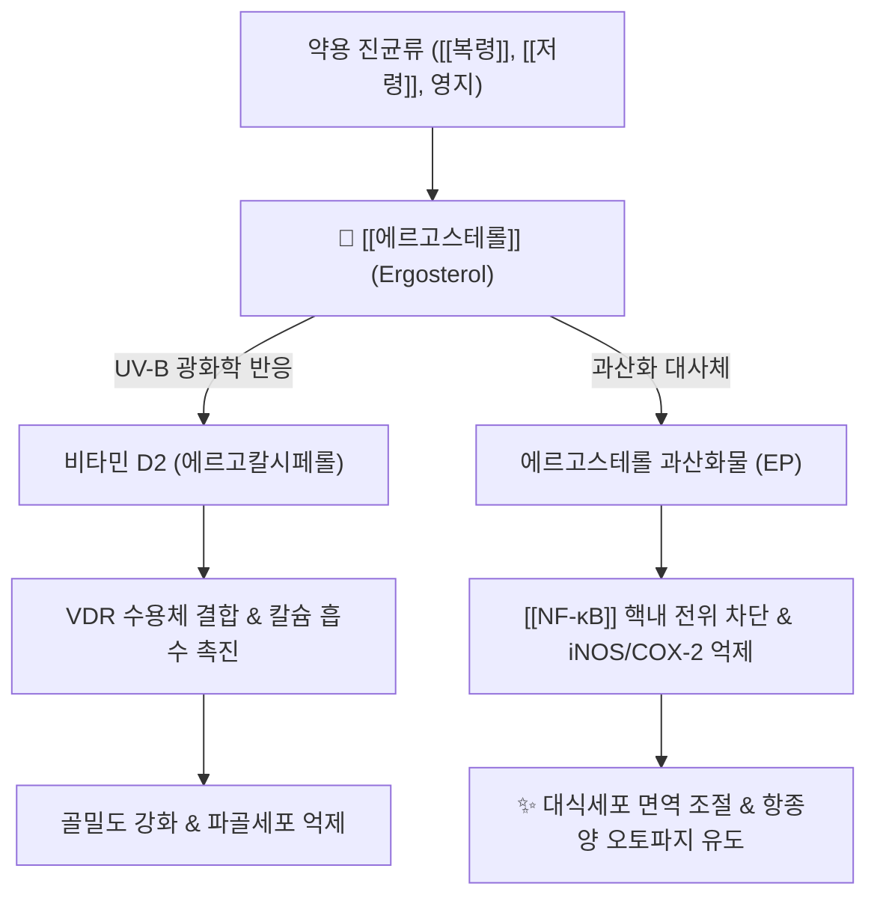

---
aliases:
  - 에르고스테롤
  - Ergosterol
  - 프로비타민 D2
  - Provitamin D2
tags:
  - 약리성분
  - 스테롤
  - 비타민D전구체
  - 진균세포막
  - 면역조절
  - 항염증
---

# 💊 [[에르고스테롤]] (Ergosterol, Provitamin D2)

> **핵심 요약 (Key Summary)**:
> 진균류 및 약용 버섯([[복령]], [[저령]], [[영지]], [[동충하초]])의 세포막을 구성하는 핵심 진균 스테롤(Mycosterol)이자 프로비타민 D2
> 자외선(UV-B) 광조사에 의해 비타민 D2(에르고칼시페롤)로 광이성화되며 양방 폴리엔계·아졸계 항진균제의 핵심 분자 표적으로 작용
> 에르고스테롤 및 산화 대사체(Ergosterol peroxide)가 [[NF-κB]] 및 STAT 신호를 억제하여 면역 조절·항종양·항염증 및 골대사 개선 효과 발휘

---

## 📌 목차
1. [기본 화학 정보 & 분자 구조식 (Chemical Identity)](#1-기본-화학-정보--분자-구조식-chemical-identity)
2. [분자약리 작용 기전 & 광전환 네트워크](#2-분자약리-작용-기전--광전환-네트워크)
3. [항진균 화학요법 표적 매커니즘 (Antifungal Target)](#3-항진균-화학요법-표적-매커니즘-antifungal-target)
4. [한의 약용 균류 유효성분 및 임상 응용](#4-한의-약용-균류-유효성분-및-임상-응용)
5. [이상 반응 및 안전성 (Safety & Toxicity)](#5-이상-반응-및-안전성-safety--toxicity)
6. [콜레스테롤·피토스테롤과의 비교 매트릭스](#6-콜레스테롤피토스테롤과의-비교-매트릭스)
7. [출처 및 학술 참고 문헌 (References)](#7-출처-및-학술-참고-문헌-references)

---

## 1. 기본 화학 정보 & 분자 구조식 (Chemical Identity)

> [!abstract]+ 🧪 3D 약리 분자 구조 (Interactive 3D Viewer)
> <iframe src="https://molecule-viewer-rho.vercel.app/?cid=444679" style="width: 100%; height: 600px; border: none; border-radius: 12px; box-shadow: 0 4px 20px rgba(0,0,0,0.15);" allowfullscreen></iframe>

| 항목 | 상세 내용 |
| :--- | :--- |
| **일반명 (Generic)** | [[에르고스테롤]] (Ergosterol, Provitamin D2) |
| **기원 천연물** | 담자균류 및 자낭균류의 세포막 ([[복령]], [[저령]], [[영지]], 효모) |
| **화학식 / 분자량** | $\text{C}_{28}\text{H}_{44}\text{O}$ / 396.65 g/mol |
| **화학 구조 분류** | B-고리 5,7-dien 결합을 가진 테트라사이클릭 트리테르페노이드 스테롤 |
| **활성 대사 전환체** | 광전환 비타민 D2 (Ergocalciferol), 에르고스테롤 과산화물 (Ergosterol peroxide) |
| **체내 흡수 특성** | 동물 세포막의 콜레스테롤과 유사하게 미셀화되어 장관 흡수 후 간으로 수송 |

### 🔬 화학 구조식 및 광전환 (Photochemical Activation)
> **[구조적 특징 및 활성]**: 에르고스테롤의 B고리는 5,7-공액 이중결합(Conjugated diene) 구조를 가짐. 자외선(UV-B, 파장 280~315nm)을 흡수하면 B고리의 9-10 탄소 결합이 개환되어 프리비타민 D2(Pre-vitamin D2)가 형성되고, 체온에 의한 열 이성화(Thermal isomerization)를 거쳐 비타민 D2(Ergocalciferol)로 비가역적으로 전환됨.

---

## 2. 분자약리 작용 기전 & 광전환 네트워크

### (1) 분자 수준 작용 메커니즘
* **비타민 D2 광전환 및 칼슘·골대사 조절**:
  * 비타민 D2로 전환된 후 체내에서 25-OH-D2 및 1,25-(OH)2-D2로 활성화되어 핵 내 VDR(Vitamin D Receptor)에 결합.
  * 소장 상피세포의 칼슘 흡수 채널(TRPV6)과 칼바인딘(Calbindin) 발현을 유도하여 골밀도를 높이고 구루병·골다공증을 예방.
* [[NF-κB]] 및 STAT1 신호 차단을 통한 항염증·면역 조절:
  * 에르고스테롤 과산화물(Ergosterol peroxide)은 대식세포에서 LPS 유도성 [[NF-κB]] 인산화 및 STAT1 신호전달을 억제하여 [[iNOS]], [[COX-2]], [[TNF-α]] 방출을 강력히 차단.
* **항암 및 세포자멸사(Apoptosis) 유도**:
  * 종양세포 미토콘드리아 막전위를 붕괴시키고 시토크롬 C 유리를 촉진하여 Caspase-3/9 매개 암세포 자멸사를 유도.

---

## 3. 항진균 화학요법 표적 매커니즘 (Antifungal Target)

* **폴리엔계 항진균제(Amphotericin B, Nystatin)의 직접 표적**:
  * 에르고스테롤은 인체 세포막의 콜레스테롤과 달리 진균 특이적 스테롤임.
  * 암포테리신 B가 에르고스테롤에 결합하여 진균 세포막에 친수성 이온 통로(Pore)를 형성, 세포질 내 $\text{K}^+$, $\text{Mg}^{2+}$ 등의 누출을 일으켜 진균을 사멸시킴.
* **아졸계 항진균제(Fluconazole, Itraconazole)의 합성 효소 억제**:
  * 라노스테롤 14α-탈메틸화효소(CYP51)를 억제하여 에르고스테롤 생합성을 차단, 독성 중간체 침착으로 진균 증식을 정지시킴.

---

## 4. 한의 약용 균류 유효성분 및 임상 응용

| 생약명 | 한자 | 함유 특성 | 주요 임상 효능 및 적응증 |
| :--- | :--- | :--- | :--- |
| [[복령]] | 茯苓 | 균핵 세포막 풍부 | 비허수종, 소변불리, 건비안신, 진정 작용 |
| [[저령]] | 豬苓 | 이수통림 주성분 | 신장 염증 완화, 요로결석 배출 촉진, 면역 증강 |
| [[영지]] | 靈芝 | 균사체 및 자실체 | 보심익기, 혈류 개선, 만성 피로 및 면역 감퇴증 |
| [[동충하초]] | 冬蟲夏草 | 자좌 및 균핵 | 익신보폐, 운동 능력 향상, 항피로, 호흡기 면역 |

---

## 5. 이상 반응 및 안전성 (Safety & Toxicity)

* **천연 식이기원 안전성**:
  * 천연 버섯류 및 효모 섭취를 통한 에르고스테롤은 전구체 형태로 존재하므로 고칼슘혈증을 유발하지 않으며 안전역이 매우 넓음.
* **약물 상호작용**:
  * 양방 아졸계 항진균제 복용 환자에서 진균의 에르고스테롤 결핍 돌연변이 발생 시 약제 내성 기전과 연관됨.

---

## 6. 콜레스테롤·피토스테롤과의 비교 매트릭스

| 구분 | [[에르고스테롤]] (진균류) | 콜레스테롤 (동물류) | β-시토스테롤 (식물류) |
| :--- | :--- | :--- | :--- |
| **세포 기원** | 효모 및 약용 진균류 | 동물 세포막 및 지질 | 고등 식물 종자 및 잎 |
| **핵심 기능** | 진균막 유동성, 프로비타민 D2 | 세포막 안정화, 스테로이드 호르몬 전구체 | 식물막 보강, 혈중 콜레스테롤 흡수 억제 |
| **광반응성** | **UV-B 조사 시 비타민 D2 전환** | 7-DHC 단계에서 비타민 D3 전환 | 광전환 활성 없음 |

---

## 7. 출처 및 학술 참고 문헌 (References)
* Weete JD, et al. Fungal sterols: biosynthesis and functions. *Adv Fungal Biotechnol*. 2010;48:1-32.
  - [연구 요약]: 진균류에서 에르고스테롤 생합성 경로 및 항진균제 분자 표적으로서의 구조적 특성 총설.
* Kobori M, et al. Ergosterol peroxide from an edible mushroom suppresses inflammatory responses in RAW264.7 macrophages and growth of HT29 colon adenocarcinoma cells. *Br J Pharmacol*. 2007;150(2):209-219.
  - [연구 요약]: 에르고스테롤 과산화물의 NF-κB 활성 억제 및 대장암 세포 증식 차단 분자 기전 입증.
* Jasinghe VJ, Perera CO. UV-B irradiation: a process for generating vitamin D2 in edible mushrooms. *Food Chem*. 2006;95(4):638-643.
  - [연구 요약]: 식용 및 약용 버섯에서 UV-B 처리에 따른 에르고스테롤의 비타민 D2 광전환 효율 최적화 연구.
