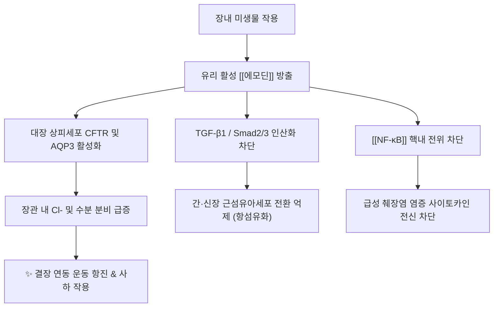

---
aliases:
  - 에모딘
  - Emodin
  - 안트라퀴논
  - 대황 에모딘
tags:
  - 약리성분
  - 안트라퀴논
  - 사하제
  - 항염증
  - 항섬유화
  - 대황
---

# 💊 [[에모딘]] (Emodin, 1,3,8-Trihydroxy-6-methylanthraquinone)

> **핵심 요약 (Key Summary)**:
> 마디풀과 [[대황]](Rheum palmatum), [[호장근]], [[하수오]] 및 [[결명자]] 등에 풍부한 대표적인 천연 오렌지색 안트라퀴논(Anthraquinone) 유도체
> 대장 점막의 CFTR 염소이온 채널 및 AQP3을 자극하여 장관 수분 분비를 촉진하고 [[NF-κB]] 및 TGF-β1/Smad 경로를 억제하여 조직 섬유화 차단
> 급만성 변비 완하·급성 췌장염 및 전신 염증 제어·만성 신부전 및 간섬유화 지연·항바이러스 면역 활성에 탁월한 효능 발휘

---

## 📌 목차
1. [기본 화학 정보 & 분자 구조식 (Chemical Identity)](#1-기본-화학-정보--분자-구조식-chemical-identity)
2. [분자약리 작용 기전 (Mechanism of Action, MoA)](#2-분자약리-작용-기전-mechanism-of-action-moa)
3. [임상 적응증 & 본초 배오 (Indications & Herb Sources)](#3-임상-적응증--본초-배오-indications--herb-sources)
4. [부작용, 대장흑색증 & 주의사항 (Adverse Effects & Safety)](#4-부작용-대장흑색증--주의사항-adverse-effects--safety)
5. [약물 상호작용 & 병용 주의 (Drug Interactions)](#5-약물-상호작용--병용-주의-drug-interactions)
6. [대황 안트라퀴논 동족체 비교 매트릭스](#6-대황-안트라퀴논-동족체-비교-매트릭스)
7. [출처 및 학술 참고 문헌 (References)](#7-출처-및-학술-참고-문헌-references)

---

## 1. 기본 화학 정보 & 분자 구조식 (Chemical Identity)

> [!abstract]+ 🧪 3D 약리 분자 구조 (Interactive 3D Viewer)
> <iframe src="https://molecule-viewer-rho.vercel.app/?cid=3220" style="width: 100%; height: 600px; border: none; border-radius: 12px; box-shadow: 0 4px 20px rgba(0,0,0,0.15);" allowfullscreen></iframe>

| 항목 | 상세 내용 |
| :--- | :--- |
| **일반명 (Generic)** | [[에모딘]] (Emodin, 6-methyl-1,3,8-trihydroxyanthraquinone) |
| **기원 본초** | [[대황]](大黃), [[호장근]](虎杖根), [[하수오]](何首烏), [[결명자]](決明子), 카스카라사그라다 |
| **화학식 / 분자량** | $\text{C}_{15}\text{H}_{10}\text{O}_5$ / 270.24 g/mol |
| **약효 분류** | 천연 안트라퀴논계 자극성 완하제(Stimulant laxative), 항섬유화제, 항염증제 |
| **생체이용률 (Bioavailability)** | 경구 투여 시 중간 수준 (장관 내 배당체 형태에서 장내 미생물에 의해 유리 에모딘으로 활성화) |
| **대사 경로 (Metabolism)** | 간 및 장점막에서 글루쿠론산 포합(UGT1A8, UGT1A9) 및 수산화(CYP1A2) |
| **배설 경로 (Excretion)** | 담즙-분변 배설 및 요중 배설 (소변 색이 주황색/적갈색으로 변색될 수 있음) |

### 🔬 화학 구조식 (Chemical Structure)
> **[구조적 특징 및 활성]**: 안트라센 핵의 1, 8번 위치에 페놀성 수산기(OH)와 9, 10번 위치에 카르보닐기(C=O)를 가진 옥시안트라퀴논 골격. 이 분자 구조는 장점막 상피세포의 전해질 펌프에 결합하여 수분 분비를 자극하는 동시에, 활성산소종을 제어하고 핵 수용체 전사 인자를 차단하는 약리 활성의 모체임.

---

## 2. 분자약리 작용 기전 (Mechanism of Action, MoA)

### (1) 분자 수준 작용 메커니즘
* **대장 연동 촉진 및 전해질 분비 (자극성 사하 기전)**:
  * 대장 점막 상피의 아쿠아포린-3(AQP3) 발현을 조절하고 CFTR(Cystic fibrosis transmembrane conductance regulator) 염소 이온 통로를 자극하여 장관 내로 수분과 전해질을 끌어들임.
  * 아우에르바흐 신경총(Myenteric plexus)을 직접 자극하여 결장의 추진성 수축 운동을 촉진.
* **항염증 및 전신 패혈성 염증 억제**:
  * IκBα 분해를 차단하여 [[NF-κB]] 활성화를 억제하고, NLRP3 인플라마좀 복합체 형성을 방해하여 급성 췌장염, 패혈증 모델에서 [[TNF-α]], IL-1β의 폭풍 분비를 강력 차단.
* **항섬유화 (Anti-fibrotic) 및 장기 보호**:
  * 만성 신장 질환(CKD) 및 만성 간염 모델에서 TGF-β1/Smad 경로를 억제하여 세포외 기질(ECM, 제1형 콜라겐)의 침착을 억제, 사구체 경화 및 간경변 진행을 지연시킴.

---

## 3. 임상 적응증 & 본초 배오 (Indications & Herb Sources)

### (1) 주요 임상 질환
* **실열성 변비 및 장폐색증**: [[대승기탕]], [[조위승기탕]]의 군약인 [[대황]]의 핵심 사하 성분으로 장관 적체를 신속히 배출.
* **급만성 간질환 및 고지혈증**: [[호장근]]과 결명자에 함유되어 간내 지방 축적을 억제하고 담즙 분비를 촉진(이담 작용).
* **만성 신부전의 요독소 배출**: 대황 관장 요법 및 경구 투여를 통해 장관을 통한 질소성 노폐물(BUN, 크레아티닌)의 체외 배출을 유도.

---

## 4. 부작용, 대장흑색증 & 주의사항 (Adverse Effects & Safety)

* **대장흑색증 (Melanosis Coli)**:
  * 에모딘을 비롯한 안트라퀴논계 제제를 수개월 이상 장기 연속 복용 시, 대장 상피세포의 사멸(Apoptosis) 잔류체가 대식세포에 탐식되어 리포푸신(Lipofuscin) 색소 침착으로 대장 점막이 흑갈색으로 변색됨 (복용 중단 시 수개월 내 가역적 회복).
* **전해질 불균형 (저칼륨혈증)**:
  * 과량 복용 시 심한 설사로 인해 칼륨($\text{K}^+$) 소실이 유발될 수 있음.
* **임산부 복용 금기**:
  * 골반강 장기의 충혈을 유발하고 자궁 수축을 자극할 수 있어 임신 중 투여를 금함.

---

## 5. 약물 상호작용 & 병용 주의 (Drug Interactions)

* **강심배당체([[디곡신]]) 병용 주의**:
  * 에모딘에 의한 저칼륨혈증 발생 시 심근 세포의 [[디곡신]] 독성(부정맥) 위험이 현저히 증가.
* **이뇨제(루프/티아지드계) 병용 주의**:
  * 칼륨 배출성 이뇨제와 병용 시 전해질 고갈 시너지 주의.

---

## 6. 대황 안트라퀴논 동족체 비교 매트릭스

| 성분명 | 화학 구조 | 사하 활성 강도 | 주요 특징 |
| :--- | :--- | :--- | :--- |
| **센노시드 A/B** | 디안트론 배당체 | ★★★★★ (최강) | 대황·센나의 가장 강력한 완하 성분 |
| [[에모딘]] | 유리 안트라퀴논 | ★★★☆☆ (중등도) | 사하 + 항염증·항섬유화 다면적 활성 |
| **레인 (Rhein)** | 카르복실산 안트라퀴논 | ★★☆☆☆ (완만) | 사하 작용보다 신장 보호·항산화 우수 |
| **크리소파놀** | 메틸 안트라퀴논 | ★☆☆☆☆ (미약) | 지질 대사 개선 및 항균 활성 위주 |

---

## 7. 출처 및 학술 참고 문헌 (References)
* Dong X, et al. Emodin: A review of its pharmacology, toxicity and pharmacokinetics. *Phytother Res*. 2016;30(8):1207-1218.
  - [연구 요약]: 에모딘의 광범위한 분자약리 타깃(NF-κB, AKT, TGF-β) 및 약동학, 안전성 지침 총설.
* Ikarashi N, et al. The laxative effect of Daio is mediated by aquaporin-3 in the colon. *Biochem Biophys Res Commun*. 2011;408(4):579-583.
  - [연구 요약]: 대황 안트라퀴논 성분(에모딘 유도체)이 대장 아쿠아포린-3 발현을 조절하여 배변을 촉진하는 세포 분자 기전 입증.
* Xiao J, et al. Protective effects of emodin on chronic kidney disease: A systematic review and meta-analysis of preclinical studies. *Front Pharmacol*. 2022;13:951234.
  - [연구 요약]: 에모딘이 TGF-β1 신호를 차단하여 사구체 섬유화를 억제하고 신기능을 보존함을 메타분석으로 확인.
