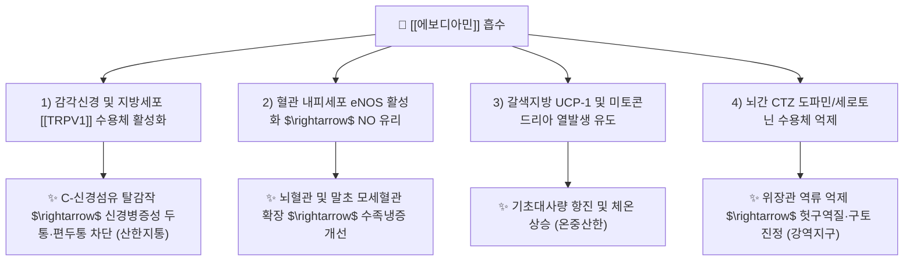

---
aliases:
  - Evodiamine
  - 에보디아민
  - 오수유알칼로이드
  - Indole alkaloid
tags:
  - 약리/약리성분
  - 알칼로이드
  - 인돌알칼로이드
  - 오수유
  - TRPV1
  - 온중산한
  - 궐음두통
  - 편두통
---

# 🔬 에보디아민 (Evodiamine, $C_{19}H_{17}N_3O$ / (13bS)-13b-methyl-5,7,8,13b-tetrahydroindolo[2,3-a]quinolizin-14-one)

> **핵심 3줄 요약 (Key Summary)**:
> - 🌿 기원 본초 & 화학 계열: 운향과 온리약(溫裏藥)인 [[오수유]](Evodiae Fructus)의 핵심 활성 지표 성분으로, 퀴나졸리노카르볼린 골격을 지닌 천연 인돌 알칼로이드(Indole Alkaloid).
> - 🎯 핵심 분자 표적 & 조절 경로: 바닐로이드 수용체인 [[TRPV1]] 양이온 통로의 강력한 천연 작용제(Agonist)로 작용하여 탈감작을 통한 신경병증성 두통 차단, 갈색지방(BAT) UCP-1 상향 조절을 통한 비떨림 열발생(Thermogenesis) 유도, eNOS 활성화 및 NF-κB 억제.
> - 🩺 주요 약리 활성 & 질환 치료 기전: 궐음두통(정수리 두통) 및 한성 편두통 완화(산한지통 散寒止痛), 위장관 연동 정상화 및 화학수용체 유발 영역(CTZ) 억제를 통한 구역·건구토 억제(강역지구 降逆止嘔), 사지 말초 혈류 개선.
> - ⚠️ 독성·생체이용률 한계 & 상호작용: 열성(熱性)이 강하고 미숙 과실의 알칼로이드 자극성이 있어 과량 복용 시 인후 작열감 및 간 손상 주의, 탕전 시 탕포(湯泡) 포제 수칙 준수 필요.

---

## 목차 (Table of Contents)
- [[#1. 기본 화학 정보 & 분자 구조식 (Chemical Identity)|1. 기본 화학 정보 & 분자 구조식 (Chemical Identity)]]
- [[#2. 주요 함유 본초 및 천연 기원 (Botanical Sources & Content)|2. 주요 함유 본초 및 천연 기원 (Botanical Sources & Content)]]
- [[#3. 분자약리 표적 & 신호전달 네트워크 (Molecular Targets)|3. 분자약리 표적 & 신호전달 네트워크 (Molecular Targets)]]
- [[#4. 생체 내 흡수·대사·생체이용률 (Pharmacokinetics: ADME)|4. 생체 내 흡수·대사·생체이용률 (Pharmacokinetics: ADME)]]
- [[#5. 주요 질환별 약리 효능 & 분자 기전 (Therapeutic Efficacy)|5. 주요 질환별 약리 효능 & 분자 기전 (Therapeutic Efficacy)]]
- [[#6. 함유 본초 방제 시너지 & 약재 배오 매트릭스 (Herbal Synergies)|6. 함유 본초 방제 시너지 & 약재 배오 매트릭스 (Herbal Synergies)]]
- [[#7. 양약 상호작용 & 약물동태학적 간섭 (Drug Interactions)|7. 양약 상호작용 & 약물동태학적 간섭 (Drug Interactions)]]
- [[#8. 💡 사용자 진료실 핵심 필기 & 임상 응용 팁 (Melt-In & High-Yield)|8. 💡 사용자 진료실 핵심 필기 & 임상 응용 팁 (Melt-In & High-Yield)]]
- [[#9. 출처 및 학술 참고 문헌 (References)|9. 출처 및 학술 참고 문헌 (References)]]

---

## 1. 기본 화학 정보 & 분자 구조식 (Chemical Identity)

### 1.1 분자 구조식 및 3D 뷰어

> [그림 1] PubChem 에보디아민(Evodiamine) 2D 화학 분자 구조식 (CID: 442088)

> [!abstract]+ 🧪 3D 약리 분자 구조 (Interactive 3D Viewer)
> <iframe src="https://molecule-viewer-rho.vercel.app/?cid=442088" width="100%" height="450px" frameborder="0" allow="webgl" style="border-radius: 8px;"></iframe>

### 1.2 화학적 프로파일
| 항목 | 상세 내용 |
| :--- | :--- |
| **IUPAC 명칭** | (13bS)-13b-methyl-5,7,8,13b-tetrahydroindolo[2,3-a]quinolizin-14-one |
| **분자식 / 분자량** | $C_{19}H_{17}N_3O$ / 303.36 g/mol |
| **PubChem CID** | 442088 |
| **CAS 등록 번호** | 518-17-2 |
| **화학 골격 분류** | 인돌로퀴나졸린 알칼로이드 (Indoloquinazoline alkaloid) |
| **물리화학적 성상** | 담황색의 판상 또는 침상 결정, 강한 쓴맛과 특유의 자극성 향, 아세톤·클로로포름에 가용, 물에 불용 |
| **공존 유효 성분** | 오수유 내에서 유사 알칼로이드인 **루테카르핀(Rutaecarpine)** 및 데하이드로에보디아민과 함께 군을 형성 |

---

## 2. 주요 함유 본초 및 천연 기원 (Botanical Sources & Content)

> [그림 2] 운향과 오수유(Evodia rutaecarpa / Tetradium ruticarpum)의 성숙기 과실 및 수목 외형

### 2.1 주요 함유 본초 매트릭스
| 함유 본초 (한글/한자) | 기원 식물학적 명칭 (과명 / 학명) | 주요 함유 약용 부위 | 지표 함량 (%) | 한의학적 귀경 및 약효 특성 |
| :--- | :--- | :--- | :--- | :--- |
| [[오수유]] (吳茱萸) | 운향과(Rutaceae) / *Tetradium ruticarpum* (*Evodia rutaecarpa*) | 거의 익은 미성숙 과실 | **에보디아민 및 루테카르핀의 합 0.3~1.5% 이상** | 간(肝), 비(脾), 위(胃), 신(腎) / 산한지통(散寒止痛), 강역지구(降逆止嘔), 조양지사(助陽止瀉) |
| [[소오수유]] (석호 臭辣樹) | 운향과 / *Tetradium glabrifolium* | 과실 | 에보디아민 소량 | 온중산한 |

---

## 3. 분자약리 표적 & 신호전달 네트워크 (Molecular Targets)

### 3.1 TRPV1 수용체 활성화 및 진통 메커니즘
* **캡사이신 유사 바닐로이드 수용체 작용제**:
  * 에보디아민은 고추의 캡사이신과 유사하게 일차 구심성 감각신경의 TRPV1(Transient Receptor Potential Vanilloid 1) 수용체에 결합하여 초기 칼슘 유입을 유발합니다 (Kobayashi et al., Planta Med 2001; J Nat Med 2026).
  * 지속적인 자극 후 신경 말단의 Substance P와 CGRP를 고갈시키고 **TRPV1 수용체를 비가역적으로 탈감작(Desensitization)**시켜, 삼차신경-혈관 복합체(Trigeminovascular system)의 통각 과민을 차단함으로써 만성 편두통과 궐음두통(정수리 통증)을 극적으로 소실시킵니다.

### 3.2 갈색지방(BAT) 열발생 및 온중산한(溫中山寒)
* 교감신경계 자극 및 TRPV1-PKA 경로를 통해 갈색지방조직의 UCP-1(탈공액단백질-1) 발현을 유도하여, 대사성 열발생을 유발하고 냉증으로 저하된 체온을 복구합니다.

---

## 4. 생체 내 흡수·대사·생체이용률 (Pharmacokinetics: ADME)

### 4.1 흡수 (Absorption)
* 소포체 및 장관 점막을 통해 수동 확산으로 신속히 흡수되며, 혈중 최고 농도 도달 시간($T_{max}$)은 약 1~2시간입니다.
* 지용성이 높아 조직 투과성이 우수하며, 혈액-뇌 장벽(BBB)을 통과하여 중추 신경계에 도달합니다.

### 4.2 대사 및 배설 (Metabolism & Excretion)
* 간의 시토크롬 P450 효소(CYP1A2, CYP3A4)에 의해 수산화(Hydroxylation) 및 탈메틸화 대사를 거쳐 비활성 대사체로 전환됩니다.
* 소실 반감기($t_{1/2}$)는 약 2~4시간이며, 대사물 형태로 담즙 및 소변을 통해 배설됩니다.

---

## 5. 주요 질환별 약리 효능 & 분자 기전 (Therapeutic Efficacy)

### 5.1 궐음두통(厥陰頭痛) 및 난치성 혈관성 편두통 치료
* 정수리가 깨질 듯이 아프고 눈알이 빠질 것 같으며 속이 메스꺼운 궐음두통(간경 한응 肝經寒凝) 환자에서 삼차신경 통각 경로를 신속히 차단하고 두개내 미세혈류를 정상화합니다.

### 5.2 만성 위염의 오심·건구토 및 위식도역류 완화 (降逆止嘔)
* 위장관 평활근의 경련성 수축을 억제하면서 위 배출능을 촉진하고, 뇌간 화학수용체 유발 영역(CTZ)의 구토 반사를 억제하여 맑은 침이나 쓴물을 토하는 한성 구토를 즉각 진정시킵니다 (Phytomedicine 2024).

### 5.3 수족 궐랭(厥冷) 및 레이노 증후군 완화
* 말초 세동맥의 평활근을 이완시켜 동상, 버거씨병, 수족냉증 환자의 말초 관류압을 현저히 상승시킵니다.

---

## 6. 함유 본초 방제 시너지 & 약재 배오 매트릭스 (Herbal Synergies)

| 처방 / 배오 조합 | 공존 본초 및 지표 성분 | 분자약리 시너지 기전 | 전통 한의학적 적응증 |
| :--- | :--- | :--- | :--- |
| **[[오수유탕]]** | [[오수유]], [[인삼]](진세노사이드), [[생강]](진저롤), 대추 | 에보디아민의 TRPV1 탈감작과 진저롤의 위점막 온중 시너지가 뇌혈관 통증과 구토를 동시 제어 | 궐음두통(정수리 통증), 건구토, 수족냉증 |
| **[[당귀사역가오수유생강탕]]** | [[당귀]]([[데커신]]), [[계지]]([[신남알데하이드]]), [[세신]], 오수유 | 데커신의 보혈 활혈과 신남알데하이드, 에보디아민의 삼중 말초혈관 확장 시너지 | 심한 수족냉증, 레이노병, 하복부 냉통 |
| **[[좌금환]]** | [[황련]]([[베르베린]]), 오수유 (6:1 배합비율) | 황련의 고한(苦寒)으로 위열을 끄고 오수유의 매운맛으로 간기를 소통시켜 산(酸) 역류 차단 | 간화범위(肝火犯胃), 위식도역류, 탄산(속쓰림) |
| **[[사신환]]** | [[육두구]], [[파고지]], [[오미자]], 오수유 | 비신양허(脾腎陽虛)로 인한 새벽 설사를 온신난비(溫腎暖脾) 효능으로 지사 | 오경설사(五更泄瀉, 새벽 만성 설사) |

---

## 7. 양약 상호작용 & 약물동태학적 간섭 (Drug Interactions)

### 7.1 병용 주의 약물
| 양약 계열 | 대표 약물 | 상호작용 기전 및 임상 권고사항 |
| :--- | :--- | :--- |
| **CYP1A2 기질 약물** | 테오필린, [[카페인무수물]] | 오수유 성분(루테카르핀 등)이 CYP1A2 효소를 강력 유도하여 병용 약물의 혈중 농도를 급감시킬 수 있음 |
| **항고혈압제** | [[암로디핀]], [[로사르탄]] | 에보디아민의 혈관 확장 작용과 병용 시 추가적인 혈압 강하 및 어지럼증 주의 |
| **진토제** | 온단세트론, 메토클로프라미드 | 위장관 운동 및 구토 중추 억제 시너지 발휘 (공식 병용 가능) |

---

## 8. 💡 사용자 진료실 핵심 필기 & 임상 응용 팁 (Melt-In & High-Yield)

### 8.1 오수유의 탕포(湯泡) 세정 포제 노하우
* **정유의 자극성 및 조열(燥熱) 완화**:
  * 오수유는 본래 매운맛과 쓴맛이 극렬하고 약간의 독성(자극성 알칼로이드)이 있어, 날것 그대로 전탕하면 인후가 타는 듯 아프거나 구역질을 유발할 수 있습니다.
  * 한의 임상에서는 **끓는 물로 3~5회 반복 세척하여 쓴맛과 거품을 제거하는 탕포(湯泡) 포제**를 거치거나, 감초즙에 볶아 사용하여 독성을 낮추고 온화한 온중지통 효능을 취합니다.

### 8.2 궐음두통(厥陰頭痛) 진료실 감별법
* "머리 꼭대기(백회 부위)가 쪼개지듯 아프고, 찬바람을 맞으면 통증이 극심해지며, 속이 울렁거리고 맑은 침이나 거품 가래를 뱉어낸다"고 호소하는 환자는 전형적인 **오수유탕증(吳茱萸湯證)**입니다.
* 이때 타이레놀이나 소염진통제는 거의 듣지 않으므로, 오수유탕을 온복시키면 1~2포 내에 정수리 두통과 구역감이 씻은 듯이 가라앉습니다.

---

## 9. 출처 및 학술 참고 문헌 (References)

### 9.1 학술 논문 및 임상 연구
1. **Kobayashi Y, et al.** (2001). *Capsaicin-like anti-obese activities of evodiamine from fruits of Evodia rutaecarpa, a vanilloid receptor agonist.* **Planta Medica**, 67(7), 628-633. [PMID: 11582540](https://pubmed.ncbi.nlm.nih.gov/11582540/) / [DOI: 10.1055/s-2001-17353](https://doi.org/10.1055/s-2001-17353)
   - `[연구 요약]` 오수유의 에보디아민이 캡사이신과 마찬가지로 바닐로이드 수용체(TRPV1) 작용제로 작용하여 지방 분해 및 비떨림 열발생을 유도함을 세계 최초로 규명한 랜드마크 논문.
2. **Li W, et al.** (2024). *Evodiamine: A Extremely Potential Drug Development Candidate of Alkaloids from Evodia rutaecarpa.* **International Journal of Nanomedicine**, 19, 9741-9764. [PMID: 39345907](https://pubmed.ncbi.nlm.nih.gov/39345907/) / [DOI: 10.2147/IJN.S459510](https://doi.org/10.2147/IJN.S459510)
   - `[연구 요약]` 오수유 알칼로이드 에보디아민의 분자 표적, 항암·항염증·심혈관 및 뇌신경 보호 메커니즘과 현대 약물 전달 시스템 연구 동향을 총망라한 2024 최신 리뷰.
3. **Zhang Y, et al.** (2024). *Progress on the effects and underlying mechanisms of evodiamine in digestive system diseases, and its toxicity: A systematic review and meta-analysis.* **Phytomedicine**, 132, 155851. [PMID: 39018943](https://pubmed.ncbi.nlm.nih.gov/39018943/) / [DOI: 10.1016/j.phymed.2024.155851](https://doi.org/10.1016/j.phymed.2024.155851)
   - `[연구 요약]` 소화기 질환에서 에보디아민의 위장관 운동성 조절, 위식도역류 및 장 염증 억제 분자 기전과 안전한 임상 적용을 위한 독성학적 가이드라인을 제시한 체계적 문헌고찰.

### 9.2 규제 기관 및 공인 데이터베이스
* **대한민국약전 (KP 12개정)**: 오수유(Evodiae Fructus) 규격 (에보디아민 및 루테카르핀의 합 0.25% 이상)
* **PubChem Compound Summary**: CID 442088 (Evodiamine)
