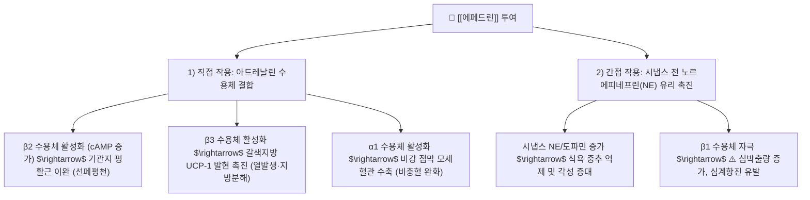

---
aliases:
  - Ephedrine
  - 에페드린
  - L-ephedrine
  - 마황알칼로이드
  - Ephedrine alkaloid
tags:
  - 약리/약리성분
  - 알칼로이드
  - 페닐알킬아민
  - 교감신경효능제
  - 마황
  - 대사항진
---

# 🔬 에페드린 (Ephedrine, $C_{10}H_{15}NO$ / (1R,2S)-2-(methylamino)-1-phenylpropan-1-ol)

> **핵심 3줄 요약 (Key Summary)**:
> - 🌿 기원 본초 & 화학 계열: [[마황]](Ephedra sinica Stapf)의 핵심 지표 성분으로, 페닐에틸아민/페닐알킬아민 골격을 지닌 천연 식물성 알칼로이드(Alkaloid).
> - 🎯 핵심 분자 표적 & 조절 경로: 아드레날린 수용체($\alpha_1, \alpha_2, \beta_1, \beta_2, \beta_3$)를 직접 자극함과 동시에 시냅스 전 신경 말단에서 노르에피네프린(NE) 유리를 촉진하는 혼합형 교감신경 효능제(Mixed-acting sympathomimetic).
> - 🩺 주요 약리 활성 & 질환 치료 기전: 기관지 평활근 이완([[천식]], 만성 해수), 갈색지방조직(BAT)의 UCP-1 상향 조절을 통한 열발생(Thermogenesis) 촉진 및 기초대사량 증가([[비만]], 대사증후군), 말초 혈관 수축을 통한 비충혈 완화.
> - ⚠️ 독성·생체이용률 한계 & 상호작용: 중추신경 흥분 및 심혈관 부하로 심계항진, 혈압 상승, 불면, 진전(Tremor) 유발 가능, MAO 억제제(MAOI)와 병용 시 치명적 고혈압 위기 위험, 성인 1일 에페드린 150mg 이하 안전 기준 엄수.

---

## 목차 (Table of Contents)
- [[#1. 기본 화학 정보 & 분자 구조식 (Chemical Identity)|1. 기본 화학 정보 & 분자 구조식 (Chemical Identity)]]
- [[#2. 주요 함유 본초 및 천연 기원 (Botanical Sources & Content)|2. 주요 함유 본초 및 천연 기원 (Botanical Sources & Content)]]
- [[#3. 분자약리 표적 & 신호전달 네트워크 (Molecular Targets)|3. 분자약리 표적 & 신호전달 네트워크 (Molecular Targets)]]
- [[#4. 생체 내 흡수·대사·생체이용률 (Pharmacokinetics: ADME)|4. 생체 내 흡수·대사·생체이용률 (Pharmacokinetics: ADME)]]
- [[#5. 주요 질환별 약리 효능 & 분자 기전 (Therapeutic Efficacy)|5. 주요 질환별 약리 효능 & 분자 기전 (Therapeutic Efficacy)]]
- [[#6. 함유 본초 방제 시너지 & 약재 배오 매트릭스 (Herbal Synergies)|6. 함유 본초 방제 시너지 & 약재 배오 매트릭스 (Herbal Synergies)]]
- [[#7. 양약 상호작용 & 약물동태학적 간섭 (Drug Interactions)|7. 양약 상호작용 & 약물동태학적 간섭 (Drug Interactions)]]
- [[#8. 💡 사용자 진료실 핵심 필기 & 임상 응용 팁 (Melt-In & High-Yield)|8. 💡 사용자 진료실 핵심 필기 & 임상 응용 팁 (Melt-In & High-Yield)]]
- [[#9. 출처 및 학술 참고 문헌 (References)|9. 출처 및 학술 참고 문헌 (References)]]

---

## 1. 기본 화학 정보 & 분자 구조식 (Chemical Identity)

### 1.1 분자 구조식 및 3D 뷰어

> [그림 1] PubChem 에페드린(Ephedrine) 2D 화학 분자 구조식 (CID: 9294)

> [!abstract]+ 🧪 3D 약리 분자 구조 (Interactive 3D Viewer)
> <iframe src="https://molecule-viewer-rho.vercel.app/?cid=9294" width="100%" height="450px" frameborder="0" allow="webgl" style="border-radius: 8px;"></iframe>

### 1.2 화학적 프로파일
| 항목 | 상세 내용 |
| :--- | :--- |
| **IUPAC 명칭** | (1R,2S)-2-(methylamino)-1-phenylpropan-1-ol |
| **분자식 / 분자량** | $C_{10}H_{15}NO$ / 165.23 g/mol |
| **PubChem CID** | 9294 |
| **CAS 등록 번호** | 299-42-3 (유리염기), 134-71-4 (염산염) |
| **화학 골격 분류** | 페닐알킬아민계 알칼로이드 (Protoalkaloid) |
| **물리화학적 성상** | 백색의 결정 또는 결정성 분말, 무취, 쓴맛, 물과 에탄올에 쉽게 용해됨 |
| **입체이성질체 관계** | (1R,2S) 배위를 가지며, 1번 및 2번 탄소의 부분입체이성질체(Diastereomer)가 [[슈도에페드린]](Pseudoephedrine, (1S,2S))임 |

---

## 2. 주요 함유 본초 및 천연 기원 (Botanical Sources & Content)

> [그림 2] 마황(Ephedra sinica)의 자생지 및 녹색 초본성 줄기 성상

### 2.1 주요 함유 본초 매트릭스
| 함유 본초 (한글/한자) | 기원 식물학적 명칭 (과명 / 학명) | 주요 함유 약용 부위 | 지표 함량 (%) | 한의학적 귀경 및 약효 특성 |
| :--- | :--- | :--- | :--- | :--- |
| [[마황]] (초마황) | 마황과(Ephedraceae) / *Ephedra sinica* | 초질경(건조된 녹색 줄기) | 총 알칼로이드 1.0 ~ 2.5% (에페드린 70~80%) | 폐(肺), 방광(膀胱) / 발한해표(發汗解表), 선폐평천(宣肺平喘), 이수소종(利水消腫) |
| [[마황]] (중마황) | 마황과(Ephedraceae) / *Ephedra intermedia* | 초질경 | 총 알칼로이드 1.0 ~ 1.8% (슈도에페드린 비율 상대적 높음) | 폐, 방광 / 거풍지해, 발한 |
| [[마황]] (목적마황) | 마황과(Ephedraceae) / *Ephedra equisetina* | 초질경 | 총 알칼로이드 1.5 ~ 2.5% | 폐, 방광 / 선폐평천, 발한 |
| [[마황근]] (뿌리) | 마황과(Ephedraceae) / *Ephedra sinica* | 지하 뿌리 및 근경 | 에페드린 극미량 (에페드라딘 A-D 함유) | 심(心), 폐(肺) / 지한(止汗, 땀을 멎게 함 - 지상부 줄기와 정반대 효능) |

---

## 3. 분자약리 표적 & 신호전달 네트워크 (Molecular Targets)

> [그림 3] 에페드린의 아드레날린 수용체 직접/간접 복합 자극 네트워크

### 3.1 혼합형 교감신경 효능 기전 (Direct & Indirect Sympathomimetic)
* **간접적 신경전달물질 유리 촉진**:
  * 교감신경 말단의 소포성 모노아민 수송체-2(VMAT2) 및 노르에피네프린 수송체(NET)에 작용하여 저장된 노르에피네프린(NE)을 세포외 시냅스 간극으로 대량 방출시킵니다.
* **직접적 아드레날린 수용체 활성화**:
  * $\beta_2$ 수용체 결합: 아데닐릴 시클라아제(Adenylyl Cyclase)를 활성화하여 세포 내 cAMP 농도를 높이고 PKA를 활성화하여 기관지 평활근을 이완시킵니다.
  * $\beta_3$ 수용체 결합: 지방세포의 지방분해효소(HSL)를 활성화하여 중성지방 분해 및 유리 지방산 유출을 유도합니다.

---

## 4. 생체 내 흡수·대사·생체이용률 (Pharmacokinetics: ADME)

### 4.1 흡수 (Absorption)
* **완전한 경구 흡수**: 경구 복용 시 위장관에서 신속하고 거의 완전하게 흡수(생체이용률 $F \approx 85\sim 100\%$)됩니다.
* **최고 농도 도달 시간($T_{max}$)**: 약 **1~2시간** 이내로, 복용 후 30~60분 내에 심박수 상승, 각성 및 대사항진이 체감됩니다.

### 4.2 분포 (Distribution) 및 BBB 통과
* **중추신경 침투성**: 지용성이 우수하여 혈액-뇌 장벽(BBB)을 통과하며, 중추신경계 시상하부 식욕 중추 및 피질 망상계를 자극합니다 (암페타민보다는 BBB 통과율이 낮음).
* **분포 용적($V_d$)**: 약 2.5~3.0 L/kg.

### 4.3 대사 및 배설 (Metabolism & Excretion)
* **간 대사 저항성**: 에페드린의 2번 탄소 메틸기($-\alpha\text{-methyl}$)로 인해 모노아민 산화효소(MAO)에 의해 분해되지 않으며, 간 대사는 10~20% 미만(소량 N-demethylation되어 노르에페드린 형성)에 불과합니다.
* **신장 미변화체 배설**:
  * 투여량의 **60~80%가 대사되지 않은 활성 미변화체 상태로 신장을 통해 소변으로 배설**됩니다.
  * 소변 pH에 매우 민감하여, **산성뇨(Acidic urine)에서는 이온화되어 배설이 촉진(반감기 3시간 단축)**되고, 알칼리성뇨에서는 세뇨관 재흡수가 증가하여 반감기가 6~8시간 이상으로 연장됩니다.

---

## 5. 주요 질환별 약리 효능 & 분자 기전 (Therapeutic Efficacy)

### 5.1 비만 치료 및 열발생(Thermogenesis) 기초대사량 항진
* **갈색지방조직(BAT) 및 UCP-1 활성화**:
  * 교감신경계를 통해 갈색지방조직 및 베이지색 지방세포의 $\beta_3$-아드레날린 수용체를 자극하여 탈공액단백질-1(UCP-1) 발현을 강력히 상향 조절합니다.
  * 미토콘드리아 전자전달계와 ATP 합성을 탈공액(Uncoupling)시켜 에너지를 열(Heat)로 발산함으로써 기초대사량을 5~10% 이상 증가시킵니다 (Astrup et al., Int J Obes).
* **시상하부 식욕 억제**:
  * 시상하부 복내측핵(VMH)의 포만 중추를 자극하고 섭식 중추를 억제하여 음식 섭취량을 유의하게 감소시킵니다.

### 5.2 호흡기 평활근 이완 및 항천식 (宣肺平喘)
* 기관지 평활근 세포 내 칼슘 농도를 낮추어 히스타민이나 아세틸콜린에 의해 유발된 기관지 연축을 강력하게 이완시킵니다. 천식, 급만성 기관지염, 해수 천명(喘鳴) 증상을 신속히 완화합니다.

### 5.3 비강 점막 충혈 완화 및 감기 표증 해소 (發汗解表)
* 말초 혈관 $\alpha_1$ 수용체를 수축시켜 비강 점막 부종을 완화하고, 외감 풍한(風寒) 초기에 땀샘을 열어 체온을 조절하는 발한 작용을 촉진합니다.

---

## 6. 함유 본초 방제 시너지 & 약재 배오 매트릭스 (Herbal Synergies)

| 처방 / 배오 조합 | 공존 본초 및 지표 성분 | 분자약리 시너지 기전 | 전통 한의학적 적응증 |
| :--- | :--- | :--- | :--- |
| **[[마황탕]]** | [[계지]]([[신남알데하이드]]), [[행인]], [[감초]] | 에페드린의 혈관 작용과 신남알데하이드의 말초 혈류 개선 시너지로 강력한 발한해표 유도 | 외감풍한 표실증 (무한, 두통, 오한) |
| **[[마행감석탕]] / [[월비탕]]** | [[석고]](황산칼슘 $CaSO_4$), 감초 | 석고의 해열 작용이 에페드린의 중추 흥분 및 열감을 상쇄하고 진해거담 극대화 | 폐열천해(肺熱喘咳), 비만 다이어트 |
| **[[소청룡탕]]** | [[세신]], [[건강]], [[반하]], [[오미자]] | 기관지 수축 억제와 분비물 억제 시너지로 맑은 콧물 및 기관지 과민성 차단 | 알레르기 비염, 기관지 천식 |
| **[[태음조위탕]]** | [[의이인]]([[코익세놀라이드]]), [[건밤]], [[나복자]] | 에페드린의 열발생과 의이인의 수습 배출 및 장관 흡수 조절 시너지 | 사상체질 태음인 비만증, 부종 |

---

## 7. 양약 상호작용 & 약물동태학적 간섭 (Drug Interactions)

### 7.1 병용 절대 금기 및 주의 약물
| 양약 계열 | 대표 약물 | 상호작용 기전 및 임상 위험 |
| :--- | :--- | :--- |
| **MAO 억제제 (MAOI)** | 셀레길린, 모클로베미드 | 에페드린이 유리시킨 노르에피네프린의 분해가 차단되어 **급성 고혈압 위기(Hypertensive crisis), 뇌출혈, 부정맥 유발 (절대 금기)** |
| **중추신경 흥분제 / 카페인** | [[카페인무수물]], 메틸페니데이트 | 교감신경 흥분 반응 중첩으로 심계항진, 혈압 급상승, 중증 불면 및 불안 유발 |
| **교감신경 베타차단제** | 프로프라놀롤, 아테놀롤 | $\beta_2$ 기관지 확장 및 대사항진 효과가 상쇄되고, 무반향 $\alpha$ 수용체 자극만 남아 심각한 혈압 상승 초래 |
| **혈당강하제** | [[메트포르민]], 인슐린 | 에페드린의 간 당원분해 촉진으로 혈당이 일시 상승하여 당뇨약 효과 감쇄 가능 |

---

## 8. 💡 사용자 진료실 핵심 필기 & 임상 응용 팁 (Melt-In & High-Yield)

### 8.1 대한한의사협회 마황 안전 처방 가이드라인
* **성인 1일 권장 용량**:
  * 건강한 성인 기준 **1일 에페드린 총량 150mg 이하**로 처방을 설계합니다.
  * 통상 전탕용 생약 마황은 품질에 따라 알칼로이드 함량이 1.0~1.5%이므로, **마황 1일 용량 6~12g(비만 치료 시 최대 16g 내외)**이 적정 안전 가이드라인에 부합합니다.
* **복용 초기 3대 적응 반응 사전 티칭**:
  1. **심계항진 및 손떨림(Fine tremor)**: 교감신경 항진에 따른 일시적 반응으로, 복용 2~3일 차에 수용체 하향조절과 함께 점차 완화됨을 설명.
  2. **불면증 예방**: 마지막 회차 복용은 취침 전 최소 4~6시간 전(오후 4~5시 이전)에 완료하도록 지도.
  3. **구갈(입마름)**: 대사항진에 따른 진액 소모이므로 미온수를 수시로 섭취하도록 안내.

### 8.2 부작용 민감 환자 대처 프로토콜
* **초기 용량 감량**: 약물에 민감하거나 체구가 작은 환자는 1/2 용량부터 시작하여 3~5일 간격으로 점진 증량(Step-up).
* **배오 보완**: 두근거림이나 불안이 심한 환자에게는 [[산조인]], [[백자인]], [[용골]], [[모려]] 등 안신약(安神藥)을 합방하여 교감신경의 과도한 중추 흥분을 부드럽게 진정시킵니다.

---

## 9. 출처 및 학술 참고 문헌 (References)

### 9.1 학술 논문 및 임상 연구
1. **Astrup A, Breum L, Toubro S, Hein P, Quaade F.** (1993). *Thermogenic, metabolic, and cardiovascular responses to ephedrine and caffeine in man.* **International Journal of Obesity and Related Metabolic Disorders**, 17 Suppl 1, S41-S47. [PMID: 8384179](https://pubmed.ncbi.nlm.nih.gov/8384179/)
   - `[연구 요약]` 에페드린 투여가 인간 갈색지방 및 골격근의 에너지 소비와 열발생(Thermogenesis)을 유의하게 촉진하며, 카페인과의 복합 시너지로 체지방 감량 효과가 극대화됨을 입증한 랜드마크 대사 연구.
2. **Haller CA, Benowitz NL.** (2000). *Adverse cardiovascular and central nervous system events associated with dietary supplements containing ephedra alkaloids.* **New England Journal of Medicine**, 343(25), 1833-1838. [PMID: 11117974](https://pubmed.ncbi.nlm.nih.gov/11117974/) / [DOI: 10.1056/NEJM200012213432502](https://doi.org/10.1056/NEJM200012213432502)
   - `[연구 요약]` 마황 알칼로이드가 심근 수축 및 혈관 수축을 유발하여 심혈관 및 중추신경계 유해 반응을 초래할 수 있음을 규명하고, 표준화된 안전 용량 관리의 절대적 필요성을 제시한 NEJM 랜드마크 논문.
3. **Zhang Y, et al.** (2025). *Material basis and mechanism of Ephedra sinica in interfering with wind-chill cold.* **International Immunopharmacology**, 153, 114432. [PMID: 40058103](https://pubmed.ncbi.nlm.nih.gov/40058103/) / [DOI: 10.1016/j.intimp.2025.114432](https://doi.org/10.1016/j.intimp.2025.114432)
   - `[연구 요약]` 마황의 주성분인 에페드린과 슈도에페드린이 선천 면역 수용체 및 신경펩티드 조절을 통해 풍한형 감기 증상을 개선하는 현대 분자 면역학적 물질 기반 및 다표적 메커니즘을 규명한 최신 논문.

### 9.2 규제 기관 및 공인 데이터베이스
* **대한한의사협회**: 한방비만학회 비만치료 임상진료지침 (마황의 안전한 사용 가이드라인)
* **PubChem Compound Summary**: CID 9294 (Ephedrine)
