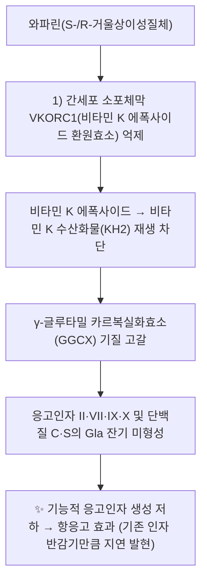

---
aliases:
  - Warfarin
  - 쿠마딘
  - Coumadin
  - CAS 81-81-2
tags:
  - 약리성분
  - 의약품
  - 항응고제
  - 쿠마린유도체
---

# 🔬 와파린 (Warfarin, C₁₉H₁₆O₄)

> **핵심 3줄 요약 (Key Summary)**:
> - 🌿 기원 & 화학 계열: 한약재 유래 파이토케미컬이 아닌 합성 쿠마린(coumarin) 유도체 의약품. 원형은 부패한 스위트클로버(*Melilotus*)에서 발견된 천연 항응고 물질 디쿠마롤(dicoumarol)에서 유래.
> - 🎯 핵심 분자 표적 & 조절 경로: 간 VKORC1(비타민 K 에폭사이드 환원효소) 억제 → 비타민 K 재활성화 차단 → 응고인자 II·VII·IX·X 및 단백질 C·S의 γ-카르복실화 억제.
> - 🩺 주요 약리 활성 & 질환 치료 기전: 경구 항응고제로 심방세동의 뇌졸중 예방, 정맥혈전색전증(VTE) 치료·예방, 인공심장판막 혈전 예방에 사용.
> - ⚠️ 독성·생체이용률 한계 & 상호작용: 치료역이 매우 좁아 출혈 위험이 크고, CYP2C9·VKORC1 유전다형성에 따라 필요 용량이 개인마다 크게 다름. 다수의 한약재·건강기능식품과 상호작용이 보고되어 병용 시 INR 모니터링이 필수.

---

## 📌 목차
1. [기본 화학 정보 & 분자 구조식 (Chemical Identity)](#1-기본-화학-정보--분자-구조식-chemical-identity)
2. [실제 적용 형태 및 기원 (Origin & Clinical Formulation)](#2-실제-적용-형태-및-기원-origin--clinical-formulation)
3. [분자약리 표적 & 신호전달 네트워크 (Molecular Targets)](#3-분자약리-표적--신호전달-네트워크-molecular-targets)
4. [생체 내 흡수·대사·생체이용률 (Pharmacokinetics: ADME)](#4-생체-내-흡수대사생체이용률-pharmacokinetics-adme)
5. [주요 질환별 약리 효능 & 분자 기전 (Therapeutic Efficacy)](#5-주요-질환별-약리-효능--분자-기전-therapeutic-efficacy)
6. [와파린과 상호작용하는 한약재 매트릭스 (Herb-Drug Interaction Matrix)](#6-와파린과-상호작용하는-한약재-매트릭스-herb-drug-interaction-matrix)
7. [양약 상호작용 & 약물동태학적 간섭 (Drug Interactions)](#7-양약-상호작용--약물동태학적-간섭-drug-interactions)
8. [💡 사용자 진료실 핵심 필기 & 임상 응용 팁 (Melt-In & High-Yield)](#8--사용자-진료실-핵심-필기--임상-응용-팁-melt-in--high-yield)
9. [출처 및 학술 참고 문헌 (References)](#9-출처-및-학술-참고-문헌-references)

---

## 1. 기본 화학 정보 & 분자 구조식 (Chemical Identity)

> [!abstract]+ 🧪 3D 약리 분자 구조 (Interactive 3D Viewer)
> <iframe src="https://molecule-viewer-rho.vercel.app/?cid=54678486" width="100%" height="450px" frameborder="0" allow="webgl" style="border-radius: 8px;"></iframe>

| 항목 | 상세 내용 |
| :--- | :--- |
| **IUPAC 명칭** | 4-hydroxy-3-(3-oxo-1-phenylbutyl)chromen-2-one |
| **분자식 / 분자량** | C₁₉H₁₆O₄ / 308.3 g/mol |
| **PubChem CID** | [54678486](https://pubchem.ncbi.nlm.nih.gov/compound/54678486) |
| **CAS 등록 번호** | 81-81-2 (PubChem 동의어 기준) |
| **화학 골격 분류** | 합성 4-히드록시쿠마린(4-hydroxycoumarin) 유도체. 비대칭 탄소(C3′)를 가져 R-/S- 두 거울상이성질체의 라세미 혼합물로 임상 사용됨(제제는 보통 라세미체이며, S-와파린이 R-와파린보다 약 2.7~3.8배 강한 항응고 효력을 가짐) |
| **물리화학적 성상** | 약산성 물질(카르보닐-엔올 호변이성질체 구조), 유리산 형태는 물에 거의 녹지 않으나 나트륨염(warfarin sodium)은 수용성이 높아 임상 제제(정제·주사)로 사용됨 |
| **천연 기원 배경** | 파이토케미컬이 아닌 완전 합성 의약품이지만, 원형은 부패한 스위트클로버(*Melilotus officinalis* 등)에서 자연 생성된 디쿠마롤(dicoumarol)로, 소가 이를 섭취하고 출혈사한 사례(1920~30년대 미국·캐나다 "sweet clover disease")에서 발견됨. 1948년 위스콘신대(WARF)에서 살서제로 합성·특허 후, 1954년부터 인체 항응고제(Coumadin®)로 임상 사용 시작 |

---

## 2. 실제 적용 형태 및 기원 (Origin & Clinical Formulation)

> ⚠️ 와파린은 한약재에서 얻는 성분이 아니라 완전 합성 의약품이므로, 템플릿의 "주요 함유 본초" 섹션은 적용되지 않습니다. 이 절에서는 실제 임상 적용 형태와, §6에서 다룰 한약재 병용 시 상호작용의 배경만 정리합니다.

| 적용 형태 | 상세 |
| :--- | :--- |
| 경구 정제 | 1, 2, 2.5, 3, 4, 5, 6, 7.5, 10 mg 등 다양한 함량(국가·제조사별 상이), 개인별 적정 용량으로 조절 |
| 대표 상품명 | Coumadin®, Jantoven® 등(국내는 와파린정 등 제네릭 다수) |
| 투여 목표 지표 | 국제표준화비율(INR) — 적응증별 목표 범위(대개 2.0~3.0, 기계식 심장판막은 2.5~3.5)를 두고 정기 채혈로 용량을 조절 |

---

## 3. 분자약리 표적 & 신호전달 네트워크 (Molecular Targets)

### 1) 핵심 분자 표적 (Molecular Targets)
* **VKORC1 억제**: 와파린은 간세포 소포체막의 VKORC1을 경쟁적으로 억제해, 비타민 K 에폭사이드가 활성형인 비타민 K 수산화물로 환원되는 것을 차단합니다. VKORC1 유전자는 2004년 두 독립 연구팀이 동시에 규명했습니다(Li 2004; Rost 2004).
* **γ-카르복실화 차단**: 재생된 비타민 K가 없으면 γ-글루타밀 카르복실화효소(GGCX)가 응고인자 II·VII·IX·X와 항응고 단백질 C·S의 글루탐산 잔기를 감마-카르복실화(Gla 형성)하지 못해, 이들 인자가 칼슘 의존적으로 인지질막에 결합하지 못하는 불활성 전구체(PIVKA)로 남습니다.
* **약효 발현 지연**: 이미 순환 중인 정상 응고인자의 반감기(인자 VII 약 6시간이 가장 짧고, 인자 II는 약 60~72시간으로 가장 김)가 소진되어야 항응고 효과가 완전히 나타나므로, 초기 며칠은 헤파린 등과 브리징이 필요합니다(단백질 C 반감기도 짧아 초기 일과성 과응고 위험이 있음 — 단백질 C 결핍 환자의 피부괴사 기전).

---

## 4. 생체 내 흡수·대사·생체이용률 (Pharmacokinetics: ADME)

* **경구 흡수**: 경구 생체이용률이 매우 높아 거의 완전히 흡수되는 것으로 알려져 있으며(Ansell 2008 Chest 가이드라인 기준), 음식과 함께 복용해도 흡수량 자체는 크게 변하지 않으나 흡수 속도는 지연될 수 있습니다.
* **혈장 단백결합**: 알부민에 매우 높은 비율로 결합하는 것으로 알려져 있어, 유리형(활성형) 분율이 작고, 알부민 결합 부위를 두고 경쟁하는 다른 약물·성분에 의해 유리형 농도가 변동할 수 있습니다(§6 단삼 상호작용 참고).
* **간 대사(CYP450)**: 약리 활성이 큰 S-와파린은 주로 **CYP2C9**에 의해 대사되며(7-히드록시화가 주경로), 활성이 약한 R-와파린은 CYP1A2·CYP3A4가 관여합니다. *CYP2C9\*2*, *\*3* 등의 기능저하 대립유전자를 가진 환자는 대사가 느려 저용량에도 출혈 위험이 큽니다.
* **유전다형성과 용량**: *VKORC1* 프로모터 다형성(예: -1639G>A)과 *CYP2C9* 유전형을 결합하면 유지 용량 예측력이 향상된다는 것이 대규모 다기관 연구(International Warfarin Pharmacogenetics Consortium, IWPC 2009)로 확인되었으며, 이를 근거로 유전형 기반 초기 용량 산정 알고리즘이 개발되었습니다.
* **소실**: 대사체는 주로 소변·대변으로 배설되며, 반감기는 개인차가 큰 것으로 보고되어 있습니다(수 시간~수일 단위로 알려져 있으며 정확한 평균값은 이번 조사에서 개별 1차 문헌 수치로 재확인하지 못해 ⚠️ 내용 검토 필요).

---

## 5. 주요 질환별 약리 효능 & 분자 기전 (Therapeutic Efficacy)

### 1) 심방세동의 뇌졸중·전신 색전증 예방
* 비판막성 심방세동 환자에서 좌심방이 내 혈전 형성을 억제해 허혈성 뇌졸중·전신 색전증 위험을 낮추는 표준 치료로 오랫동안 사용되어 왔습니다(Ansell 2008 ACCP 가이드라인).
### 2) 정맥혈전색전증(VTE) 치료 및 재발 예방
* 심부정맥혈전증·폐색전증 급성기 헤파린 치료 후 장기 유지 항응고제로 사용되어 재발을 예방합니다.
### 3) 기계식 인공심장판막 혈전 예방
* 기계판막 표면의 혈전 형성을 억제하기 위해 평생 항응고가 필요하며, 이 적응증에서는 목표 INR이 더 높게(2.5~3.5) 설정됩니다.
* ⚠️ 각 적응증의 개별 대규모 RCT(무작위배정 임상시험) 명칭·수치는 이번 조사에서 1차 문헌으로 재확인하지 못해, ACCP 가이드라인(Ansell 2008) 수준의 근거로만 기재합니다.

---

## 6. 와파린과 상호작용하는 한약재 매트릭스 (Herb-Drug Interaction Matrix)

> ⚠️ 와파린은 한약재 성분이 아니므로, 이 표는 템플릿의 "배오 매트릭스"가 아니라 **병용 시 항응고 효과에 영향을 주는 것으로 문헌 보고된 한약재**를 정리한 것입니다. 병용 자체를 권장하는 것이 아니라, 병용 시 INR 모니터링 강화가 필요함을 안내하는 목적입니다.

| 한약재 | 보고된 방향 | 근거·기전 |
| :--- | :--- | :--- |
| [[당귀]] | 항응고 효과 **증강**(출혈 위험↑) | 46세 여성 심방세동 환자 증례에서 당귀 병용 4주 후 PT·INR이 2배 이상 상승. 기전은 불명확하나 동물시험에서 약동학적이 아닌 약력학적 상호작용 가능성이 제시됨(Page 1999) |
| 은행잎(Ginkgo biloba, 볼트 미등재) | 마우스 실험에서 항응고 효과 **감쇄**(빌로발라이드에 의한 간 CYP 유도, S-와파린 수산화효소 포함) — ⚠️ 다만 다른 임상 보고·리뷰는 은행잎 자체의 항혈소판 작용으로 출혈 위험 **증가**를 경고해 방향이 문헌마다 다름 | Taki 2012(마우스); Holbrook 2005·Tan 2021 등 종설은 출혈 위험 증가 방향으로 기재 |
| [[인삼]] | 상호작용 가능성 "확실한 근거" 주장 논문 있으나, 이번에 확인한 초록만으로는 구체적 방향(증강/감쇄)을 특정하지 못함 ⚠️ 내용 검토 필요 | Dong 2017 |
| [[삼칠]] (삼칠근 사포닌, Panax notoginseng saponins) | 랫드 실험에서 INR·PT에 유의한 변화, 약동학적 상호작용 기전 제시 | Qian 2022 |
| [[단삼]] (복방단삼적환, CDDP) | **시험관 내**에서는 단삼 성분이 인간혈청알부민(HSA) 결합 부위를 두고 와파린과 경쟁해 유리형 와파린 농도를 높일 수 있다는 기전이 제시되었으나(Shao 2016), **실제 임상 코호트**에서는 대부분의 유전형 그룹에서 와파린 용량·농도에 유의한 차이가 없었고 출혈 사례도 없었음(단, CYP4F2 C/C 유전형군은 최고 농도가 유의하게 달랐음, Lv 2019) — 시험관 기전과 임상 결과가 상충해 실제 임상적 의미는 제한적일 수 있음 | Shao 2016; Lv 2019 |
| 마늘(볼트에 '마늘' 노트가 있으나 이 문서에서 인용한 근거는 종설 수준) | 항혈소판 작용을 통한 출혈 위험 증가 가능성이 여러 리뷰에 열거됨(개별 1차 임상시험은 이번에 별도 확인하지 못함) ⚠️ | Holbrook 2005; Agbabiaka 2017; Tan 2021 |
| [[감초]] | 이번 검색에서 와파린과의 직접 상호작용 1차 문헌을 확인하지 못함 — 근거 없이 기재하지 않음 | — |

---

## 7. 양약 상호작용 & 약물동태학적 간섭 (Drug Interactions)

* **CYP2C9 억제/유도 약물**: 아미오다론·메트로니다졸·플루코나졸·설파메톡사졸 등 CYP2C9 억제제는 S-와파린 농도를 높여 출혈 위험을 키우고, 리팜핀·카바마제핀 등 유도제는 반대로 효과를 감소시킵니다(개별 상호작용 강도의 정량 수치는 약제별로 상이하며 이번 노트에서는 일반 원리만 기재).
* **혈소판 기능에 영향을 주는 병용 약물**: 아스피린·NSAIDs·클로피도그렐 등 항혈소판제와 병용하면 약동학적 상호작용이 없어도 출혈 위험이 상가적으로 증가합니다.
* **광범위 계열 원칙**: Holbrook 2005의 체계적 문헌고찰은 다수의 처방약·식이·허브 성분이 INR에 영향을 줄 수 있음을 정리했으며, 병용 시작·중단 시 INR을 더 자주 확인할 것을 권고합니다.
* **비타민 K 섭취량 변동**: 항응고 기전상 약물은 아니지만, [[비타민 K]] 섭취량이 급격히 변하면(녹색채소 섭취 변화 등) INR이 흔들릴 수 있어 일정한 섭취를 권장합니다.

---

## 8. 💡 사용자 진료실 핵심 필기 & 임상 응용 팁 (Melt-In & High-Yield)

* **사용자 원문 필기**: 이 노트는 신규 작성으로, 원장님의 기존 수기 필기가 없습니다. (추후 필기가 생기면 이곳에 원문 그대로 추가)
* **진료실 실전 참고 팁**:
  1. 와파린 복용 환자에게 당귀·단삼·인삼·삼칠(삼칠근) 등이 포함된 처방·건강기능식품을 병용할 때는, §6의 문헌 근거가 모두 단일 증례 또는 소규모/전임상 연구 수준임을 감안해 "위험 없음"으로 단정하지 말고 INR 모니터링 강화를 권고하는 것이 안전합니다.
  2. 은행잎처럼 문헌마다 방향(증강 vs 감쇄)이 엇갈리는 경우, 실제 임상에서는 어느 쪽이든 INR 변동 위험 신호로 다뤄야 합니다.

---

## 9. 출처 및 학술 참고 문헌 (References)

1. **Rost S, Fregin A, Ivaskevicius V, et al. (2004)**. *Mutations in VKORC1 cause warfarin resistance and multiple coagulation factor deficiency type 2*. **Nature**, 427(6974):537-541. PMID: [14765194](https://pubmed.ncbi.nlm.nih.gov/14765194/) · DOI: [10.1038/nature02214](https://doi.org/10.1038/nature02214)
   - **[연구 요약]**: 와파린의 분자 표적인 VKORC1 유전자를 규명한 두 독립 연구 중 하나로, 돌연변이가 와파린 저항성 및 응고인자 결핍을 유발함을 밝힘.
2. **Li T, Chang CY, Jin DY, Lin PJ, Khvorova A, Stafford DW (2004)**. *Identification of the gene for vitamin K epoxide reductase*. **Nature**, 427(6974):541-544. PMID: [14765195](https://pubmed.ncbi.nlm.nih.gov/14765195/) · DOI: [10.1038/nature02254](https://doi.org/10.1038/nature02254)
   - **[연구 요약]**: VKORC1 유전자를 규명한 또 다른 독립 연구. 와파린의 직접 분자 표적을 확정함.
3. **International Warfarin Pharmacogenetics Consortium (2009)**. *Estimation of the warfarin dose with clinical and pharmacogenetic data*. **N Engl J Med**, 360(8):753-764. PMID: [19228618](https://pubmed.ncbi.nlm.nih.gov/19228618/) · DOI: [10.1056/NEJMoa0809329](https://doi.org/10.1056/NEJMoa0809329)
   - **[연구 요약]**: 전 세계 다기관 코호트로 CYP2C9·VKORC1 유전형 기반 와파린 용량 예측 알고리즘을 개발·검증.
4. **Ansell J, Hirsh J, Hylek E, Jacobson A, Crowther M, Palareti G (2008)**. *Pharmacology and management of the vitamin K antagonists: American College of Chest Physicians Evidence-Based Clinical Practice Guidelines (8th Edition)*. **Chest**, 133(6 Suppl):160S-198S. PMID: [18574265](https://pubmed.ncbi.nlm.nih.gov/18574265/) · DOI: [10.1378/chest.08-0670](https://doi.org/10.1378/chest.08-0670)
   - **[연구 요약]**: 와파린 약리학·적응증·용량 조절·모니터링에 대한 ACCP 근거 기반 임상 가이드라인.
5. **Holbrook AM, Pereira JA, Labiris R, et al. (2005)**. *Systematic overview of warfarin and its drug and food interactions*. **Arch Intern Med**, 165(10):1095-1106. PMID: [15911722](https://pubmed.ncbi.nlm.nih.gov/15911722/) · DOI: [10.1001/archinte.165.10.1095](https://doi.org/10.1001/archinte.165.10.1095)
   - **[연구 요약]**: 와파린과 상호작용하는 처방약·식이·허브 성분을 체계적으로 정리한 문헌고찰.
6. **Tan CSS, Lee SWH (2021)**. *Warfarin and food, herbal or dietary supplement interactions: A systematic review*. **Br J Clin Pharmacol**, 87(2):352-374. PMID: [32478963](https://pubmed.ncbi.nlm.nih.gov/32478963/)
   - **[연구 요약]**: 와파린과 식품·허브·건강기능식품 상호작용에 대한 체계적 문헌고찰.
7. **Agbabiaka TB, Spencer NH, Khanom S, Goodman C (2017)**. *Concurrent Use of Prescription Drugs and Herbal Medicinal Products in Older Adults: A Systematic Review*. **Drugs Aging**, 34(12):891-905. PMID: [29196903](https://pubmed.ncbi.nlm.nih.gov/29196903/)
   - **[연구 요약]**: 고령 환자의 처방약-허브 병용 실태와 상호작용 위험을 정리한 체계적 문헌고찰. 마늘·은행잎 등이 항응고제 관련 위험 목록에 포함됨.
8. **Page RL 2nd, Lawrence JD (1999)**. *Potentiation of warfarin by dong quai*. **Pharmacotherapy**, 19(7):870-876. PMID: [10417036](https://pubmed.ncbi.nlm.nih.gov/10417036/) · DOI: [10.1592/phco.19.10.870.31558](https://doi.org/10.1592/phco.19.10.870.31558)
   - **[연구 요약]**: 심방세동으로 와파린 복용 중이던 46세 여성이 당귀 병용 후 INR이 2배 이상 상승한 증례 보고.
9. **Taki Y, Yokotani K, Yamada S, et al. (2012)**. *Ginkgo biloba extract attenuates warfarin-mediated anticoagulation through induction of hepatic cytochrome P450 enzymes by bilobalide in mice*. **Phytomedicine**, 19(2):177-182. PMID: [21802929](https://pubmed.ncbi.nlm.nih.gov/21802929/) · DOI: [10.1016/j.phymed.2011.06.020](https://doi.org/10.1016/j.phymed.2011.06.020)
   - **[연구 요약]**: 마우스에서 은행잎 추출물이 간 CYP 유도를 통해 오히려 와파린의 항응고 효과를 감쇄시킴을 보고(임상 리뷰들이 경고하는 출혈 위험 증가 방향과 반대).
10. **Dong H, Ma J, Li T, et al. (2017)**. *Global deregulation of ginseng products may be a safety hazard to warfarin takers: solid evidence of ginseng-warfarin interaction*. **Sci Rep**, 7(1):5813. PMID: [28725042](https://pubmed.ncbi.nlm.nih.gov/28725042/) · DOI: [10.1038/s41598-017-05825-9](https://doi.org/10.1038/s41598-017-05825-9)
    - **[연구 요약]**: 인삼-와파린 상호작용 위험을 경고. 이번 노트에서는 초록 앞부분만 확인해 구체적 방향은 미확인으로 표기.
11. **Qian J, Chen W, Wu J, et al. (2022)**. *Effects and Mechanism of Action of Panax notoginseng Saponins on the Pharmacokinetics of Warfarin*. **Eur J Drug Metab Pharmacokinet**, 47(3):331-342. PMID: [35138605](https://pubmed.ncbi.nlm.nih.gov/35138605/) · DOI: [10.1007/s13318-022-00753-0](https://doi.org/10.1007/s13318-022-00753-0)
    - **[연구 요약]**: 삼칠(Panax notoginseng) 사포닌이 랫드에서 와파린 약동학·PT/INR에 미치는 영향과 기전을 분석.
12. **Lv C, Liu C, Liu J, et al. (2019)**. *The Effect of Compound Danshen Dripping Pills on the Dose and Concentration of Warfarin in Patients with Various Genetic Polymorphisms*. **Clin Ther**, 41(6):1097-1109. PMID: [31053296](https://pubmed.ncbi.nlm.nih.gov/31053296/) · DOI: [10.1016/j.clinthera.2019.04.006](https://doi.org/10.1016/j.clinthera.2019.04.006)
    - **[연구 요약]**: 복방단삼적환(단삼 포함) 병용이 대부분의 유전형군에서 와파린 용량·농도·INR에 유의한 영향을 주지 않았고 출혈도 없었음을 보고한 임상 코호트.
13. **Shao X, Ai N, Xu D, Fan X (2016)**. *Exploring the interaction between Salvia miltiorrhiza and human serum albumin: Insights from herb-drug interaction reports, computational analysis and experimental studies*. **Spectrochim Acta A Mol Biomol Spectrosc**, 161:1-7. PMID: [26926393](https://pubmed.ncbi.nlm.nih.gov/26926393/) · DOI: [10.1016/j.saa.2016.02.015](https://doi.org/10.1016/j.saa.2016.02.015)
    - **[연구 요약]**: 단삼 성분이 인간혈청알부민 결합 부위에서 와파린과 경쟁해 유리형 농도를 높일 수 있다는 시험관 내 기전을 제시.
