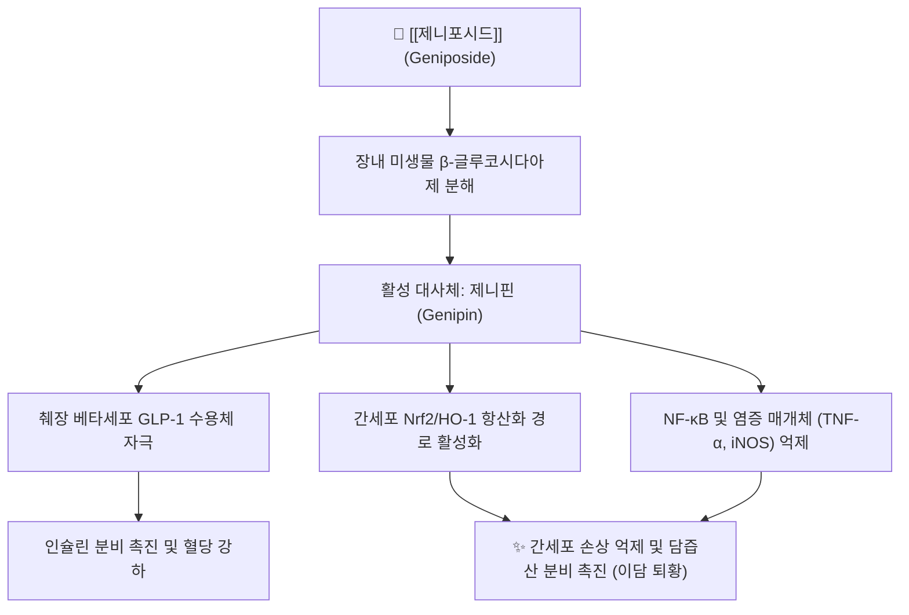

# 🌿 [[제니포시드]] (Geniposide)

> **핵심 요약 (Key Summary)**:
> 꼭두서니과 식물인 [[치자]] 및 [[두충]]의 건조 성숙 과실에 다량 함유된 대표적 이리도이드 배당체
> 장내 미생물에 의해 활성 아글리콘인 제니핀으로 전환되어 GLP-1 수용체 자극 및 Nrf2 항산화 촉진
> 간세포 보호, 이담(담즙 분비 촉진), 인슐린 분비능 개선, 항염증 및 급성 황달 치료 지표

---

## 📌 목차
1. [기본 화학 정보 & 분자 구조식 (Chemical Identity)](#1-기본-화학-정보--분자-구조식-chemical-identity)
2. [분자약리 작용 기전 (Mechanism of Action)](#2-분자약리-작용-기전-mechanism-of-action)
3. [함유 본초 및 한의학적 연계](#3-함유-본초-및-한의학적-연계)
4. [임상 효능 및 연구 결과](#4-임상-효능-및-연구-결과)
5. [안전성 및 대사 경로](#5-안전성-및-대사-경로)
6. [출처 및 학술 참고 문헌 (References)](#6-출처-및-학술-참고-문헌-references)

---
## 1. 기본 화학 정보 & 분자 구조식 (Chemical Identity)

> [!abstract]+ 🧪 3D 약리 분자 구조 (Interactive 3D Viewer)
> <iframe src="https://molecule-viewer-rho.vercel.app/?cid=442428" style="width: 100%; height: 600px; border: none; border-radius: 12px; box-shadow: 0 4px 20px rgba(0,0,0,0.15);" allowfullscreen></iframe>

| 항목 | 상세 내용 |
| :--- | :--- |
| **성분명** | [[제니포시드]] (Geniposide, 게니포사이드) |
| **IUPAC 명칭** | methyl (1S,4aS,7aS)-1-(β-D-glucopyranosyloxy)-7-(hydroxymethyl)-1,4a,5,7a-tetrahydrocyclopenta[c]pyran-4-carboxylate |
| **화학식** | $C_{17}H_{24}O_{10}$ |
| **분자량** | 388.37 g/mol |
| **화합물 분류** | 이리도이드 배당체 (Iridoid Glucoside) |
| **지표 본초** | [[치자]](*Gardenia jasminoides* J.Ellis), [[두충]](*Eucommia ulmoides*) |

---
## 2. 분자약리 작용 기전 (Mechanism of Action)

### (1) 장내 대사 및 활성 대사체 제니핀(Genipin) 생성
* 경구 복용된 제니포시드는 소화관 상부에서 거의 흡수되지 않고 대장에 도달하여 장내 세균총의 $eta$-glucosidase에 의해 당이 분리되어 지용성인 제니핀(Genipin)으로 전환된 후 신속히 흡수되어 전신 약리 효과를 나타냄.

### (2) 간세포 보호 및 담즙 분비(利膽) 촉진
* 간세포 내 담즙산 수송체(BSEP, MRP2)의 발현을 상향 조절하여 담즙 울체를 해소하고, 사염화탄소($	ext{CCl}_4$)나 알코올로 유도된 간세포 괴사를 억제함.

### (3) 대사 증후군 및 신경염증 억제
* 췌장 $eta$-세포의 GLP-1 수용체를 자극하여 포도당 반응성 인슐린 분비를 촉진하고, 미세아교세포 활성화를 억제하여 뇌신경 세포를 보호함.

---
## 3. 함유 본초 및 한의학적 연계

### (1) 핵심 기원 본초: [[치자]]
* [[치자]]는 한의학에서 삼초(三焦)의 화열을 끄고 습열을 소변으로 배출시키는 청열사화·청열이습의 대표 요약임.
* 제니포시드는 치자의 청열이담(淸熱利膽), 사화해독 및 지혈 효능을 대변하는 핵심 지표 성분(KP 규격 $\ge 3.0\%$)임.

### (2) 주요 배오 처방
* [[인진호탕]]: [[인진호]], [[대황]]과 배오하여 급성 습열황달 및 담낭염 치료.
* [[황련해독탕]]: [[황련]], [[황금]], [[황백]]과 함께 삼초 실열 해열.
* [[치자시탕]]: 번열과 흉민, 불면증 해소.

---
## 4. 임상 효능 및 연구 결과

* **비알코올성 지방간(NAFLD) 개선**: 간 내 지질 과산화를 억제하고 AMPK 활성화를 통해 지방간 진행을 억제함.
* **항혈전 및 혈관내피 보호**: 혈소판 응집을 완만하게 억제하고 혈관 평활근 증식을 차단함.

---
## 5. 안전성 및 대사 경로

* **다량 복용 시 사하 작용**: 활성체인 제니핀이 장관 연동 운동을 자극하므로, 치자 과량 복용 시 복통과 설사가 유발될 수 있음.

---
## 6. 출처 및 학술 참고 문헌 (References)

* 전국한의과대학 본초학교수 공편저, 《본초학》, 영림사
* Shan M et al. Geniposide: An updated review of its phytochemistry and pharmacology. Front Pharmacol. 2021.
  * [연구 요약] 제니포시드의 간보호, 항염증, 포도당 대사 조절 및 신경보호 분자 기전을 종합적으로 고찰함.
