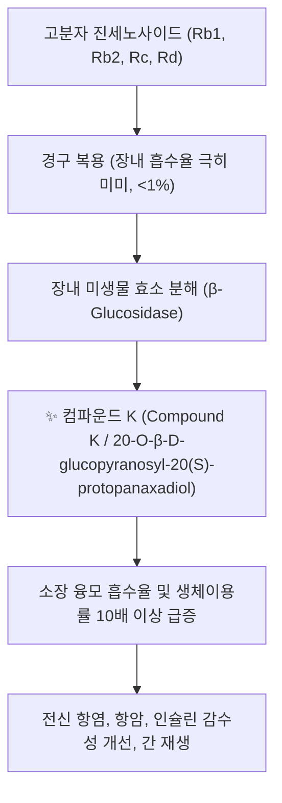

# 💊 [[진세노사이드]] (Ginsenosides)

> **핵심 요약 (Key Summary)**:
> 두릅나무과 인삼 및 홍삼의 핵심 유효 생리활성 물질로 담마란 골격을 갖는 트리테르페노이드계 사포닌 복합 화합물군.
> 프로토파낙사디올계(Rb1, Rg3, Compound K)와 프로토파낙사트리올계(Rg1, Re)로 분류되며 eNOS 혈관 확장, AMPK 대사 촉진, HPA축 면역 항상성을 발휘.
> 만성 피로, 대사증후군, 인지 기능 저하 치료의 핵심 분자 표적이자 보중익기탕과 사군자탕의 대보원기(大補元氣) 효능을 대변하는 대표 약리 성분.

---

## 📌 목차
1. [기본 화학 정보 & 분자 구조식 (Chemical Identity)](#1-기본-화학-정보--분자-구조식-chemical-identity)
2. [장내 미생물 생체 전환(Biotransformation)과 컴파운드 K](#2-장내-미생물-생체-전환biotransformation과-컴파운드-k)
3. [핵심 분자 표적 및 다중 표적(Multi-target) 신호전달망](#3-핵심-분자-표적-및-다중-표적multi-target-신호전달망)
4. [주요 생리활성: 항피로·면역증강·혈관내피기능·신경보호](#4-주요-생리활성-항피로면역증강혈관내피기능신경보호)
5. [한의학적 보기(補氣) 처방 및 홍삼 법제 연계](#5-한의학적-보기補氣-처방-및-홍삼-법제-연계)
6. [출처 및 학술 참고 문헌 (References)](#6-출처-및-학술-참고-문헌-references)

---
## 1. 기본 화학 정보 & 분자 구조식 (Chemical Identity)

> [!abstract]+ 🧪 3D 약리 분자 구조 (Interactive 3D Viewer)
> <iframe src="https://molecule-viewer-rho.vercel.app/?cid=441923" style="width: 100%; height: 600px; border: none; border-radius: 12px; box-shadow: 0 4px 20px rgba(0,0,0,0.15);" allowfullscreen></iframe>

진세노사이드는 4원환 담마란(Dammarane) 트리테르펜 골격에 당 잔기가 결합된 구조에 따라 크게 세 그룹으로 분류됩니다.

| 분류군 | 기본 비배당체 골격 | 주요 진세노사이드 성분 | 주된 생리활성 특성 |
| :--- | :--- | :--- | :--- |
| **프로토파낙사디올 (PPD계)** | Protopanaxadiol (C-3, C-20 위치에 -OH) | [[진세노사이드 Rb1]], Rb2, Rc, Rd, Rg3, Rh2, [[컴파운드 K]] | 중추신경 진정, 항염증, 항암, 혈당 강하, 지질 대사 개선 |
| **프로토파낙사트리올 (PPT계)** | Protopanaxatriol (C-3, C-6, C-20 위치에 -OH) | 진세노사이드 Rg1, Re, Rf, Rh1, F1 | 중추신경 흥분/기억력 향상, 혈관 신생, 면역세포 증식, 항피로 |
| **올레아난형 (Oleanolic acid계)** | 5원환 오환성 트리테르펜 | 진세노사이드 Ro | 항염증, 간 보호 |

---
## 2. 장내 미생물 생체 전환(Biotransformation)과 컴파운드 K

* **진세노사이드의 체내 흡수 패러독스**:
  * 인삼 원형의 고분자 진세노사이드(Rb1 등)는 당이 여러 개 결합되어 있어 장관 흡수율이 1~5% 미만으로 매우 낮습니다.
  * 복용 후 대장 내 혐기성 유익균(*Bifidobacterium*, *Lactobacillus*)의 당분해 효소 작용을 통해 저분자 활성 대사물인 [[컴파운드 K]]로 탈당화(Deglycosylation)되어야 비로소 혈중으로 신속히 흡수됩니다.

---
## 3. 핵심 분자 표적 및 다중 표적(Multi-target) 신호전달망

* **혈관 내피세포 eNOS 활성화 및 혈류 개선 (Rg1, Rb1)**:
  * 내피세포의 eNOS 인산화를 촉진하여 일산화질소(NO) 생성을 유도, 말초 미세혈관을 확장하고 혈소판 응집을 저지합니다.
* **AMPK 활성화 및 세포 에너지 대사 촉진 (Rd, Rg3)**:
  * 골격근 및 간세포에서 AMPK(AMP-activated protein kinase)를 인산화하여 미토콘드리아 생합성과 GLUT4 막 이동을 유도함으로써 인슐린 저항성을 개선하고 피로 회복을 촉진합니다.
* **HPA축 조절 및 코르티솔 항상성 (Adaptogen 효능)**:
  * 스트레스 상황 시 시상하부-뇌하수체-부신(HPA) 축의 과흥분을 차단하고, 면역 저하 시에는 대식세포와 T림프구의 증식을 유도하는 양방향 항상성(Adaptogenic) 제어기 역할을 합니다.

---
## 4. 주요 생리활성: 항피로·면역증강·혈관내피기능·신경보호

1. **항피로 및 운동 수행능 개선**:
   * 근육 내 젖산(Lactate) 축적을 방지하고 글리코겐 고갈을 지연시키며, 항산화 효소(SOD, Catalase)를 상향 조절합니다.
2. **신경세포 보호 및 시냅스 가소성**:
   * 진세노사이드 Rg1과 Rb1은 해마(Hippocampus)의 BDNF 발현을 증대시켜 알츠하이머병 및 뇌허혈 손상 모델에서 인지 기억력을 방어합니다.
3. **면역 강화 및 항체 생성 촉진**:
   * NK세포 활성을 증대시키고 Th1/Th2 면역 균형을 정상화하여 백신 면역보조제(Adjuvant) 효과를 나타냅니다.

---
## 5. 한의학적 보기(補氣) 처방 및 홍삼 법제 연계

* **홍삼(紅蔘) 증숙 과정에서의 성분 전환**:
  * 백삼(수삼)을 9번 찌고 말리는 구증구포 과정에서 열분해 반응을 통해 PPD계 성분이 탈수되면서 원수삼에는 없거나 미량인 **진세노사이드 Rg3, Rh2, Rk1, Rg5** 등의 특이 활성 성분이 대량 생성됩니다.
  * 이로 인해 홍삼은 백삼에 비해 혈소판 응집 억제 및 항암, 면역 활성이 비약적으로 강화됩니다.
* **대표 한의 처방과의 배오 연계**:
  * [[사군자탕]], [[보중익기탕]]: 만성 기허증 환자에서 면역글로불린 생성 및 소화흡수력 증진.
  * [[생맥산]]: 진세노사이드 Re/Rg1과 맥문동 사포닌, 오미자 리그난의 시너지로 심근 수축력 보존 및 하기갈(夏期渴) 탈진 방지.
  * [[독삼탕]]: 대출혈, 쇼크로 맥미욕절(脈微欲絶)한 위급 상태에서 급격한 혈역학적 심박출량 회복.

---
## 6. 출처 및 학술 참고 문헌 (References)

* Christensen LP. Ginsenosides: Chemistry, biosynthesis, analysis, and potential health effects. *Adv Food Nutr Res*. 2009;55:1-99.
  * `[연구 요약]` 인삼의 화학적 구조별 진세노사이드 분류, 식물 내 생합성 경로 및 주요 장기별 약리생리학적 연구 총괄.
* Kim DH. Gut microbiota-mediated metabolism of ginsenosides and its clinical relevance. *J Ginseng Res*. 2018;42(3):255-263.
  * `[연구 요약]` 장내 미생물에 의한 진세노사이드의 컴파운드 K 생체 전환 메커니즘과 개인별 장내균총 차이에 따른 흡수율 편차 검토.
* 대한약침학회 학술위원회. *약침학*. 엘스비어코리아; 2011.
  * `[연구 요약]` 산삼약침 및 홍삼약침 내 진세노사이드 분획의 면역세포 활성화 및 만성 피로·암성 악액질 치료 임상 연구.
