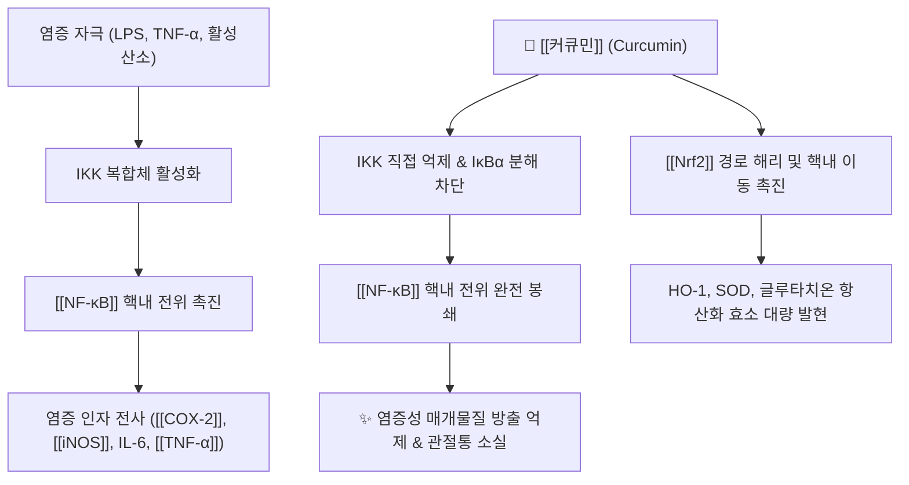

---
aliases:
  - 커큐민
  - Curcumin
  - Diferuloylmethane
  - 강황색소
tags:
  - 약리성분
  - 폴리페놀
  - 항염증
  - 항산화
  - NF-kB억제
  - 관절염
---

# 💊 [[커큐민]] (Curcumin, Diferuloylmethane)

> **핵심 요약 (Key Summary)**:
> 생강과(Zingiberaceae) [[강황]] 및 울금의 근경에서 추출되는 대표적인 천연 친유성 폴리페놀(Polyphenol) 성분
> IKK 활성화를 차단하여 [[NF-κB]] 신호 전달을 억제하고 [[COX-2]] 및 [[iNOS]] 발현을 차단하며 [[Nrf2]] 경로를 통한 강력한 항산화 효소 유도
> 골관절염 통증 완화·염증성 장질환·비알코올성 지방간·대사증후군 개선 및 운동 유발성 지연성 근육통(DOMS) 회복에 탁월한 효능 입증

---

## 📌 목차
1. [기본 약물 정보 & 약동학 (Pharmacokinetics)](#1-기본-약물-정보--약동학-pharmacokinetics)
2. [분자약리 작용 기전 (Mechanism of Action, MoA)](#2-분자약리-작용-기전-mechanism-of-action-moa)
3. [임상 적응증 & 용법·용량 (Indications & Dosing)](#3-임상-적응증--용법용량-indications--dosing)
4. [부작용, 주의사항 & 금기 (Adverse Effects & Contraindications)](#4-부작용-주의사항--금기-adverse-effects--contraindications)
5. [약물 상호작용 & 병용 주의 (Drug Interactions)](#5-약물-상호작용--병용-주의-drug-interactions)
6. [제형 기술 및 생체이용률 개선 비교](#6-제형-기술-및-생체이용률-개선-비교)
7. [출처 및 학술 참고 문헌 (References)](#7-출처-및-학술-참고-문헌-references)

---

## 1. 기본 약물 정보 & 약동학 (Pharmacokinetics)

| 항목 | 상세 내용 |
| :--- | :--- |
| **일반명 (Generic)** | [[커큐민]] (Curcumin, Diferuloylmethane) |
| **기원 생약** | 생강과 [[강황]](*Curcuma longa* L.), 울금(*C. aromatica* Salisb.)의 지하 근경 |
| **화학식 / 분자량** | $\text{C}_{21}\text{H}_{20}\text{O}_6$ / 368.38 g/mol |
| **약효 분류** | 천연 항염증제, 항산화제, Nrf2 활성제, AMPK 조절제 |
| **생체이용률 (Bioavailability)** | 경구 섭취 시 극히 낮음 (<1%, 불용성 및 광범위한 장관/간 1차 대사) |
| **혈중 반감기 ($t_{1/2}$)** | 약 1.5 ~ 2시간 (경구 복용 시 전신 순환계 도달 한계) |
| **대사 경로 (Metabolism)** | 장관 및 간의 환원 반응(테트라하이드로커큐민 등) 및 글루쿠론산/황산 포합(UGT, SULT) |
| **배설 경로 (Excretion)** | 대부분 분변 배설 (>90%), 신장 배설 극소량 |

### 🔬 화학 구조식 (Chemical Structure)
> **[구조적 특징 및 활성]**: 두 개의 페룰산(Ferulic acid) 분자가 메틸렌 브릿지로 연결된 대칭적 디페룰로일메탄(Diferuloylmethane) 구조. 두 페놀성 고리와 중앙의 β-디케톤(diketone) 호변이성질체(Keto-enol tautomerism) 구조가 활성산소종(ROS)을 직접 소거하는 강력한 전자 공여체로 작용.

---

## 2. 분자약리 작용 기전 (Mechanism of Action, MoA)

### (1) 분자 수준 작용 메커니즘
* [[NF-κB]] 신호 전달 억제:
  * IκB 키나아제(IKK)의 활성화를 직접 차단하여 세포질 내 IκBα의 인산화 및 분해를 방지.
  * 결과적으로 [[NF-κB]](p65/p50)가 핵으로 이동하는 것을 차단하여 [[COX-2]], [[iNOS]], [[TNF-α]], IL-1β, IL-6 등의 전염증성 매개물질 유전자 전사를 근원적으로 억제.
* [[Nrf2]]-ARE 항산화 방어계 활성화:
  * Keap1 단백질의 반응성 시스테인 잔기와 상호작용하여 [[Nrf2]]를 방출, 핵 내 ARE(Antioxidant Response Element)에 결합시켜 헴옥시게나아제-1(HO-1), 슈퍼옥사이드 디스뮤타아제(SOD), 카탈라아제 등의 항산화 효소를 유도.
* **MAPK 및 STAT3 신호 억제**:
  * p38 MAPK 및 JNK 인산화를 억제하여 세포사멸 스트레스를 줄이고 관절 연골세포(Chondrocytes) 파괴 효소(MMP-1, MMP-13) 분비를 차단.

---

## 3. 임상 적응증 & 용법·용량 (Indications & Dosing)

### (1) 주요 임상 활용
* **골관절염 및 관절염 통증**: 슬관절 골관절염 환자에서 NSAIDs(이부프로펜, 세레콕시브)에 필적하는 관절통(VAS 점수) 경감 및 관절 기능 회복.
* **지연성 근육통(DOMS) 및 운동 피로**: 강도 높은 운동 후 발생하는 골격근 미세 손상 및 크레아틴 키나아제(CK) 상승을 억제하여 빠른 근기능 회복 지원.
* **만성 염증성 질환**: 궤양성 대장염 환자의 관해 유지 요법, 비알코올성 지방간(NAFLD)의 간효소 수치(AST/ALT) 및 간지질 저하.

### (2) 표준 용법 및 용량
* **일반 표준 추출물**: 1일 1,000 ~ 2,000 mg (식후 분복).
* **고흡수성 제형(파이토솜/나노제형)**: 1일 250 ~ 500 mg.

---

## 4. 부작용, 주의사항 & 금기 (Adverse Effects & Contraindications)

* **위장관 자극**: 고용량 복용 시 오심, 속쓰림, 설사 발생 가능 (식후 복용 권장).
* **담도 폐쇄 및 담석증 환자 주의**: 담낭 수축을 촉진하므로 담석이나 완전 담도 폐쇄증 환자는 산통 유발 위험이 있어 투여 주의.
* **임산부 주의**: 자궁 수축을 자극할 수 있어 고농도 보충제 복용 제한.

---

## 5. 약물 상호작용 & 병용 주의 (Drug Interactions)

* **항응고제 / 항혈소판제 병용 주의**:
  * [[와파린]], [[아스피린]], 클로피도그렐 등과 병용 시 혈소판 응집 억제 시너지로 인해 출혈 위험 증가 모니터링 필요.
* [[피페린]](Piperine)과의 흡수율 증대 시너지:
  * 흑후추 성분인 [[피페린]](Piperine)과 병용 시 간 및 장관의 글루쿠론산 포합을 억제하여 커큐민의 생체이용률을 최대 2,000%(20배)까지 상승시킴.

---

## 6. 제형 기술 및 생체이용률 개선 비교

| 제형 기술 | 상품/형태 예시 | 체내 흡수율 개선도 |
| :--- | :--- | :--- |
| **단독 결정형 추출물** | 표준 Curcumin 95% | 기준 (1배, 흡수 극히 불량) |
| **피페린 복합 제형** | Curcumin + Piperine (Bioperine) | 약 20배 (2,000% 증대) |
| **인지질 복합체 (Phytosome)** | Curcumin-Phosphatidylcholine (Meriva) | 약 29배 생체이용률 향상 |
| **수용성 나노 미셀 (Micellar)** | Polysorbate 나노 유화형 | 약 185배 혈중 최고농도 도달 |

---

## 7. 출처 및 학술 참고 문헌 (References)
* Aggarwal BB, Harikumar KB. Potential therapeutic effects of curcumin, the anti-inflammatory agent, against neurodegenerative, cardiovascular, pulmonary, metabolic, autoimmune and neoplastic diseases. *Int J Biochem Cell Biol*. 2009;41(1):40-59.
  - [연구 요약]: 커큐민의 분자 표적(NF-κB, COX-2, 5-LOX, STAT3) 및 광범위한 만성 염증 억제 기전 총설.
* Daily JW, et al. Efficacy of Turmeric Extracts and Curcumin for Alleviating the Symptoms of Joint Arthritis: A Systematic Review and Meta-Analysis of Randomized Clinical Trials. *J Med Food*. 2016;19(8):717-729.
  - [연구 요약]: 골관절염 환자에서 커큐민의 통증 완화 및 관절 기능 개선 효과가 진통소염제와 대등함을 입증한 메타분석.
* Hewlings SJ, Kalman DS. Curcumin: A Review of Its Effects on Human Health. *Foods*. 2017;6(10):92.
  - [연구 요약]: 커큐민의 항산화·항염증 임상 작용과 피페린을 통한 생체이용률 개선 전략 종합 검토.
