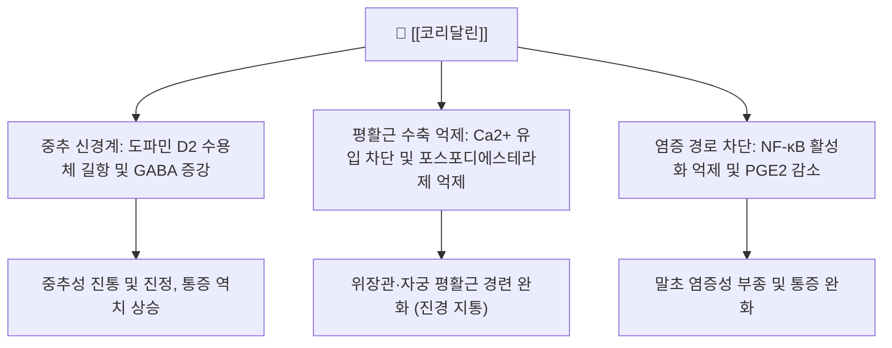

# 🌿 [[코리달린]] (Corydaline)

> **핵심 요약 (Key Summary)**:
> 한약재 [[현호색]]의 뿌리줄기에서 추출되는 대표적인 이소퀴놀린·프로토베르베린계 알칼로이드 성분
> 도파민 [[D2 수용체]] 길항 및 GABA성 신경계 활성화, 소화관 평활근 경련 억제 작용
> 급·만성 내장통증 및 위경련 완화, 진통·진정 및 항소화성궤양 효과 발휘

---

## 📌 목차
1. [기본 화학 정보 & 분자 구조식 (Chemical Identity)](#1-기본-화학-정보--분자-구조식-chemical-identity)
2. [분자약리 작용 기전 (Mechanism of Action)](#2-분자약리-작용-기전-mechanism-of-action)
3. [함유 본초 및 한의학적 연계](#3-함유-본초-및-한의학적-연계)
4. [임상 효능 및 연구 결과](#4-임상-효능-및-연구-결과)
5. [안전성 및 약물 상호작용](#5-안전성-및-약물-상호작용)
6. [출처 및 학술 참고 문헌 (References)](#7-출처-및-학술-참고-문헌-references)

---
## 1. 기본 화학 정보 & 분자 구조식 (Chemical Identity)

> [!abstract]+ 🧪 3D 약리 분자 구조 (Interactive 3D Viewer)
> <iframe src="https://molecule-viewer-rho.vercel.app/?cid=442534" style="width: 100%; height: 600px; border: none; border-radius: 12px; box-shadow: 0 4px 20px rgba(0,0,0,0.15);" allowfullscreen></iframe>

| 항목 | 상세 내용 |
| :--- | :--- |
| **성분명** | [[코리달린]] (Corydaline, d-Corydaline) |
| **IUPAC 명칭** | (13aS)-2,3,9,10-tetramethoxy-13-methyl-5,6,13,13a-tetrahydro-8H-dibenzo[a,g]quinolizine |
| **화학식** | $C_{22}H_{27}NO_4$ |
| **분자량** | 369.45 g/mol |
| **화합물 분류** | 프로토베르베린(Protoberberine) 알칼로이드 |
| **지표 본초** | [[현호색]](Corydalis yanhusuo) 덩이줄기 |

---
## 2. 분자약리 작용 기전 (Mechanism of Action)

### (1) 중추성 및 말초성 진통 메커니즘
* **신경전달물질 조절**: 뇌내 [[D2 수용체]]에 부분 길항 작용을 나타내며, 하행성 억제 통증 경로를 활성화하여 내장통과 신경병증성 통증을 완화함.
* **칼슘 유입 차단**: 혈관 및 위장관 평활근의 전압의존성 칼슘 통로를 억제하여 세포 내 칼슘 농도를 낮춤으로써 강력한 진경(경련 억제) 작용을 나타냄.

### (2) 위점막 보호 및 항소화성궤양
* 위벽 세포의 H+/K+-ATPase 억제 및 프로스타글란딘 합성 촉진을 통해 위산 과다로 인한 점막 손상을 방어함.

---
## 3. 함유 본초 및 한의학적 연계

### (1) 대표 함유 본초: [[현호색]]
* [[현호색]]은 한의학에서 기혈(氣血)이 맺혀서 생기는 일체의 동통을 치료하는 '활혈지통(活血止痛), 행기지통(行氣止痛)'의 요약임.
* 코리달린은 현호색의 진통 및 진경 효능을 담보하는 핵심 지표 성분으로, 식초로 볶는 초현호색(醋玄胡索) 법제 시 알칼로이드 용출률이 비약적으로 증가함.

### (2) 주요 배오 처방
* [[활락효령단]]: 유향, 몰약, 당귀, 단삼과 함께 어혈성 격렬한 통증 제거.
* [[금령자산]]: [[천련자]]와 배오하여 간위불화로 인한 명치 통증 및 흉협통 치료.

---
## 4. 임상 효능 및 연구 결과

* **원발성 월경통 완화**: 자궁근층의 과도한 수축을 완화하여 생리통 강도를 유의하게 경감시킴.
* **기능성 소화불량 및 위완통**: 위배출능을 개선하고 위장관 통각 과민을 억제함.

---
## 5. 안전성 및 약물 상호작용

* **중추신경계 억제제 병용 주의**: 알코올, 벤조디아제핀, 아편유사제와 병용 시 진정 작용이 증강될 수 있음.
* **임산부 주의**: 자궁 수축 및 활혈 작용을 지닌 현호색 유래 성분이므로 임산부 투여는 신중을 기함.

---
## 6. 출처 및 학술 참고 문헌 (References)

* 생약학연구회, 《현대생약학》, 학창사
* Choi SU et al. Antinociceptive and anti-inflammatory properties of corydaline from Corydalis tubers. Phytother Res. 2012.
  * [연구 요약] 코리달린이 염증성 및 신경병성 통증 동물 모델에서 용량 의존적인 진통 효과를 보이며 위장관 경련을 억제함을 증명함.
