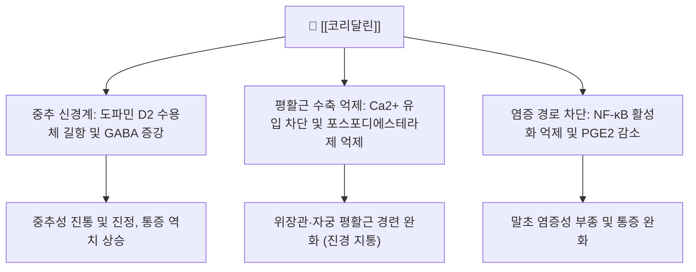

# 🌿 [[코리달린]] (Corydaline)

> **핵심 3줄 요약 (Key Summary)**:
> - 🌿 기원 본초 & 화학 계열: 한약재 [[현호색]] 뿌리줄기에서 추출되는 이소퀴놀린·프로토베르베린계 알칼로이드.
> - 🎯 핵심 분자 표적 & 조절 경로: 도파민 [[D2 수용체]] 길항 및 GABA성 신경계 활성화, 평활근 Ca2+ 유입 차단.
> - 🩺 주요 약리 활성 & 질환 치료 기전: 급·만성 내장통증 및 위경련 완화, 진통·진정 및 항소화성궤양 효과.
> - ⚠️ 독성·생체이용률 한계 & 상호작용: 중추신경계 억제제(알코올·벤조디아제핀·아편유사제) 병용 시 진정작용 증강 위험, 임산부 투여 주의.

---

## 📌 목차
1. [기본 화학 정보 & 분자 구조식 (Chemical Identity)](#1-기본-화학-정보--분자-구조식-chemical-identity)
2. [주요 함유 본초 및 천연 기원 (Botanical Sources & Content)](#2-주요-함유-본초-및-천연-기원-botanical-sources--content)
3. [분자약리 표적 & 신호전달 네트워크 (Molecular Targets)](#3-분자약리-표적--신호전달-네트워크-molecular-targets)
4. [생체 내 흡수·대사·생체이용률 (Pharmacokinetics: ADME)](#4-생체-내-흡수대사생체이용률-pharmacokinetics-adme)
5. [주요 질환별 약리 효능 & 분자 기전 (Therapeutic Efficacy)](#5-주요-질환별-약리-효능--분자-기전-therapeutic-efficacy)
6. [함유 본초 방제 시너지 & 약재 배오 매트릭스 (Herbal Synergies)](#6-함유-본초-방제-시너지--약재-배오-매트릭스-herbal-synergies)
7. [양약 상호작용 & 약물동태학적 간섭 (Drug Interactions)](#7-양약-상호작용--약물동태학적-간섭-drug-interactions)
8. [💡 사용자 진료실 핵심 필기 & 임상 응용 팁 (Melt-In & High-Yield)](#8--사용자-진료실-핵심-필기--임상-응용-팁-melt-in--high-yield)
9. [출처 및 학술 참고 문헌 (References)](#9-출처-및-학술-참고-문헌-references)
---
## 1. 기본 화학 정보 & 분자 구조식 (Chemical Identity)

> [!abstract]+ 🧪 3D 약리 분자 구조 (Interactive 3D Viewer)
> <iframe src="https://molecule-viewer-rho.vercel.app/?cid=442534" style="width: 100%; height: 600px; border: none; border-radius: 12px; box-shadow: 0 4px 20px rgba(0,0,0,0.15);" allowfullscreen></iframe>

| 항목 | 상세 내용 |
| :--- | :--- |
| **성분명** | [[코리달린]] (Corydaline, d-Corydaline) |
| **IUPAC 명칭** | (13aS)-2,3,9,10-tetramethoxy-13-methyl-5,6,13,13a-tetrahydro-8H-dibenzo[a,g]quinolizine |
| **화학식** | $C_{22}H_{27}NO_4$ |
| **분자량** | 369.45 g/mol |
| **화합물 분류** | 프로토베르베린(Protoberberine) 알칼로이드 |
| **지표 본초** | [[현호색]](Corydalis yanhusuo) 덩이줄기 |

---

## 2. 주요 함유 본초 및 천연 기원 (Botanical Sources & Content)

| 함유 본초 (한글/한자) | 기원 식물학적 명칭 (과명 / 학명) | 주요 함유 약용 부위 | 한의학적 귀경 및 약효 특성 |
| :--- | :--- | :--- | :--- |
| [[현호색]] (玄胡索/延胡索) | 양귀비과(Papaveraceae) / *Corydalis yanhusuo*, *Corydalis ternata* | 덩이줄기(초자 가공한 醋玄胡索) | 心·肝·脾經 귀경, [[활혈산어]]·[[행기지통]] |

* [[현호색]]은 한의학에서 기혈(氣血)이 맺혀서 생기는 일체의 동통을 치료하는 '활혈지통(活血止痛), 행기지통(行氣止痛)'의 요약이며, 코리달린은 [[테트라하이드로팔마틴]](THP)·파파베린과 함께 이 효능을 담보하는 핵심 지표 성분이다.

---

## 3. 분자약리 표적 & 신호전달 네트워크 (Molecular Targets)

### (1) 중추성 및 말초성 진통 메커니즘
* **신경전달물질 조절**: 뇌내 [[D2 수용체]]에 부분 길항 작용을 나타내며, 하행성 억제 통증 경로를 활성화하여 내장통과 신경병증성 통증을 완화함.
* **칼슘 유입 차단**: 혈관 및 위장관 평활근의 전압의존성 칼슘 통로를 억제하여 세포 내 칼슘 농도를 낮춤으로써 강력한 진경(경련 억제) 작용을 나타냄.

### (2) 위점막 보호 및 항소화성궤양
* 위벽 세포의 H+/K+-ATPase 억제 및 프로스타글란딘 합성 촉진을 통해 위산 과다로 인한 점막 손상을 방어함.

---

## 4. 생체 내 흡수·대사·생체이용률 (Pharmacokinetics: ADME)

* **포제(법제)에 의한 용출률 증대**: 식초로 볶는 초현호색(醋玄胡索) 법제 시 알칼로이드 용출률이 비약적으로 증가하여, 전탕 시 생체이용 가능한 코리달린 함량이 늘어나는 것으로 알려져 있음(원문 §3 내용 재구성).
* **정량적 약동학 지표 관련 주의**: 코리달린 단일 성분의 인체 대상 흡수·대사·반감기에 대한 구체적 수치를 제시하는 검증된 문헌을 본 노트 작성 시점 기준으로 확인하지 못하여, 임의의 수치를 기재하지 않음.

---

## 5. 주요 질환별 약리 효능 & 분자 기전 (Therapeutic Efficacy)

* **원발성 월경통 완화**: 자궁근층의 과도한 수축을 완화하여 생리통 강도를 유의하게 경감시킴.
* **기능성 소화불량 및 위완통**: 위배출능을 개선하고 위장관 통각 과민을 억제함.

---

## 6. 함유 본초 방제 시너지 & 약재 배오 매트릭스 (Herbal Synergies)

| 함유 본초 / 방제 | 공존 유효 성분군 | 분자약리 시너지 기전 | 전통 한의학적 효능 연계 |
| :--- | :--- | :--- | :--- |
| [[활락효령단]] | [[유향]], [[몰약]], [[당귀]], [[단삼]] | 다경로 진통 상승(어혈 제거 + 도파민 D2 차단) | 어혈성 격렬한 통증 제거 |
| [[금령자산]] | [[천련자]] | 간위불화 통증 경로 동시 차단 | 간위불화로 인한 명치 통증 및 흉협통 치료 |

* [[활락효령단]]: 유향, 몰약, 당귀, 단삼과 함께 어혈성 격렬한 통증 제거.
* [[금령자산]]: [[천련자]]와 배오하여 간위불화로 인한 명치 통증 및 흉협통 치료.

---

## 7. 양약 상호작용 & 약물동태학적 간섭 (Drug Interactions)

* **중추신경계 억제제 병용 주의**: 알코올, 벤조디아제핀, 아편유사제와 병용 시 진정 작용이 증강될 수 있음.
* **임산부 주의**: 자궁 수축 및 활혈 작용을 지닌 현호색 유래 성분이므로 임산부 투여는 신중을 기함.

---

## 8. 💡 사용자 진료실 핵심 필기 & 임상 응용 팁 (Melt-In & High-Yield)

* 현재 별도로 기록된 원장님 임상 필기가 없습니다.

---

## 9. 출처 및 학술 참고 문헌 (References)

* 생약학연구회, 《현대생약학》, 학창사
* Choi SU et al. Antinociceptive and anti-inflammatory properties of corydaline from Corydalis tubers. Phytother Res. 2012.
  * [연구 요약] 코리달린이 염증성 및 신경병성 통증 동물 모델에서 용량 의존적인 진통 효과를 보이며 위장관 경련을 억제함을 증명함.
