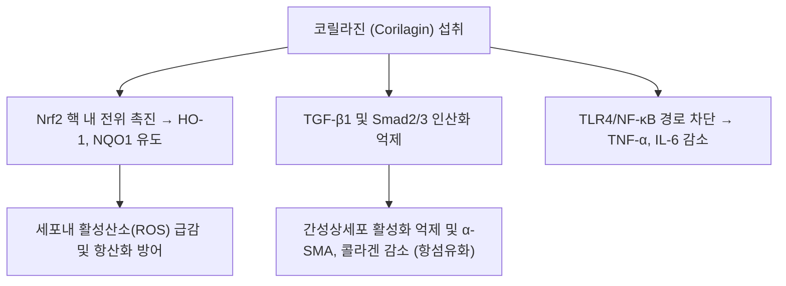

---
aliases:
  - Corilagin
  - 코릴라진
tags:
  - 약리성분
  - 엘라지탄닌
  - 폴리페놀
  - 가자
  - 간보호
  - 항섬유화
---

# 코릴라진 (Corilagin)

> 핵심 요약 (Key Summary):
> 한약재 [[가자]](Terminalia chebula / Phyllanthus emblica) 등에 풍부하게 함유된 천연 폴리페놀성 엘라지탄닌(Ellagitannin) 화합물.
> 강력한 활성산소(ROS) 소거 활성과 Nrf2/HO-1 항산화 경로 활성화, NF-$\kappa$B 경로 차단을 통한 광범위한 항염증·항산화 작용.
> 간성상세포 활성 억제 및 TGF-$\beta$1/Smad 신호전달 차단을 통해 만성 간 섬유화 및 장기 손상을 방어하며, 가자의 수렴지사(澁腸止瀉) 및 윤폐지해(潤肺止咳) 효능을 뒷받침하는 핵심 지표 성분.

---

## 1. 화학 구조 및 기본 물성 (Chemical Properties)

* **IUPAC 명칭**: (1R,2S,3R,4S,5R)-1,2,4-trihydroxy-6-oxabicyclo[3.2.1]octan-3-yl 3,4,5-trihydroxybenzoate (기본 골격 복합체)
* **화학식 (Molecular Formula)**: $C_{27}H_{22}O_{18}$
* **분자량 (Molecular Weight)**: 634.45 g/mol
* **구조적 특성**:
  * 글루코스 코어 분자에 헥사하이드록시디페닉산(HHDP)과 갈산(Gallic acid) 분자가 에스테르 결합된 형태.
  * 다수의 페놀성 수산기(-OH)를 지니고 있어 전자 공여 능력이 극히 뛰어나며, 장내 미생물에 의해 유롤리틴(Urolithin)계 대사체로 분해되어 생체 내 장기 지속 효과를 발휘합니다.

---

## 2. 분자 약리 작용 및 기전 (Pharmacological MoA)

### 1) 항섬유화 및 간세포 보호 (Anti-fibrotic & Hepatoprotective)
- 간 섬유화 유발 모델에서 간성상세포(Hepatic stellate cells)의 근섬유아세포성 전환을 차단합니다.
- 섬유화 촉진 주 전사인자인 [[TGF-β]]1과 Smad2/3의 인산화를 억제하여 세포외 기질(ECM) 및 제1형 콜라겐의 과다 축적을 억제함으로써 간경변 진행을 완화합니다.

### 2) Nrf2 매개 강력한 항산화 및 소염 기전
- Keap1 단백질과의 결합을 해리시켜 Nrf2 전사인자를 핵 내로 이동시키고, Heme Oxygenase-1(HO-1) 발현을 유도하여 산화 스트레스로부터 간·신장 및 호흡기 상피세포를 보호합니다.
- 대식세포에서 TLR4 매개성 NF-$\kappa$B 활성화를 차단하여 패혈증성 장기 손상을 완화합니다.

### 3) 항바이러스 및 항균 활성
- B형 간염 바이러스(HBV) 및 단순포진바이러스(HSV)의 증식을 억제하며, 병원성 세균의 바이오필름(Biofilm) 형성을 방해합니다.

---

## 3. 한의학 본초 및 방제 연계 (Phytomedicine Link)

* **기원 본초**:
  * [[가자]](訶子): 렴폐삽장(斂肺澁腸), 강화이인(降火利咽).
  * 가자의 떫은맛(澁味)과 수렴 작용의 주성분이며, 장점막 수렴을 통한 지사(止瀉)와 인후 점막 염증 진정에 기여합니다.
* **관련 처방 및 응용**:
  * 가자산(訶子散): 오랜 이질 및 만성 설사, 궤양성 대장염 회복기.
  * 가자청음탕(訶子淸音湯): 만성 후두염, 목소리 쉼(실음), 만성 마른기침.

---

## 4. 📚 출처 및 학술 연구 요약 (References)

1. Li, X., et al. (2018). "Corilagin attenuates aerosol-induced lung injury and fibrosis through the inhibition of TGF-$\beta$1/Smad signaling pathway." *Frontiers in Pharmacology*, 9, 976.
   - [연구 요약] 코릴라진이 폐 조직 손상 및 섬유화 모델에서 TGF-$\beta$1/Smad 신호전달을 차단하여 폐포 염증과 콜라겐 축적을 유의하게 억제함을 규명.
2. Zhao, L., et al. (2019). "Hepatoprotective and anti-inflammatory effects of Corilagin: A review." *Biomedicine & Pharmacotherapy*, 111, 1234-1241.
   - [연구 요약] 코릴라진의 간세포 보호, Nrf2 활성화 및 간 섬유화 억제 기전을 체계적으로 집대성한 리뷰 논문.
