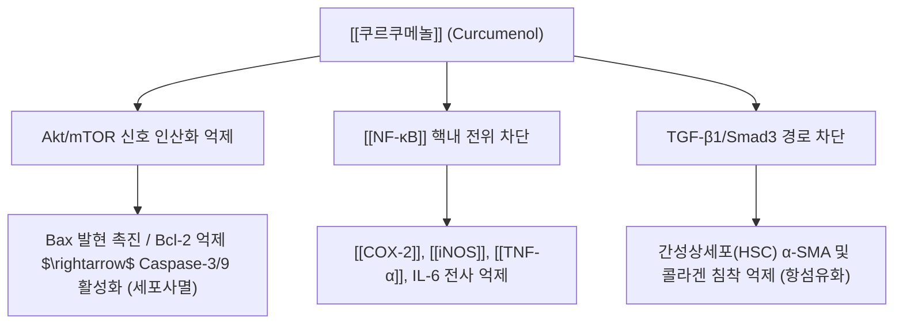

---
aliases:
  - 쿠르쿠메놀
  - Curcumenol
tags:
  - 약리성분
  - 세스퀴테르펜
  - 아출
  - 항암
  - 항염증
  - 파혈거어
---

# 💊 [[쿠르쿠메놀]] (Curcumenol)

> **핵심 3줄 요약 (Key Summary)**:
> - 🌿 기원 본초 & 화학 계열: 생강과(Zingiberaceae) [[아출]](*Curcuma zedoaria*), 온울금(*C. wenyujin*)에서 유래하는 구아이안형 세스퀴테르페노이드.
> - 🎯 핵심 분자 표적 & 조절 경로: Akt/mTOR 신호 인산화 억제, [[NF-κB]] 핵내 전위 차단, TGF-β1/Smad3 경로 차단.
> - 🩺 주요 약리 활성 & 질환 치료 기전: 항종양(세포사멸 유도), 간 보호·항섬유화, 항염증·진통 — 한의학의 파혈거어(破血祛瘀)·행기소적(行氣消積) 효능과 연계.
> - ⚠️ 독성·생체이용률 한계 & 상호작용: 수불용성으로 흡수 한계 가능, 임산부 금기, 항응고제·항혈소판제 병용 시 출혈 위험 증가.

---

## 📌 목차
1. [기본 화학 정보 & 분자 구조식 (Chemical Identity)](#1-기본-화학-정보--분자-구조식-chemical-identity)
2. [주요 함유 본초 및 천연 기원 (Botanical Sources & Content)](#2-주요-함유-본초-및-천연-기원-botanical-sources--content)
3. [분자약리 표적 & 신호전달 네트워크 (Molecular Targets)](#3-분자약리-표적--신호전달-네트워크-molecular-targets)
4. [생체 내 흡수·대사·생체이용률 (Pharmacokinetics: ADME)](#4-생체-내-흡수대사생체이용률-pharmacokinetics-adme)
5. [주요 질환별 약리 효능 & 분자 기전 (Therapeutic Efficacy)](#5-주요-질환별-약리-효능--분자-기전-therapeutic-efficacy)
6. [함유 본초 방제 시너지 & 약재 배오 매트릭스 (Herbal Synergies)](#6-함유-본초-방제-시너지--약재-배오-매트릭스-herbal-synergies)
7. [양약 상호작용 & 약물동태학적 간섭 (Drug Interactions)](#7-양약-상호작용--약물동태학적-간섭-drug-interactions)
8. [💡 사용자 진료실 핵심 필기 & 임상 응용 팁 (Melt-In & High-Yield)](#8--사용자-진료실-핵심-필기--임상-응용-팁-melt-in--high-yield)
9. [출처 및 학술 참고 문헌 (References)](#9-출처-및-학술-참고-문헌-references)
---
## 1. 기본 화학 정보 & 분자 구조식 (Chemical Identity)

> [!abstract]+ 🧪 3D 약리 분자 구조 (Interactive 3D Viewer)
> <iframe src="https://molecule-viewer-rho.vercel.app/?cid=5281767" style="width: 100%; height: 600px; border: none; border-radius: 12px; box-shadow: 0 4px 20px rgba(0,0,0,0.15);" allowfullscreen></iframe>

| 항목 | 상세 내용 |
| :--- | :--- |
| **일반명 (Generic)** | 쿠르쿠메놀 (Curcumenol) |
| **화학명 (IUPAC)** | (1S,4S,5R,8S)-4,8-dimethyl-1-propan-2-yl-11-oxatricyclo[5.3.1.0^{1,5}]undec-8-en-2-one |
| **기원 본초** | 생강과(Zingiberaceae) [[아출]](*Curcuma zedoaria* Rosc.), 온울금(*C. wenyujin*) |
| **화학식 / 분자량** | $\text{C}_{15}\text{H}_{22}\text{O}_2$ / 234.33 g/mol |
| **화학적 분류** | 옥시시클로 구아이안형 세스퀴테르페노이드 (Guaiane sesquiterpenoid) |
| **물리화학적 성상** | 백색 결정성 분말, 친유성(지용성), 에탄올·클로로포름 가용, 수불용성 |

---

## 2. 주요 함유 본초 및 천연 기원 (Botanical Sources & Content)

| 함유 본초 (한글/한자) | 기원 식물학적 명칭 (과명 / 학명) | 성미 / 귀경 | 비고 |
| :--- | :--- | :--- | :--- |
| [[아출]] (봉아출) | 생강과(Zingiberaceae) / *Curcuma zedoaria* Rosc. | 苦辛, 溫 / 肝·脾經 | 쿠르쿠메놀의 대표 기원 본초 |
| [[울금]] (鬱金) | 생강과 / *Curcuma* spp. | - | 정유 분획에 쿠르쿠메놀 함유 |
| [[강황]] (薑黃) | 생강과 / *Curcuma longa* | - | 정유 분획에 쿠르쿠메놀 함유 |

* 기미는 고신(苦辛), 온(溫). 귀경은 간·비경.
* 울금(鬱金), 강황(薑黃)의 정유 분획.

---

## 3. 분자약리 표적 & 신호전달 네트워크 (Molecular Targets)

* **Akt/mTOR 경로 차단 및 세포사멸 유도**:
  * 간암(HepG2), 위암(SGC-7901), 폐암(A549) 세포주에서 Akt 인산화(Ser473) 억제 $\rightarrow$ 미토콘드리아 외막 전위(MMP) 붕괴 $\rightarrow$ Cytochrome c 방출 및 Caspase-9/3 연쇄 활성화.
* **염증성 신호 차단**:
  * LPS 자극 대식세포에서 IκBα 분해를 막아 [[NF-κB]] p65 전사 활성을 차단함으로써 [[TNF-α]], [[IL-6]], [[COX-2]] 및 [[iNOS]] 유래 NO 생성을 농도 의존적으로 감소.
* **항혈관신생 및 전이 억제**:
  * VEGF 발현을 하향 조절하고 [[MMP-2]], MMP-9 발현을 억제하여 종양 침습 및 내피세포 혈관신생 차단.

---

## 4. 생체 내 흡수·대사·생체이용률 (Pharmacokinetics: ADME)

* **용해도 기반 흡수 특성**: 쿠르쿠메놀은 백색 결정성 분말로 친유성(지용성)이 강하고 수불용성이므로(§1 물성 참조), 수전탕 단독 복용 시 흡수 효율에 한계가 있을 수 있음.
* **정량적 약동학 지표 관련 주의**: 쿠르쿠메놀 단일 성분의 경구 생체이용률·반감기 등 구체적 수치를 제시하는 검증된 문헌을 본 노트 작성 시점 기준으로 확인하지 못하여, 임의의 수치를 기재하지 않음.

---

## 5. 주요 질환별 약리 효능 & 분자 기전 (Therapeutic Efficacy)

### 1) 항종양 및 세포독성 활성
* 아출(봉아출)의 지표 항암 성분인 커큐몰(Curcumol), 저마크론(Germacrone)과 함께 종양 미세환경 내 이상 증식 억제.
* 위암 세포 및 간암 세포에서 G2/M 세포주기 정지 유도.

### 2) 간 보호 및 항섬유화 작용
* 사염화탄소($\text{CCl}_4$) 유도 간손상 모델에서 간세포 괴사 완화 및 혈청 AST/ALT 수치 정상화.
* TGF-β1 유도 간성상세포 활성화를 차단하여 간경변·간섬유화 진행 완화.

### 3) 항염증 및 진통 활성
* 포르말린 유발 통증 및 초산 유발 라이딩 모델에서 유의한 말초 진통 효과 확인 (COX-2 매개 프로스타글란딘 억제).

---

## 6. 함유 본초 방제 시너지 & 약재 배오 매트릭스 (Herbal Synergies)

* **한의 임상 효능과의 연계**:
  * **파혈거어(破血祛瘀)**: 쿠르쿠메놀의 혈소판 응집 억제 및 혈관내피 보호 기전은 한의학에서 어혈을 깨뜨리고 종괴(징가적취)를 없애는 효능의 분자생물학적 근거.
  * **행기소적(行氣消積)**: 위장관 평활근 긴장 조절 및 염증성 소화기 병변 개선을 통해 소화관 울체와 식적을 풀어줌.

| 대표 배합 처방 | 공존 유효 성분군 | 시너지 기전 |
| :--- | :--- | :--- |
| [[아출환]] | 아출 지표 성분군 (커큐몰, 저마크론) | 파혈거어 상승 |
| [[보허화어탕]] | 보기약 + 파혈약 배오 | 공벌(攻伐) 완화 및 정기 보호 |
| [[가미격하축어탕]] | 축어(逐瘀) 계열 배오 | 어혈 제거 시너지 |
| [[계지복령환]] 가 아출삼릉 | [[계지복령환]] + 아출·삼릉 가미 | 자궁·골반강 어혈 종괴 소산 |

* **주요 배합 처방**:
  * 아출환, 보허화어탕, 가미격하축어탕, 계지복령환 가 아출삼릉.

---

## 7. 양약 상호작용 & 약물동태학적 간섭 (Drug Interactions)

* **임부 금기**:
  * 강력한 파혈(破血) 및 자궁 평활근 흥분 가능성으로 인해 임산부 투여 금기.
* **출혈 경향 주의**:
  * 항응고제(와파린), 항혈소판제(아스피린, 클로피도그렐) 병용 시 출혈 위험 증가 주의.
* **비위허약자 신중 투여**:
  * 공벌(攻伐) 작용이 강하므로 비위가 허약하고 어혈이 없는 자는 보기약(황기, 인삼)과 병용하거나 감량 투여.

---

## 8. 💡 사용자 진료실 핵심 필기 & 임상 응용 팁 (Melt-In & High-Yield)

* 현재 별도로 기록된 원장님 임상 필기가 없습니다.

---

## 9. 출처 및 학술 참고 문헌 (References)
* Liu Y, et al. Curcumenol induces apoptosis in human hepatoma cells through Akt/mTOR pathway. *Biomed Pharmacother*. 2019;112:108670.
  * `[연구 요약]`: 쿠르쿠메놀의 간암세포 증식 억제와 Akt/mTOR 탈인산화 매개 Caspase 유도 세포사멸 기전 규명.
* Lo WL, et al. Anti-inflammatory sesquiterpenoids from the rhizomes of Curcuma zedoaria. *J Nat Prod*. 2010;73(10):1642-1647.
  * `[연구 요약]`: 봉아출 근경 유래 쿠르쿠메놀의 대식세포 NF-κB 및 염증 매개물질 억제 활성 입증.
