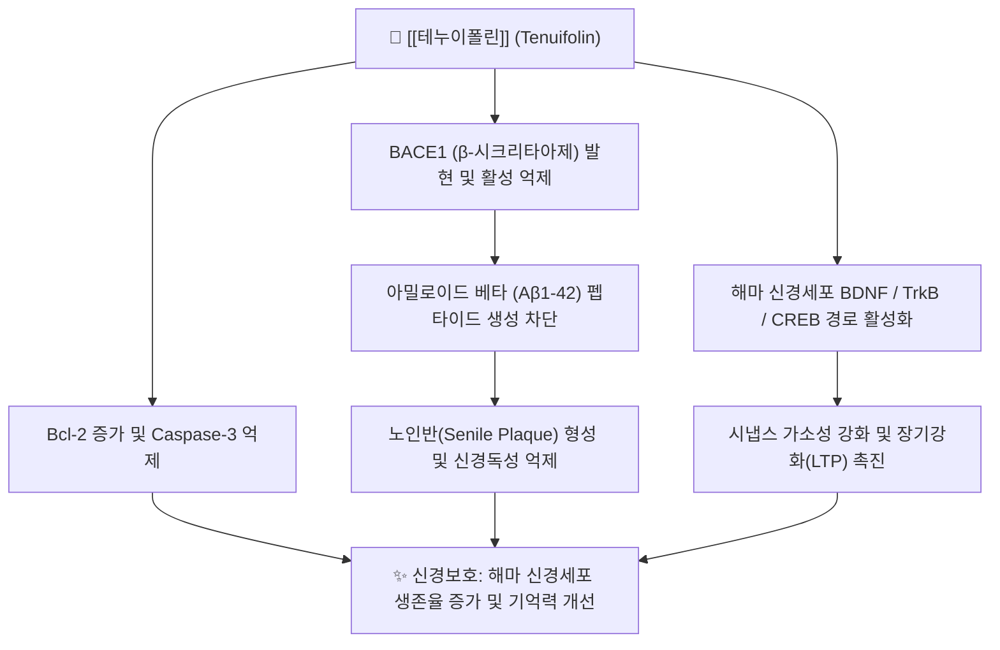

# 🌿 [[테누이폴린]] (Tenuifolin)

> **핵심 요약 (Key Summary)**:
> 한약재 [[원지]]의 뿌리에서 추출되는 대표적인 올레아난형 트리테르페노이드 사포닌 지표 성분
> BACE1 억제를 통한 아밀로이드 베타 생성 억제 및 BDNF/TrkB 신호 촉진 매개 신경 가소성 강화
> 알츠하이머 치매 인지장애 개선, 건망증 해소, 해마 신경보호 및 원지의 거담개규 효능 지표

---

## 📌 목차
1. [기본 화학 정보 & 분자 구조식 (Chemical Identity)](#1-기본-화학-정보--분자-구조식-chemical-identity)
2. [분자약리 작용 기전 (Mechanism of Action)](#2-분자약리-작용-기전-mechanism-of-action)
3. [함유 본초 및 한의학적 연계](#3-함유-본초-및-한의학적-연계)
4. [임상 효능 및 연구 결과](#4-임상-효능-및-연구-결과)
5. [안전성 및 약물 상호작용](#5-안전성-및-약물-상호작용)
6. [출처 및 학술 참고 문헌 (References)](#6-출처-및-학술-참고-문헌-references)

---
## 1. 기본 화학 정보 & 분자 구조식 (Chemical Identity)

> [!abstract]+ 🧪 3D 약리 분자 구조 (Interactive 3D Viewer)
> <iframe src="https://molecule-viewer-rho.vercel.app/?cid=160644" style="width: 100%; height: 600px; border: none; border-radius: 12px; box-shadow: 0 4px 20px rgba(0,0,0,0.15);" allowfullscreen></iframe>

| 항목 | 상세 내용 |
| :--- | :--- |
| **성분명** | [[테누이폴린]] (Tenuifolin) |
| **IUPAC 명칭** | (2β,3β,4α)-3-(β-D-glucopyranosyloxy)-2,27-dihydroxyolean-12-ene-23,28-dioic acid |
| **화학식** | $C_{36}H_{56}O_{12}$ |
| **분자량** | 680.82 g/mol |
| **화합물 분류** | 올레아난형 펜타사이클릭 트리테르펜 사포닌 (Triterpenoid Saponin) |
| **지표 본초** | [[원지]](*Polygala tenuifolia* Willd.)의 뿌리 |

---
## 2. 분자약리 작용 기전 (Mechanism of Action)

### (1) 아밀로이드 베타($	ext{A}eta$) 축적 억제
* 알츠하이머병의 핵심 병인인 아밀로이드 전구 단백질(APP)의 비정상적 절단을 유발하는 $eta$-secretase(BACE1)를 억제하여 $	ext{A}eta_{1-40}$ 및 $	ext{A}eta_{1-42}$ 생성을 억제함.

### (2) 신경영양인자(BDNF) 증강 및 시냅스 장기강화(LTP)
* 뇌 유래 신경영양인자([[BDNF]])와 그 수용체인 TrkB 인산화를 유도하여 해마 CA1 부위의 시냅스 연결성을 회복시키고 공간 학습 능력을 유의하게 향상시킴.

### (3) 미토콘드리아 보호 및 항세포사멸
* 신경세포 내 과도한 활성산소(ROS) 생성을 억제하고 미토콘드리아 막전위를 유지하여 세포자멸사를 억제함.

---
## 3. 함유 본초 및 한의학적 연계

### (1) 핵심 함유 본초: [[원지]]
* [[원지]](遠志)는 심신(心腎)을 소통시켜 담(痰)을 삭이고 정신을 맑게 하는 안신익지(安神益智), 거담개규(祛痰開竅)의 대표 본초임.
* 테누이폴린은 원지 뿌리의 목질부를 제거한 원지피(遠志皮)에 고농도로 존재하며, 건망(健忘), 불면, 가슴 두근거림을 치료하는 물질적 기반임.

### (2) 주요 배오 처방
* [[총명탕]]: [[백복신]], [[석창포]]와 배오하여 수험생 기억력 증진 및 건망증 치료.
* [[귀비탕]]: 심비양허(心脾兩虛)로 인한 건망, 불면, 불안 신경증 치료.
* [[안신정지환]]: 정서적 불안과 공포증 해소.

---
## 4. 임상 효능 및 연구 결과

* **인지기능 저하 억제**: 스코폴라민 유도 기억상실 모델에서 아세틸콜린 분해를 막고 수동 회피 실험 반응 시간을 대조군 수준으로 회복시킴.
* **수면 구조 개선**: 비렘(NREM) 수면 시간을 증가시키고 입면 잠복기를 단축시키는 진정 효과 보고.

---
## 5. 안전성 및 약물 상호작용

* **위점막 자극 주의**: 원지의 조사포닌 분획은 위점막을 자극하여 오심, 구토를 유발할 수 있으므로, 반드시 감초 달인 물에 담그거나 볶는 포제(자원지 炙遠志)를 통해 복용함.

---
## 6. 출처 및 학술 참고 문헌 (References)

* 전국한의과대학 본초학교수 공편저, 《본초학》, 영림사
* Jiao Y et al. Tenuifolin, a secondary saponin from Polygala tenuifolia, ameliorates cognitive deficits in Alzheimer's disease models. Neurobiol Aging. 2016.
  * [연구 요약] 테누이폴린이 BACE1 억제 및 BDNF 상향 조절을 통해 알츠하이머 마우스 모델의 인지 결손을 개선함을 규명함.
