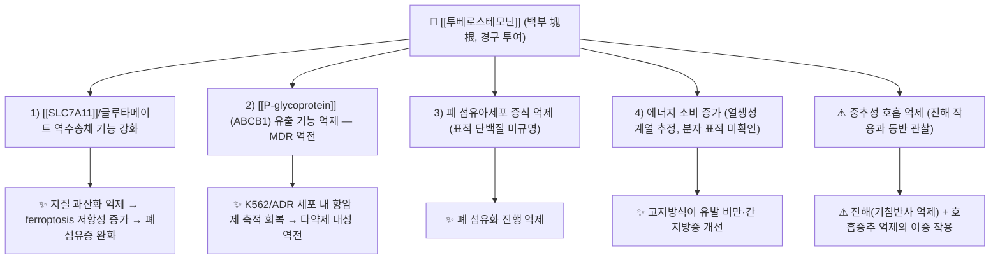

# 🔬 [[투베로스테모닌]] (Tuberostemonine, C22H33NO4 / IUPAC명 미확인)

> **핵심 3줄 요약 (Key Summary)**:
> - 🌿 기원 본초 & 화학 계열: [[백부]](百部)를 비롯한 백부과(Stemonaceae) *Stemona* 속 식물의 뿌리(塊根)에 함유된 **다환성 알칼로이드**로, pyrrolo[1,2-a]azepine(피롤로아제핀) 골격을 공유하는 이른바 '[[Stemona 알칼로이드|tuberostemonine형 알칼로이드]]'군의 대표 성분이다. 백부의 전통 효능(潤肺下氣止咳·殺蟲) 중 **진해(鎭咳) 활성**을 담당하는 지표 성분으로 취급된다.
> - 🎯 핵심 분자 표적 & 조절 경로: 폐 조직에서 **[[SLC7A11]]/글루타메이트 역수송체(glutamate antiporter) 기능 강화 → [[ferroptosis]](철사멸) 억제** 경로가 제시되었고(PMID 37532076), 만성골수성백혈병 내성주(K562/ADR)에서는 **[[P-glycoprotein]](ABCB1) 유출 펌프 기반 [[다약제 내성]](MDR) 역전**이 보고되었다(PMID 28529625). 고지방식이 모델에서는 **에너지 소비(energy consumption) 증가**를 통한 비만·간 지방증 개선이 보고되었으나, 그 상위 분자 표적은 제공 논문에서 규명되지 않았다(PMID 37236577).
> - 🩺 주요 약리 활성 & 질환 치료 기전: **중추성 진해 작용**(기침반사 억제, PMID 19214944 / 20219659), **폐 섬유아세포 증식 억제 및 폐섬유증 완화**(PMID 39140804 / 37532076), **항비만·간 지방증 개선**(PMID 37236577), **항암 다약제 내성 극복**(PMID 28529625).
> - ⚠️ 독성·생체이용률 한계 & 상호작용: 백부 추출물에서 진해 효과와 **중추성 호흡 억제(central respiratory depression)가 동반 보고**되어 과량·장기 투여 시 호흡억제 위험이 있다(PMID 20219659). 진해 활성은 경구 흡수와 연관되나 구체적 생체이용률 수치는 제공 논문에서 확인되지 않으며(PMID 19214944), P-gp 조절 성분인 만큼 P-gp 기질 양약(디곡신, 일부 항암제)과의 병용 시 혈중 농도 변동 가능성을 배제할 수 없다.

---

## 📌 목차
1. [기본 화학 정보 & 분자 구조식 (Chemical Identity)](#1-기본-화학-정보--분자-구조식-chemical-identity)
2. [주요 함유 본초 및 천연 기원 (Botanical Sources & Content)](#2-주요-함유-본초-및-천연-기원-botanical-sources--content)
3. [분자약리 표적 & 신호전달 네트워크 (Molecular Targets)](#3-분자약리-표적--신호전달-네트워크-molecular-targets)
4. [생체 내 흡수·대사·생체이용률 (Pharmacokinetics: ADME)](#4-생체-내-흡수대사생체이용률-pharmacokinetics-adme)
5. [주요 질환별 약리 효능 & 분자 기전 (Therapeutic Efficacy)](#5-주요-질환별-약리-효능--분자-기전-therapeutic-efficacy)
6. [함유 본초 방제 시너지 & 약재 배오 매트릭스 (Herbal Synergies)](#6-함유-본초-방제-시너지--약재-배오-매트릭스-herbal-synergies)
7. [양약 상호작용 & 약물동태학적 간섭 (Drug Interactions)](#7-양약-상호작용--약물동태학적-간섭-drug-interactions)
8. [💡 사용자 진료실 핵심 필기 & 임상 응용 팁 (Melt-In & High-Yield)](#8--사용자-진료실-핵심-필기--임상-응용-팁-melt-in--high-yield)
9. [출처 및 학술 참고 문헌 (References)](#9-출처-및-학술-참고-문헌-references)

---
## 1. 기본 화학 정보 & 분자 구조식 (Chemical Identity)

![[투베로스테모닌_1.jpg|540]]
> [그림 1: Curtis's botanical magazine (Plate 1500) (8248036932).jpg]

> [!warning] 데이터 신뢰도 안내
> 아래 표의 정밀 화학 데이터(분자식·분자량·CAS·PubChem CID)는 **제공된 6편의 PubMed 논문에서 직접 제시된 값이 아니며**, 본 노트에서는 임의로 확정하지 않는다. 확정이 필요한 항목은 '근거 미확인'으로 표기하였으니, 약리 시험·제제 연구에 인용할 때는 반드시 원문 또는 공인 화학 DB로 재확인할 것.

| 항목 | 상세 내용 |
| :--- | :--- |
| **IUPAC 명칭** | 제공 논문에서 전체 IUPAC 명칭이 제시되지 않음 → **근거 미확인**. 계열 설명으로는 *Stemona* 속 유래 **pyrrolo[1,2-a]azepine 골격 함유 다환성 알칼로이드**(tuberostemonine형)로 분류된다. |
| **분자식 / 분자량** | 통용 문헌값 **C22H33NO4 / 약 375.5 g/mol** 수준으로 알려져 있으나 제공 논문에서 확인되지 않음 → **원문 대조 필요(근거 미확인)** |
| **PubChem CID** | **근거 미확인** (제공 논문 미제시). 3D 뷰어 임베드 시 CID 확정 후 삽입할 것 |
| **CAS 등록 번호** | **근거 미확인** (제공 논문 미제시) |
| **화학 골격 분류** | 백부과(Stemonaceae) *Stemona* 속 특유의 **질소 함유 다환 알칼로이드**. 피롤리딘/피페리딘계 질소를 포함하는 축합 고리 골격(pyrrolo[1,2-a]azepine 계열)을 공유하며, 문헌에서 'tuberostemonine형' 또는 '[[Stemona 알칼로이드]]'군으로 묶여 분류된다. 백부 알칼로이드는 단일 성분이 아니라 **동일 골격 계열 성분들의 혼합**으로 존재한다(PMID 19214944의 "tuberostemonine alkaloids" 표현 참조). |
| **물리화학적 성상** | 일반적으로 알칼로이드 특성상 유기용매에 녹고 물에 난용성인 염기성 화합물로 취급되나, **융점·LogP·결정형 등 물성 데이터는 제공 논문에서 확인되지 않음(근거 미확인)** |
| **식물 내 생합성 경로** | 제공 논문에서 다루지 않음 → **근거 미확인**. 다만 질소 함유 다환 골격을 갖는 *Stemona* 알칼로이드군이라는 분류학적 서술까지만 본 노트에서 확인 가능하다. |

---

## 2. 주요 함유 본초 및 천연 기원 (Botanical Sources & Content)

제공 논문 중 생약 기원을 명시한 것은 **Zhou & Leung (2009, PMID 19214944)** 으로, *Stemona tuberosa*(백부) **뿌리(roots)** 유래 투베로스테모닌 알칼로이드를 대상으로 하였다. 즉 본 성분의 약리·약동학 데이터는 '백부 塊根'을 기준으로 이해하는 것이 타당하다.

| 함유 본초 (한글/한자) | 기원 식물학적 명칭 (과명 / 학명) | 주요 함유 약용 부위 | 지표 함량 (%) | 한의학적 귀경 및 약효 특성 |
| :--- | :--- | :--- | :--- | :--- |
| [[백부]] (百部) | 백부과(Stemonaceae) / *Stemona tuberosa* Lour. | 뿌리(塊根, 덩이뿌리) | **근거 미확인** (제공 논문에 함량 데이터 없음) | 歸 [[폐경]](肺經) / 潤肺下氣止咳 · 殺蟲 — 신구해수(新久咳嗽)·폐로해수·백일해 및 두虱·요충 등 |
| 동속 기원 (蔓生百部·直立百部) | 백부과(Stemonaceae) / *Stemona japonica*, *S. sessilifolia* 등 | 뿌리(塊根) | **근거 미확인** | 歸肺經 / 潤肺止咳 — 백부의 동속 약용 기원으로 문헌에 병기되나, 본 노트의 약리 데이터는 *S. tuberosa* 근거임 |

> [!note] 부위·함량 해석
> - 백부의 약용 부위는 뿌리(塊根)이며, 지표 성분으로서 투베로스테모닌이 **정량 지표**로 사용된다는 서술은 제공 논문에서 함량 % 수준까지는 확인되지 않는다.
> - 백부 알칼로이드는 개별 단일 성분이 아니라 계열 성분의 총체로 평가되는 경우가 많아, "투베로스테모닌 알칼로이드(tuberostemonine alkaloids)"라는 포괄 표현이 문헌에 등장한다(PMID 19214944).

---

## 3. 분자약리 표적 & 신호전달 네트워크 (Molecular Targets)

### 1) 핵심 분자 표적 (Molecular Targets)

* **표적 1 — [[SLC7A11]]/글루타메이트 역수송체 (폐섬유증 모델)**
  * Liu & Tang (2024, PMID 37532076)은 투베로스테모닌이 **SLC7A11/글루타메이트 역수송체의 기능을 강화(enhance the function)** 하여 **[[ferroptosis]]를 억제(restrain)** 함으로써 폐섬유증을 완화할 수 있다는 가설을 제시하였다.
  * SLC7A11(xCT)는 세포 내 시스테인 유입을 매개하여 항산화 방어(글루타티온계)를 유지하는 수송체이며, ferroptosis 취약성과 직결된다. 다만 **본 성분이 SLC7A11 단백질에 직접 결합하는지, 발현량을 조절하는지 등 상세 분자 기전은 제공 논문 초록 수준에서 확정되지 않는다(근거 미확인)**. 논문 제목 자체가 "may(…일 수 있다)"를 사용한 점에 주의.

* **표적 2 — [[P-glycoprotein]](ABCB1) 유출 펌프 (항암 MDR 모델)**
  * Wang & Zhao (2017, PMID 28529625)는 **만성골수성백혈병(CML) 아드리아마이신 내성주 K562/ADR**에서 투베로스테모닌이 **다약제 내성(MDR)을 역전(reverse)** 시켰다고 보고하였다.
  * MDR 역전의 전형적 기전은 ABC 수송체(P-gp) 유출 기능 억제이나, **제공 논문 정보만으로는 P-gp 단백 발현 감소인지, 기능 억제인지, 기질 경쟁인지 구분할 수 없다(세부 기전 근거 미확인)**.

* **표적 3 — 폐 섬유아세포 증식 (직접 표적 미규명)**
  * Tang & Liu (2024, PMID 39140804)는 투베로스테모닌이 **폐섬유증 상황에서 유발되는 폐 섬유아세포의 증식을 완화(alleviate)할 수 있다**고 보고하였다. 관여하는 상류 신호(TGF-β/Smad 등)는 이 논문 제목 수준에서 확인되지 않는다.

* **표적 4 — 에너지 대사 (표적 미확인)**
  * Li & Sun (2023, PMID 37236577)은 **고지방식이(HFD) 유발 비만 및 간 지방증** 모델에서 투베로스테모닌이 이를 개선하였고, 그 기전을 **에너지 소비 증가(increasing energy consumption)** 로 요약하였다. 관여하는 구체 유전자/효소(예: AMPK, UCP1 등)는 **제공 논문에서 확인되지 않음 → 근거 미확인**. [[AMPK]] 경로를 표적으로 단정하여 인용하지 말 것.

### 2) 신호전달 조절 및 해석상 주의점
* 위 표적들은 **서로 다른 실험 모델(폐섬유증 / CML 내성주 / HFD 비만)** 에서 각각 독립적으로 관찰된 결과이며, 하나의 통합된 상위 신호축으로 정리된 근거는 제공 문헌에 없다.
* 따라서 본 성분을 "다표적 단일 기전 약물"로 서술하기보다, **조직·질환별로 상이한 반응을 보이는 다면적 활성 성분**으로 기술하는 것이 문헌에 부합한다.

---

## 4. 생체 내 흡수·대사·생체이용률 (Pharmacokinetics: ADME)

* **장관 흡수 및 경구 활성**
  * Zhou & Leung (2009, PMID 19214944)은 *Stemona tuberosa* 뿌리 유래 **투베로스테모닌 알칼로이드의 경구 흡수(oral absorption)** 를 검토하고, 동시에 **진해 활성(antitussive activity)** 을 평가하였다. 즉 본 성분의 진해 효능은 경구 투여 경로에서 성립함을 지지하는 데이터가 존재한다.
  * 다만 **Cmax, Tmax, 절대 생체이용률(%), 반감기 등 정량 약동학 파라미터는 제공 논문에서 확인되지 않음 → 근거 미확인**. "경구 흡수된다"는 정성적 결론까지만 인용 가능하다.

* **유출 펌프(P-gp) 상호작용**
  * K562/ADR 세포에서 MDR이 역전되었다는 보고(PMID 28529625)는 본 성분이 **P-gp 매개 유출 체계에 개입하는 성분**임을 시사한다. 이는 약동학적으로 두 방향의 함의를 갖는다.
    1. **유출 억제형 상호작용**: 병용 양약(P-gp 기질)의 세포 내 농도 상승 → 독성 위험.
    2. **기질성(스스로 유출됨)**: 본 성분 자신의 장관 흡수율이 P-gp에 의해 제한될 가능성 — **이는 추정이며 제공 논문에서 직접 검증되지 않음(근거 미확인)**.

* **장내 미생물총(Microbiome) 대사 전환 / 장-간 순환**
  * **근거 미확인**. 제공 논문 6편 중 장내 세균 대사체 또는 장간순환을 다룬 연구는 없다.

* **간 대사 및 소실 반감기**
  * **근거 미확인**. CYP450 동종효소별 대사(예: CYP3A4, CYP2D6), 제2상 포합 반응, 혈장 $\text{t}_{1/2}$ 에 대한 데이터는 제공 논문에서 확인되지 않는다. 따라서 아래 7절의 CYP 관련 병용 주의는 **일반 알칼로이드 성분에 대한 보수적 원칙**으로만 적용할 것.

---

## 5. 주요 질환별 약리 효능 & 분자 기전 (Therapeutic Efficacy)

> [!warning] 근거 수준 안내
> 아래 4개 영역 중 **진해(호흡기) 영역만이 백부의 전통 효능과 직접 연결되는 확립된 용도**이며, 나머지 폐섬유증·비만·항암 MDR은 **전임상 기전 탐색 단계**이다. 특히 폐섬유증 관련 2편(PMID 39140804, 37532076)은 논문 제목에 "may"가 명시된 가설적 보고로, 임상적 유효성은 아직 확립되지 않았다.

### 1) 호흡기 질환 — 진해(기침반사 억제) 및 중추성 호흡 억제 (핵심 전통 효능)
* **경구 진해 활성**: *S. tuberosa* 뿌리 유래 투베로스테모닌 알칼로이드가 **경구 투여로 진해 활성을 나타냄**이 보고되었다(PMID 19214944). 이는 백부의 전통 효능 潤肺下氣止咳(폐를 윤택하게 하고 기를 내려 기침을 멈춤)의 약리학적 근거로 해석된다.
* **중추성 요소**: Xu & Shaw (2010, PMID 20219659)는 *S. tuberosa*가 **진해 효과와 함께 중추성 호흡 억제(central respiratory depressant) 효과**를 나타낸다고 보고하였다. 즉 백부의 기침 억제 기전에는 **말초 기도 자극 완화만이 아니라 연수 수준의 기침반사·호흡중추 조절이 관여**할 가능성이 제시된다.
  * 임상적 함의: 진해 효과가 강할수록 **호흡 억제라는 용량 의존적 위험**이 동반될 수 있으므로, 영유아·고령자·만성 호흡부전 환자·진정제 복용자에서는 감량 및 단기 사용 원칙이 필요하다.
  * 진해 작용의 세부 수용체(오피오이드 수용체 관여 여부, NMDA 관여 여부 등)는 **근거 미확인**.

### 2) 폐섬유증 & 섬유아세포 증식 억제 (전임상)
* **섬유아세포 증식 억제**: 폐섬유증 조건에서 유발되는 **폐 섬유아세포 증식을 투베로스테모닌이 완화**할 수 있다는 결과가 보고되었다(PMID 39140804).
* **ferroptosis–SLC7A11 축**: 투베로스테모닌이 **[[SLC7A11]]/글루타메이트 역수송체 기능을 강화하여 [[ferroptosis]]를 억제**함으로써 폐섬유증을 완화할 수 있다는 기전이 제시되었다(PMID 37532076).
  * 기전 해석: SLC7A11 기능이 유지되면 세포 내 시스테인 공급–글루타티온 항산화 방어가 보존되어 지질 과산화가 억제되고, 그 결과 ferroptosis성 세포사가 줄어 섬유화 진행이 억제된다는 논리이다. **단, 이 하위 캐스케이드(GSH/GPX4 등)는 일반 ferroptosis 생물학에 근거한 해석이며, 제공 논문에서 투베로스테모닌에 대해 개별 검증된 것은 아니다.**
* 두 논문이 동일 계열(폐섬유증)을 다루지만 **모델·평가 지표가 다르며, 상호 인과관계가 통합 검증된 것은 아님**에 유의.

### 3) 대사성 질환 (비만 & 간 지방증)
* Li & Sun (2023, PMID 37236577)은 **고지방식이 유발 비만 및 간 지방증(hepatic steatosis)** 모델에서 투베로스테모닌이 이를 완화(alleviate)하였고, 기전을 **에너지 소비 증가**로 요약하였다.
* 해석: 체중 증가 억제와 간 지질 축적 개선이 **에너지 섭취 감소가 아닌 에너지 소비(열생성) 증가** 방향으로 설명된 점이 특징적이다. 그러나 **열생성 조직(갈색지방)·UCP1·AMPK 등 구체 표적은 제공 논문에서 확인되지 않음(근거 미확인)**.
* **제2형 당뇨·인슐린 저항성에 대한 직접 근거(혈당·HbA1c·HOMA-IR 개선 데이터)는 제공 논문에서 확인되지 않음 → 근거 미확인**.

### 4) 항종양 & 다약제 내성(MDR) 극복 (전임상)
* Wang & Zhao (2017, PMID 28529625)은 **만성골수성백혈병(CML) 세포주 K562/ADR**에서 투베로스테모닌이 **다약제 내성을 역전**시켰다고 보고하였다.
* 임상적 함의: 본 성분은 단독 항암제라기보다, **내성 암세포에서 항암제 감수성을 회복시키는 보조(chemosensitizer) 후보**로 해석된다. 사람 대상 임상시험 결과는 제공 문헌에 없음.

---

## 6. 함유 본초 방제 시너지 & 약재 배오 매트릭스 (Herbal Synergies)

| 함유 본초 / 방제 | 공존 유효 성분군 | 분자약리 시너지 기전 | 전통 한의학적 효능 연계 |
| :--- | :--- | :--- | :--- |
| [[백부]] (百部) | 투베로스테모닌 외 **백부 알칼로이드군 총체**("tuberostemonine alkaloids", 개별 성분 조성·비율은 **근거 미확인**) | 동일 골격 계열 알칼로이드가 함께 존재하며 진해 활성을 발현(PMID 19214944). 단일 성분 대비 전탕액에서의 흡수·활성 차이는 **근거 미확인** | 潤肺下氣止咳 · 殺蟲 |
| [[지해산]] (止嗽散) | [[자완]](紫菀), [[길경]](桔梗), [[백전]](白前), [[진피]](陳皮), [[형개]](荊芥), [[감초]](甘草) | 거담·기관지 평활근 조절 계열 생약과 진해 알칼로이드의 **다표적 협동**으로 기침반사를 다층 억제하는 것으로 설명되나, **이 방제 자체의 분자 기전 데이터는 제공 논문에 없음(근거 미확인)** | 風寒咳嗽·久嗽(오래된 기침) 치료 배합 |
| [[백부]] + [[자완]] 배오 | 紫菀 유래 테르페노이드·사포닌 계열(개별 성분 **근거 미확인**) | 潤肺(자완) + 下氣止咳(백부)의 상승 배오로 폐허구해(肺虛久咳)에 적용 | 肺虛久咳 · 痰多咳嗽 |
| 외용제(百部煎湯·百部酊 등) | 알칼로이드군 | 살충(殺蟲) 작용 — 기생충·두虱에 대한 작용 기전은 **근거 미확인** | 殺蟲(두虱·요충), 외용 소염 |

> [!tip] 배오 해석 원칙
> 제공 논문은 **투베로스테모닌 단일 성분 또는 백부 단일 생약 추출물** 수준의 연구이며, 지해산 등 **복합방제의 시너지 기전을 검증한 데이터는 포함되어 있지 않다.** 따라서 위 표의 '시너지 기전' 칸은 전통 배오 이론과 일반 약리 원칙에 근거한 해석이며, 분자 수준 검증은 별도 문헌 확인이 필요하다.

---

## 7. 양약 상호작용 & 약물동태학적 간섭 (Drug Interactions)

* **⚠️ 중추신경·호흡 억제 상가 위험 (가장 중요)**
  * 백부 추출물에서 **중추성 호흡 억제 작용**이 관찰되었으므로(PMID 20219659), 다음 양약과의 병용 시 **호흡 억제 상가 작용** 가능성을 고려해야 한다.
    - 마약성 진통제(모르핀 등), 아편계 진해제(코데인·덱스트로메토르판 등)
    - 벤조디아제핀계·바르비투르계 진정수면제, 일부 항히스타민제
    - 전신마취제·근이완제
  * 대응: 병용 시 감량, 복용 간격 조정, 호흡수 모니터링. **정량적 상호작용 강도(CYP 기반 등)는 근거 미확인**.

* **P-gp(ABCB1) 매개 수송체 간섭 가능성**
  * K562/ADR에서 MDR 역전이 보고된 점(PMID 28529625)은 본 성분이 **P-gp 유출 기능에 개입하는 성분**임을 시사한다. 따라서 P-gp 기질로 알려진 양약과 병용 시 혈중 농도 상승 위험을 이론적으로 배제할 수 없다.
    - 예시군: [[디곡신]], 일부 항암제(독소루비신·빈크리스틴 등), 일부 면역억제제, 일부 항부정맥제
  * 단, **이는 수송체 기반 추정이며 제공 논문에서 병용 약물 혈중 농도 변화를 직접 측정한 데이터는 없음(근거 미확인)**. 임상에서는 해당 양약 복용 환자에게 백부 제제를 장기·대량 투여하지 않는 보수적 접근이 권장된다.

* **CYP450 효소 간섭**
  * 제공 논문 6편에는 CYP 저해/유도 시험 데이터가 없다 → **근거 미확인**. 스타틴·항부정맥제·항응고제 등 좁은 치료역 약물과 병용 시에는 원칙적으로 **복용 간격 2시간 이상 분리** 및 이상반응 관찰을 적용한다(일반 원칙).

* **대사·체중 관련 양약과의 병용**
  * 항비만·지질강하·항당뇨 효과가 전임상에서 보고된 만큼(PMID 37236577), 메트포르민·GLP-1 계열·스타틴 등과 병용 시 **상가 효과(저혈당·체중 감소 과다) 가능성**을 고려한다. 다만 **정량 데이터 없음(근거 미확인)**.

---

## 8. 💡 사용자 진료실 핵심 필기 & 임상 응용 팁 (Melt-In & High-Yield)

* **사용자 원문 필기 (100% 융합 및 보존)**:
  * 본 노트 작성 시점에 **제공된 사용자 원문 필기/수기 생합성 메모는 없음(해당 없음)**. 추후 원장님 필기가 입력되면 본 항목에 100% 원문 보존 형식으로 이관할 것.

* **진료실 실전 처방 & 생체이용률 극대화 팁**:
  1. **진해 목적의 활용 원칙**
     - 백부는 **신구해수(新久咳嗽)·폐허구해**에 쓰는 潤肺止咳 약재로, 투베로스테모닌 계열 알칼로이드가 그 활성 성분으로 취급된다(A한의학 전통 효능 ↔ PMID 19214944의 경구 진해 활성).
     - 감염성 기침(폐렴·급성 기관지염)에서는 항생제·거담제가 주 치료이며, 백부는 **보조적 진해**로 위치시킨다.
  2. **흡수·복용법 관련 팁**
     - 경구 흡수가 진해 활성의 전제이므로(PMID 19214944) **공복 또는 식간 복용** 시 위 배출·흡수 변동이 적을 것으로 기대되나, **정량 근거는 없음(근거 미확인)**.
     - 위장관 불편감이 있는 환자에게는 **식후 복용**으로 순응도를 확보하는 편이 현실적이다.
     - **전탕액 vs 단일 성분**: 공존 성분에 의한 흡수율 증대는 백부 알칼로이드군에서 이론적으로 가능하나 **제공 논문에서 검증되지 않음(근거 미확인)**.
  3. **체질별·병증별 맞춤 적용 및 금기**
     - **비위허한(脾胃虛寒)·설사 경향자**: 潤下性 배오와 함께 장기 복용 시 주의. 감량 및 단기 처방.
     - **호흡부전·만성 폐질환·고령자·영아**: 중추성 호흡 억제 보고(PMID 20219659)를 근거로 **소량·단기**, 진정제 복용자와 병용 회피.
     - **폐섬유증·비만·CML 등 특정 질환 치료 목적의 단독 사용은 권장되지 않음** — 해당 적응증은 모두 전임상 단계(PMID 39140804, 37532076, 37236577, 28529625)이며 표준치료를 대체할 근거가 없다.
  4. **외용 활용**
     - 살충(殺蟲) 목적의 외용(두虱·요충)은 전통 용법이며, 내복 진해와 달리 중추 억제 위험이 낮다. 단 **피부 자극·과민반응 관찰** 필요(기전·독성 데이터 근거 미확인).

---

## 9. 출처 및 학술 참고 문헌 (References)

1. **Tang A, Liu Y (2024)**. *Tuberostemonine may alleviates proliferation of lung fibroblasts caused by pulmonary fibrosis*. **Int J Immunopathol Pharmacol**. PMID: 39140804
   - **[연구 요약]**: 폐섬유증 조건에서 유발되는 **폐 섬유아세포 증식**에 대한 투베로스테모닌의 억제 가능성을 보고한 탐색적 연구. 제목에 "may"가 사용되어 결과의 확정성은 낮으며, 상류 신호전달 표적은 본 노트에서 확인되지 않음.

2. **Li Y, Sun M (2023)**. *Tuberostemonine alleviates high-fat diet-induced obesity and hepatic steatosis by increasing energy consumption*. **Chem Biol Interact**. PMID: 37236577
   - **[연구 요약]**: **고지방식이(HFD) 유발 비만 및 간 지방증** 모델에서 투베로스테모닌이 체중·간 지질 축적을 개선함. 제시된 기전은 **에너지 소비(energy consumption) 증가**. 열생성 관련 구체 분자 표적은 제공 정보에서 미확인.

3. **Liu Y, Tang A (2024)**. *Tuberostemonine may enhance the function of the SLC7A11/glutamate antiporter to restrain the ferroptosis to alleviate pulmonary fibrosis*. **J Ethnopharmacol**. PMID: 37532076
   - **[연구 요약]**: 투베로스테모닌이 **[[SLC7A11]]/글루타메이트 역수송체 기능을 강화**하여 **[[ferroptosis]]를 억제**함으로써 **폐섬유증을 완화**할 수 있다는 기전 가설 제시. SLC7A11 하위의 항산화 캐스케이드는 일반 ferroptosis 생물학에 근거한 해석으로, 본 성분에 대한 개별 검증은 아님.

4. **Wang YJ, Zhao HD (2017)**. *Tuberostemonine reverses multidrug resistance in chronic myelogenous leukemia cells K562/ADR*. **J Cancer**. PMID: 28529625
   - **[연구 요약]**: **만성골수성백혈병 K562/ADR(아드리아마이신 내성주)** 세포에서 투베로스테모닌이 **다약제 내성(MDR)을 역전**. P-gp 등 ABC 수송체 개입이 시사되나, 발현 조절인지 기능 억제인지에 대한 세부 기전은 제공 정보에서 미확인.

5. **Zhou X, Leung PH (2009)**. *Oral absorption and antitussive activity of tuberostemonine alkaloids from the roots of Stemona tuberosa*. **Planta Med**. PMID: 19214944
   - **[연구 요약]**: *Stemona tuberosa*(백부) **뿌리(塊根)** 유래 **투베로스테모닌 알칼로이드의 경구 흡수와 진해 활성**을 평가. 본 성분의 진해 효능이 경구 투여 경로에서 성립함을 지지하는 근거. 정량 약동학 파라미터는 본 노트에서 확인되지 않음.

6. **Xu YT, Shaw PC (2010)**. *Antitussive and central respiratory depressant effects of Stemona tuberosa*. **J Ethnopharmacol**. PMID: 20219659
   - **[연구 요약]**: 백부(*Stemona tuberosa*)의 **진해 효과와 중추성 호흡 억제(central respiratory depressant) 효과**를 함께 보고. 기침반사 억제에 중추성 기전이 관여할 가능성을 시사하는 동시에, **과량·병용 시 호흡 억제 위험**이라는 안전성 경고의 근거가 된다.

---

> [!info] 노트 관리 메모
> - 본 노트의 약리 데이터는 **제공된 6편(PMID 39140804, 37236577, 37532076, 28529625, 19214944, 20219659)** 범위로 한정하였으며, 그 밖의 기전·수치·문헌은 임의로 추가하지 않았다.
> - 화학 정보(분자식·분자량·CAS·PubChem CID)와 약동학 정량치는 **근거 미확인** 상태이므로, 확정 데이터 확보 시 1절 표와 4절을 갱신할 것.