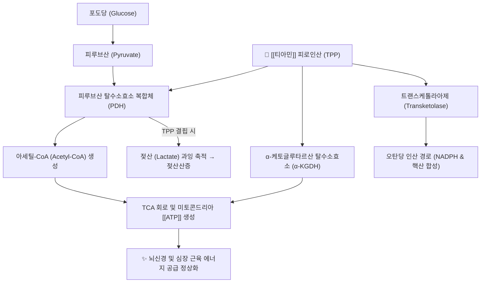

---
aliases:
  - 티아민
  - Thiamine
  - Thiamin
  - 비타민 B1
  - Vitamin B1
tags:
  - 약리성분
  - 비타민
  - 수용성비타민
  - 탄수화물대사
  - 뇌신경대사
  - 피로회복
  - 각기병
  - 베르니케코르사코프
---
# 💊 [[티아민]] (Thiamine, Vitamin B1, Aneurine)

> **핵심 요약 (Key Summary)**:
> 수용성 비타민 B 복합체의 첫 번째 성분(비타민 B1)으로 곡류 배아 및 콩류, 효모에 풍부.
> 생체 내 활성형인 티아민 피로인산(TPP)으로 전환되어 피루브산 탈수소효소(PDH) 및 알파케토글루타르산 탈수소효소의 필수 조효소로 작용, 탄수화물 에너지 대사 및 젖산 축적 억제.
> 결핍 시 베르니케-코르사코프 증후군(중추신경계 뇌병증), 각기병(심부전 및 말초신경염)을 유발하며, 만성 피로와 당뇨병성 신경병증의 핵심 관리 영양소.

---

## 1. 기본 화학 및 약동학적 특성 (Pharmacokinetics)

| 항목 | 상세 내용 |
| :--- | :--- |
| **일반명 (Generic)** | [[티아민]] (Thiamine, Vitamin B1) |
| **화학명 (IUPAC)** | 3-[(4-amino-2-methylpyrimidin-5-yl)methyl]-5-(2-hydroxyethyl)-4-methylthiazol-3-ium |
| **화학식 / 분자량** | $\text{C}_{12}\text{H}_{17}\text{N}_{4}\text{OS}^{+}$ / 265.35 g/mol (염산염: 337.27 g/mol) |
| **생체 내 활성형** | 티아민 피로인산 (TPP, Thiamine Pyrophosphate / Thiamine Diphosphate) |
| **흡수 경로** | 공장(Jejunum)에서 능동 수송체(THTR-1, THTR-2) 및 고농도 시 단순 확산 |
| **생체 내 저장 및 반감기** | 체내 저장량 약 30mg (매우 적음, 간·골격근·뇌), 반감기 10~20일로 지속 공급 필수 |
| **배설 경로** | 과잉 섭취 시 신장을 통해 소변으로 신속 배설 |

---

## 2. 분자약리 작용 기전 (Mechanism of Action, MoA)

* **탄수화물 대사 및 미토콘드리아 ATP 생성**:
  * TPP는 포도당이 분해되어 생성된 피루브산이 아세틸-CoA로 전환되는 필수 관문인 피루브산 탈수소효소(PDH)의 필수 보효소. 결핍 시 유산소 호흡이 중단되고 젖산(Lactate)이 축적되어 심한 대사성 산증과 근육 피로를 초래.
* **TCA 회로 회전 및 신경전달물질 합성**:
  * TCA 회로의 $\alpha$-케토글루타르산 탈수소효소 활성을 지탱하여 ATP 생성뿐만 아니라 글루타메이트 및 [[GABA]], 아세틸콜린 합성을 정상화.
* **오탄당 인산 경로(Pentose Phosphate Pathway) 조효소**:
  * 트랜스케톨라아제(Transketolase) 활성을 매개하여 신경세포막의 수초(Myelin sheath) 유지와 항산화 물질인 NADPH 생합성에 기여.

---

## 3. 결핍증 및 임상 적응증

* **베르니케-코르사코프 증후군 (Wernicke-Korsakoff Syndrome)**:
  * 만성 알코올 중독 및 영양실조로 발생. 급성기 안구운동마비, 운동실조(보행장애), 의식혼탁(베르니케) 및 만성기 불가역적 기억상실, 작화증(코르사코프) 유발.
  * **응급 수칙**: 저혈당 혼수 환자에게 포도당 수액을 단독 투여하면 급격한 티아민 소모로 뇌병증이 급격히 악화되므로, 반드시 포도당 투여 전/동시에 티아민을 먼저 주사 투여.
* **각기병 (Beriberi)**:
  * 건성 각기병(Dry Beriberi): 말초신경병증, 사지 무력, 감각 이상, 반사 소실.
  * 습성 각기병(Wet Beriberi): 심근 대사 부전으로 인한 고박출성 심부전, 폐부종, 전신 부종.
* **당뇨병성 신경병증 및 만성 피로**:
  * 고혈당으로 인한 혈관 내피 손상을 억제(벤포티아민 등 지용성 유도체 활용)하고 당뇨 합병증 완화.

---

## 4. 기원 식품, 본초 및 한의 임상 연계

* **풍부한 한약재 및 식품**:
  * [[맥아]](麥芽), [[의이인]](薏苡仁), 미강(쌀겨), 대두, 효모, 돼지고기, 견과류.
* **한의학적 각기(脚氣)와 비위습열(脾胃濕熱)**:
  * 한의학에서 각기병(脚氣衝心 등)은 중초 비위의 습담이 하지 경락을 막고 심장으로 치밀어 오르는 병증으로 인식함.
  * [[오적산]], [[당귀사역탕]], [[위령탕]] 등의 처방 운용과 함께 곡류 배아를 보양하는 식이 처방이 티아민 결핍 해소와 밀접하게 맞물림.

---

## 5. 부작용 및 복용 주의사항

* **안전성**:
  * 수용성 비타민으로 경구 투여 시 독성이 거의 없으며 잉여분은 소변으로 배설됨.
* **주사제 알레르기 반응**:
  * 고용량 정맥 주사 시 드물게 아나필락시스 유사 쇼크 반응이 발생할 수 있으므로 천천히 투여.
* **이뇨제 복용자 주의**:
  * 루프계 이뇨제(Furosemide 등) 장기 복용 환자는 티아민의 신장 배설이 증가하여 결핍 위험이 높아지므로 추가 보충 권고.

---

## 6. 출처 및 학술 참고 문헌 (References)

* Frank, L. L. (2015). Thiamin in clinical practice. *Journal of Parenteral and Enteral Nutrition*, 39(5), 503-520.
  * `[연구 요약]` 티아민의 분자생화학적 대사 경로, 결핍 시 나타나는 뇌병증과 심부전의 병태생리 및 임상 수액 투여 가이드를 총괄 정리.
* Lonsdale, D. (2006). A review of the biochemistry, metabolism and clinical benefits of thiamin(e) and its derivatives. *Evidence-Based Complementary and Alternative Medicine*, 3(1), 49-59.
  * `[연구 요약]` 티아민과 지용성 유도체(벤포티아민)의 미토콘드리아 에너지 대사 조절 및 만성 퇴행성 질환 예방 메커니즘을 규명.
