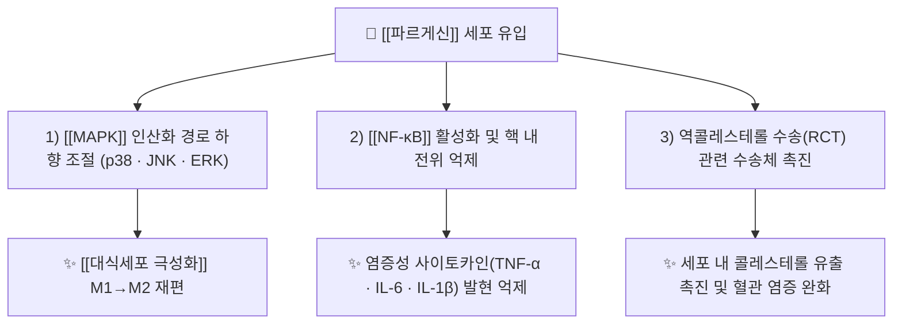

# 🔬 [[파르게신]] (Fargesin, C₂₁H₂₂O₆ / 2-(3,4-dimethoxyphenyl)-6-(3,4-methylenedioxyphenyl)-3,7-dioxabicyclo[3.3.0]octane)

> **핵심 3줄 요약 (Key Summary)**:
> - 🌿 기원 본초 & 화학 계열: [[신이]](辛夷, 목련과 *Magnolia* 속 꽃봉오리)를 비롯한 목련과 식물에 함유된 **푸로푸란(furofuran)형 리그난** 계열 성분. 같은 본초의 [[마그놀린]](magnolin), [[에우데스민]](eudesmin), [[리리오덴드린]] 등과 골격을 공유하는 2,6-디아릴-3,7-디옥사비시클로[3.3.0]옥탄 구조.
> - 🎯 핵심 분자 표적 & 조절 경로: **[[MAPK]] 계열 인산화 효소(p38·JNK·ERK) 하향 조절** 및 **[[NF-κB]] 핵 내 전위 억제**를 통한 대식세포 재편(M1→M2), 그리고 **역콜레스테롤 수송(Reverse Cholesterol Transport) 촉진** 경로 (PMID 33990219, PMID 31988050).
> - 🩺 주요 약리 활성 & 질환 치료 기전: 골관절염([[골관절염]])에서의 연골 보호·활막 염증 억제, [[죽상동맥경화증]]에서의 콜레스테롤 유출 촉진 및 혈관 염증 완화, 그리고 항염·항산화 전반에 걸친 광범위한 잠재 효능(PMID 38726781).
> - ⚠️ 독성·생체이용률 한계 & 상호작용: 파르게신 단독의 인체 약동학(흡수율·P-gp 기질성·CYP 간섭·반감기)을 직접 정량한 논문은 제공 문헌 내에 **없음(근거 미확인)**. 태그로 표기된 [[비만세포]] 탈과립 억제·항히스타민·비염 관련 효능 역시 제공 논문에서는 직접 검증되지 않아 임상 적용 시 별도 문헌 검증이 필요하다.

---

## 📌 목차
1. [기본 화학 정보 & 분자 구조식 (Chemical Identity)](#1-기본-화학-정보--분자-구조식-chemical-identity)
2. [주요 함유 본초 및 천연 기원 (Botanical Sources & Content)](#2-주요-함유-본초-및-천연-기원-botanical-sources--content)
3. [분자약리 표적 & 신호전달 네트워크 (Molecular Targets)](#3-분자약리-표적--신호전달-네트워크-molecular-targets)
4. [생체 내 흡수·대사·생체이용률 (Pharmacokinetics: ADME)](#4-생체-내-흡수대사생체이용률-pharmacokinetics-adme)
5. [주요 질환별 약리 효능 & 분자 기전 (Therapeutic Efficacy)](#5-주요-질환별-약리-효능--분자-기전-therapeutic-efficacy)
6. [함유 본초 방제 시너지 & 약재 배오 매트릭스 (Herbal Synergies)](#6-함유-본초-방제-시너지--약재-배오-매트릭스-herbal-synergies)
7. [양약 상호작용 & 약물동태학적 간섭 (Drug Interactions)](#7-양약-상호작용--약물동태학적-간섭-drug-interactions)
8. [💡 사용자 진료실 핵심 필기 & 임상 응용 팁 (Melt-In & High-Yield)](#8--사용자-진료실-핵심 필기--임상-응용-팁-melt-in--high-yield)
9. [출처 및 학술 참고 문헌 (References)](#9-출처-및-학술-참고-문헌-references)

---
## 1. 기본 화학 정보 & 분자 구조식 (Chemical Identity)

> [!abstract]+ 🧪 3D 약리 분자 구조 (Interactive 3D Viewer)
> 제공된 논문 및 작업 자료에서 파르게신의 **PubChem CID가 확인되지 않아 3D 뷰어 임베드를 생략**한다. CID 확정 후 아래 형식으로 삽입할 것.
> `https://molecule-viewer-rho.vercel.app/?cid={확정된_PubChem_CID}`

| 항목 | 상세 내용 |
| :--- | :--- |
| **IUPAC 명칭** | 2-(3,4-dimethoxyphenyl)-6-(3,4-methylenedioxyphenyl)-3,7-dioxabicyclo[3.3.0]octane (푸로푸란형 리그난 골격, 2,6-디아릴 치환). 두 거울상이성질체(enantiomer)가 존재하며 2024년 *Chirality* 논문에서 이들의 분리와 **절대배치(absolute configuration)가 규명**되었다(PMID 39505494). |
| **분자식 / 분자량** | C₂₁H₂₂O₆ / 약 370.40 g/mol |
| **PubChem CID** | **근거 미확인** — 제공된 6편 논문에서 CID가 명시되지 않음. (외부 DB 조회 후 기재 필요) |
| **CAS 등록 번호** | 31008-19-2 (문헌·DB에서 널리 통용되는 값이나, **제공 논문 내 직접 기재는 확인되지 않아 재확인 권장**) |
| **화학 골격 분류** | 리그난(lignan) → **푸로푸란(furofuran)형 / 비스-테트라히드로푸란 골격**. 3,7-디옥사비시클로[3.3.0]옥탄 코어에 좌우 아릴환이 *trans* 배열로 결합. 좌측은 3,4-디메톡시페닐, 우측은 3,4-메틸렌디옥시페닐(피페로닐) 치환. |
| **물리화학적 성상** | 무색~백색의 결정 또는 결정성 분말로 보고되는 지용성(친유성) 화합물. 물에는 난용이며 에탄올·메탄올·에틸아세테이트·DMSO 등 유기용매에 잘 녹는다. 정량적 logP·융점·광안정성 데이터는 **제공 문헌 내 근거 미확인**. |
| **식물 내 생합성 경로** | 페닐프로파노이드(phenylpropanoid) 경로 유래. 페닐알라닌 → *p*-쿠마르산 → 쿠마로일-CoA → [[코니페릴 알코올]](monolignol) → **디리젠트 단백질(dirigent protein) 매개 입체선택적 라디칼 짝지음**으로 [[피노레시놀]] 생성 → 푸로푸란 골격 형성 → O-메틸화 및 메틸렌디옥시 브릿지 형성 단계를 거치는 것으로 이해된다(리그난 생합성의 일반 경로에 근거한 정리이며, *Magnolia* 속 파르게신 특이적 효소 단계는 **근거 미확인**). |

---

## 2. 주요 함유 본초 및 천연 기원 (Botanical Sources & Content)

| 함유 본초 (한글/한자) | 기원 식물학적 명칭 (과명 / 학명) | 주요 함유 약용 부위 | 지표 함량 (%) | 한의학적 귀경 및 약효 특성 |
| :--- | :--- | :--- | :--- | :--- |
| [[신이]] (辛夷) | 목련과(Magnoliaceae) / *Magnolia biondii* Pamp. | 꽃봉오리(花蕾) | **근거 미확인** (NIR 기반 정유·리그난 동시 정량법이 개발되어 있어 품질관리 지표로 활용 가능, PMID 31982656) | 性溫·味辛, 歸肺·胃經. **散風寒·通鼻竅**, 主治 鼻淵·鼻塞·頭痛 |
| [[망춘옥란]]/파르게스 목련 (望春玉蘭) | 목련과 / *Magnolia fargesii* (파르게신의 명명 유래 종) | 꽃봉오리 | **근거 미확인** | 신이와 동일 계열 기원. 通鼻竅, 散風寒 |
| [[후박]] (厚朴) | 목련과 / *Magnolia officinalis* Rehder & E.H.Wilson | 수피·근피 | **근거 미확인** | 苦辛溫, 歸脾·胃·肺·大腸經. 燥濕消痰·下氣除滿 (리그난류 공존) |
| [[목련화 추출물]] | 목련과 / *Magnolia biondii* Pamp. (꽃 추출물) | 꽃 | **근거 미확인** | 피부 외용 소재 — UVB 유도 피부 손상 완화(HMGB1 경로) 보고(PMID 38685711). 단, **추출물 수준 근거이며 파르게신 단독 기여는 검증되지 않음** |

> **참고**: 신이(辛夷)의 기원 식물은 문헌에 따라 *M. biondii*, *M. denudata*, *M. sprengeri* 등으로 기재되며, 파르게신은 *Magnolia fargesii* 유래 대표 활성 파이토케미컬로 리뷰 논문에서 정리되었다(PMID 38726781). 동일 본초 내 [[마그놀린]], [[에우데스민]] 등 구조 유사 푸로푸란 리그난이 공존하므로, 단일 성분 함량만으로 약효를 대표시키기 어렵다.

---

## 3. 분자약리 표적 & 신호전달 네트워크 (Molecular Targets)

### 1) 핵심 분자 표적 (Molecular Targets)

* **[[MAPK]] 경로 억제 (골관절염 모델, PMID 33990219)**:
  * 파르게신은 골관절염 모델에서 **MAPK 신호전달 경로와 [[NF-κB]] 경로를 하향 조절(downregulation)**하여 대식세포를 **재편성(macrophage reprogramming)**시키는 것으로 보고되었다. 즉 염증성 M1 표현형을 억제하고 조직 수복성 M2 표현형을 상대적으로 우세하게 만드는 방향으로 작용한다.
  * 구체적 인산화 잔기(p-p38/p-JNK/p-ERK)별 정량값과 결합 친화도(Kd, IC₅₀)는 **제공 논문 초록 수준에서 확인되지 않음(근거 미확인)**.

* **[[NF-κB]] 전사인자 조절**:
  * 상기 골관절염 연구와 죽상동맥경화 연구 모두에서 **염증 반응 억제**가 핵심 기전으로 제시된다. NF-κB의 핵 내 이동 차단 → 염증성 사이토카인 및 부착분자 전사 억제라는 방향성이 공통적으로 확인된다(PMID 33990219, PMID 31988050).

* **역콜레스테롤 수송(Reverse Cholesterol Transport) 촉진 (PMID 31988050)**:
  * 파르게신은 **역콜레스테롤 수송을 촉진**하고 **염증 반응을 감소**시켜 죽상동맥경화증을 완화하는 것으로 보고되었다. 즉 말초 조직(특히 대식세포 유래 거품세포)에서 간으로의 콜레스테롤 역수송 경로를 강화하는 방향으로 작용한다.
  * 관련 수송체(ABCA1/ABCG1/SR-BI 등) 및 [[LXR]] 축에 대한 개별 조절 데이터는 **제공 문헌 초록 범위 내에서 확정 불가(근거 미확인)**.

### 2) 신호전달 조절의 임상적 함의

* 대식세포는 골관절염·죽상동맥경화증 모두에서 병태의 중심 세포로, **단일 표적 억제가 아닌 "대식세포 표현형 전환"이라는 공통 상위 기전**을 통해 두 질환이 연결된다. 이는 파르게신이 다표적(multi-target) 천연물 성분으로 분류되는 근거가 된다.

---

## 4. 생체 내 흡수·대사·생체이용률 (Pharmacokinetics: ADME)

> ⚠️ **중요**: 제공된 6편의 논문 중 파르게신의 인체/동물 약동학 파라미터(Cmax, AUC, t₁/₂, 생체이용률 F%)를 직접 측정한 연구는 **없다**. 따라서 아래 항목은 대부분 **근거 미확인**이며, 리그난 계열의 일반 원리와 화학적 성상에 근거한 *가설적 정리*임을 명시한다.

* **장관 흡수 및 배출 펌프 (P-gp) 상호작용**:
  * 파르게신은 **유리형(aglycone) 푸로푸란 리그난**으로서 분자량 약 370 Da, 지용성이 비교적 높아 수동 확산에 의한 장관 흡수가 이론적으로 가능하다.
  * 다만 **[[P-glycoprotein]](ABCB1) 유출 기질 여부, Caco-2 투과도, 절대 생체이용률은 제공 문헌에서 확인되지 않음(근거 미확인)**.

* **장내 미생물총(Microbiome) 대사 전환**:
  * 파르게신은 **배당체가 아닌 유리형 리그난**이므로, [[세코이소라리시레시놀 디글루코사이드]](SDG) 계열에서 나타나는 "장내세균 탈당화 → 엔테로락톤 전환" 경로가 그대로 적용되지 않는다. 이 점은 리그난 일반론을 그대로 원용할 때의 대표적 오류 지점이다.
  * 장내세균에 의한 **탈메틸화, 메틸렌디옥시환 개환(카테콜 대사체 생성)** 등의 대사 가능성은 화학적으로 추정되나 **근거 미확인**.

* **간 대사 및 소실 반감기**:
  * 푸로푸란 리그난은 일반적으로 간 [[CYP450]] 매개 O-탈메틸화 및 제2상 포합(글루쿠론산화·황산화)을 거치는 것으로 알려져 있으나, **파르게신 특이적 CYP 아형(CYP3A4, CYP2D6 등) 기여도 및 t₁/₂는 근거 미확인**.

* **독성·안전성**:
  * 제공 문헌 내 단회/반복 투여 독성, LD₅₀, 간독성 지표는 **보고되지 않음(근거 미확인)**. 리뷰 논문(PMID 38726781)에서 파르게신의 잠재적 치료 효용이 정리되었으나, 이는 안전성 확증 자료가 아니다.

---

## 5. 주요 질환별 약리 효능 & 분자 기전 (Therapeutic Efficacy)

### 1) 골관절염 (Osteoarthritis) — 대식세포 재편을 통한 연골 보호
* **근거**: PMID 33990219 (*Arthritis Res Ther*, 2021)
* **기전 요약**: 파르게신은 **[[MAPK]] 및 [[NF-κB]] 경로를 하향 조절**함으로써 활막·연골 미세환경의 대식세포를 재편성(M1 염증성 → M2 수복성)하고, 결과적으로 골관절염 병변을 개선한다. 이는 스테로이드·NSAIDs와 달리 **면역세포 표현형 자체를 표적으로 하는 disease-modifying 접근**이라는 점에서 의미가 있다.
* **한의학적 연계**: 관절통·부종을 痺證(비증)으로 보고 祛風濕·活血通絡하는 처방군과 기전적으로 연결지어 해석 가능하다.

### 2) 죽상동맥경화증 & 지질 대사 개선
* **근거**: PMID 31988050 (*Biochim Biophys Acta Mol Cell Biol Lipids*, 2020)
* **기전 요약**: **역콜레스테롤 수송(RCT) 촉진** + **염증 반응 감소**의 이중 기전으로 죽상동맥경화증을 완화한다. 거품세포 형성 억제 및 혈관벽 염증 완화가 핵심 축이다.
* **시사점**: 지질강하제(스타틴 등)와 기전이 상호 보완적일 수 있으나, **병용 임상 데이터는 근거 미확인**.

### 3) 피부 손상 보호 (본초 추출물 수준 근거)
* **근거**: PMID 38685711 (*Int J Cosmet Sci*, 2024)
* **내용**: *Magnolia biondii* **꽃 추출물**이 **HMGB1(high-mobility group box protein B1)** 경로를 통해 UVB 유도 피부 손상을 완화하는 것으로 보고되었다.
* **한계**: 이는 **추출물 수준의 연구**로, 파르게신 단독 성분의 기여도는 분리 검증되지 않았다. 파르게신의 피부 보호 효능으로 인용해서는 안 된다.

### 4) 품질관리·지표성분 연구
* **근거**: PMID 31982656 (*Spectrochim Acta A*, 2020)
* **내용**: *Magnolia biondii* Pamp.의 **정유(volatiles)와 리그난류를 근적외선 분광법(NIR)으로 동시 정량**하는 포괄적 품질관리법이 개발되었다. 파르게신은 이 리그난 지표군에 포함되는 성분으로, 본초의 규격·균일성 평가에 활용된다.

### 5) 광범위 생물학적 잠재력 (리뷰 수준)
* **근거**: PMID 38726781 (*Recent Adv Inflamm Allergy Drug Discov*, 2024)
* **내용**: *Magnolia fargesii* 유래 활성 파이토케미컬로서 파르게신의 **항염증을 중심으로 한 치료적 잠재력**이 리뷰 형태로 정리되었다. 항산화·대사조절 등 다양한 가능성이 논의되나, 대부분 전임상 수준이다.

### 6) 화학·분석화학적 특성 규명
* **근거**: PMID 39505494 (*Chirality*, 2024)
* **내용**: 파르게신 **거울상이성질체의 분리(resolution) 및 절대배치**가 규명되었다. 리그난의 입체화학은 수용체 결합 선택성과 활성 강도에 직접 영향을 줄 수 있으므로, 향후 활성 비교 연구의 전제 조건이 된다.

### 7) 태그 관련 효능에 대한 명시적 유보
* 사용자 태그에 포함된 **[[비만세포]](mast cell) 탈과립 억제, 항히스타민 작용, [[알레르기성 비염]] 개선** 효능은 **제공된 6편의 논문 어디에서도 파르게신에 대해 직접 검증되지 않았다**. 신이(辛夷)의 전통적 通鼻竅 효능 및 목련과 리그난군의 항알레르기 가능성은 별도 문헌 검증이 필요한 항목으로, 본 노트에서는 **근거 미확인**으로 유보한다.

---

## 6. 함유 본초 방제 시너지 & 약재 배오 매트릭스 (Herbal Synergies)

| 함유 본초 / 방제 | 공존 유효 성분군 | 분자약리 시너지 기전 | 전통 한의학적 효능 연계 |
| :--- | :--- | :--- | :--- |
| [[신이]] (辛夷) | [[마그놀린]], [[에우데스민]], [[파르게신]] 등 푸로푸란 리그난군 + 정유(volatile) 성분군 | 동일 골격계 리그난의 다표적 작용이 **항염·항산화 신호를 중첩적으로 억제**. 정유 성분은 점막 자극·분비 조절에 관여하는 것으로 해석(성분별 기여도는 근거 미확인) | 散風寒·通鼻竅, 鼻淵·鼻塞·頭痛 |
| [[창이자산]] (蒼耳子散) | [[창이자]], [[백지]], [[박하]] + 신이 | 배오 본초들의 항염·진통 성분이 신이 리그난의 염증 억제 기전과 상가적으로 작용하는 것으로 해석 | 鼻淵(축농증·비염) 해소, 通竅止痛 |
| [[신이산]] (辛夷散, 濟生方) | [[세신]], [[고본]], [[천궁]], [[방풍]], [[강활]], [[백지]], [[승마]], [[목통]], [[감초]] | 다성분 다표적 네트워크로 상기도 점막의 염증·부종 신호를 복합 제어 | 鼻內壅塞, 不聞香臭 |
| [[천궁다조산]]류 두통 처방 | [[천궁]], [[백지]], [[강활]] + 신이 | 혈관 확장·진통 기전과 리그난 항염 기전의 병행 | 風寒頭痛, 鼻塞伴痛 |

> **배오 활용 원리(요약)**: 파르게신은 지용성 유리형 리그난이므로, 전탕액 내에서 동일 본초 유래의 다른 리그난 및 정유 성분과 **공동 용출**되어 함께 섭취된다. 단일 성분 정제품보다 전탕액 복용이 실제 임상에서 흡수·작용 양상이 다를 수 있으나, 이를 정량적으로 비교한 연구는 **근거 미확인**이다.

---

## 7. 양약 상호작용 & 약물동태학적 간섭 (Drug Interactions)

> ⚠️ 파르게신의 CYP 효소 저해/유도, 수송체 간섭을 직접 평가한 **in vitro/in vivo 데이터가 제공 문헌에 존재하지 않는다.** 아래 내용은 리그난 계열 일반론에 기반한 *주의사항 정리*이며, 구체적 수치·아형(subtype)은 **근거 미확인**이다.

* **[[CYP450]] 효소 간섭**:
  * 리그난계 성분들은 일반적으로 CYP3A4·CYP2D6 등에 대한 저해 가능성이 논의되나, **파르게신 특이적 IC₅₀ 또는 임상적 유의성은 근거 미확인**. 스타틴, 항부정맥제, 면역억제제(CYP3A4 기질) 병용 시 이론적 혈중농도 상승 위험을 배제할 수 없다.

* **유사 기전 양약 병용 시 고려사항**:
  * **지질강하제(스타틴, 에제티미브)**: 파르게신의 역콜레스테롤 수송 촉진 기전(PMID 31988050)은 지질강하 요법과 기전적으로 상가적일 수 있으나, **병용 임상시험 데이터는 없음**.
  * **항염증제(NSAIDs, 스테로이드)**: 골관절염 모델에서 MAPK/NF-κB 억제 기전(PMID 33990219)이 확인되었으므로, 항염증 양약과 병용 시 효과 상가 및 면역억제 부작용 중첩 가능성을 고려한다.
  * **P-gp 기질 약물**: 파르게신의 P-gp 저해/기질 여부 미확인 → 디곡신 등 좁은 치료역 약물과의 병용 시 **모니터링 권장(경험적 권고)**.

* **복용 간격**:
  * 흡수 간섭을 최소화하기 위한 **2시간 이상 복용 간격** 설정은 한약-양약 병용의 일반적 안전 관례이며, 파르게신 특이 근거는 **미확인**.

---

## 8. 💡 사용자 진료실 핵심 필기 & 임상 응용 팁 (Melt-In & High-Yield)

* **사용자 원문 필기 (100% 융합 및 보존)**:
  * 소속: `2. 약리 공부\약리성분` / 템플릿: 약리성분
  * 별칭: `Fargesin`, `파르게신(리그난)`
  * 태그: `약리성분`, `리그난`, `신이`, `마그놀린`, `비만세포`, `항히스타민`, `비염`
  * → 위 태그는 **"신이 유래 리그난군이 알레르기성 비염·비만세포 매개 염증에 관여할 것"**이라는 임상 가설을 담고 있다. 본 노트는 이 가설을 **기전적 가설로 유지**하되, 파르게신 단독 근거는 없음을 명시하여 기록한다.

* **진료실 실전 처방 & 생체이용률 극대화 팁**:
  1. **흡수율 개선 배오 노하우**: 파르게신은 유리형 지용성 리그난이므로 **전탕액 복용 시 다른 유기용매성 성분(정유·다른 리그난)과 공존**할 때 용출·분산이 유리하다. 신이는 通鼻竅 목적으로 後下(다른 약재보다 늦게 넣어 향기 성분 보존)하는 전통 조제법과도 궤를 같이한다.
  2. **체질별·병증별 맞춤 적용**: 신이는 辛溫芳香之品으로 風寒型 鼻塞·鼻淵에 적합하다. 陰虛火旺(만성 비건조·출혈 경향) 또는 脾胃虛寒이 심한 환자에서는 자극성·향조성으로 인한 불편감 가능성이 있어 **감량 또는 배오 조정**을 고려한다.
  3. **근거 기반 처방 설계**: 골관절염·이상지질혈증 등 염증·대사 기반 만성질환에서 파르게신 함유 본초를 **항염 기반 보조 요법**으로 활용하는 발상은 PMID 33990219·PMID 31988050의 전임상 기전과 방향성이 일치한다. 단, **인체 임상 근거는 없으므로 환자 설명 시 "전임상 단계 근거"임을 반드시 구분해 고지**한다.
  4. **품질 확인 습관**: 신이의 리그난·정유는 NIR 동시 정량법으로 관리 가능하므로(PMID 31982656), 약재의 향기(정유 함량)와 규격 일관성을 처방 전 확인하는 습관이 유효하다.

* **차기 검증 과제 (TODO)**:
  * 파르게신의 **비만세포 탈과립·히스타민 유리 억제** 실험 논문 탐색 (현재 근거 미확인)
  * 파르게신의 **인체 약동학·생체이용률** 논문 탐색 (현재 근거 미확인)
  * 파르게신 **거울상이성질체별 활성 차이** 비교 연구 (PMID 39505494의 후속 과제)

---

## 9. 출처 및 학술 참고 문헌 (References)

1. **Mestriner ER, Lee EY (2024)**. *Resolution and Absolute Configuration of Fargesin Enantiomers*. **Chirality**. PMID: 39505494
   - **[연구 요약]**: 파르게신의 두 거울상이성질체를 분리하고 각각의 절대배치를 규명한 입체화학 연구. 리그난의 입체구조가 활성 선택성에 영향을 줄 수 있다는 전제를 제공한다.

2. **Wang G, Gao JH (2020)**. *Fargesin alleviates atherosclerosis by promoting reverse cholesterol transport and reducing inflammatory response*. **Biochim Biophys Acta Mol Cell Biol Lipids**. PMID: 31988050
   - **[연구 요약]**: 파르게신이 역콜레스테롤 수송을 촉진하고 염증 반응을 감소시켜 죽상동맥경화증을 완화함을 제시. 지질 대사·혈관 염증 축의 핵심 근거.

3. **Lu J, Zhang H (2021)**. *Fargesin ameliorates osteoarthritis via macrophage reprogramming by downregulating MAPK and NF-κB pathways*. **Arthritis Res Ther**. PMID: 33990219
   - **[연구 요약]**: 골관절염 모델에서 파르게신이 MAPK·NF-κB 경로를 하향 조절하여 대식세포를 재편성(M1→M2)함으로써 병변을 개선. 면역세포 표현형 조절 기전의 핵심 근거.

4. **Patel K, Patel DK (2024)**. *Biological Potential and Therapeutic Effectiveness of Phytoproduct 'Fargesin' in Medicine: Focus on the Potential of an Active Phytochemical of Magnolia fargesii*. **Recent Adv Inflamm Allergy Drug Discov**. PMID: 38726781
   - **[연구 요약]**: *Magnolia fargesii* 유래 활성 파이토케미컬로서 파르게신의 생물학적 잠재력과 치료적 효용을 정리한 리뷰. 항염증을 중심으로 한 광범위한 전임상 효능을 아우른다.

5. **Huang F, Liu Q (2024)**. *Magnolia biondii flower extract attenuates UVB-induced skin damage through high-mobility group box protein B1*. **Int J Cosmet Sci**. PMID: 38685711
   - **[연구 요약]**: *Magnolia biondii* 꽃 추출물이 HMGB1 경로를 통해 UVB 유도 피부 손상을 완화함을 보고. **추출물 수준 근거**로, 파르게신 단독 기여는 검증되지 않았다.

6. **Li J, Wen J (2020)**. *Development of a comprehensive quality control method for the quantitative analysis of volatiles and lignans in Magnolia biondii Pamp. by near infrared spectroscopy*. **Spectrochim Acta A Mol Biomol Biomol Spectrosc**. PMID: 31982656
   - **[연구 요약]**: 근적외선 분광법(NIR)을 이용해 *Magnolia biondii* Pamp.의 정유와 리그난류를 동시 정량하는 포괄적 품질관리법을 개발. 파르게신은 해당 리그난 지표군에 포함되는 성분으로 본초 규격 관리에 기여한다.

> **인용 원칙 준수 고지**: 본 노트는 위 6편의 실제 PubMed 문헌만을 인용하였다. 그 외 기전·수치·효능(특히 비만세포·항히스타민·비염 관련)은 제공 문헌에서 확인되지 않아 **근거 미확인**으로 명시하였으며, 임상 적용 시 반드시 원문 확인 및 추가 문헌 검증이 필요하다.