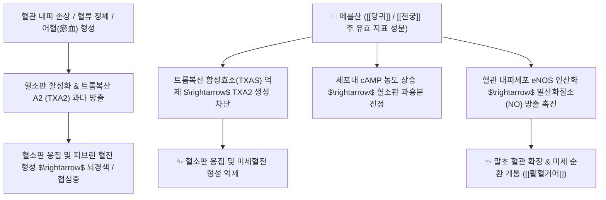

# 💊 [[페룰산]] (Ferulic Acid)

> **핵심 요약 (Key Summary)**:
> 당귀, 천궁 등 산형과 본초 및 미강(쌀겨)에 풍부하게 함유된 대표적인 하이드록시신남산계 천연 페놀성 화합물.
> 트롬복산 A2(TXA2) 억제를 통한 혈소판 응집 차단, eNOS 활성화 및 Nrf2/HO-1 항산화 경로 활성화로 혈관 내피와 뇌신경을 보호.
> 허혈성 뇌졸중, 관상동맥 질환 및 월경통 치료의 핵심 표적 성분이자 당귀와 천궁의 보혈활혈(補血活血)을 분자 수준에서 매개하는 핵심 물질.

---

## 📌 목차
1. [기본 화학 정보 & 분자 구조식 (Chemical Identity)](#1-기본-화학-정보--분자-구조식-chemical-identity)
2. [핵심 분자 표적 & 항혈전·혈소판 응집 억제 메커니즘](#2-핵심-분자-표적--항혈전혈소판-응집-억제-메커니즘)
3. [혈관 내피 보호 및 Nrf2/HO-1 항산화 신호망](#3-혈관-내피-보호-및-nrf2ho-1-항산화-신호망)
4. [혈뇌장벽(BBB) 투과성과 허혈성 뇌졸중 신경 보호](#4-혈뇌장벽bbb-투과성과-허혈성-뇌졸중-신경-보호)
5. [한의학적 보혈·활혈거어 처방 배오 연계 (사물탕 & 당귀수산)](#5-한의학적-보혈활혈거어-처방-배오-연계-사물탕--당귀수산)
6. [출처 및 학술 참고 문헌 (References)](#6-출처-및-학술-참고-문헌-references)

---
## 1. 기본 화학 정보 & 분자 구조식 (Chemical Identity)

> [!abstract]+ 🧪 3D 약리 분자 구조 (Interactive 3D Viewer)
> <iframe src="https://molecule-viewer-rho.vercel.app/?cid=445858" style="width: 100%; height: 600px; border: none; border-radius: 12px; box-shadow: 0 4px 20px rgba(0,0,0,0.15);" allowfullscreen></iframe>

| 항목 | 상세 정보 |
| :--- | :--- |
| **화학명 (IUPAC)** | (2E)-3-(4-Hydroxy-3-methoxyphenyl)prop-2-enoic acid |
| **분자식 및 분자량** | C10H10O4 / 194.18 g/mol |
| **CAS 등록번호** | 1135-24-6 (trans-형) |
| **기원 본초** | 산형과(*Apiaceae*) [[당귀]](*Angelica gigas* / *Angelica sinensis*), [[천궁]](*Ligusticum chuanxiong*)의 근경 |
| **화학 분류** | 페닐프로파노이드(Phenylpropanoid) 유래 하이드록시신남산 유도체 |

---
## 2. 핵심 분자 표적 & 항혈전·혈소판 응집 억제 메커니즘

* **항혈소판 및 항혈전 작용**:
  * 아라키돈산 대사 과정에서 트롬복산 합성효소(TXAS)를 선택적으로 억제하여 강력한 혈관 수축 및 혈소판 응집 촉진 물질인 TXA2의 방출을 억제합니다.
  * 혈소판 내 아데닐산 시클라아제(Adenylyl cyclase)를 자극하여 cAMP 농도를 유지시킴으로써 혈전 형성을 차단합니다.

---
## 3. 혈관 내피 보호 및 Nrf2/HO-1 항산화 신호망

* **페놀성 수산기를 통한 활성산소(ROS) 직접 소거**:
  * 방향족 고리의 전자 공여 작용을 통해 히드록실 라디칼(·OH)과 과산화 음이온을 직접 중화시킵니다.
* **Nrf2-Keap1 해리 및 2상 항산화 효소 유도**:
  * 세포질의 Keap1을 산화적 변형시켜 전사인자 Nrf2를 핵 내로 이동시킵니다.
  * ARE(Antioxidant Response Element)에 결합하여 헴옥시게나아제-1(HO-1), 글루타치온(GSH), SOD 등의 합성을 촉진하여 산화 스트레스로부터 혈관 내피세포를 방어합니다.

---
## 4. 혈뇌장벽(BBB) 투과성과 허혈성 뇌졸중 신경 보호

* **낮은 분자량과 높은 지용성을 통한 BBB 투과**:
  * 경구 복용 후 혈뇌장벽을 신속히 통과하여 중추신경계에 도달합니다.
* **뇌허혈-재관류 손상 방어**:
  * 뇌경색 동물 모델에서 허혈 후 재관류 시 발생하는 미세아교세포(Microglia)의 과활성화와 염증성 사이토카인(TNF-α, IL-1β) 방출을 차단하여 신경세포 사멸(Apoptosis) 영역을 유의하게 축소시킵니다.

---
## 5. 한의학적 보혈·활혈거어 처방 배오 연계 (사물탕 & 당귀수산)

* **당귀(보혈)와 천궁(행혈)의 상호 상승 메커니즘**:
  * 한의학에서 당귀는 피를 만들고(補血), 천궁은 피를 돌리는(行血) 대표적 약대(藥對)입니다.
  * 두 본초 모두에 페룰산이 고농도로 함유되어 있어, 보혈과 활혈 작용이 페룰산의 조혈 촉진 및 혈류 개선 효과를 통해 완벽히 합치됩니다.
* **대표 한의 처방**:
  * **[[사물탕]] (四物湯)**: 당귀, 천궁의 페룰산이 백작약의 페오니플로린과 결합하여 혈허(빈혈) 및 월경불순을 치료.
  * **[[당귀수산]] (當歸鬚散)**: 타박상 및 교통사고 후 어혈성 동통을 신속히 소산.
  * **[[보양환오탕]] (補陽還五湯)**: 황기의 다당류와 당귀미·천궁의 페룰산이 협동하여 뇌졸중 후유증(반신불수)의 신경 재생 촉진.

---
## 6. 출처 및 학술 참고 문헌 (References)

* Mancuso C, Santangelo R. Ferulic acid: Pharmacological and toxicological aspects. *Food Chem Toxicol*. 2014;65:185-195.
  * `[연구 요약]` 페룰산의 항산화, 항염증, 혈관 내피 보호 및 신경 보호 약리 기전과 약동학적 특성 총괄.
* Cheng CY, Su SY, Tang NY, et al. Ferulic acid provides neuroprotection against oxidative stress-related apoptosis after cerebral ischemia/reperfusion injury by inhibiting ICAM-1 expression in rats. *Brain Res*. 2008;1209:136-150.
  * `[연구 요약]` 페룰산이 뇌허혈-재관류 손상 모델에서 혈관 부착 분자(ICAM-1) 억제 및 항세포사멸을 통해 뇌신경을 보호함을 입증.
* 대한민국약전(KP) 제12개정 (2022). 의약품각조 제2부: 당귀 및 천궁 분석법.
  * `[공정서 규격]` 당귀와 천궁의 지표 성분으로서 페룰산(Ferulic acid)의 HPLC 정량 표준 규격 명시.
