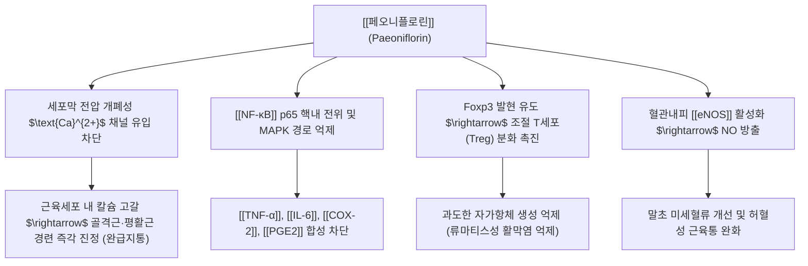

---
aliases:
  - 페오니플로린
  - Paeoniflorin
  - 피오니플로린
tags:
  - 약리성분
  - 모노테르펜배당체
  - 작약
  - 진경
  - 진통
  - 면역조절
---
# 💊 [[페오니플로린]] (Paeoniflorin)

> **핵심 요약 (Key Summary)**:
> 미나리아재비과(Ranunculaceae) 생약인 [[작약]](Paeonia lactiflora)의 뿌리에서 추출되는 대표적인 피난(Pinane) 골격 모노테르펜 글루코사이드
> 전압 의존성 L형 칼슘 채널 차단 및 [[NF-κB]] 신호 전달 억제를 통해 골격근·평활근 경련을 즉각 이완시키고 염증성 통증 완화
> 사지 근육 경련과 복통 및 월경통을 해소하는 작약감초탕의 핵심 지표 성분이자 류마티스 관절염 및 자가면역 질환의 천연 면역조절제

---

## 📌 목차
1. [기본 약물 정보 & 화학 구조 (Chemical Structure)](#1-기본-약물-정보--화학-구조-chemical-structure)
2. [분자약리 작용 기전 (Mechanism of Action, MoA)](#2-분자약리-작용-기전-mechanism-of-action-moa)
3. [작약감초탕(芍藥甘草湯) 진경 시너지 메커니즘](#3-작약감초탕芍藥甘草湯-진경-시너지-메커니즘)
4. [주요 약리학적 효능 (항염증 & 신경보호)](#4-주요-약리학적-효능-항염증--신경보호)
5. [기원 본초 및 한의 임상 연계](#5-기원-본초-및-한의-임상-연계)
6. [출처 및 학술 참고 문헌 (References)](#6-출처-및-학술-참고-문헌-references)

---

## 1. 기본 약물 정보 & 화학 구조 (Chemical Structure)

| 항목 | 상세 내용 |
| :--- | :--- |
| **일반명 (Generic)** | [[페오니플로린]] (Paeoniflorin) |
| **화학명 (IUPAC)** | [(1R,2S,3R,5R,6R,8S)-8-methyl-3-[(2S,3R,4S,5S,6R)-3,4,5-trihydroxy-6-(hydroxymethyl)oxan-2-yl]oxy-9,10-dioxatricyclo[4.3.1.0^{2,5}]decan-2-yl] benzoate |
| **기원 본초** | 미나리아재비과 [[작약]](*Paeonia lactiflora* Pall.)의 건조 뿌리 |
| **화학식 / 분자량** | $\text{C}_{23}\text{H}_{28}\text{O}_{11}$ / 480.46 g/mol |
| **화학적 분류** | 옥사비사이클릭 피난계 모노테르펜 배당체 (Monoterpene glucoside) |
| **생약 규격** | 대한약전(KP) 백작약 및 적작약 기준 페오니플로린 2.0% 이상 함유 |

---

## 2. 분자약리 작용 기전 (Mechanism of Action, MoA)

* **근육 경련 차단 (진경 완급)**:
  * 골격근 및 평활근 세포막의 칼슘 이온 유입을 억제하고 소포체 칼슘 유리를 막아 근수축 액틴-미오신 결합을 해제.
* **면역 관용 유도 (Treg/Th17 밸런스 회복)**:
  * 류마티스 관절염 및 전신홍반루푸스 모델에서 염증성 Th17 세포를 억제하고 면역 브레이크인 Treg 세포를 증식시켜 관절 파괴 차단.

---

## 3. 작약감초탕(芍藥甘草湯) 진경 시너지 메커니즘

* **페오니플로린 + 글리시리진 상호 증강**:
  * 작약의 [[페오니플로린]]은 운동 신경 말단의 아세틸콜린 유리를 억제하고 근세포 칼슘 유입을 차단.
  * 감초의 [[글리시리진]]은 세포막 $\text{K}^+$ 채널을 활성화하여 과분극을 유도.
  * 두 성분이 결합 시 척수 전각 운동신경원과 근섬유를 동시에 안정화시켜 **쥐가 나는 급성 비복근 경련을 수분 내에 풀어버리는 극적인 임상 시너지** 발휘.

---

## 4. 주요 약리학적 효능 (항염증 & 신경보호)

* **골관절염 및 류마티스 관절염 연골 보호**:
  * 활액막세포의 MMP-1, MMP-3, MMP-13 분비를 억제하여 관절 연골 기질 분해를 차단.
* **중추 신경보호 및 항우울 활성**:
  * 해마 신경세포의 산화 스트레스를 줄이고 BDNF 발현을 증대시켜 만성 통증에 동반되는 불안·우울 증상 개선.

---

## 5. 기원 본초 및 한의 임상 연계

* **백작약 vs 적작약**:
  * **백작약(白芍藥)**: 양혈렴음(養血斂陰), 유간지통(柔肝止痛)으로 근육 경련, 월경통, 간울협통에 다용.
  * **적작약(赤芍藥)**: 청열양혈(淸熱涼血), 산어지통(散瘀止痛)으로 혈열어체, 피부 자반, 타박상에 다용.
* **주요 배합 방제**:
  * [[작약감초탕]], [[사물탕]], [[당귀작약산]], [[소요산]], [[계지복령환]], [[패독산]].

---

## 6. 출처 및 학술 참고 문헌 (References)
* State Pharmacopoeia Commission of PRC. *Pharmacopoeia of the People's Republic of China*. 2020: 110-111.
  * `[연구 요약]`: 작약의 규격 기준, 페오니플로린 정량 분석 시험법.
* Zhang W, et al. Paeoniflorin: A review on its pharmacology, pharmacokinetics, and clinical application. *Front Pharmacol*. 2020;11:1195.
  * `[연구 요약]`: 페오니플로린의 진통, 진경, 면역조절, 항관절염 및 심혈관 보호 작용 종합 리뷰.
