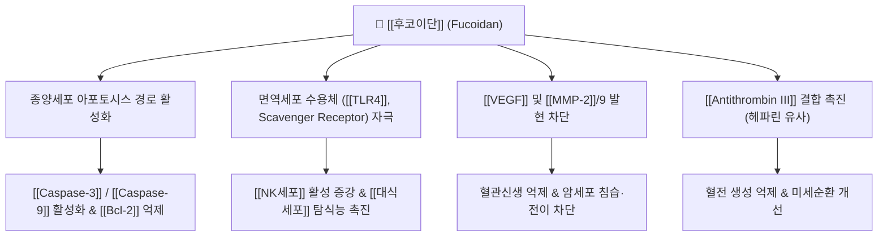

---
aliases:
  - 후코이단
  - Fucoidan
  - 황산화후코스
tags:
  - 약리성분
  - 다당류
  - 황산화다당류
  - 항종양
  - 면역조절
  - 항응고
  - 갈조류
---
# 💊 [[후코이단]] (Fucoidan, Sulfated Fucose-rich Polysaccharide)

> **핵심 요약 (Key Summary)**:
> 갈조류인 [[다시마]](*Laminaria japonica*), [[미역]](*Undaria pinnatifida*), 모즈쿠(*Cladosiphon okamuranus*), [[해조]](*Sargassum*)에서 추출되는 황산화 다당류 복합체.
> [[Macrophage]] 표면의 [[TLR4]] 및 수용체 자극을 통한 면역세포 활성화, [[Caspase-3]]/9 매개 암세포 아포토시스 유도, [[VEGF]] 억제를 통한 신생혈관 억제 및 항응고 활성.
> 한의학의 연견산결(軟堅散結) 및 화담거습 약리에 대응하여 갑상선종, 종괴, 만성 염증성 질환 및 보조적 항암 관리에 응용.

---

## 1. 기본 화학 정보 & 분자 구조식 (Chemical Identity)

> [!abstract]+ 🧪 3D 약리 분자 구조 (Interactive 3D Viewer)
> <iframe src="https://molecule-viewer-rho.vercel.app/?cid=16211014" style="width: 100%; height: 600px; border: none; border-radius: 12px; box-shadow: 0 4px 20px rgba(0,0,0,0.15);" allowfullscreen></iframe>

| 항목 | 상세 내용 |
| :--- | :--- |
| **일반명 (Generic)** | [[후코이단]] (Fucoidan) |
| **화학적 분류** | 황산화 L-후코스 중합체 다당류 (Sulfated heteropolysaccharide) |
| **기원 해조류** | [[다시마]], [[미역]](포자엽 메카부), 톳, [[해조]], 블래더랙(*Fucus vesiculosus*) |
| **기본 구성 당류** | L-Fucose, Sulfate groups($\text{-SO}_3\text{H}$), Galactose, Xylose, Glucuronic acid |
| **평균 분자량** | 10,000 ~ 1,000,000 Da (추출법에 따라 고분자 및 저분자 후코이단으로 구분) |
| **물리화학적 성상** | 담갈색~황갈색 분말, 점조성 수용액 형성, 물에 용해되며 에탄올 침전 |

---

## 2. 분자약리 작용 기전 (Mechanism of Action, MoA)

* **종양세포 세포사멸(Apoptosis) 유도**:
  * 미토콘드리아 외막의 투과성을 조절하여 [[Bcl-2]]/Bax 비율을 낮추고 Cytochrome c 방출을 촉진하여 [[Caspase-3]], [[Caspase-9]]을 순차적으로 활성화.
  * 종양세포 주기(Cell cycle)를 G0/G1 또는 G2/M기에서 정지시킴.
* **면역 활성화 및 면역감시 기능 강화**:
  * 장관 상피 Peyer's patch 및 전신 단핵구의 패턴인식수용체([[TLR4]])에 결합하여 [[TNF-α]], [[IFN-γ]], [[IL-12]] 등 Th1 편향 사이토카인 분비를 촉진.
  * [[NK세포]](Natural Killer cell)의 퍼포린·그랜자임 분비를 높여 변이세포 제거능을 강화.
* **신생혈관 억제 및 전이 차단(Anti-angiogenic & Anti-metastatic)**:
  * [[VEGF]](Vascular Endothelial Growth Factor)와 그 수용체([[VEGFR-2]])의 자가인산화를 방해하여 종양 주변의 신규 모세혈관 생성을 억제.
  * 기저막 분해 효소인 [[MMP-2]], [[MMP-9]]의 발현을 낮추어 암세포의 혈관 외 유출 및 조직 침습을 차단.
* **항응고 및 혈전 용해 작용**:
  * 황산기($\text{SO}_4^{2-}$)가 풍부한 분자 구조로 인해 헤파린(Heparin)과 유사하게 [[Antithrombin III]]와 복합체를 형성, 트롬빈(Thrombin)과 제Xa인자(FXa) 활성을 억제하여 미세혈전 형성을 억제.

---

## 3. 주요 적응증 및 임상 응용

* **보조적 종양 관리 (Integrative Oncology)**:
  * 항암 화학요법 및 방사선 치료 중인 환자에서 면역력 유지, 피로도 개선, 종양 진행 억제 보조.
* **갑상선 종대 및 결절성 질환 (연견산결)**:
  * 풍부한 미네랄 및 황산화 다당의 복합 항염·소종 작용을 바탕으로 경부 림프절염, 갑상선종, 양성 낭종성 병변의 축소 유도.
* **소화기 점막 보호 및 만성 위염·궤양**:
  * 위점막 점액층과의 결합을 통해 헬리코박터 파일로리(*Helicobacter pylori*)의 위벽 부착을 물리적으로 저해하고 점막 재생을 촉진.
* **동맥경화 및 이상지질혈증 예방**:
  * 혈관 내피 염증 억제 및 간 내 콜레스테롤 대사 개선, 중성지방 배출 촉진.

---

## 4. 기원 본초 및 한의학 연계

* **대표 기원 본초**:
  * [[곤포]](昆布, *Laminaria japonica*): 연견산결, 소담이수. 갑상선종, 나력, 부종 치료.
  * [[해조]](海藻, *Sargassum pallidum*): 연견산결, 소담연견. 결절, 고환종통 치료.
* **연계 처방**:
  * [[해조옥호탕]](海藻玉壺湯): 영류(갑상선종, 림프절염)의 대표 처방으로 해조와 곤포가 군약으로 배합되어 후코이단의 현대적 효능과 직결됨.
* **본초 배합 특성**:
  * 한의학에서 함미(鹹味, 짠맛)는 단단한 것을 무르게 하는 연견(軟堅) 효능을 지니며, 해조류의 후코이단 성분은 딱딱하게 뭉친 결절과 담핵(痰核)을 푸는 물질적 기반이 됨.

---

## 5. 부작용, 상호작용 및 복용 주의사항

* **항응고제 및 항혈소판제 병용 주의**:
  * 와파린(Warfarin), 아스피린(Aspirin), NOAC(자렐토, 엘리퀴스 등)과 병용 시 출혈 경향성(멍, 잇몸 출혈, 혈뇨)이 증가할 수 있으므로 대용량 복용 시 혈액응고수치(PT/INR) 모니터링 필요.
* **갑상선 기능 이상 환자 주의**:
  * 천연 갈조류 원료에서 정제되지 않은 조추출물의 경우 [[요오드]](Iodine) 함량이 높아 갑상선기능항진증 환자나 하시모토 갑상선염 환자에서 갑상선 수치 변동을 유발할 수 있으므로 정제 규격 확인 필요.
* **소화기 반응**:
  * 수용성 식이섬유 다당류 특성상 과량 섭취 시 복부 팽만감, 묽은 변, 가스 생성이 발생할 수 있음.

---

## 6. 출처 및 학술 참고 문헌 (References)

* Atashrazm, F., et al. (2015). Fucoidan and Cancer: A Multifunctional Molecule with Anti-Tumor and Immune-Modulating Properties. *Marine Drugs*, 13(4), 2327-2346.
  * `[연구 요약]` 후코이단의 분자 구조, 암세포 아포토시스 경로 활성화([[Caspase-3]], 9), 신생혈관 억제 및 면역감시 강화 기전을 체계적으로 입증한 종설.
* Kwak, J. Y. (2014). Fucoidan as a marine bioactive compound for cancer therapy. *Integrative Cancer Therapies*, 13(4), 351-360.
  * `[연구 요약]` 항암 보조 요법으로서 후코이단의 임상적 유용성과 안전성, 면역 증강 프로파일을 규명.
* Fitton, J. H., et al. (2015). Therapies from Fucoidan; An Update. *Marine Drugs*, 13(9), 5920-5946.
  * `[연구 요약]` 후코이단의 항응고, 항염증, 항바이러스 작용 및 장관 면역 수용체 상호작용 규명.
