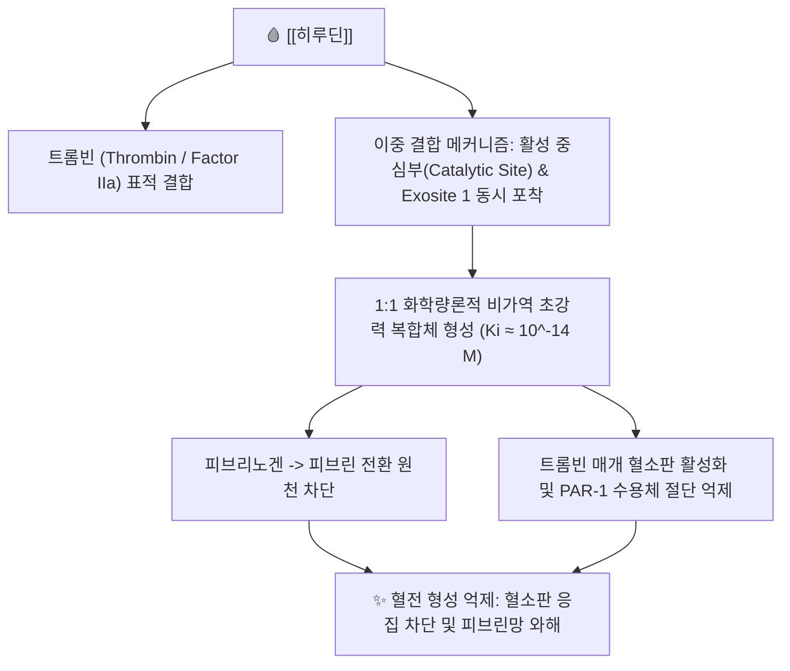

# 🩸 [[히루딘]] (Hirudin)

> **핵심 요약 (Key Summary)**:
> 한약재 [[수질]](약용 거머리)의 타액선에서 분비되는 천연 65~66개 아미노산 폴리펩타이드
> 안티트롬빈 III 비의존적으로 트롬빈 활성 부위와 외곽 결합 부위(Exosite 1)를 직접 차단
> 파종성 혈관내 응고(DIC), 헤파린 유도 혈소판 감소증(HIT) 및 심부정맥혈전증 치료 지표

---

## 📌 목차
1. [기본 화학 정보 & 분자 구조식 (Chemical Identity)](#1-기본-화학-정보--분자-구조식-chemical-identity)
2. [분자약리 작용 기전 (Mechanism of Action)](#2-분자약리-작용-기전-mechanism-of-action)
3. [함유 본초 및 한의학적 연계](#3-함유-본초-및-한의학적-연계)
4. [임상 효능 및 유전자재조합 제제](#4-임상-효능-및-유전자재조합-제제)
5. [안전성 및 독성학적 고찰](#5-안전성-및-독성학적-고찰)
6. [출처 및 학술 참고 문헌 (References)](#6-출처-및-학술-참고-문헌-references)

---
## 1. 기본 화학 정보 & 분자 구조식 (Chemical Identity)

> [!abstract]+ 🧪 3D 약리 분자 구조 (Interactive 3D Viewer)
> <iframe src="https://molecule-viewer-rho.vercel.app/?cid=118701161" style="width: 100%; height: 600px; border: none; border-radius: 12px; box-shadow: 0 4px 20px rgba(0,0,0,0.15);" allowfullscreen></iframe>

| 항목 | 상세 내용 |
| :--- | :--- |
| **성분명** | [[히루딘]] (Hirudin, Hirudin variant 1) |
| **분자 구조** | 65~66개 아미노산 단일 사슬 폴리펩타이드 (분자량 약 7,000 Da) |
| **황산화 특성** | Tyr-63 잔기에 특이적 황산화(Sulfation) 수식 존재 |
| **약효 분류** | 직접 트롬빈 억제제 (Direct Thrombin Inhibitor, DTI) |
| **대표 기원 동물** | [[수질]](*Hirudo medicinalis*, *Hirudo nipponia* 등 참거머리과) |

---
## 2. 분자약리 작용 기전 (Mechanism of Action)

### (1) 트롬빈 직접 억제 (Direct & Cofactor-Independent)
* **안티트롬빈 독립성**: 헤파린과 달리 혈장 내 보조인자인 안티트롬빈 III(AT-III)가 결핍된 환자에서도 온전한 항응고 활성을 발휘함.
* **결합형 트롬빈 억제**: 이미 피브린 혈전 내부에 갇혀 있는 결합형 트롬빈까지 침투하여 불활성화시키는 우수한 항혈전 특성을 지님.

### (2) 혈소판 활성화 수용체 차단
* 트롬빈이 혈소판 표면의 PAR-1(Protease-activated receptor 1)을 절단하여 유발하는 강력한 혈소판 응집 반응을 억제함.

---
## 3. 함유 본초 및 한의학적 연계

### (1) 핵심 기원 본초: [[수질]]
* [[수질]](水蛭, 참거머리)은 축혈(蓄血)을 부수고 단단한 징가적취(癥瘕積聚)를 뚫어내는 파혈축어의 명약임.
* 히루딘은 수질의 강력한 어혈 척결 및 혈행 재통 효능을 설명하는 핵심 생화학적 실체임.

### (2) 주요 배오 처방
* [[저당탕]]: [[맹충]], [[도인]], [[대황]]과 배오하여 하초의 극심한 축혈과 정맥 혈전 치료.
* [[대황자충환]]: 만성 소모성 질환의 건혈(乾血) 제거 및 간섬유화 억제.

---
## 4. 임상 효능 및 유전자재조합 제제

* **HIT 환자의 대체 항응고제**: 헤파린 투여 후 발생하는 면역 매개성 혈소판 감소증(HIT) 환자에게 혈소판 응집을 유발하지 않는 최적의 항응고제로 활용 (레피루딘 Lepirudin, 데시루딘 Desirudin 등).
* **미세수술 후 혈전 예방**: 성형외과 및 정형외과 미세혈관 문합 수술 후 정맥 울혈 해소를 위한 거머리 요법의 지표.

---
## 5. 안전성 및 독성학적 고찰

* **길항제 부재**: 히루딘은 헤파린의 프로타민(Protamine)과 같은 특이적 해독제(Antidote)가 없으므로 과량 투여로 인한 출혈 시 혈액 투석이나 수혈 등 대증 처치가 요구됨.
* **신기능 저하 환자 주의**: 신장을 통해 배설되므로 신부전 환자 투여 시 체내 축적에 따른 중증 출혈 위험 주의.

---
## 6. 출처 및 학술 참고 문헌 (References)

* Markwardt F. The development of hirudin as an antithrombotic drug. Thromb Res. 1994.
  * [연구 요약] 거머리 타액으로부터 히루딘을 최초로 분리 정제하고 그 트롬빈 특이적 억제 메커니즘을 규명함.
* Greinacher A et al. Recombinant hirudin for the treatment of heparin-induced thrombocytopenia. N Engl J Med. 1999.
  * [연구 요약] HIT 환자에서 재조합 히루딘의 혈전성 합병증 예방 및 안전성을 대규모 임상으로 입증함.
