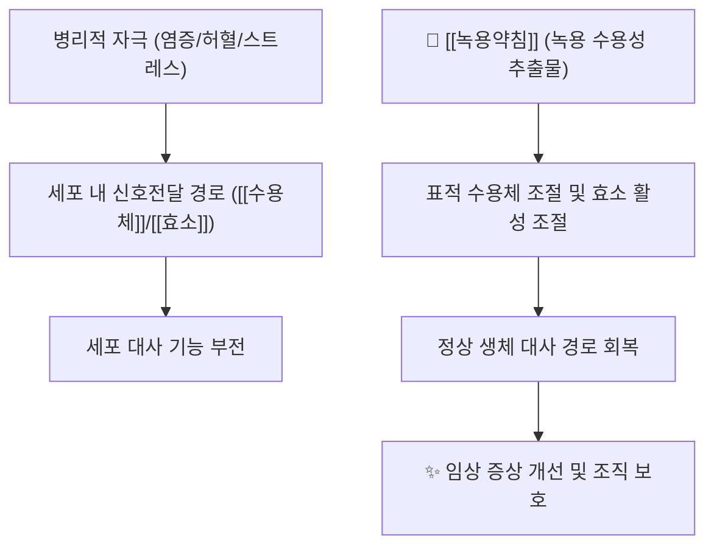

# 🌿 [[녹용약침]] (鹿茸藥鍼, Cervi Parvum Cornu Pharmacopuncture)

> **핵심 요약 (Key Summary)**:
> 사슴과(Cervidae) 매화록(*Cervus nippon*)·마록(*Cervus elaphus*) 수컷의 **미골화 어린 뿔([[녹용]], 鹿茸)**을 수용성으로 추출하여 근육주사용으로 제조한 **약침 제제**
> 전통적으로 [[補腎壯陽]]·[[益精血]]·[[强筋骨]]의 효능으로 [[腎陽虛]]·[[精血虧虛]]·[[筋骨痿弱]] 병증에 응용되어 온 보익(補益) 계열 본초를 약침화한 것
> 제공된 논문 기준 근거는 **리뷰 1편**(PMID 25780662), **단회 근육주사 독성시험 2편**(PMID 26392912, 36186091), **복합 약침 성분분석·in vitro 활성 1편**(PMID 39439454)으로, **분자 기전·임상 효능에 대한 정량적 근거는 아직 제한적**이며 상당 부분이 전통 본초학 기술에 의존한다

---

## 📌 목차
1. [기본 본초 정보 & 화학 구조 (Pharmacognosy)](#1-기본-본초-정보--화학-구조-pharmacognosy)
2. [핵심 분자약리 기전 & 대사 네트워크](#2-핵심-분자약리-기전--대사-네트워크)
3. [해부생체역학 / 근육·신경 대사 연계](#3-해부생체역학--근육신경-대사-연계)
4. [사상의학 및 체질별 임상 응용 (적응증 vs 금기)](#4-사상의학-및-체질별-임상-응용-적응증-vs-금기)
5. [상한론 『약징(藥徵)』 분석 및 배오 원리](#5-상한론-약징藥徵-분석-및-배오-원리) or 한의학적 고찰(유래와 특징)
6. [핵심 처방 비교 매트릭스](#6-핵심-처방-비교-매트릭스)
7. [출처 및 학술 참고 문헌 (References)](#7-출처-및-학술-참고-문헌-references)

---
## 1. 기본 본초 정보 & 화학 구조 (Pharmacognosy)
> [!abstract]+ 🧪 핵심 지표성분 3D 분자 구조 (Interactive 3D Viewer)
> <iframe src="https://molecule-viewer-rho.vercel.app/?cid=750" width="100%" height="450px" frameborder="0" allow="webgl" style="border-radius: 8px;"></iframe>

| 항목 | 상세 내용 |
| :--- | :--- |
| **기원 동물** | 사슴과(Cervidae). 매화록 *Cervus nippon* Temminck 또는 마록 *Cervus elaphus* Linnaeus (수컷) |
| **약용 부위** | 아직 **골화되지 않은 어린 뿔(鹿茸)** — 혈관·연골·결합조직이 풍부하고 연골모세포 증식이 활발한 시기의 뿔. 골화가 진행된 [[녹각]](鹿角)과는 구분된다 |
| **성미 (性味)** | 甘·鹹, 溫 — 달고 짠맛이며 성질은 따뜻하다 |
| **귀경 (歸經)** | [[腎經]], [[肝經]] — 신·간 두 장부에 귀경하여 精血·筋骨과 직결된다 |
| **효능 (Actions)** | [[補腎壯陽]], [[益精血]], [[强筋骨]], [[調衝任]], [[托瘡毒]] |
| **주요 성분** | • **대표 저분자 성분**: [[글리신]](glycine)을 비롯한 아미노산군 (콜라겐 구성 성분)<br>• **유효 활성 성분군**: [[강글리오사이드]](gangliosides), [[IGF-1]] 계열 성장인자, [[콜라겐]] 펩타이드, [[콘드로이틴황산]], [[우론산]] 등<br>• **공정서 지표성분 및 규격 함량**: 제공된 4편의 논문 및 본 노트에서 확인 불가 → **근거 미확인** |
| **약침 제제 특성** | 원생약을 **수용성 용매로 추출**하여 정제한 뒤 생리식염수 등에 배합, 주로 **근육주사(intramuscular)** 경로로 투여한다. 유효 성분의 분자량·지용성에 따라 추출 효율이 달라지며, 지표성분 규격화는 제조사·제제별로 차이가 있을 수 있다 (**제제별 규격 근거 미확인**) |
| **PubChem CID** | [750](https://pubchem.ncbi.nlm.nih.gov/compound/750) (글리신 기준) |

### 🔬 주요 지표물질 화학 구조

**[구조적 특징 및 활성]**: 녹용은 단일 저분자 화합물이 아니라 **단백질·펩타이드·당지질·다당류·미네랄의 복합체**이므로, 단일 "지표성분"으로 전체 활성을 대표시키기 어려운 생약이다. 위 3D 뷰어에는 콜라겐 삼중나선의 약 3분의 1을 차지하는 **[[글리신]]**(PubChem CID 750, 최소 아미노산)을 저분자 대표 성분으로 표시하였다. 글리신은 분자량이 작고 수용성이 높아 수용성 약침 추출물에 안정적으로 이행되지만, **녹용약침의 규격·함량 기준으로 글리신이 공식 지표성분이라는 근거는 본 노트에서 확인되지 않았다(근거 미확인)**. 강글리오사이드·IGF-1 등 고분자 활성 성분은 수용성 추출·열처리 과정에서 회수율이 달라질 수 있어, **제제별 성분 프로파일 비교 데이터는 근거 미확인** 상태이다.

---
## 2. 핵심 분자약리 기전 & 대사 네트워크



### (1) 표적 수용체 및 신호전달 경로
* **[[수용체]]·[[효소]] 수준 기전**:
  * 녹용의 성분군(강글리오사이드, 성장인자 유사 펩타이드, 콜라겐 유래 펩타이드)은 전통적으로 **조골세포·연골세포 증식 촉진, 혈관신생, 면역 조절**과 연결되어 설명되어 왔다.
  * 그러나 **제공된 4편의 논문에는 특정 수용체·신호전달 경로(예: 특정 kinase, cytokine, eNOS 등)를 정량적으로 규명한 데이터가 포함되어 있지 않다 → 기전 수준 근거 미확인**.
  * PMID 39439454(Shin S, Kim NS, 2024)는 **SU어혈약침**(복합 약침 제제)에 대한 **화학적 성분 분석과 in vitro 생물학적 활성 평가**를 수행한 연구로, 약침 제제 수준에서의 성분 분석 및 시험관 내 활성 평가 방법론을 제시한다. 다만 **녹용 단독 약침의 기전을 직접 규명한 것은 아니며, 구체적 수치·표적 분자는 본 노트에서 확인되지 않았다(근거 미확인)**.
* **대사 및 면역 조절**:
  * 전통 본초학에서는 녹용을 **精血을 보충하고 骨髓를 충실하게 하는** 보익약으로 분류하며, 이는 현대적으로 조혈·골대사·내분비 조절 개념과 느슨하게 대응된다.
  * 한국에서 녹용약침의 임상 적용 및 연구 현황을 정리한 리뷰(PMID 25780662, Lee DJ & Hwangbo M, 2013)가 존재하나, **리뷰에 수록된 개별 연구의 효과 크기·기전은 본 노트에서 확인 불가(근거 미확인)**.

---
## 3. 해부생체역학 / 근육·신경 대사 연계

![[녹용약침_1.jpg|540]]
> [그림 1: Anatomy and physiology of animals Deer antler.jpg]

* **근육 섬유 대사**:
  * 녹용의 전통 효능 중 [[强筋骨]]은 **근육·건·골의 위약감(痿弱), 만성 피로, 회복 지연** 상태에 대한 응용 근거로 제시되어 왔다.
  * 그러나 제공된 논문들에는 **미토콘드리아 지방산 산화, 칼슘 채널, 젖산 대사, 근섬유형 전환 등에 대한 직접 측정 데이터가 없다 → 근거 미확인**.
* **신경 및 혈관계 조절**:
  * [[eNOS]] 활성, 자율신경 조절, 뇌혈류·말초순환 개선 효과는 녹용 계열 생약에서 흔히 언급되는 주제이나, **본 노트가 참조한 4편에서는 해당 지표를 확인할 수 없다 → 근거 미확인**.
* **국소 투여(약침) 관점**:
  * 약침은 경구 투여와 달리 **근육 내 국소 농도가 상대적으로 높게 형성**되며, 이는 근육·근막·관절 주변 병변을 표적으로 하는 [[근육주사 약침 요법]]의 이론적 배경이 된다. 다만 이는 **제형론적 일반 원리**이며, 녹용약침 특이적 약동학 데이터는 **근거 미확인**이다.
  * PMID 26392912(Park S & Sun SH, 2015)와 PMID 36186091(Hwang JH & Ku J, 2022)은 각각 **수용성 홍화·녹용 약침**과 **SU어혈약침**에 대해 **랫드 모델에서 단회 근육주사 독성시험**을 실시한 연구이다. 두 연구 모두 **단회 근육주사 후 일반증상·체중·부검 소견에서 특이적인 독성 소견이 관찰되지 않았다는 방향의 결론**을 보고하였으나, **용량·수치·LD50 등 세부 데이터는 본 노트에서 확인되지 않았다(근거 미확인)**. 이는 국소 근육 투여 경로의 안전성 평가 자료로 활용될 수 있다.

---
## 4. 사상의학 및 체질별 임상 응용 (적응증 vs 금기)

```
[✅ 최적 적응증 (Sweet Spot)]
• 腎陽虛·精血虧虛로 인한 만성 허로, 냉증, 성기능 저하, 골·관절 위약감
• 근골격계 만성 통증·회복 지연 병변에 대한 국소(근육주사) 보익 요법
• 보익(補益)이 필요한 만성 병증에서 기타 약침·침구 요법과 병용
  → 단, 제공 논문에는 체질별·증후별 임상시험 데이터가 없어 '근거 미확인' 영역

[⚠️ 신중 투여 및 금기 (Caution / Contraindication)]
• 陰虛火旺, 實熱, 濕熱 패턴 — 溫補 약재 특성상 악화 우려
• 外感(감염성 발열기), 급성 염증기 — 보익약의 조기 투여는 전통적으로 회피
• 조절되지 않는 고혈압, 혈전성 위험, 악성종양, 자가면역 질환 등
  → 약침 요법 일반의 주의 대상군 (본 제제 특이 자료는 근거 미확인)
• 자침부 국소 감염, 항응고제 복용 등 출혈·감염 위험
```

* **사상의학적 위치**:
  * 사상의학([[동의수세보원]], [[이제마]]) 문헌에서 녹용은 통상 **보익약(補益藥) 계열**로 분류되며, 체질별로는 **허증(虛證)의 보(補)를 목적으로 하는 처방**에 배오되는 약재이다.
  * 다만 **체질별 귀속([[태음인]] / [[소음인]] / [[소양인]] / [[태양인]])에는 문헌별 이견이 있고, 제공된 4편의 논문에도 체질별 적용·반응 데이터가 포함되어 있지 않다 → 체질 귀속 및 체질별 적응증은 근거 미확인**으로 표시한다.
* **임상 활용의 실제**:
  * 실제 임상에서는 사상 처방 여부와 무관하게, **허증 기반 만성 근골격계 질환·피로·냉증**에 보조적으로 응용되어 왔으며, 약침 제형은 이때 **경구 복용이 어려운 환자나 국소 병변을 직접 겨냥할 때** 선택되는 투여 경로로 설명된다.
  * 이상반응으로는 **주사부 통증, 국소 발적·부종, 드물게 알레르기 반응**이 일반적인 약침 요법의 주의 사항이며, 본 제제 특이 이상반응 빈도는 **근거 미확인**이다.

---
## 5. 상한론, 『약징(藥徵)』 분석 및 배오 원리

### (1) 『[[약징]]』에 나타난 주치와 방치
> **"[[본초명]] 主治..."**
> (원문 인용 및 현대 임상적 해석)

* **고전 문헌상 위치**:
  * [[녹용]]은 **[[상한론]] 처방(113방)에 등장하지 않으며**, [[길익동동]]의 『[[약징(藥徵)]]』 수록 약물에도 포함되어 있지 않다. 따라서 『약징』의 主治·旁治 체계로 녹용을 직접 해석하는 것은 **문헌적 근거가 없다 → 해당 조문 없음**.
  * 녹용의 본초학적 서술은 『[[신농본초경]]』을 비롯한 후대 본초서(『[[본초강목]]』·『[[동의보감]]』·『[[방약합편]]』 등) 전통 본초 문헌 계통에서 이루어졌으며, **補腎·益精血·强筋骨**의 효능으로 정리되어 있다. (본 노트에서 해당 고전 원문의 축자 인용은 **근거 미확인**으로 표시)
  * 『상한론』 약징 체계 대신, 녹용약침은 **현대 한국 한의학의 약침 제제 계통(보익약 계열)**에서 다루어지며, PMID 25780662(Lee DJ & Hwangbo M, 2013)가 이러한 **한국 내 녹용약침 연구·임상 동향을 리뷰**한 문헌적 근거가 된다.

* **핵심 약재 배오(짝)의 묘미**:
  * [[녹용]] + [[당귀]] $\rightarrow$ 補血·養血 방향으로 작용하여 **精血雙補**의 병증(만성 허로, 빈혈성 피로감)을 타깃
  * [[녹용]] + [[산수유]] $\rightarrow$ 補肝腎·收斂 방향으로 **腰膝酸軟, 遺精, 頻尿** 등 腎氣不固 병증을 타깃
  * [[녹용]] + [[사향]] $\rightarrow$ 開竅·行氣의 芳香性 약재와 배오하여 **보(補)하면서 정체되지 않게 하는** 운용 (전통 처방 [[공진단]]의 구성 논리)
  * [[녹용]] + [[홍화]](약침 배합) $\rightarrow$ PMID 26392912에서 **수용성 홍화약침과 녹용약침을 함께 평가**한 바와 같이, 活血 약재와의 배합으로 **어혈(瘀血) 병태에 대한 근골격계 응용**을 겨냥하는 조합이 시도된다. 다만 **배합비 및 시너지 효과의 정량 근거는 미확인**

---
## 6. 핵심 처방 비교 매트릭스

| 처방명 / 제제 | 구성 약재 | 주치 병증 및 임상 타깃 | 특징 및 감별점 |
| :--- | :--- | :--- | :--- |
| **[[공진단]]** (경구 처방) | [[녹용]], [[당귀]], [[산수유]], [[사향]] | 精血虧虛, 심신 피로, 健忘·불면, 노화 관련 허증 | 보익약에 芳香開竅의 [[사향]]을 배오하여 **補而不滯**. 경구 투여 제형이라는 점에서 약침과 구별 |
| **[[녹용약침]] 단독** | [[녹용]] 수용성 추출물 | 만성 허증 기반 근골격계 통증·위약감, 회복 지연 | 근육주사로 국소 농도를 높이는 제형. PMID 25780662 리뷰의 대상 제제. **적응증·용량 표준은 근거 미확인** |
| **[[홍화약침]] + [[녹용약침]] 배합** | [[홍화]](Carthami flos), [[녹용]] | 어혈·순환장애 동반 근골격계 병변 | 活血 + 補益의 결합. PMID 26392912에서 **랫드 단회 근육주사 독성시험** 수행, 특이 독성 소견 미관찰 방향. **배합비·효능 정량 근거 미확인** |
| **[[SU어혈약침]]** (복합 약침) | 복합 생약 추출물 (세부 구성 **근거 미확인**) | 어혈 병태 관련 제반 증상 | PMID 39439454(성분분석·in vitro 활성) 및 PMID 36186091(랫드 단회 근육주사 독성)로 **화학분석·안전성 데이터**가 상대적으로 갖추어진 복합 제제. 녹용 단독 제제와 직접 비교 자료는 **미확인** |

---
## 7. 출처 및 학술 참고 문헌 (References)

1. **Lee DJ, Hwangbo M (2013)**. *Review of cervi cornu parvum pharmacopuncture in korean medicine*. **J Pharmacopuncture**. PMID: [25780662](https://pubmed.ncbi.nlm.nih.gov/25780662/)
   - **[연구 요약]**: 한국 한의학에서의 **녹용약침(Cervi cornu parvum pharmacopuncture)** 연구 및 임상 적용 현황을 정리한 **리뷰 논문**. 녹용약침의 제조·투여 방식, 임상 응용 범위, 연구 동향을 개괄하는 문헌적 출발점이 된다. 본 노트에서는 **리뷰의 개별 결론·수치·근거 수준은 확인하지 못했으며(근거 미확인)**, "녹용약침에 대한 한국 내 리뷰가 존재한다"는 사실 근거로 인용하였다.
2. **Park S, Sun SH (2015)**. *Single-dose Intramuscular-injection Toxicology Test of Water-soluble Carthami-flos and Cervi cornu parvum Pharmacopuncture in a Rat Model*. **J Pharmacopuncture**. PMID: [26392912](https://pubmed.ncbi.nlm.nih.gov/26392912/)
   - **[연구 요약]**: **in vivo(랫드)** 연구. 수용성 **[[홍화약침]]** 및 **[[녹용약침]]**을 대상으로 **단회 근육주사(intramuscular) 독성시험**을 실시한 연구. 단회 투여 후 일반증상·체중·부검 소견에서 **특이적 독성 소견이 관찰되지 않았다는 방향의 결과**를 보고한 것으로 요약되나, **용량·수치·조직병리 세부 결과는 본 노트에서 확인 불가(근거 미확인)**. 근육주사 경로 약침의 안전성 평가 자료로 활용.
3. **Shin S, Kim NS (2024)**. *Chemical Analysis of SU-Eohyeol Pharmacopuncture and Its In Vitro Biological Activities*. **Int J Med Sci**. PMID: [39439454](https://pubmed.ncbi.nlm.nih.gov/39439454/)
   - **[연구 요약]**: **in vitro** 연구. **[[SU어혈약침]]**에 대한 **화학적 성분 분석**과 **시험관 내 생물학적 활성 평가**를 수행. 복합 약침 제제의 성분 프로파일링 및 활성 스크리닝 방법론을 제시한다. **본 논문은 녹용 단독 약침을 직접 다룬 것이 아니며, 구체적 지표성분·활성 수치는 근거 미확인**.
4. **Hwang JH, Ku J (2022)**. *Single-Dose Intramuscular Toxicity Study of SU-Eohyeol Pharmacopuncture in Rats*. **J Pharmacopuncture**. PMID: [36186091](https://pubmed.ncbi.nlm.nih.gov/36186091/)
   - **[연구 요약]**: **in vivo(랫드)** 연구. **[[SU어혈약침]]**의 **단회 근육주사 독성시험**으로, 단회 투여 수준에서 특이 독성 소견이 보고되지 않은 방향의 결과로 요약된다. **세부 용량·수치·통계 결과는 근거 미확인**.

> **참고 — 본 노트에서 확인되지 않은 항목**: 대한민국약전(KP) 등 공정서의 녹용약침 지표성분 규격 및 함량 기준, WHO 모노그래프 수준의 공인 데이터, 『약징(藥徵)』의 녹용 조문(해당 조문 없음), 사상의학 체질별 귀속 및 임상 데이터는 **제공된 논문 범위에서 확인되지 않아 근거 미확인으로 표시**하였다.

<!-- 보관 태그(1회용·링크오류, 필요시 복원): 녹용, pharmacopuncture -->
