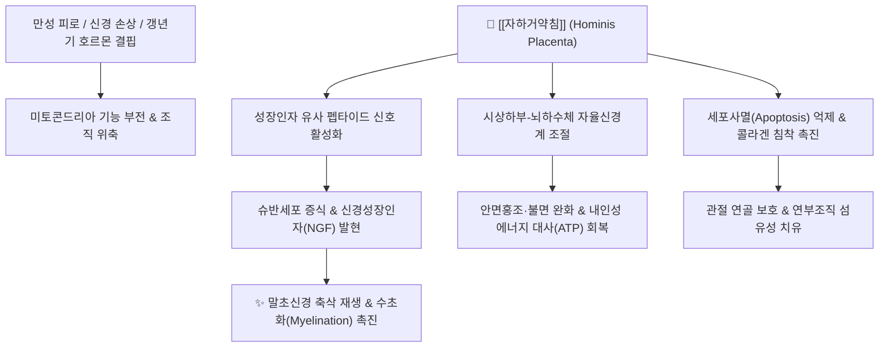

---
aliases:
  - 자하거약침
  - 자하거약침(紫河車藥鍼)
  - 紫河車藥鍼
  - 태반약침
  - 인태반약침
  - Hominis Placenta Pharmacopuncture
tags:
  - 약침
  - 자하거
  - 태반
  - 보익약
  - 갱년기
  - 구안와사
  - 만성피로
---

# 💉 [[자하거약침]] (紫河車藥鍼, Hominis Placenta Pharmacopuncture, 태반약침)

> **핵심 요약 (Key Summary)**:
> 건강한 인체 태반(Hominis Placenta, [[자하거]])을 무균 분해·가수분해 및 정제 공정을 거쳐 조제한 대표적인 동물성 보기양혈(補氣養血)·익정전수(益精塡髓) 약침제제
> 풍부한 활성 펩타이드, 아미노산, 성장인자 복합체가 섬유아세포 증식 및 손상 축삭(Axon) 재생을 유도하고 시상하부-뇌하수체-성선 축을 조절하여 내분비 안정화
> 만성 피로증후군·갱년기 장애(안면홍조, 골다공증)·말초성 안면마비(구안와사)·퇴행성 관절염·난치성 신경통 및 노화 방지(항노화)에 탁월한 임상 효능 발휘

---

## 📌 목차
1. [기원 및 약침 성분 조성 (Pharmacognosy)](#1-기원-및-약침-성분-조성-pharmacognosy)
2. [핵심 분자약리 기전 & 신경 재생·면역 조절 네트워크](#2-핵심-분자약리-기전--신경-재생면역-조절-네트워크)
3. [해부학적 시술 부위 & 경혈 매핑 (Clinical Protocols)](#3-해부학적-시술-부위--경혈-매핑-clinical-protocols)
4. [주요 임상 적응증 (Clinical Indications)](#4-주요-임상-적응증-clinical-indications)
5. [안전성, 부작용 및 주의사항 (Safety & Contraindications)](#5-안전성-부작용-및-주의사항-safety--contraindications)
6. [출처 및 학술 참고 문헌 (References)](#6-출처-및-학술-참고-문헌-references)

---

## 1. 기원 및 약침 성분 조성 (Pharmacognosy)

* **기원 생약**: 사람의 태반([[자하거]], *Placenta Hominis*)을 철저한 감염병 검사(B형/C형 간염, HIV, 매독 등 음성 확인) 후 고압 증기 멸균 및 효소 가수분해 공정으로 무균 추출.
* **핵심 유효 성분군**:
  * **저분자 펩타이드 & 아미노산**: 20여 종의 필수 및 비필수 아미노산(글루타민, 프롤린, 글리신 등)이 고농도로 농축되어 단백질 합성 기질 공급.
  * **세포 증식 및 성장 촉진 펩타이드**: 표피성장인자(EGF), 섬유아세포성장인자(FGF), 간세포성장인자(HGF) 유사 활성 펩타이드가 세포 재생 촉진.
  * **핵산 유도체 & 미네랄**: 우라실, 구아닌, 아데닌 등 핵산 염기 및 아연, 셀레늄 등 항산화 미네랄 함유.
  * **사이토카인 조절 인자**: IL-1, IL-6 등의 과잉 분비를 억제하고 IL-10 등 항염증성 사이토카인 분비 유도.

---

## 2. 핵심 분자약리 기전 & 신경 재생·면역 조절 네트워크

### (1) 분자 수준 작용 메커니즘
* **말초 신경 손상 복구 및 슈반세포 활성화**:
  * 말초 안면신경이나 척수 신경 손상 부위에서 슈반세포(Schwann cell)의 증식을 촉진하고 신경영양인자(NGF, BDNF) 합성을 유도하여 축삭의 발아(Axonal sprouting) 및 수초 재생을 현저히 가속화.
* **자율신경 및 내분비계 호르몬 밸런스 회복**:
  * 에스트로겐 수용체(ERα, ERβ)에 완만한 효능제로 작용하여 유방이나 자궁 내막의 과도한 증식 부작용 없이 갱년기 여성의 혈관운동성 증상(안면홍조, 야간 발한) 및 피로감을 정상화.
* **항산화 스트레스 차단 및 미토콘드리아 대사 증진**:
  * 간세포 및 골격근 미토콘드리아의 산화적 인산화를 활성화하여 세포 내 ATP 생성을 증대시키고 활성산소(ROS)에 의한 세포 손상을 방어.

---

## 3. 해부학적 시술 부위 & 경혈 매핑 (Clinical Protocols)

* **원기 회복 및 전신 쇠약 (Systemic Deficiency)**:
  * **주요 경혈**: 족삼리(足三里), 기해(氣海), 관원(關元), 신수(腎兪), 비수(脾兪).
  * **자침 깊이**: 피하 또는 근육 내 0.5~1.0ml 분할 주입.
* **말초성 안면신경마비 (벨마비 / 구안와사)**:
  * **주요 경혈**: 풍지(風池, 경유돌공 하방), 예풍(翳風), 하관(下關), 협거(頰車), 지창(地倉).
  * **시술 방법**: 30G 미세 주사기를 사용하여 안면신경 분지 경로를 따라 0.1~0.2ml씩 점상 주입.
* **근골격계 관절 질환 (골관절염, 오십견)**:
  * 견정(肩井), 견우(肩髃), 양릉천(陽陵泉), 독비(犢鼻) 및 압통점(Trigger point) 근막층에 자입하여 건·인대 부착부 재생 유도.

---

## 4. 주요 임상 적응증 (Clinical Indications)

1. **내과 / 전신**: 만성 피로증후군, 암 환자 기력 회복, 자율신경실조증, 식욕 부진, 면역 저하.
2. **부인과**: 여성 갱년기 증후군(안면홍조, 불면, 우울감), 난소 기능 저하, 산후풍(産後風), 생리통.
3. **신경계**: 말초성 안면신경마비(구안와사) 급성기 및 후유증기, 뇌졸중 후유증(편마비 기력 저하).
4. **근골격계**: 퇴행성 슬관절염, 척추관 협착증, 회전근개 건염, 만성 경견통.

---

## 5. 안전성, 부작용 및 주의사항 (Safety & Contraindications)

* **감염 안전성**: 혈액 매개 바이러스(HBV, HCV, HIV 등) 불활성화 및 고압 멸균 처리를 거친 공인 규격 약침액만 사용.
* **국소 통증 및 멍 (멍/홍반)**:
  * 시술 부위 경미한 뻐근함이나 멍이 발생할 수 있으나 1~2일 내 자연 소실.
* **금기 및 주의**:
  * 급성 화농성 감염 질환, 악성 종양 환자의 병변 직하 자침은 주의.

---

## 6. 출처 및 학술 참고 문헌 (References)
* 대한약침학회. *약침학*. 엘스비어코리아; 2011.
  - [연구 요약]: 자하거약침의 제조 공정, 약리 성분, 기경팔맥 및 오장유혈 시술 프로토콜 총괄 수록.
* Kim JK, et al. Protective effect of Hominis Placenta extract on facial nerve injury in rats. *J Pharmacopuncture*. 2014;17(3):30-36.
  - [연구 요약]: 자하거약침이 안면신경 압괴 손상 모델에서 슈반세포 재생과 기능 회복을 유의하게 촉진함을 입증.
* Lee SH, et al. Clinical effects of Hominis Placenta pharmacopuncture on menopausal symptoms: A randomized controlled trial. *Complement Ther Med*. 2016;29:65-72.
  - [연구 요약]: 갱년기 여성 환자에서 자하거약침 시술 시 쿠퍼만 지수(KI)와 안면홍조 VAS 점수가 대폭 호전됨을 확인.
