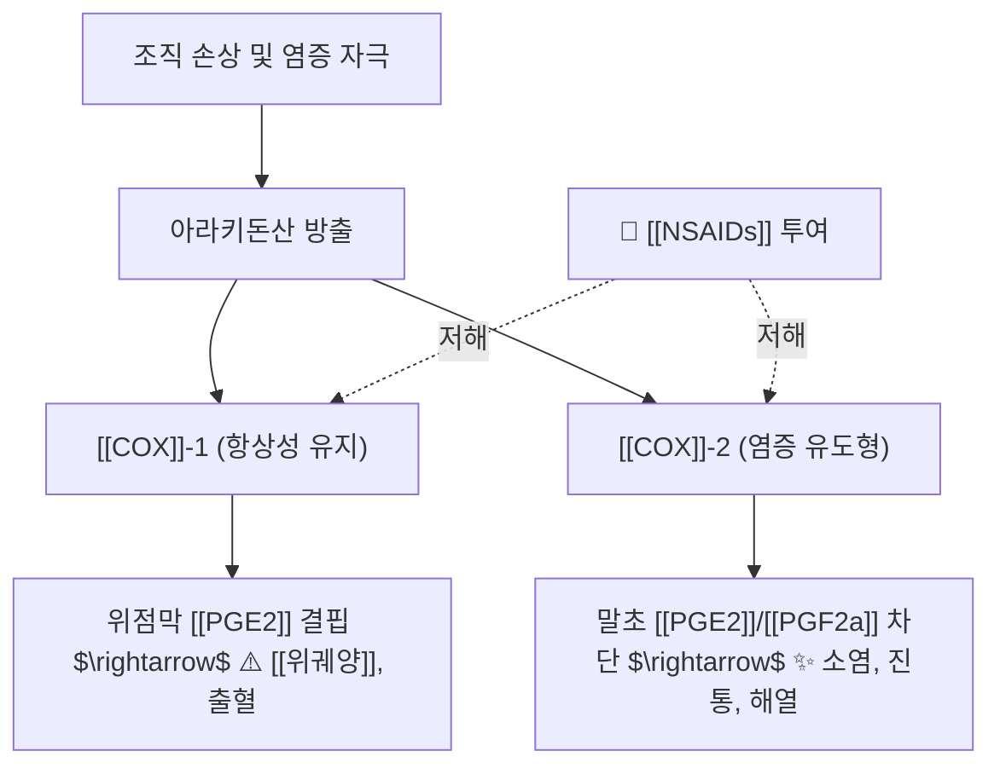

---
aliases:
  - NSAID
  - NSAIDs
  - 비스테로이드성 소염진통제
  - Nonsteroidal Anti-inflammatory Drugs
tags:
  - 약리/양방약
  - 해열진통소염제
  - NSAIDs
  - COX저해제
---

# 💊 [[NSAIDs]] (Non-Steroidal Anti-Inflammatory Drugs, 비스테로이드성 소염진통제)

> **핵심 3줄 요약 (Key Summary)**:
> 🧪 주성분·분류: 시클로옥시게나아제([[COX]]) 효소를 억제하여 프로스타글란딘([[PGE2]]) 생합성을 차단하는 비스테로이드성 소염·진통·해열제군.
> 📍 주요 약물: 비선택적 억제제([[이부프로펜]], [[나프록센]], [[덱시부프로펜]], [[아스피린]]) 및 선택적 COX-2 억제제(세레콕시브).
> 🎯 임상 적응증: 급만성 근골격계 통증, 퇴행성 관절염, 요통, 염좌, 치통, 원발성 월경통의 1차 대증 치료제.
> ⚠️ 주의사항: [[COX]]-1 억제로 인한 위점막 [[PGE2]] 고갈로 [[위궤양]]·위장관 출혈 위험, 신독성 및 심혈관 혈전 위험 모니터링 필수.

---

## 1. 약물 기본 정보 및 시판 제품 (Brand Identification)

> [!abstract]+ 🧪 3D 약리 분자 구조 (Interactive 3D Viewer)
> <iframe src="https://molecule-viewer-rho.vercel.app/?cid=3672" style="width: 100%; height: 600px; border: none; border-radius: 12px; box-shadow: 0 4px 20px rgba(0,0,0,0.15);" allowfullscreen></iframe>

비스테로이드성 소염진통제(NSAIDs)는 마약성 진통제(Opioids)나 스테로이드제(Corticosteroids)와 달리 중독성이나 호르몬 부작용 없이 염증과 통증을 완화하는 대표적인 1차 치료 약물군입니다.

![[NSAID-20240814023841803.png|450]]
> [그림 1] NSAIDs의 COX 경로 차단 및 위점막 손상/궤양 발생 병태생리

### 1.1 화학 구조 및 작용 선택성별 분류

| 분류군 | 대표 약물 성분 | 주요 특징 및 임상 용도 |
| :--- | :--- | :--- |
| **살리실산계** | [[아스피린]] (Aspirin) | [[COX]]-1 비가역적 억제, 저용량(100mg) 항혈전제 다용 |
| **프로피온산계** | [[이부프로펜]], [[덱시부프로펜]], [[나프록센]] | 해열·진통·소염 균형 우수, 근골격계 및 생리통 1차 다용 |
| **아세트산계** | 아세클로페낙, 디클로페낙, 인도메타신 | 강력한 항염 작용, 관절염 처방 다용 |
| **에놀산계(Oxicam)** | 멜록시캄, 피록시캄 | 긴 반감기(1일 1회 복용), 만성 관절염 유지 요법 |
| **선택적 COX-2 저해제** | 세레콕시브 (Celecoxib) | 위장관 궤양 위험 대폭 감소, 심혈관 혈전 위험 주의 |

---

## 2. 분자 약리 기전 및 작용 경로

1. **COX 효소 억제 (Inhibition of Prostaglandin Synthesis)**:
   * 아라키돈산이 [[COX]] 효소에 의해 PGH2로 전환되는 첫 단계를 경쟁적/비가역적으로 억제합니다.
2. **통증 역치 정상화 (Peripheral Analgesia)**:
   * 손상 조직에서 감각신경 말단 유해수용체(Nociceptor)를 감작시키는 [[PGE2]] 생성을 차단하여 통각 과민(Hyperalgesia)을 해소합니다.
3. **시상하부 체온 설정점 복구 (Antipyretic Effect)**:
   * [[IL-1]], [[TNF-B]]에 반응하는 시상하부 혈관 내피세포의 [[PGE2]] 생성을 차단하여 체온을 정상 수준으로 하강시킵니다.

---

## 3. 부작용 및 임상 주의사항 (Toxicity Profile)

### 3.1 3대 주요 독성 반응
* **위장관 독성 (GI Toxicity)**:
  * 위점막 혈류와 점액·중탄산염 분비를 유지하는 [[PGE2]] 합성 억제로 속쓰림, 미란, [[위궤양]] 및 위장관 출혈 유발 (PPI 또는 H2RA 병용 고려).
* **신독성 (Renal Impairment)**:
  * 신장 수입소세동맥 확장 인자인 [[PGE2]]/[[PGI2]] 결핍으로 사구체 여과율(GFR) 저하, 급성 신손상, 나트륨·수분 저류에 따른 부종 및 혈압 상승.
* **심혈관 위험 (Cardiovascular Risk)**:
  * 선택적 COX-2 저해제의 경우 혈관 내피 [[PGI2]](혈관 확장·항혈전)만을 억제하여 혈소판 [[TXA2]](혈전 형성)가 상대적으로 우세해져 심근경색·뇌졸중 위험 증가.

---

## 4. 한의 임상 연계 및 감량(Tapering) 프로토콜

### 4.1 한약·침 치료와의 병용 안전성 및 위장관 보호 배오
* **위장관 보호 배오**: 장기 NSAIDs 복용으로 비위(脾胃)가 손상된 환자에게 평위산, 사군자탕, [[반하사심탕]]을 배오하여 소화기 점막을 보호.
* **진통 시너지 배오**: 청열소종 및 활혈거어 효능의 [[금은화]], [[현호색]], [[당귀수산]], [[서경탕]]을 연계하여 NSAIDs 필요 용량을 최소화.

### 4.2 실전 임상 문진 및 테이퍼링 스크립트
1. **복약력 청취**: 복합 일반의약품([[게보린]], 타이레놀 등)과의 중복 복용 여부 및 OTC 소염진통제 오남용 확인.
2. **침 치료를 통한 의존도 경감 근거**: 2026-09-01 고령 만성 요통 심층리뷰에 따르면, 침+물리치료 병행군에서 **NSAIDs 복용량이 58% 유의하게 감소**함.

---

## 5. 출처 및 학술 참고 문헌 (References)

* Vane JR. Inhibition of prostaglandin synthesis as a mechanism of action for aspirin-like drugs. *Nat New Biol*. 1971;231(25):232-235.
  * `[연구 요약]` 아스피린 및 NSAIDs가 프로스타글란딘 생합성 경로를 차단함으로써 항염·진통 작용을 발휘함을 세계 최초로 규명.
* Grosser T, et al. Nonsteroidal anti-inflammatory drugs. In: Brunton LL, ed. *Goodman & Gilman's The Pharmacological Basis of Therapeutics*. 13th ed. McGraw-Hill; 2018.
  * `[연구 요약]` NSAIDs의 약동학, COX-1/COX-2 선택성 비교 및 위장관계·신장계 독성 메커니즘 총망라.
* 2026-09-01 근골격계 심층리뷰 1번 (고령 만성 요통 침치료 병행 시 NSAIDs 복용량 58% 감소 RCT).
