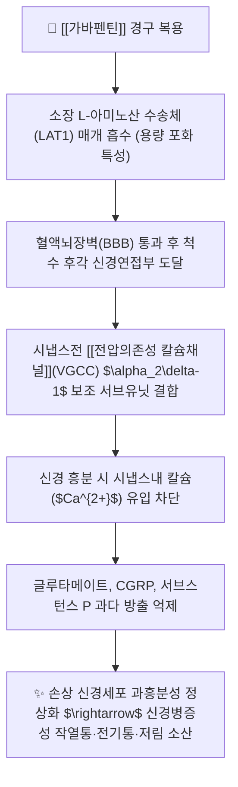

---
aliases:
  - Gabapentin
  - 뉴론틴
  - 가바틴
  - 가바펜
  - Neurontin
  - 가바펜틴캡슐
tags:
  - 약리/양방약
  - 신경병증성통증
  - 가바펜티노이드
  - 항경련제
  - 전문의약품
---

# 💊 [[가바펜틴]] (Gabapentin, 뉴론틴 / Neurontin, N02BF01 / N03AX12)

> **핵심 3줄 요약 (Key Summary)**:
> - 🧪 약물 분류 & 표적: GABA 구조 유사체이지만 GABA 수용체에는 작용하지 않는 1세대 **가바펜티노이드(Gabapentinoid)**, 전압의존성 칼슘 통로(VGCC)의 **$\alpha_2\delta-1$ 보조 서브유닛**에 결합하여 글루타메이트·서브스턴스 P 유리 차단.
> - 🎯 주요 적응증 & 원내외 처방 패턴: **대상포진후신경통(PHN), 당뇨병성 말초신경병증(DPN), 척추관 협착증·추간판 탈출증의 방사통·저림**, 뇌전증 부분발작 보조요법.
> - 🔬 분자약리 기전 & 약동학(PK/PD): 소장 L-아미노산 수송체(LAT1)를 통해 흡수되며 고용량일수록 수송체 포화로 생체이용률이 감소(비선형 약동학), 간 대사를 전혀 거치지 않고 신장으로 100% 원형 배설.
> - ⚠️ 블랙박스 경고 & 주요 부작용: 졸림(Somnolence), 어지럼(Dizziness), 보행실조(Ataxia), 말초 부종, 고령자 낙상 위험 및 급격한 중단 시 반동성 불안·불면.

---

## 📌 목차
1. [기본 약물 정보 & 시판 제품·알약 식별 (Pill Identification)](#1-기본-약물-정보--시판-제품알약-식별-pill-identification)
2. [분자약리학적 작용 기전 (MOA) & 화학 구조](#2-분자약리학적-작용-기전-moa--화학-구조)
3. [약동학적 특성 (ADME: 흡수·분포·대사·배설)](#3-약동학적-특성-adme-흡수분포대사배설)
4. [진료과별 다빈도 처방 패턴 & 임상 적응증 (Sweet Spot vs 금기)](#4-진료과별-다빈도-처방-패턴--임상-적응증-sweet-spot-vs-금기)
5. [약물 상호작용 & 병용 금기 매트릭스](#5-약물-상호작용--병용-금기-매트릭스)
6. [부작용·독성 발현 기전 & 응급 해독 프로토콜](#6-부작용독성-발현-기전--응급-해독-프로토콜)
7. [💡 사용자 진료실 핵심 필기 & 한의 임상 연계·테이퍼링 팁 (원문 보존)](#7--사용자-진료실-핵심-필기--한의-임상-연계테이퍼링-팁-원문-보존)
8. [출처 및 학술 참고 문헌 (References)](#8-출처-및-학술-참고-문헌-references)

---

## 1. 기본 약물 정보 & 시판 제품·알약 식별 (Pill Identification)

| 항목 | 상세 정보 |
| :--- | :--- |
| **일반명 (Generic Name)** | [[가바펜틴]] (Gabapentin, INN/USAN) |
| **약효 분류 (Class)** | 1세대 $\alpha_2\delta$ 리간드 가바펜티노이드계 신경병증성 통증 치료제 / 항뇌전증제 |
| **ATC 코드** | N02BF01 (신경병증성 통증) / N03AX12 (항뇌전증제) |
| **약국 시판 제품 (OTC 일반약)** | 전문의약품(ETC)으로 처방전 필수 (일반약 없음) |
| **병원 처방 의약품 (ETC 전문약)** | • **오리지널 제제**: **뉴론틴캡슐(Neurontin Cap, 비아트리스/화이자 오리지널 100mg, 300mg, 400mg)**, **뉴론틴정(600mg, 800mg)** • **제네릭 제제**: 가바틴캡슐, 가바펜캡슐, 동아가바펜틴정 |
| **상용 용법·용량** | • **신경병증성 통증 초회 적정**: 1일차 300mg 1회, 2일차 300mg bid, 3일차 300mg tid로 점진 증량 • **유지 용량**: 성인 1회 300~600mg씩 1일 3회 식후 복용 (1일 최대 1,800~3,600mg 이하, 1일 3회 분할 필수) |

### 1.1 대표 시판 제품 및 함유 복합제 매핑 (Brand Identification & Combinations)

| 구분 | 대표 제품명 / 브랜드 | 함유 성분 및 1회당 함량 | 제형 및 특징 | 주요 적응증 및 복약 지도 핵심 |
| :--- | :--- | :--- | :--- | :--- |
| **오리지널 단일 캡슐 (ETC)** | [[뉴론틴]] (비아트리스/화이자) | [[가바펜틴]] 단일 (100mg / 300mg / 400mg) | 백색/황색 경질캡슐 | 대상포진후신경통, 당뇨병성 신경통 1차 치료제 |
| **고용량 단일 정제 (ETC)** | 뉴론틴정 600mg/800mg | [[가바펜틴]] (600mg / 800mg) | 필름코팅정 (분할선) | 고용량 필요 환자 복약 정수 감소용 |
| **제네릭 제제 (ETC)** | 가바틴, 가바펜 | [[가바펜틴]] (300mg) | 경질캡슐 | 척추관 협착증 하지 방사통 조절 |

![[가바펜틴_패키지_박스.jpg|400]]
> [그림 1: 전 세계 신경과 및 척추관절 병원에서 신경통 치료 목적으로 널리 처방되는 뉴론틴 300mg 패키지 외형]

![[가바펜틴_캡슐_알약.jpg|400]]
> [그림 2: 가바펜틴 300mg 경질캡슐 성상 및 식별 각인 성상]

---

## 2. 분자약리학적 작용 기전 (MOA) & 화학 구조

![[가바펜틴_화학구조.png|300]]
> [그림 3: 가바펜틴의 2D 평면 화학 분자 구조식 (2-[1-(aminomethyl)cyclohexyl]acetic acid, 분자량 171.24 g/mol, PubChem CID 3446)]

### 1) $\alpha_2\delta-1$ 칼슘 채널 조절 기전
* 가바펜틴은 화학 구조상 GABA의 사이클로헥실 유도체이지만, GABA 수용체에는 작용하지 않습니다.
* 손상된 감각 신경세포의 축삭 및 척수 후각에서 비정상적으로 과발현되는 **전압의존성 칼슘 통로의 $\alpha_2\delta-1$ 서브유닛**에 특이적으로 결합하여, 흥분 신호 전달의 핵심인 세포 내 칼슘 유입을 차단합니다.
* 이를 통해 통각 신경세포의 **중추 감작(Central Sensitization)을 완화**하여 통증을 진정시킵니다.

### 2) 프레가발린과의 약동학적 차이점 (LAT1 수송체 포화)
* 가바펜틴은 소장 상피세포의 능동 수송체인 **LAT1(L-type amino acid transporter)**을 통해서만 흡수됩니다.
* 따라서 투여량이 증가할수록 수송체가 포화되어 **생체이용률이 역으로 감소(300mg 시 60% $\rightarrow$ 1,200mg 시 35%)**하므로, 하루 1~2회 고용량 투여로는 약효를 유지할 수 없으며 **반드시 1일 3회 분할 복용**해야 합니다.

---

## 3. 약동학적 특성 (ADME: 흡수·분포·대사·배설)

| 약동학 파라미터 | 수치 및 임상적 의미 |
| :--- | :--- |
| **생체이용률 (Bioavailability, F)** | **27 ~ 60% (용량 의존적 비선형 포화 흡수, 고용량일수록 흡수율 저하)** |
| **최고혈중농도 도달시간 (Tmax)** | **약 2 ~ 3 시간** (식사와 무관하게 복용 가능) |
| **혈장 단백결합률 (Protein Binding)** | **0%** (혈청 단백 결합 전혀 없음) |
| **간 대사 효소 (Metabolism)** | **0% (간 대사를 전혀 거치지 않으며 간독성 및 CYP 효소 간섭 전무)** |
| **소실 반감기 (Elimination t1/2)** | **약 5 ~ 7 시간** (1일 3회 투약 필요) |
| **주요 배설 경로 (Excretion)** | **100% 신장 소변으로 미변화체 원형 배설** (사구체 여과율에 비례 감량 필수) |

---

## 4. 진료과별 다빈도 처방 패턴 & 임상 적응증 (Sweet Spot vs 금기)

### 1) 주요 진료과별 처방 패턴
* **피부과 / 통증의학과 / 감염내과**:
  * 대상포진(Herpes Zoster) 급성기 신경통 및 대상포진후신경통(PHN) 1차 처방.
* **내분비내과 / 신경과**:
  * 당뇨병성 말초신경병증(DPN)의 발바닥 저림, 화끈거림 조절.
* **척추외과 / 재활의학과**:
  * 척추관 협착증의 신경인성 간헐적 파행 및 디스크 신경근병증.

### 2) 최적 적응증 (Sweet Spot) vs 신중 투여 및 금기
* **[✅ 최적 적응증 (Sweet Spot)]**:
  * **간질환이 있거나 다제 복용 중인 고령 환자**: 간 대사가 없어 약물 상호작용 위험이 없음.
  * **대상포진 후 극심한 피부 통증 및 칼로 베는 듯한 통증**.
* **[⚠️ 신중 투여 및 금기 (Caution / Contraindication)]**:
  * **신부전 환자(CrCl < 60 mL/min)**: 신배설 저하로 혈중 농도 급상승 및 신경독성 위험 (감량 가이드라인 준수).
  * **고령자 기립성 어지럼 및 낙상 주의**.

---

## 5. 약물 상호작용 & 병용 금기 매트릭스

| 병용 약물 / 물질 | 상호작용 기전 | 임상적 위험 및 결과 | 처방 및 티칭 가이드 |
| :--- | :--- | :--- | :--- |
| 제산제 (마그네슘/알루미늄 제산제) | 위장관 내 가바펜틴 킬레이트 결합 | 가바펜틴 흡수율 약 20% 감소 | **제산제 복용 2시간 후에 가바펜틴 복용** |
| 마약성 진통제 (모르핀, [[트라마돌]]) | 중추신경 억제 시너지 | 과도한 졸림, 인지기능 저하, 어지럼 | 병용 시 저용량부터 점진 적정 |
| 활혈통락 한약 ([[황기계지오물탕]], [[오적산]]) | 척추 신경근 미세혈류 촉진 및 감각 회복 | 방사통 조기 개선 및 가바펜틴 감량 | **양약 복용 1시간 후 한약 복용** |

---

## 6. 부작용·독성 발현 기전 & 응급 해독 프로토콜

* **핵심 부작용 프로파일**:
  1. **중추신경계**: 졸림(19%), 어지럼(17%), 보행실조(Ataxia 3~4%), 피로감.
  2. **말초계**: 말초 부종(Peripheral edema), 체중 증가.
  3. **금단 증상**: 급작스런 투약 중단 시 반동성 불안, 불면, 오심, 발작(Seizure) 위험.
* **적정 및 중단 수칙**:
  * 1일 300mg에서 시작하여 3~5일 간격으로 300mg씩 서서히 증량.
  * 중단 시 최소 1주 이상 서서히 감량.

---

## 7. 💡 사용자 진료실 핵심 필기 & 한의 임상 연계·테이퍼링 팁 (원문 보존)

* **진료실 실전 문진 체크리스트 (3대 핵심 질문)**:
  1. **"대상포진을 앓으신 후 처방받으신 약 중에 '뉴론틴'이나 '가바틴'이 있나요?"**:
     * 피부 발진 치유 후에도 지속되는 신경통증 상태 스크리닝.
  2. **"약을 아침, 점심, 저녁 하루 3번 규칙적으로 드시고 계신가요?"**:
     * 가바펜틴의 수송체 포화 및 짧은 반감기 특성상 1일 3회 복용의 중요성 티칭.
  3. **"걸으실 때 휘청거리거나 낮에 쏟아지는 졸림이 있으신가요?"**:
     * 고령 환자의 낙상 위험성을 평가.

* **한의 치료(침·약침·한약) 연계 및 양약 테이퍼링(감량) 전략**:
  1. **대상포진후신경통 및 협착증 한의 치료 배오**:
     * 통증 부위 아시혈 및 협척혈 황련해독탕약침/신바로약침, 사암침법(폐정격, 심정격)을 시술하고 [[황기계지오물탕]], [[소풍활혈탕]]을 처방.
  2. **가바펜틴 감량 프로토콜**:
     * 신경통 NRS가 7 $\rightarrow$ 3 이하로 떨어지면 1일 900mg(300mg tid) $\rightarrow$ 600mg(300mg bid) $\rightarrow$ 300mg(취침 전 1회) $\rightarrow$ 완전 중단으로 단계적 단약 완수.

---

## 8. 출처 및 학술 참고 문헌 (References)

1. **식품의약품안전처 (MFDS)**. 의약품 품목허가사항: 가바펜틴 제제 (2023).
2. **Backonja, M. et al. (1998)**. *Gabapentin for the symptomatic treatment of painful neuropathy in patients with diabetes mellitus: a randomized controlled trial*. **JAMA**, 280(21), 1831-1836.
   - [PubMed (PMID: 9846777)](https://pubmed.ncbi.nlm.nih.gov/9846777/) | [DOI](https://doi.org/10.1001/jama.280.21.1831)
   - **[연구 요약]**: 당뇨병성 신경병증 환자 대상 대규모 무작위 대조 임상시험에서 가바펜틴의 유의미한 통증 경감 및 수면 장애 개선 입증.
3. **Rowbotham, M. et al. (1998)**. *Gabapentin for the treatment of postherpetic neuralgia: a randomized controlled trial*. **JAMA**, 280(21), 1837-1842.
   - [PubMed (PMID: 9846778)](https://pubmed.ncbi.nlm.nih.gov/9846778/) | [DOI](https://doi.org/10.1001/jama.280.21.1837)
   - **[연구 요약]**: 대상포진후신경통(PHN) 환자 대상 가바펜틴의 통증 강도 및 삶의 질 개선 효과 증명.
4. **Backonja, M. & Glanzman, R. L. (2003)**. *Gabapentin dosing for neuropathic pain: evidence from randomized, placebo-controlled clinical trials*. **Clinical Therapeutics**, 25(1), 81-104.
   - [PubMed (PMID: 12637113)](https://pubmed.ncbi.nlm.nih.gov/12637113/) | [DOI](https://doi.org/10.1016/s0149-2918(03)90011-7)
   - **[연구 요약]**: 신경병증성 통증 환자 대상 가바펜틴의 유효 용량 적정(1,800~3,600mg/일) 및 임상적 유효성 근거 고찰.
