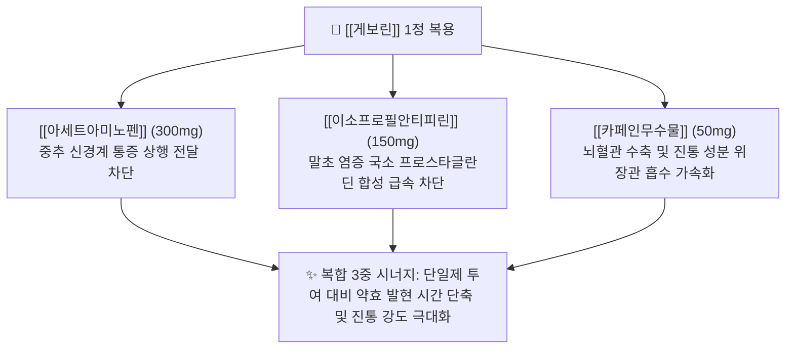

---
aliases:
  - 게보린
  - 게보린정
  - Geworin
  - 한국인의두통약
  - 게보린소프트
  - 게보린릴랙스
  - 게보린브이
tags:
  - 약리/양방약
  - 복합제
  - 일반의약품
  - 복합진통제
  - 해열진통소염제
---

# 💊 [[게보린]] (Geworin Tab, 삼진제약, 다성분 복합 진통제)

> **핵심 3줄 요약 (Key Summary)**:
> 🧪 주성분 배합: [[아세트아미노펜]](300mg) + [[이소프로필안티피린]](IPA 150mg) + [[카페인무수물]](50mg)의 삼중 복합 상승 배합.
> 📍 복합 약리 기전: 중추성 통증 신호 억제([[아세트아미노펜]]) + 말초성 강력 소염진통([[이소프로필안티피린]]) + 뇌혈관 수축 및 진통 흡수 촉진([[카페인무수물]])의 신속 진통 시너지.
> 🎯 임상 적응증: 급성 두통, 치통, 월경통, 신경통, 관절통, 발열 시 신속 대증요법.
> ⚠️ 특정 성분 금기: IPA 성분으로 인한 무과립구증 위험으로 15세 미만 소아·청소년 복용 절대 금기, 카페인 연용에 따른 약물과용두통(MOH) 주의.

---

## 1. 약물 기본 정보 및 시판 제품 (Brand Identification)

> [!abstract]+ 🧪 3D 약리 분자 구조 (Interactive 3D Viewer)
> <iframe src="https://molecule-viewer-rho.vercel.app/?cid=3778" style="width: 100%; height: 600px; border: none; border-radius: 12px; box-shadow: 0 4px 20px rgba(0,0,0,0.15);" allowfullscreen></iframe>

![[게보린_패키지_박스.jpg|350]]
> [그림 1] [[게보린]]의 대표적인 시판 패키지 외형 및 브랜드 디자인

![[게보린_블리스터_알약.jpg|350]]
> [그림 2] [[게보린]] 정제의 PTP 블리스ter 포장 및 식별 성상

![[이소프로필안티피린_화학구조식.png|280]]
> [그림 3] 게보린정의 핵심 소염진통 성분인 [[이소프로필안티피린]](IPA)의 2D 화학 분자 구조식

![[카페인무수물_화학구조식.png|280]]
> [그림 4] 혈관 수축 및 진통 흡수 촉진제 역할을 하는 [[카페인무수물]]의 2D 화학 분자 구조식

### 1.1 게보린정 1정당 복합 성분 구성표

| 구성 성분 (한글/영문) | 1정당 함량 | 약효 분류 | 주된 약리 작용 및 복합 시너지 역할 |
| :--- | :--- | :--- | :--- |
| [[아세트아미노펜]] (Acetaminophen) | 300mg | 비마약성 해열진통제 | 중추성 통증 전달 차단, 시상하부 체온 강하, 위점막 자극 적음 |
| [[이소프로필안티피린]] (IPA, Propyphenazone) | 150mg | 피라졸론계 소염진통제 | 말초 프로스타글란딘 합성 억제, 매우 신속하고 강력한 소염·진통 발휘 |
| [[카페인무수물]] (Anhydrous Caffeine) | 50mg | 중추신경흥분제 / 혈관수축제 | 뇌혈관 수축으로 혈관확장성 두통 완화, 진통 성분의 체내 흡수 가속화 |

---

## 2. 복합 상승 약리 기전 (Combination Mechanism & Synergy)

* **중추 + 말초 이중 경로 차단 (Central & Peripheral Blockade)**:
  * [[아세트아미노펜]]이 중추 신경계의 통증 조절 통로를 안정화하는 동안, [[이소프로필안티피린]]이 말초 조직의 통각수용기 감작을 동시에 차단하여 진통 시너지를 형성합니다.
* **약동학적 신속성 (PK Synergy)**:
  * [[카페인무수물]]이 위장관 혈류를 개선하고 약물 용출을 촉진하여 복용 후 15~30분 이내에 혈중 최고 농도에 도달하도록 유도합니다.

---

## 3. 게보린 브랜드 패밀리 라인업 비교 (Brand Lineup Analysis)

| 제품 라인업명 | 주성분 및 제형 특성 | 차별화 적응증 | 임상 복약 지도 핵심 |
| :--- | :--- | :--- | :--- |
| **게보린정** (오리지널 삼중 복합) | [[아세트아미노펜]] 300mg + [[이소프로필안티피린]] 150mg + [[카페인무수물]] 50mg (삼각형 분홍색 정제) | 급성 두통, 치통, 신경통, 관절통 | 15세 미만 복용 절대 금기, 단기 복용 원칙 |
| **게보린 소프트 연질캡슐** | [[이부프로펜]] 250mg + [[파마브롬]] 25mg (액상 연질캡슐) | 원발성 월경통, 하복부 팽만감 및 부종 | IPA 무함유 안심 설계, 생리 시작 직전부터 복용 |
| **게보린 릴랙스 연질캡슐** | [[아세트아미노펜]] 300mg + [[클로르족사존]] 200mg + [[카페인무수물]] 50mg (액상 연질캡슐) | 근막통증증후군, 경추견비통, 담 결림, 근육 경련 | 근이완제 복합, 복용 후 졸림 및 진정 작용 주의 |
| **게보린 브이정** | [[플루르비프로펜]] 8.75mg (트로키/정제) | 인후염, 목 통증 및 부종 | 국소 소염진통 구강 용해제 |

---

## 4. 복합제 특이 위험성 및 특정 성분 금기 (Black Box & Red Flags)

### 4.1 이소프로필안티피린(IPA) 관련 혈액학적 경고
* **15세 미만 소아·청소년 복용 절대 금기**: 소아 복용 시 조혈 기능 장애 및 중증 대사 장애 위험으로 법적 투여 금기.
* **무과립구증(Agranulocytosis) 위험**: 극히 드물게 골수 억제로 인한 백혈구 급감 부작용이 보고되므로, 복용 중 고열, 오한, 인후통, 잦은 감염 발생 시 즉시 복용 중단 및 혈액 검사 시행.

### 4.2 카페인 유발 약물과용두통(MOH) 및 의존성
* **약물과용두통(Medication Overuse Headache)**: 만성 두통 환자가 게보린을 주 3일 이상 지속 복용 시, 카페인 금단 및 진통제 내성으로 인한 반동성 두통이 발생하므로 **월 10일 이하, 주 2일 이내 복용 원칙** 준수.

---

## 5. 한의학적 복합 처방 배오 비교 및 테이퍼링 프로토콜 (Integrative Medicine)

### 5.1 한방 군신좌사(君臣佐使) 배오 원리와의 비교

게보린의 다성분 복합 상승 설계는 한의학의 **군신좌사(君臣佐使)** 두통 처방 배오 원리와 매우 유사한 구조를 가집니다.

| 양방 복합제 구성 | 한의 대응 본초 | 한의학적 배오 역할 및 기전 연계 |
| :--- | :--- | :--- |
| **중추성 진통 성분** ([[아세트아미노펜]]) | [[천궁]], [[백지]] | 군약(君藥): 두면부 기혈 순환을 통락시키고 풍열 두통 소산 |
| **말초성 소염 성분** ([[이소프로필안티피린]]) | [[황금]], [[작약]] | 신약(臣藥): 염증성 열감을 끄고 경련성 근막 긴장을 완화 |
| **혈관 수축·인경 성분** ([[카페인무수물]]) | [[세신]], [[감초]] | 좌사약(佐使藥): 미세순환을 촉진하고 제반 약성을 두부로 인경(引經) |

### 5.2 진료실 실전 문진 및 양약 감량(테이퍼링) 가이드
1. **습관적 복용력 청취**: 두통 환자 내원 시 "게보린이나 펜잘을 일주일에 며칠 드시는지"를 반드시 확인하여 약물과용두통 감별.
2. **단계적 한의 치료 전환**:
   * **1단계**: 게보린 복용 빈도를 주 1~2회로 제한하고 풍지, 태양, 백회, 천주, 합곡 혈위 침·약침 시술.
   * **2단계**: [[조등산]](간양상항 두통), [[청상견통탕]](풍열 담탁 두통), [[천궁차조산]](풍한 두통)을 투여하여 양약 완전 중단 유도.

---

## 6. 출처 및 학술 참고 문헌 (References)

* 삼진제약 게보린정 공식 의약품 허가사항 및 제품 설명서.
* 식품의약품안전처 의약품안전나라 - 이소프로필안티피린 제제 안전성 서한 (2011).
* Diener, H. C. et al. (2005). The fixed combination of acetylsalicylic acid, paracetamol and caffeine is more effective than single substances and dual combination for the treatment of headache: a multicentre, randomized, double-blind, single-dose, placebo-controlled parallel group study. *Cephalalgia*, 25(10), 776-787.
  * [PubMed (PMID: 16162254)](https://pubmed.ncbi.nlm.nih.gov/16162254/) | [DOI](https://doi.org/10.1111/j.1468-2982.2005.00948.x)
  * `[연구 요약]` 아세트아미노펜과 소염진통제, 카페인의 고정용량 복합제가 단일제 대비 통증 완화 시간 단축 및 진통 강도에서 우월함을 입증한 대규모 무작위 대조 임상시험.
* Ibrahim, H. et al. (2021). Simultaneous Determination of Paracetamol, Propyphenazone and Caffeine in Presence of Paracetamol Impurities Using Dual-Mode Gradient HPLC and TLC Densitometry Methods. *Journal of Chromatographic Science*, 59(2), 140-147.
  * [PubMed (PMID: 33221830)](https://pubmed.ncbi.nlm.nih.gov/33221830/) | [DOI](https://doi.org/10.1093/chromsci/bmaa088)
  * `[연구 요약]` 아세트아미노펜, 이소프로필안티피린(propyphenazone), 카페인 3종 복합 제형의 동시 정량 분석 및 제제 안정성 검증.
