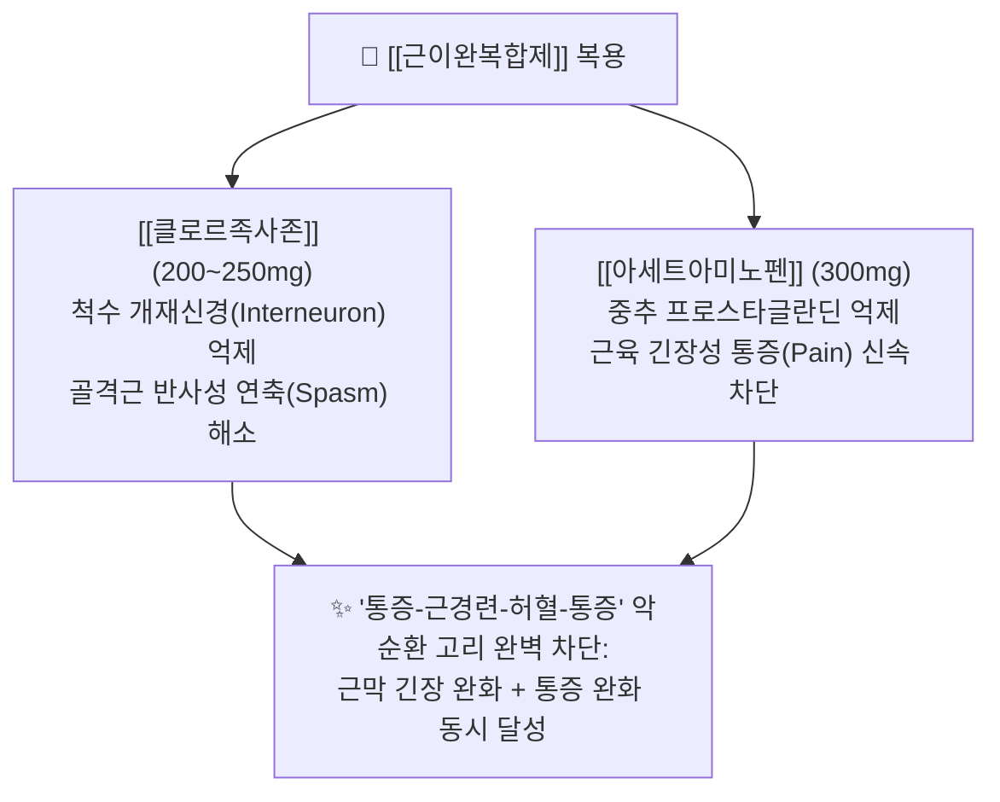

---
aliases:
  - 근이완복합제
  - 게보린릴랙스
  - 렉스펜
  - 렉스펜정
  - 아세트아미노펜클로르족사존
  - 담결림약
  - 클로르족사존복합제
  - 아세파존
tags:
  - 약리/양방약
  - 복합제
  - 일반의약품
  - 근이완제
  - 해열진통제
  - 근골격계
---

# 💊 [[근이완복합제]] (Muscle Relaxant Combinations, 게보린릴랙스 / 렉스펜)

> **핵심 3줄 요약 (Key Summary)**:
> 🧪 주성분 배합: [[클로르족사존]](Chlorzoxazone 200mg~250mg, 중추성 근이완) + [[아세트아미노펜]](300mg, 해열진통)의 근육 경련·통증 동시 제어 복합 일반의약품.
> 📍 복합 약리 기전: 척수 반사궁 억제를 통한 골격근 연축 해소([[클로르족사존]])와 중추 통각 전달 차단([[아세트아미노펜]])의 결합으로 '통증-연축-통증(Pain-Spasm-Pain)' 악순환 고리를 신속히 차단.
> 🎯 임상 적응증: **급성 담 결림(근막통증증후군), 낙침(경추부 급성 염좌), 요추 염좌, 어깨 뭉침, 근육 경련**.
> ⚠️ 특정 성분 금기: 클로르족사존의 중추 억제에 따른 졸림·무기력감(운전 주의), 음주 시 간독성 급증, 소변이 적갈색으로 변하는 대사 반응 안내.

---

## 1. 약물 기본 정보 및 시판 제품 (Brand Identification)

> [!abstract]+ 🧪 3D 약리 분자 구조 (Interactive 3D Viewer)
> <iframe src="https://molecule-viewer-rho.vercel.app/?cid=3294" style="width: 100%; height: 600px; border: none; border-radius: 12px; box-shadow: 0 4px 20px rgba(0,0,0,0.15);" allowfullscreen></iframe>

![[클로르족사존_패키지_박스.jpg|350]]
> [그림 1] 중추성 근이완제 및 복합 진통제 시판 패키지 외형

![[클로르족사존_블리스터_알약.jpg|350]]
> [그림 2] 근이완 복합 정제의 PTP 블리스터 포장 및 식별 성상

![[클로르족사존_화학구조.png|280]]
> [그림 3] 척수 다발 신경반사를 억제하여 골격근을 이완시키는 [[클로르족사존]](Chlorzoxazone)의 2D 화학 분자 구조식

![[아세트아미노펜_화학구조식.png|280]]
> [그림 4] 근육통과 염증성 뻐근함을 경감시키는 [[아세트아미노펜]]의 2D 화학 분자 구조식

### 1.1 대표 근이완 복합제 1정/1캡슐당 성분 구성표

| 구성 성분 (한글/영문) | 1회당 함량 | 약효 분류 | 주된 약리 작용 및 복합 시너지 역할 |
| :--- | :--- | :--- | :--- |
| [[클로르족사존]] (Chlorzoxazone) | 200mg ~ 250mg | 중추성 골격근이완제 | 척수 및 뇌간 피질하 신경세포 억제, 비정상적 다냅스 반사궁 차단으로 근육 경직 완화 |
| [[아세트아미노펜]] (Acetaminophen) | 300mg | 비마약성 해열진통제 | 중추 통증 역치 상승, 근육 연축으로 초래된 국소 허혈성 통증 신호 차단 |
| [[카페인무수물]] (일부 복합제) | 50mg | 중추신경흥분제 | 근이완제로 인한 졸림 완충, 혈류 개선 및 유효 성분의 생체 흡수율 촉진 |

---

## 2. 복합 상승 약리 기전 (Combination Mechanism & Synergy)

* **통증-연축 악순환 고리 차단 (Breaking the Pain-Spasm-Pain Cycle)**:
  * 외상이나 불량한 자세로 골격근이 손상되면 척수 반사로 인해 지속적인 근경련이 유발되고, 이는 혈류 저하와 허혈성 통증 물질 축적으로 이어져 통증을 더욱 증폭시킵니다.
  * [[클로르족사존]]은 척수의 다발 신경 반사(Polysynaptic reflex)를 선택적으로 억제하여 단단하게 뭉친 근육을 물리적으로 풀어냅니다.
  * [[아세트아미노펜]]은 감작된 통각 수용체의 상행 통증 신호를 차단하여 환자가 근육을 편안하게 움직일 수 있도록 돕습니다.

---

## 3. 약국 OTC 근이완 복합제 브랜드 라인업 비교 (Brand Lineup Analysis)

| 제품 라인업명 | 주성분 및 제형 특성 | 차별화 적응증 | 임상 복약 지도 핵심 |
| :--- | :--- | :--- | :--- |
| **렉스펜정 / 크로아존정** | [[클로르족사존]] 200mg + [[아세트아미노펜]] 300mg (정제) | 급성 담 결림, 낙침, 허리 삐끗함 | 1회 1~2정 1일 2~3회 식후 복용 |
| **게보린릴랙스 연질캡슐** | [[클로르족사존]] 200mg + [[아세트아미노펜]] 300mg + [[카페인무수물]] 50mg | 현대인의 어깨 결림, 만성 근육통 | 카페인 첨가로 졸림 완충, 액상으로 빠른 흡수 |
| **아세파존정** | [[클로르족사존]] 250mg + [[아세트아미노펜]] 300mg (고함량 정제) | 중증 근육 강직 및 척추 염좌 | 클로르족사존 고용량 배합으로 강력한 진정 이완 |

---

## 4. 복합제 특이 위험성 및 특정 성분 금기 (Black Box & Red Flags)

### 4.1 중추신경계 진정 및 졸림 위험
* **진정 및 무기력감**: 중추 신경 억제 작용으로 인해 전신 나른함, 두통, 졸림, 집중력 저하가 흔히 발생하므로 복용 후 운전이나 정밀 기계 조작을 절대 금해야 합니다.
* **알코올 병용 시 치명적 간독성**: 음주 상태에서 복용 시 중추 진정 억제가 과도해져 호흡 억제 및 중증 간세포 독성이 유발되므로 복약 기간 중 금주가 필수적입니다.

### 4.2 대사물 관련 소변 착색 및 간장애 경고
* **소변 색조 변화**: 클로르족사존 페놀성 대사물로 인해 소변 색깔이 주황색이나 적갈색으로 변할 수 있으나, 이는 약물 대사 배설에 따른 무해한 현상임을 사전 안내합니다.
* **간독성 모니터링**: 드물게 특이체질성 간염이나 황달이 발생할 수 있으므로, 만성 피로, 소양증, 식욕 부진 증상이 나타나면 즉시 투약을 중단해야 합니다.

---

## 5. 한의학적 복합 처방 배오 비교 및 테이퍼링 프로토콜 (Integrative Medicine)

### 5.1 한방 군신좌사(君臣佐使) 배오 원리와의 비교

근이완복합제의 '해기서근(解肌舒筋) + 통락지통(通絡止痛)' 설계는 한의학 담 결림 명방인 [[갈근탕]] 및 [[작약감초탕]]의 배오 원리와 정확히 부합합니다.

| 양방 복합제 구성 | 한의 대응 본초 | 한의학적 배오 역할 및 기전 연계 |
| :--- | :--- | :--- |
| **중추성 근이완 성분** ([[클로르족사존]]) | [[갈근]], [[작약]], [[강활]] | 군약(君藥): 해기서근(解肌舒筋), 경결된 승모근·척추기립근 긴장과 연축을 이완 |
| **중추성 진통 성분** ([[아세트아미노펜]]) | [[백지]], [[천궁]], [[현호색]] | 신약(臣藥): 활혈지통(活血止痛), 국소 미세순환을 개선하고 염증성 통증 차단 |
| **흡수 촉진 및 순환 성분** | [[계지]], [[감초]], [[생강]] | 좌사약(佐使藥): 영위(營衛)를 조화롭게 하고 경맥을 소통시켜 제반 약성 촉진 |

### 5.2 진료실 실전 문진 및 양약 감량(테이퍼링) 가이드
1. **약국 OTC 담 결림약 자가 복용력 문진**:
   * "목이나 어깨가 결려 약국에서 근육이완제(녹색 알약이나 캡슐)를 사서 드신 적이 있는지", "약을 드시고 많이 졸리거나 멍하지 않으신지"를 확인합니다.
2. **한의 침구 및 사혈 요법 병용 시술**:
   * 승모근, 견갑거근, 능형근의 통증 유발점(TrP) 및 아시혈에 침·전침 치료를 시행하고, 습부항(사혈 요법)을 병행하여 국소 울혈을 사혈하면 근이완복합제 복용 없이도 즉각적인 가동역(ROM) 회복이 가능합니다.
3. **한방 처방으로의 전환 프로토콜**:
   * **경항견비통(낙침·담 결림)**: 풍한습으로 인한 급성 목·어깨 경결에는 [[갈근탕]] 또는 [[서경탕]]을 투여합니다.
   * **근육 경련 및 연축(쥐 남)**: 장딴지나 허리의 급격한 비복근/기립근 경련에는 [[작약감초탕]]을 처방하여 안전하게 양약을 대체합니다.

---

## 6. 출처 및 학술 참고 문헌 (References)

* 식품의약품안전처 의약품안전나라 - 아세트아미노펜/클로르족사존 복합제 허가사항.
* Ravisankar, S. et al. (1998). Reversed-phase HPLC method for the estimation of acetaminophen, ibuprofen and chlorzoxazone in formulations. *Talanta*, 46(6), 1577-1581.
  * [PubMed (PMID: 18967290)](https://pubmed.ncbi.nlm.nih.gov/18967290/) | [DOI](https://doi.org/10.1016/s0039-9140(98)00043-5)
  * `[연구 요약]` 아세트아미노펜 및 클로르족사존 복합 제제의 동시 정량 분석 및 유효 성분 용출 안전성 규명.
* Chatterjee, P. K. et al. (1989). Simultaneous determination of chlorzoxazone and acetaminophen in combined dosage forms by an absorbance ratio technique and difference spectrophotometry. *Journal of Pharmaceutical and Biomedical Analysis*, 7(6), 693-698.
  * [PubMed (PMID: 2490773)](https://pubmed.ncbi.nlm.nih.gov/2490773/) | [DOI](https://doi.org/10.1016/0731-7085(89)80113-x)
  * `[연구 요약]` 클로르족사존과 아세트아미노펜 복합 제형의 흡광도차 분광분석을 통한 성분 배합비 및 제제 균일성 증명.
