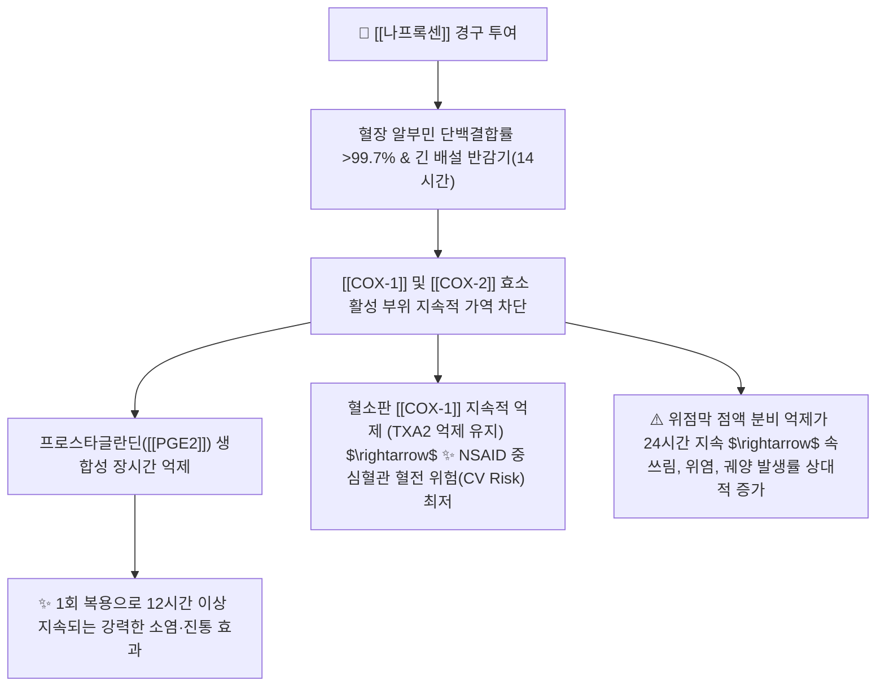
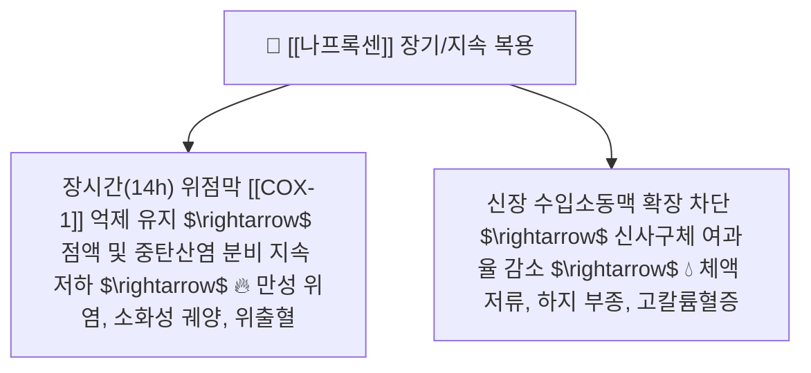

---
aliases:
  - Naproxen
  - 탁센
  - 낙센
  - 아나프록스
  - 나프록센나트륨
  - NaproxenSodium
  - Aleve
tags:
  - 약리/양방약
  - 해열진통소염제
  - NSAIDs
  - 장시간형
---

# 💊 [[나프록센]] (Naproxen, 탁센 / 낙센 / 아나프록스, M01AE02)

> **핵심 3줄 요약 (Key Summary)**:
> - 🧪 약물 분류 & 표적: 프로피온산(Propionic acid) 유도체 계열의 대표적인 **긴 반감기(12~17시간)** 비선택적 NSAID, [[COX-1]] 및 [[COX-2]] 가역적 동시 억제, 프로스타글란딘([[PGE2]]) 합성 차단.
> - 🎯 주요 적응증 & 원내외 처방 패턴: 급성 통풍 발작, 편두통 발작, 퇴행성 골관절염, 강직성 척추염, 치통, 중등도 이상의 근골격계 통증 (1일 2회 복용으로 24시간 지속 진통 효과).
> - 🔬 분자약리 기전 & 약동학(PK/PD): 생체이용률 95% 이상, 단백결합률 99.7%, 나프록센나트륨 제형(탁센 등)은 위장관 흡수가 빨라 복용 후 1~2시간 내 최고혈중농도 도달.
> - ⚠️ 블랙박스 경고 & 주요 부작용: 다른 NSAIDs 대비 **심혈관계 혈전 위험(CV Risk)이 상대적으로 가장 낮으나**, 긴 체내 잔류 시간으로 인해 위점막 자극 및 소화성 궤양·출혈 위험이 높으므로 식후 복용 엄수.

---

## 📌 목차
1. [약물 기본 정보 및 시판 제품 (Brand Identification)](#1-약물-기본-정보-및-시판-제품-brand-identification)
2. [분자약리학적 작용 기전 (MOA) & 화학 구조](#2-분자약리학적-작용-기전-moa--화학-구조)
3. [약동학적 특성 (ADME: 흡수·분포·대사·배설)](#3-약동학적-특성-adme-흡수분포대사배설)
4. [진료과별 다빈도 처방 패턴 & 임상 적응증 (Sweet Spot vs 금기)](#4-진료과별-다빈도-처방-패턴--임상-적응증-sweet-spot-vs-금기)
5. [약물 상호작용 & 병용 금기 매트릭스](#5-약물-상호작용--병용-금기-매트릭스)
6. [부작용·독성 발현 기전 & 응급 해독 프로토콜](#6-부작용독성-발현-기전--응급-해독-프로토콜)
7. [💡 사용자 진료실 핵심 필기 & 한의 임상 연계·테이퍼링 팁 (원문 보존)](#7--사용자-진료실-핵심-필기--한의-임상-연계테이퍼링-팁-원문-보존)
8. [출처 및 학술 참고 문헌 (References)](#8-출처-및-학술-참고-문헌-references)

---

## 1. 약물 기본 정보 및 시판 제품 (Brand Identification)

> [!abstract]+ 🧪 3D 약리 분자 구조 (Interactive 3D Viewer)
> <iframe src="https://molecule-viewer-rho.vercel.app/?cid=15639" style="width: 100%; height: 600px; border: none; border-radius: 12px; box-shadow: 0 4px 20px rgba(0,0,0,0.15);" allowfullscreen></iframe>

| 항목 | 상세 정보 |
| :--- | :--- |
| **일반명 (Generic Name)** | [[나프록센]] (Naproxen) / 나프록센나트륨 (Naproxen Sodium, USAN/INN) |
| **약효 분류 (Class)** | 장시간형 비선택적 비스테로이드성 소염진통제 (Long-acting Non-selective NSAID) |
| **ATC 코드** | M01AE02 (Antiinflammatory and antirheumatic products, non-steroids) |
| **약국 시판 제품 (OTC 일반약)** | • **단일제 (연질캡슐/정제)**: 탁센연질캡슐(나프록센나트륨 275mg), 낙센정(250mg), 아나프록스정(275mg), 확펜, 페인엔젤센 • **복합제 (생리통/부종)**: 탁센이브(나프록센 250mg + [[파마브롬]] 25mg) |
| **병원 처방 의약품 (ETC 전문약)** | • **단일제**: 낙센정 250mg/500mg, 낙센에프서방정 500mg, 아나프록스정 275mg/550mg • **위장보호 복합제**: **낙소졸정** (나프록센 500mg + [[에스오메프라졸]] 20mg), **비모보정** |
| **상용 용법·용량** | • **골관절염 / 강직성척추염**: 1회 250~500mg, 1일 2회(12시간 간격) 식후 복용 (1일 최대 1,250mg) • **급성 통풍 발작**: 초회 750mg(또는 나프록센나트륨 825mg) 투여 후 통증 발작 소실 시까지 8시간마다 250mg 복용 • **편두통 / 월경곤란증 / 급성 통증 (OTC)**: 초회 500mg(또는 550mg) 복용 후 필요 시 8~12시간마다 250mg (1일 최대 1,375mg 이하) |

### 1.1 대표 시판 제품 및 함유 복합제 매핑 (Brand Identification & Combinations)

| 구분 | 대표 제품명 / 브랜드 | 함유 성분 및 1회당 함량 | 제형 및 특징 | 주요 적응증 및 복약 지도 핵심 |
| :--- | :--- | :--- | :--- | :--- |
| **단일제 (OTC/ETC)** | [[탁센]] (청록색 연질캡슐), 낙센정 | 나프록센나트륨 (275mg / 550mg) | 액상 연질캡슐, 필름코팅정 | 신속 흡수, 12시간 지속 진통, 치통·편두통 1차 |
| **생리통 복합제 (OTC)** | 탁센이브, 이지엔6이브 | [[나프록센]] (250mg) + [[파마브롬]] (25mg) | 액상 연질캡슐 | 하복부 경련통 + 요통 및 골반 부종 동시 조절 |
| **위보호 복합제 (ETC)** | 낙소졸정, 비모보정 | [[나프록센]] (500mg) + [[에스오메프라졸]] (20mg) | 이중방출 복합정 | 관절염 환자 위점막 궤양 예방, 공복 복용(식전 30분) |

![[나프록센_탁센_패키지.jpg|400]]
> [그림 1: 약국 및 편의점 등에서 급성 통증에 널리 복용되는 나프록센 제제 패키지 상자 외형]

![[나프록센_블리스터_알약.jpg|400]]
> [그림 2: 나프록센 단일 제제의 정제 알약 성상 및 PTP 블리스터 포장]

---

## 2. 분자약리학적 작용 기전 (MOA) & 화학 구조

![[나프록센_화학구조.png|300]]
> [그림 3: 나프록센의 2D 평면 화학 분자 구조식 ((2S)-2-(6-methoxynaphthalen-2-yl)propanoic acid, 분자량 230.26 g/mol, PubChem CID 1563914)]

### 1) 긴 반감기에 기반한 지속적 COX 억제
* 나프록센은 간과 혈청 내에서 높은 단백결합을 유지하며, 12~17시간의 긴 소실 반감기를 통해 [[COX-1]]과 [[COX-2]]를 장시간 균일하게 억제합니다.
* 1일 3~4회 복용해야 하는 단시간형 NSAID(이부프로펜 등)와 달리 **1일 2회(아침·저녁) 복용만으로 야간 통증 및 조조강직을 완벽하게 커버**합니다.

### 2) 심혈관 안전성 (Cardiovascular Safety) 우위 기전
* 대부분의 NSAID는 COX-2 억제에 의해 혈관내피의 $\text{PGI}_2$ 생성을 억제하여 심근경색·혈전 위험을 높입니다.
* 반면 나프록센은 약동학적으로 12~24시간 동안 혈소판의 [[COX-1]] 및 트롬복산($\text{TXA}_2$) 생성을 지속적으로 억제하여, **아스피린과 유사하게 혈소판 응집을 부분적으로 억제함으로써 NSAID 계열 중 심혈관계 안전성(CV Safety)이 가장 우수**한 것으로 FDA 및 학계에서 평가받고 있습니다.

---

## 3. 약동학적 특성 (ADME: 흡수·분포·대사·배설)

| 약동학 파라미터 | 수치 및 임상적 의미 |
| :--- | :--- |
| **생체이용률 (Bioavailability, F)** | **95 ~ 100%** (경구 투여 시 완전 흡수) |
| **최고혈중농도 도달시간 (Tmax)** | 나프록센 유리염기 2~4시간, **나프록센나트륨(탁센 등) 1~2시간** (염 형태가 훨씬 신속) |
| **혈장 단백결합률 (Protein Binding)** | **> 99.7%** (치료 농도에서 혈청 알부민에 극도로 강하게 결합) |
| **분포용적 (Volume of Distribution)** | 약 0.16 L/kg (관절 활액 내 농도는 혈청 농도의 약 50% 수준으로 장시간 유지) |
| **간 대사 효소 (Metabolism)** | 간 마이크로솜 **CYP2C9** 및 CYP1A2에 의해 비활성 대사체인 6-O-데스메틸나프록센으로 탈메틸화 대사 |
| **소실 반감기 (Elimination t1/2)** | **12 ~ 17 시간** (고령자에서는 15~20시간까지 연장) |
| **주요 배설 경로 (Excretion)** | 투여량의 95% 이상이 신장 소변으로 배설 (주로 글루쿠론산 포합체 형태) |

---

## 4. 진료과별 다빈도 처방 패턴 & 임상 적응증 (Sweet Spot vs 금기)

### 1) 주요 진료과별 처방 패턴
* **정형외과 / 류마티스내과**:
  * 강직성 척추염(AS) 환자의 조조강직 및 야간 둔부통 완화 1차 표준 치료제.
  * 고령의 퇴행성 관절염 환자 중 고혈압, 협심증 등 **심혈관 기왕력이 있는 환자에게 세레콕시브 대체제로 우선 처방**.
* **통증의학과 / 응급의학과**:
  * 급성 통풍성 관절염 발작 시 극심한 통증을 즉각 제어하기 위해 초회 고용량 투약.
* **치과 / 신경과**:
  * 발치 후 지속 통증, 턱관절 장애(TMD), 급성 편두통 발작에 1차 선택.

### 2) 최적 적응증 (Sweet Spot) vs 신중 투여 및 금기
* **[✅ 최적 적응증 (Sweet Spot)]**:
  * **심혈관 질환 위험(CV Risk)이 높은 근골격계 환자**: FDA 가이드라인상 심근경색 병력자에게 가장 권장되는 소염진통제.
  * **야간 통증 및 아침 조조강직이 극심한 관절염·척추염**: 12시간 지속 효과.
  * **급성 통풍 발작 및 편두통**: 신속한 최고혈중농도 도달과 강력한 항염 작용.
* **[⚠️ 신중 투여 및 금기 (Caution / Contraindication)]**:
  * **소화성 궤양 병력자 및 위장관 출혈 고위험군**: 긴 체내 잔류 시간으로 위점막 손상 위험이 크므로 PPI 병용 복합제(낙소졸 등) 선택 필수.
  * **중증 신부전 환자(GFR < 30 mL/min) 금기**: 신배설 의존도가 높아 체내 축적 및 급성 신부전 위험.

---

## 5. 약물 상호작용 & 병용 금기 매트릭스

| 병용 약물 / 물질 | 상호작용 기전 | 임상적 위험 및 결과 | 처방 및 티칭 가이드 |
| :--- | :--- | :--- | :--- |
| [[아스피린]] (저용량 100mg) | 혈소판 COX-1 결합 부위 경쟁적 점유 | 아스피린의 비가역적 항혈소판 작용 감쇄 | **아스피린 복용 2시간 후에 나프록센 복용** |
| 항응고제 ([[와파린]], [[NOAC]]) | 혈소판 억제 + 장시간 위점막 노출 | 소화관 대량 출혈 위험 급증 | 병용을 금하고 진통 필요 시 [[아세트아미노펜]] 고려 |
| ACEI / ARB / 이뇨제 | 신장 혈류 확장 프로스타글란딘 장시간 차단 | 신혈류 급감 및 **급성 신부전(Triple Whammy)** 유발 | 고령 복용자 신기능(eGFR, BUN/Cr) 추적 |
| 위보호제 ([[에스오메프라졸]], [[레바미피드]]) | 위산 분비 억제 및 점막 혈류 촉진 | 나프록센의 위궤양 발생률 70% 이상 억제 | 장기 복용 시 병용 처방 적극 권장 |
| 관절염 한약 ([[독활기생탕]], [[서경탕]]) | 관절강 혈류 개선 및 항염 시너지 | 나프록센 투여량 절감 및 위장관 부작용 완충 | **양약 복용 1시간 후 한약 복용** |

---

## 6. 부작용·독성 발현 기전 & 응급 해독 프로토콜

* **부작용 모니터링 포인트**:
  1. **위장관계**: 상복부 통증, 가슴쓰림, 소화불량, 흑색변(Melena).
  2. **신장계**: 소변량 감소, 하지 부종, 혈압 상승.
  3. **중추신경계**: 드물게 졸림, 두통, 이명(Tinnitus) 발생.
* **응급 대처**:
  * 속쓰림 발생 시 즉시 식후 복용 재강조 및 PPI/점막보호제 추가.
  * 흑색변 또는 어지러움 동반 빈혈 시 즉시 투약 중단 및 내시경 검사 의뢰.

---

## 7. 💡 사용자 진료실 핵심 필기 & 한의 임상 연계·테이퍼링 팁 (원문 보존)

* **진료실 실전 문진 체크리스트 (3대 핵심 질문)**:
  1. **"탁센을 하루에 몇 번, 식사 후에 드셨나요?"**:
     * 탁센은 1알(275mg)만으로도 12시간 지속되므로, 환자가 다른 약처럼 1일 3~4회 수시로 복용하여 위출혈 위험을 초래하지 않도록 1일 2회 한도를 지도.
  2. **"심장 질환이나 뇌졸중 병력, 혹은 스텐트 시술을 받으셨나요?"**:
     * 심혈관 기왕력이 있는 관절염 환자에게는 세레콕시브 등 COX-2 선택제보다 나프록센(또는 낙소졸) 복용이 상대적으로 안전함을 설명.
  3. **"발가락이나 발목이 갑자기 붉게 부어오르고 극심하게 아팠나요?"**:
     * 급성 통풍 발작 초기 의심 시 나프록센의 적응증임을 확인하고, 요산 저하제 투여 전 급성기 염증 조절에 집중.

* **한의 치료(침·약침·한약) 연계 및 양약 테이퍼링(감량) 전략**:
  1. **강직성 척추염 및 조조강직 완화 통합 치료**:
     * 아침 강직과 둔부 통증 환자에게 척추 협척혈 심자 침치료 및 중성어혈약침/신바로약침을 시술하면서, [[독활기생탕]], [[오적산]]을 투여하여 나프록센 복용을 1일 2회 $\rightarrow$ 1일 1회(취침 전) $\rightarrow$ 중단으로 유도.
  2. **급성 통풍 발작 후 테이퍼링**:
     * 나프록센으로 급성 통증 피크를 넘긴 후, [[청열사습탕]], [[사묘환]], [[당귀점통탕]]을 처방하여 체내 습열(濕熱)과 요산 배출을 촉진하고 양약 복용을 3~5일 내로 신속 종료.

---

## 8. 출처 및 학술 참고 문헌 (References)

1. **식품의약품안전처 (MFDS)**. 의약품 품목허가사항 및 안전성 서한: 나프록센 제제 (2023).
2. **Antman, E. M. et al. (2007)**. *Use of nonsteroidal antiinflammatory drugs: an update for clinicians: a scientific statement from the American Heart Association*. **Circulation**, 115(12), 1634-1642.
   - [PubMed (PMID: 17325246)](https://pubmed.ncbi.nlm.nih.gov/17325246/) | [DOI](https://doi.org/10.1161/CIRCULATIONAHA.106.181424)
   - **[연구 요약]**: 미국심장협회(AHA)의 NSAIDs 지침으로, 심혈관 고위험군에서 나프록센이 가장 심혈관계 부작용 위험이 낮은 1차 선택제로 권고됨을 명시.
3. **Coxib and traditional NSAID Trialists' (CNT) Collaboration et al. (2013)**. *Vascular and upper gastrointestinal effects of non-steroidal anti-inflammatory drugs: meta-analyses of individual participant data from randomised trials*. **Lancet**, 382(9894), 769-779.
   - [PubMed (PMID: 23726390)](https://pubmed.ncbi.nlm.nih.gov/23726390/) | [DOI](https://doi.org/10.1016/S0140-6736(13)60900-9)
   - **[연구 요약]**: 28만 명 대상 대규모 메타분석에서 고용량 나프록센(1,000mg/일)이 타 NSAIDs 대비 주요 혈관 사건 위험을 증가시키지 않음을 입증.
