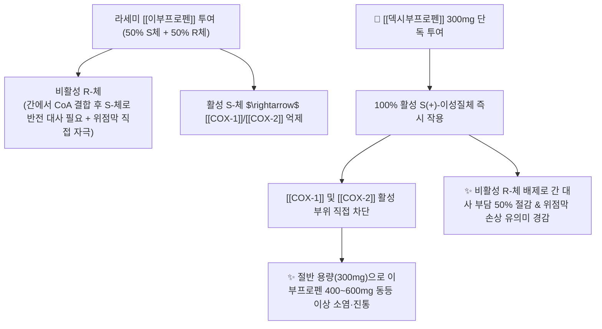

---
aliases:
  - Dexibuprofen
  - 이지엔6프로
  - 덱시부
  - 애니덱스
  - S-이부프로펜
  - 디퓨
  - Dexibuprofenum
tags:
  - 약리/양방약
  - 해열진통소염제
  - NSAIDs
  - 광학이성질체
  - 키랄의약품
---

# 💊 [[덱시부프로펜]] (Dexibuprofen, 이지엔6프로 / 덱시부, M01AE14)

> **핵심 3줄 요약 (Key Summary)**:
> - 🧪 약물 분류 & 표적: [[이부프로펜]]의 두 광학이성질체 중 실제 약리 활성을 나타내는 **S(+)-이부프로펜(Dexibuprofen)**만을 100% 순수 분리·정제한 키랄(Chiral) NSAID, [[COX-1]] 및 [[COX-2]] 직접 차단.
> - 🎯 주요 적응증 & 원내외 처방 패턴: 골관절염, 강직성 척추염, 급성 요추 염좌, 견비통, 치통, 외상 후 통증 (일반 NSAIDs 복용 시 속쓰림을 호소하는 환자의 1차 선택제).
> - 🔬 분자약리 기전 & 약동학(PK/PD): 비활성 R-체 투여에 따른 불필요한 간 대사 부담과 위점막 직접 자극을 배제하여, 이부프로펜의 약 50~60% 투여량(300mg)으로 동등 이상의 진통·소염 효능 발휘.
> - ⚠️ 블랙박스 경고 & 주요 부작용: 라세미 이부프로펜 대비 위장 장애 발생률이 30~50% 낮으나 NSAID 고유의 소화성 궤양, 신혈류 저하, 심혈관 혈전 위험은 여전히 존재하므로 식후 즉시 복용 준수.

---

## 📌 목차
1. [기본 약물 정보 & 시판 제품·알약 식별 (Pill Identification)](#1-기본-약물-정보--시판-제품알약-식별-pill-identification)
2. [분자약리학적 작용 기전 (MOA) & 화학 구조](#2-분자약리학적-작용-기전-moa--화학-구조)
3. [약동학적 특성 (ADME: 흡수·분포·대사·배설)](#3-약동학적-특성-adme-흡수분포대사배설)
4. [진료과별 다빈도 처방 패턴 & 임상 적응증 (Sweet Spot vs 금기)](#4-진료과별-다빈도-처방-패턴--임상-적응증-sweet-spot-vs-금기)
5. [약물 상호작용 & 병용 금기 매트릭스](#5-약물-상호작용--병용-금기-매트릭스)
6. [부작용·독성 발현 기전 & 응급 해독 프로토콜](#6-부작용독성-발현-기전--응급-해독-프로토콜)
7. [💡 사용자 진료실 핵심 필기 & 한의 임상 연계·테이퍼링 팁 (원문 보존)](#7--사용자-진료실-핵심-필기--한의-임상-연계테이퍼링-팁-원문-보존)
8. [출처 및 학술 참고 문헌 (References)](#8-출처-및-학술-참고-문헌-references)

---

## 1. 기본 약물 정보 & 시판 제품·알약 식별 (Pill Identification)

| 항목 | 상세 정보 |
| :--- | :--- |
| **일반명 (Generic Name)** | [[덱시부프로펜]] (Dexibuprofen, S(+)-Ibuprofen, INN) |
| **약효 분류 (Class)** | 순수 S-입체이성질체 비선택적 NSAID (Chiral NSAID, Propionic acid derivative) |
| **ATC 코드** | M01AE14 (Antiinflammatory and antirheumatic products, non-steroids) |
| **약국 시판 제품 (OTC 일반약)** | • **단일제 (연질캡슐/정제 300mg)**: 이지엔6프로(300mg), 덱시부정(300mg), 애니덱스연질캡슐(300mg), 페인엔젤프로, 솔루펜덱시 • **소아 시럽제**: 덱시부프로펜 건조시럽 (12mg/mL) |
| **병원 처방 의약품 (ETC 전문약)** | • **단일제**: 덱시부정 300mg/400mg, 디퓨정 300mg/400mg, 유니덱스정 300mg |
| **상용 용법·용량** | • **성인 표준 (OTC/ETC)**: 1회 300mg, 1일 2~4회 식후 복용 (1일 최대 1,200mg 이하) • **중증 관절염/외과 수술 후**: 1회 400mg, 1일 3회 식후 복용 |

### 1.1 대표 시판 제품 및 함유 복합제 매핑 (Brand Identification & Combinations)

| 구분 | 대표 제품명 / 브랜드 | 함유 성분 및 1회당 함량 | 제형 및 특징 | 주요 적응증 및 복약 지도 핵심 |
| :--- | :--- | :--- | :--- | :--- |
| **단일제 (OTC/ETC)** | 이지엔6프로, 덱시부정, 애니덱스 | [[덱시부프로펜]] 단일 (300mg) | 가용화 액상 연질캡슐, 필름코팅정 | 이부프로펜 대비 위장부담 경감, 빠른 흡수, 식후 즉시 복용 |
| **고용량 처방약 (ETC)** | 디퓨정 400mg, 덱시부정 400mg | [[덱시부프로펜]] 400mg | 정제 | 정형외과/신경외과 관절염·디스크 방사통 소염진통 |
| **소아 시럽제 (OTC)** | 맥시부펜시럽 | [[덱시부프로펜]] (12mg/mL) | 현탁액 | 소아 해열, 이부프로펜(부루펜)의 절반 용량으로 신속 해열 |

![[덱시부프로펜_패키지_박스.jpg|400]]
> [그림 1: 약국에서 가장 널리 판매되는 덱시부프로펜 300mg 단일제 패키지 상자 외형]

![[덱시부프로펜_연질캡슐_알약.jpg|400]]
> [그림 2: 신속한 위장 용해 및 흡수를 돕는 덱시부프로펜 300mg 투명 액상 연질캡슐 성상]

---

## 2. 분자약리학적 작용 기전 (MOA) & 화학 구조

![[덱시부프로펜_화학구조.png|300]]
> [그림 3: 덱시부프로펜의 2D 화학 구조식 ((2S)-2-(4-isobutylphenyl)propanoic acid, 분자량 206.28 g/mol, PubChem CID 39912)]

### 1) 키랄 스위치 (Chiral Switch) 약리학적 원리
* 기존 라세미 이부프로펜은 50%의 활성 S-체와 50%의 비활성 R-체 혼합물로 구성되어 있습니다.
* 비활성 R-체는 체내 간세포에서 이소머라제(Invertase) 효소에 의해 CoA 에스테르 중간체를 거쳐 서서히 S-체로 전환(Unidirectional chiral inversion)됩니다.
* 덱시부프로펜은 **처음부터 100% 활성 S(+)-이성질체만을 정제 투여하므로 체내 전환 과정이 불필요**하며, 위장관과 간세포에 불필요한 대사 부하를 유발하지 않습니다.

### 2) COX 억제 선택성 및 위장관 안전성
* 덱시부프로펜은 [[COX-1]]과 [[COX-2]]를 균형 있게 억제하며, 불필요한 R-체의 위점막 국소 축적 및 지질 결합 부작용이 없어 라세미 이부프로펜 대비 **위점막 미란 및 궤양 발생 빈도가 약 30~50% 감소**합니다.

---

## 3. 약동학적 특성 (ADME: 흡수·분포·대사·배설)

| 약동학 파라미터 | 수치 및 임상적 의미 |
| :--- | :--- |
| **생체이용률 (Bioavailability, F)** | 90% 이상 (위장관 흡수 매우 신속하고 완전함) |
| **최고혈중농도 도달시간 (Tmax)** | 액상 연질캡슐 **30 ~ 45분**, 일반 정제 1 ~ 1.5시간 (이부프로펜보다 현저히 빠름) |
| **혈장 단백결합률 (Protein Binding)** | 99% 이상 (알부민 결합) |
| **분포용적 (Volume of Distribution)** | 약 0.13 L/kg (염증 부위 및 관절낭 활액에 효과적 침투) |
| **간 대사 효소 (Metabolism)** | **CYP2C9** 및 CYP2C8에 의해 수산화 및 카르복실화 대사 (R $\rightarrow$ S 전환 생략) |
| **소실 반감기 (Elimination t1/2)** | **1.8 ~ 2.2 시간** (체내 잔류 없이 신속 소실) |
| **주요 배설 경로 (Excretion)** | 투여량의 90% 이상이 24시간 내 신장 소변으로 배설 |

---

## 4. 진료과별 다빈도 처방 패턴 & 임상 적응증 (Sweet Spot vs 금기)

### 1) 주요 진료과별 처방 패턴
* **정형외과 / 재활의학과 / 신경외과**:
  * 급만성 경추통, 요추 염좌, 척추관 협착증, 퇴행성 슬관절염 환자 중 고령이거나 위장관이 약한 환자에게 300mg bid~tid 처방.
* **내과 / 가정의학과 / 약국 1차 상담**:
  * 일반 소염진통제 복용 후 속쓰림을 경험했던 두통, 치통, 관절통 환자에게 이지엔6프로 등 액상 캡슐제 1차 추천.
* **산부인과 / 치과**:
  * 월경통 및 발치 후 급성 염증성 통증에 신속한 진통 유도를 위해 다용.

### 2) 최적 적응증 (Sweet Spot) vs 신중 투여 및 금기
* **[✅ 최적 적응증 (Sweet Spot)]**:
  * **위장이 약한 근골격계 통증 환자**: 이부프로펜, 나프록센 등 일반 NSAID 복용 시 속쓰림이 있었던 환자.
  * **신속한 통증 완화가 필요한 급성 염좌**: 연질캡슐 복용 30분 만에 최고혈중농도 도달.
* **[⚠️ 신중 투여 및 금기 (Caution / Contraindication)]**:
  * **활동성 소화성 궤양 환자 금기**: 위장 부담이 줄었으나 COX-1 억제 특성이 완전히 사라진 것은 아니므로 궤양 환자는 금기.
  * **중증 심부전 및 관상동맥 질환자 금기**: 체액 저류 및 심혈관 사건 주의.
  * **중증 신부전 환자 금기**: 신장 프로스타글란딘 억제로 인한 여과율 감소.

---

## 5. 약물 상호작용 & 병용 금기 매트릭스

| 병용 약물 / 물질 | 상호작용 기전 | 임상적 위험 및 결과 | 처방 및 티칭 가이드 |
| :--- | :--- | :--- | :--- |
| [[아스피린]] (저용량 100mg) | 혈소판 COX-1 결합 부위 가역적 경쟁 | 아스피린의 항혈소판 작용 감쇄 $\rightarrow$ 심혈관 보호 기능 저하 | **아스피린 복용 후 최소 2시간 간격을 두고 덱시부프로펜 복용** |
| 항응고제 ([[와파린]], [[NOAC]]) | 혈소판 응집 억제 + 점막 손상 시너지 | 위장관 출혈 위험 증가 | 병용 시 출혈 징후(흑색변, 멍) 밀착 관찰 |
| 이뇨제 및 혈압약 (ACEI, ARB) | 신장 사구체 혈류 조절 PGE2 차단 | 혈압 조절 저하 및 신손상 유발 | 신기능 및 전해질 검사 병행 |
| 위점막 방어 한약 ([[평위산]], [[반하사심탕]]) | 위점막 방어 점액 촉진 및 혈류 개선 | NSAIDs 미세 점막 손상 완충 | **양약 식후 복용 후 1시간 간격 한약 복용** |

---

## 6. 부작용·독성 발현 기전 & 응급 해독 프로토콜

* **부작용 발생률 비교 (라세미 이부프로펜 vs 덱시부프로펜)**:
  * **위장관 유해사례**: 이부프로펜 대비 속쓰림, 소화불량, 복통 발생률이 약 35% 유의미하게 감소.
  * **간 효소 수치 상승 빈도**: 비활성 R-체의 대사 부담이 없어 트랜스아미나제(AST/ALT) 상승률이 현저히 낮음.
* **주요 주의 부작용**:
  * 드물게 발생하는 소화성 궤양, 피부 발진, 가벼운 부종, 두통, 어지럼증.
* **응급 대처**:
  * 속쓰림 지속 시 위장점막 보호제([[레바미피드]]) 또는 PPI 병용. 위출혈 징후 발생 시 투약 즉시 중단.

---

## 7. 💡 사용자 진료실 핵심 필기 & 한의 임상 연계·테이퍼링 팁 (원문 보존)

* **진료실 실전 문진 체크리스트 (3대 핵심 질문)**:
  1. **"평소 다른 진통제(부루펜, 탁센, 게보린)를 드시면 속이 쓰리셨나요?"**:
     * 속쓰림 병력이 있는 환자에게는 덱시부프로펜 연질캡슐을 식사 직후 복용하도록 지도.
  2. **"이지엔6 '애니(이부프로펜)'와 '프로(덱시부프로펜)' 중 어떤 것을 드셨나요?"**:
     * 일반 환자들은 이지엔6 시리즈의 성분 차이를 모르는 경우가 많으므로 청색(애니)인지 주황색(프로)인지 정확히 구별 청취.
  3. **"복용 후 몇 시간 만에 통증이 가라앉나요?"**:
     * 액상 캡슐의 신속 흡수 특성을 고려하여, 통증이 시작되는 초기에 1캡슐(300mg)을 식후 복용하도록 안내.

* **한의 치료(침·약침·한약) 연계 및 양약 테이퍼링(감량) 전략**:
  1. **급성 디스크 방사통 및 요추 염좌 복합 치료**:
     * 초기 3~5일간 급성 통증기에는 신바로약침/소염약침 치료와 함께 덱시부프로펜 300mg을 1일 2회 단기 복용하여 염증 피크를 꺾음.
  2. **한약 처방 연계 신속 테이퍼링**:
     * 통증 감소와 함께 [[당귀수산]], [[오적산]], [[작약감초탕]]을 투여하여 근 긴장과 어혈을 풀면서 덱시부프로펜을 '필요 시 복용(PRN)'으로 전환 후 조기 중단.

---

## 8. 출처 및 학술 참고 문헌 (References)

1. **식품의약품안전처 (MFDS)**. 의약품 품목허가사항 및 안전성 서한: 덱시부프로펜 제제 (2023).
2. **Kaehler, S. T. et al. (2003)**. *Dexibuprofen: pharmacology, therapeutic uses and safety*. **Drugs of Today**, 39(5), 349-361.
   - **[연구 요약]**: S(+)-이부프로펜 단일 광학이성질체의 우수한 위장관 내약성, 빠른 최고혈중농도 도달 및 동등 이상의 진통 효능 임상 분석.
3. **Bonabello, A. et al. (2003)**. *Dexibuprofen (S(+)-isomer ibuprofen): pharmacological properties and potential advantages in clinical practice*. **Current Medical Research and Opinion**, 19(8), 755-763.
   - **[연구 요약]**: 키랄 스위치 기법을 통한 체내 대사 부하 절감 및 라세미 혼합물 대비 임상적 이점 총괄 고찰.
4. **Singer, F. et al. (2000)**. *Efficacy and tolerability of dexibuprofen vs racemic ibuprofen in patients with osteoarthritis of the hip or knee*. **International Journal of Clinical Pharmacology and Therapeutics**, 38(1), 15-24.
   - **[연구 요약]**: 고관절 및 슬관절 골관절염 환자 대상 대규모 무작위 대조 임상시험에서 덱시부프로펜의 우수한 안전성 프로파일 입증.
