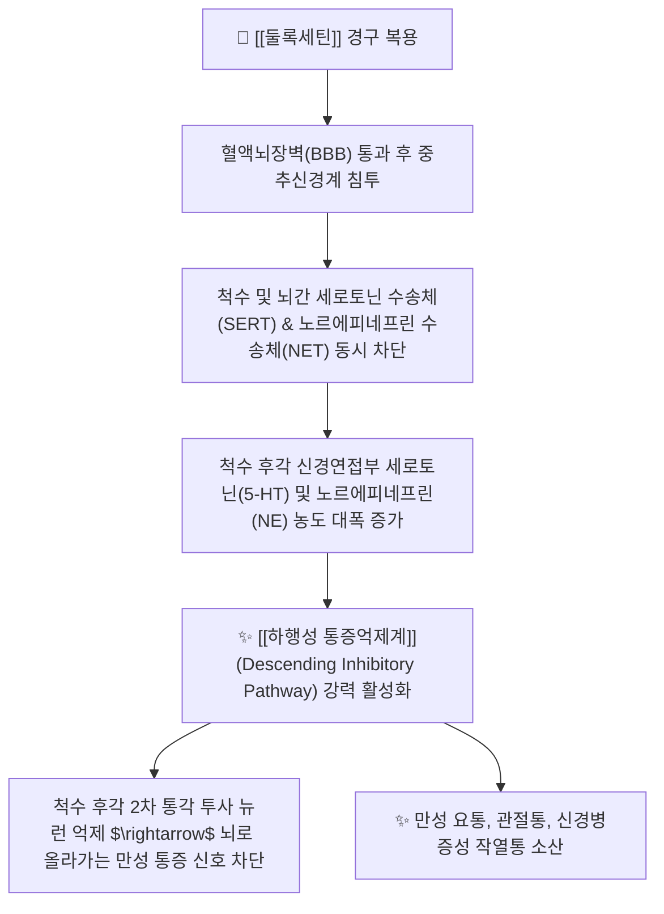

---
aliases:
  - Duloxetine
  - 심발타
  - 둘록세틴염산염
  - Cymbalta
  - 듀록세틴
  - SNRI
tags:
  - 약리/양방약
  - 신경병증성통증
  - SNRI
  - 만성통증치료제
  - 항우울제
  - 전문의약품
---

# 💊 [[둘록세틴]] (Duloxetine, 심발타 / Cymbalta, N06AX21)

> **핵심 3줄 요약 (Key Summary)**:
> - 🧪 약물 분류 & 표적: 세로토닌-노르에피네프린 재흡수 억제제(SNRI), 세로토닌 수송체(SERT) 및 노르에피네프린 수송체(NET)를 동시 차단하여 **하행성 통증 억제 경로(Descending Pain Pathway) 강화**.
> - 🎯 주요 적응증 & 원내외 처방 패턴: **만성 근골격계 요통, 골관절염 통증, 섬유근육통, 당뇨병성 말초신경병증(DPN)** 및 주요 우울장애 (신경병증 및 만성 통증 1차 치료제).
> - 🔬 분자약리 기전 & 약동학(PK/PD): 뇌간에서 척수 후각으로 투사되는 모노아민 신호를 증폭시켜 통각 신호 상행 전달을 억제하며, 간 CYP1A2 및 CYP2D6 대사를 거쳐 신장(70%) 및 분변(20%)으로 배설.
> - ⚠️ 블랙박스 경고 & 주요 부작용: 복용 초기 오심(구역 20%), 입마름, 변비, 졸림, 혈압 상승, 자살 관념 모니터링(소아·청년층), 트라마돌 병용 시 **세로토닌 증후군(Serotonin Syndrome)** 위험.

---

## 📌 목차
1. [약물 기본 정보 및 시판 제품 (Brand Identification)](#1-약물-기본-정보-및-시판-제품-brand-identification)
2. [분자약리학적 작용 기전 (MOA) & 화학 구조](#2-분자약리학적-작용-기전-moa--화학-구조)
3. [약동학적 특성 (ADME: 흡수·분포·대사·배설)](#3-약동학적-특성-adme-흡수분포대사배설)
4. [진료과별 다빈도 처방 패턴 & 임상 적응증 (Sweet Spot vs 금기)](#4-진료과별-다빈도-처방-패턴--임상-적응증-sweet-spot-vs-금기)
5. [약물 상호작용 & 병용 금기 매트릭스](#5-약물-상호작용--병용-금기-매트릭스)
6. [부작용·독성 발현 기전 & 응급 해독 프로토콜](#6-부작용독성-발현-기전--응급-해독-프로토콜)
7. [💡 사용자 진료실 핵심 필기 & 한의 임상 연계·테이퍼링 팁 (원문 보존)](#7--사용자-진료실-핵심-필기--한의-임상-연계테이퍼링-팁-원문-보존)
8. [출처 및 학술 참고 문헌 (References)](#8-출처-및-학술-참고-문헌-references)

---

## 1. 약물 기본 정보 및 시판 제품 (Brand Identification)

> [!abstract]+ 🧪 3D 약리 분자 구조 (Interactive 3D Viewer)
> <iframe src="https://molecule-viewer-rho.vercel.app/?cid=60835" style="width: 100%; height: 600px; border: none; border-radius: 12px; box-shadow: 0 4px 20px rgba(0,0,0,0.15);" allowfullscreen></iframe>

| 항목 | 상세 정보 |
| :--- | :--- |
| **일반명 (Generic Name)** | [[둘록세틴]] (Duloxetine Hydrochloride, INN/USAN) |
| **약효 분류 (Class)** | 세로토닌-노르에피네프린 재흡수 억제제 (SNRI) & 만성 통증 조절제 |
| **ATC 코드** | N06AX21 (Other antidepressants) / 117 정신신경용제 (전문의약품) |
| **약국 시판 제품 (OTC 일반약)** | 전문의약품(ETC)으로 처방전 필수 (일반약 없음) |
| **병원 처방 의약품 (ETC 전문약)** | • **오리지널 장용캡슐**: **심발타캡슐(Cymbalta Cap, 한국릴리 오리지널 30mg, 60mg)** • **제네릭 캡슐**: 듀록셉캡슐, 드록틴캡슐, 심발레트캡슐 (30mg, 60mg) |
| **상용 용법·용량** | • **당뇨병성 신경병증 / 만성 요통 / 골관절염**: 1일 1회 30mg으로 시작하여 1주 후 1일 1회 60mg으로 증량 (식사와 무관하게 복용, 1일 최대 120mg 이하) • **섬유근육통**: 1일 1회 30mg 1주 투여 후 60mg/day 유지 |

### 1.1 대표 시판 제품 및 함유 복합제 매핑 (Brand Identification & Combinations)

| 구분 | 대표 제품명 / 브랜드 | 함유 성분 및 1회당 함량 | 제형 및 특징 | 주요 적응증 및 복약 지도 핵심 |
| :--- | :--- | :--- | :--- | :--- |
| **오리지널 장용캡슐 (ETC)** | [[심발타]] (한국릴리) | 둘록세틴염산염 (30mg / 60mg) | 백색/청색 장용과립 경질캡슐 | 만성 요통, 관절염 통증, 신경병증 1차약, 초기 오심 주의 |
| **제네릭 캡슐 (ETC)** | 듀록셉, 드록틴, 심발레트 | [[둘록세틴]] (30mg / 60mg) | 장용캡슐 | 캡슐을 열어 과립을 씹거나 부수지 말 것 |
| **신경병증 2제 병용** | 심발타 + 리리카 병용요법 | [[둘록세틴]] (30mg) + [[프레가발린]] (75mg) | 개별 캡슐 병용 | 하행성 억제 + 시냅스전 칼슘 차단 상보적 통증 제어 시너지 |

![[둘록세틴_패키지_박스.jpg|400]]
> [그림 1: 정형외과 및 통증의학과에서 만성 근골격계 통증에 널리 처방되는 심발타 60mg 패키지 외형]

![[둘록세틴_캡슐_알약.jpg|400]]
> [그림 2: 둘록세틴 30mg/60mg 장용성 펠렛 함유 경질캡슐 성상]

---

## 2. 분자약리학적 작용 기전 (MOA) & 화학 구조

![[둘록세틴_화학구조.png|300]]
> [그림 3: 둘록세틴의 2D 평면 화학 분자 구조식 ((3S)-N-methyl-3-naphthalen-1-yloxy-3-thiophen-2-ylpropan-1-amine, 분자량 297.41 g/mol, PubChem CID 60835)]

### 1) 하행성 통증 억제계 (Descending Inhibitory Pathway) 강화
* 만성 통증 환자는 뇌간(청반핵, 봉선핵)에서 척수 후각으로 내려오는 내인성 억제 신호가 고갈되어 중추 감작이 발생합니다.
* 둘록세틴은 **세로토닌(5-HT)과 노르에피네프린(NE)의 재흡수를 강력히 억제**하여 척수 후각의 $\alpha_2$-아드레날린 수용체 및 $5-\text{HT}_{1A/1B}$ 수용체를 자극함으로써, 통증 신호가 대뇌로 전달되는 경로를 하행성으로 억제합니다.

### 2) 프레가발린과의 상보적 병용 시너지 기전
* **프레가발린(리리카)**은 시냅스전 $\alpha_2\delta$ 채널을 막아 흥분성 신경전달물질의 유리를 억제(Pre-synaptic blockade)합니다.
* **둘록세틴(심발타)**은 시냅스후 하행성 억제계를 촉진(Post-synaptic descending enhancement)하므로, 두 약물의 저용량 병용 시 난치성 신경통증 환자의 통증 반응률이 극대화됩니다(PMID 41890179).

---

## 3. 약동학적 특성 (ADME: 흡수·분포·대사·배설)

| 약동학 파라미터 | 수치 및 임상적 의미 |
| :--- | :--- |
| **생체이용률 (Bioavailability, F)** | 약 50% (위산에 불안정하므로 장용 코팅 과립 제형 필수) |
| **최고혈중농도 도달시간 (Tmax)** | 복용 후 **약 6.0 시간** (지연 흡수) |
| **혈장 단백결합률 (Protein Binding)** | **> 96%** (혈청 알부민 및 $\alpha_1$-산성 당단백질 결합) |
| **간 대사 효소 (Metabolism)** | **CYP1A2 및 CYP2D6**에 의해 광범위 산화 및 포합 비활성 대사 |
| **소실 반감기 (Elimination t1/2)** | **약 12.1 시간** (1일 1회 아침 또는 저녁 복용) |
| **주요 배설 경로 (Excretion)** | 투여량의 약 70%가 신장 소변으로, 약 20%가 분변(담즙)으로 배설 |

---

## 4. 진료과별 다빈도 처방 패턴 & 임상 적응증 (Sweet Spot vs 금기)

### 1) 주요 진료과별 처방 패턴
* **정형외과 / 척추센터 / 재활의학과**:
  * NSAIDs에 반응하지 않는 **만성 요통(Chronic LBP) 및 무릎 퇴행성 골관절염 환자**에게 1차 처방.
* **마취통증의학과 / 신경과**:
  * 당뇨병성 말초신경병증(DPN), 척추수술 후 통증 증후군(FBSS), 섬유근육통 환자 통증 조절.
* **정신건강의학과**:
  * 만성 통증과 우울증, 불안장애가 동반된 환자.

### 2) 최적 적응증 (Sweet Spot) vs 신중 투여 및 금기
* **[✅ 최적 적응증 (Sweet Spot)]**:
  * **우울감, 불면, 만성 피로가 동반된 만성 척추관절 통증 환자**.
  * **NSAIDs 복용이 불가능한 소화성 궤양·심혈관 고위험 환자**.
* **[⚠️ 신중 투여 및 금기 (Caution / Contraindication)]**:
  * **말기 신부전 환자(eGFR < 30 mL/min) 및 중증 간장애 환자 금기**.
  * **조절되지 않는 폐쇄각 녹내장 환자 금기** (동공 산대 유발).
  * **MAO 억제제 복용자 절대 금기** (세로토닌 독성).

---

## 5. 약물 상호작용 & 병용 금기 매트릭스

| 병용 약물 / 물질 | 상호작용 기전 | 임상적 위험 및 결과 | 처방 및 티칭 가이드 |
| :--- | :--- | :--- | :--- |
| 오피오이드계 진통제 ([[트라마돌]]) | 세로토닌 재흡수 차단 시너지 | **세로토닌 증후군** (고열, 근경련, 혼돈) 유발 | **병용 시 최저용량 시작 및 활력징후 관찰** |
| 강한 CYP1A2 억제제 (시프로플록사신) | 둘록세틴 간 대사 차단 | 둘록세틴 혈중 농도 2.5배 급상승 $\rightarrow$ 독성 위험 | 병용 투여 금기 |
| 가바펜티노이드 ([[프레가발린]]) | 상보적 통증 차단 경로 시너지 | 통증 조절 시너지 및 약물 요구량 감소 | **난치성 통증 환자에게 권장되는 병용 조합** |
| 스트레스/화병 한약 ([[가미소요산]], [[시호가용골모려탕]]) | 간기울결(肝氣鬱結) 해소 및 자율신경 안정 | 둘록세틴 복용 초기 불안·오심 완충 | **양약 복용 1시간 후 한약 복용** |

---

## 6. 부작용·독성 발현 기전 & 응급 해독 프로토콜

* **임상 다빈도 부작용**:
  1. **초기 위장관계**: 오심(Nausea 20%), 식욕부진, 구강건조, 변비 (복용 1~2주 후 점차 호전).
  2. **중추신경계**: 졸림, 불면, 어지럼, 두통, 발한.
  3. **자율신경계**: 혈압 상승, 빈맥.
* **복용 및 테이퍼링 수칙**:
  * 초기 오심을 방지하기 위해 **반드시 식사 직후 복용**하고 30mg 저용량으로 시작.
  * 갑작스러운 중단 시 어지럼, 감전되는 듯한 저림, 불안 등 금단 증상이 심하므로 수주에 걸쳐 서서히 감량.

---

## 7. 💡 사용자 진료실 핵심 필기 & 한의 임상 연계·테이퍼링 팁 (원문 보존)

* **진료실 실전 문진 체크리스트 (3대 핵심 질문)**:
  1. **"병원에서 처방받으신 약 중에 '심발타(30mg/60mg)'가 들어있나요?"**:
     * 환자가 우울증약으로 오해하여 복용을 거부하거나 불안해하는 경우가 많으므로 "만성 신경 통증을 가라앉히는 전문 통증 조절제"임을 정확히 설명.
  2. **"약을 드시고 속이 메스껍거나 입이 바짝 마르지 않으신가요?"**:
     * 초기 오심 부작용 유무를 체크하여 식후 즉시 복용하도록 지도.
  3. **"기분이 가라앉거나 불면증이 함께 개선되셨나요?"**:
     * 중추 감작 및 심리적 통증 반응 호전도 평가.

* **한의 치료(침·약침·한약) 연계 및 양약 테이퍼링(감량) 전략**:
  1. **만성 요통 및 섬유근육통 통합 치료**:
     * 척추 기립근 및 관절 주위 아시혈 침치료, 중성어혈약침, 자하거약침을 시술하여 근육 내 허혈을 개선.
  2. **심인성 통증 한약 배오 및 둘록세틴 테이퍼링**:
     * 만성 통증과 불안·우울이 동반된 환자에게 [[가미소요산]], [[귀비탕]], [[분심기음]]을 처방하여 신경계를 안정시키고, 심발타를 60mg $\rightarrow$ 30mg $\rightarrow$ 격일 복용으로 4주간 단계적 감량 후 단약 유도.

---

## 8. 출처 및 학술 참고 문헌 (References)

1. **식품의약품안전처 (MFDS)**. 의약품 품목허가사항: 둘록세틴염산염 제제 (2023).
2. **Skljarevski, V. et al. (2010)**. *Efficacy and safety of duloxetine in patients with chronic low back pain*. **Spine (Phila Pa 1976)**, 35(13), E578-E585.
   - [PubMed (PMID: 20461028)](https://pubmed.ncbi.nlm.nih.gov/20461028/) | [DOI](https://doi.org/10.1097/BRS.0b013e3181d32247)
   - **[연구 요약]**: 만성 요통 환자 대상 대규모 무작위 위약 대조 임상시험에서 둘록세틴(60mg/일)의 유의미한 요통 완화 및 신체 기능 개선 입증.
3. **Tesfaye, S. et al. (2022)**. *Comparison of amitriptyline supplemented with pregabalin, pregabalin supplemented with amitriptyline, and duloxetine supplemented with pregabalin for the treatment of diabetic peripheral neuropathic pain (OPTION-DM)*. **Lancet**, 400(10353), 680-690.
   - [PubMed (PMID: 36007534)](https://pubmed.ncbi.nlm.nih.gov/36007534/) | [DOI](https://doi.org/10.1016/S0140-6736(22)01472-6)
   - **[연구 요약]**: 신경병증성 통증 환자에서 둘록세틴 단독 및 프레가발린 병용 요법의 임상적 유효성 및 안전성 검증.
