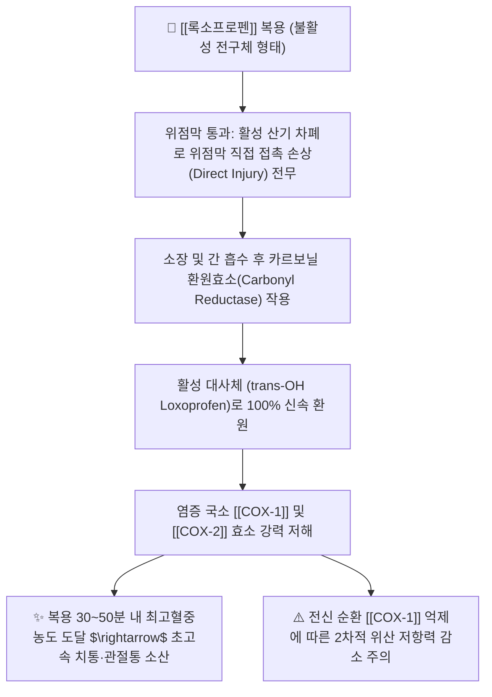

---
aliases:
  - Loxoprofen
  - 록소닌
  - 록소펜
  - 록소프로펜나트륨
  - Loxonin
  - LoxoprofenSodium
tags:
  - 약리/양방약
  - 해열진통소염제
  - NSAIDs
  - 전구약물
  - 프로피온산계
---

# 💊 [[록소프로펜]] (Loxoprofen, 록소닌 / Loxonin, M01AE)

> **핵심 3줄 요약 (Key Summary)**:
> - 🧪 약물 분류 & 표적: 프로피온산(Propionic acid) 유도체 계열의 대표적인 **전구약물(Prodrug)**형 비선택적 NSAID, [[COX-1]] 및 [[COX-2]] 가역적 차단, 프로스타글란딘([[PGE2]]) 합성 억제.
> - 🎯 주요 적응증 & 원내외 처방 패턴: 치과 발치 후 통증, 정형외과 급성 외상 및 염좌, 만성 관절염, 상기도 감염증의 해열·진통 (치과·이비인후과·정형외과 다빈도 처방).
> - 🔬 분자약리 기전 & 약동학(PK/PD): 경구 복용 시 위장관을 불활성 전구체 상태로 통과하여 위점막 직접 손상을 방지하며, 간과 소장에서 활성 trans-alcohol체로 신속 환원 대사되어 복용 50분 내 최고 진통 효과 발휘.
> - ⚠️ 블랙박스 경고 & 주요 부작용: 위점막 직접 자극은 없으나 흡수 후 전신 순환계에서 COX-1을 억제하므로 장기 복용 시 소화성 궤양·출혈 위험 모니터링 필요.

---

## 📌 목차
1. [기본 약물 정보 & 시판 제품·알약 식별 (Pill Identification)](#1-기본-약물-정보--시판-제품알약-식별-pill-identification)
2. [분자약리학적 작용 기전 (MOA) & 화학 구조](#2-분자약리학적-작용-기전-moa--화학-구조)
3. [약동학적 특성 (ADME: 흡수·분포·대사·배설)](#3-약동학적-특성-adme-흡수분포대사배설)
4. [진료과별 다빈도 처방 패턴 & 임상 적응증 (Sweet Spot vs 금기)](#4-진료과별-다빈도-처방-패턴--임상-적응증-sweet-spot-vs-금기)
5. [약물 상호작용 & 병용 금기 매트릭스](#5-약물-상호작용--병용-금기-매트릭스)
6. [부작용·독성 발현 기전 & 응급 해독 프로토콜](#6-부작용독성-발현-기전--응급-해독-프로토콜)
7. [💡 사용자 진료실 핵심 필기 & 한의 임상 연계·테이퍼링 팁 (원문 보존)](#7--사용자-진료실-핵심-필기--한의-임상-연계테이퍼링-팁-원문-보존)
8. [출처 및 학술 참고 문헌 (References)](#8-출처-및-학술-참고-문헌-references)

---

## 1. 기본 약물 정보 & 시판 제품·알약 식별 (Pill Identification)

| 항목 | 상세 정보 |
| :--- | :--- |
| **일반명 (Generic Name)** | [[록소프로펜]] (Loxoprofen Sodium Hydrate, INN) |
| **약효 분류 (Class)** | 전구약물형 비선택적 소염진통제 (Prodrug-type Non-selective NSAID) |
| **ATC 코드** | M01AE (Propionic acid derivatives) / 114 해열·진통·소염제 |
| **약국 시판 제품 (OTC 일반약)** | 전문의약품(ETC) 중심이나 일부 일반의약품 정제 및 첩부제(파스) 유통 |
| **병원 처방 의약품 (ETC 전문약)** | • **단일 정제 (60mg)**: **록소닌정(Loxonin Tab, 동화약품 오리지널)**, 록소펜정, 록스펜정, 신일록소프로펜정 • **구강붕해정**: 록소닌D정 (물 없이 혀에서 녹여 복용) • **첩부제 (외용 파스)**: 록소닌카타플라스마, 록소펜플라스타 |
| **상용 용법·용량** | • **만성 관절염 / 급성 통증**: 성인 1회 1정(60mg), 1일 3회 식후 복용 • **급성 통증 1회성 투여**: 1회 60~120mg 경구 복용 (1일 최대 180mg 이하) |

### 1.1 대표 시판 제품 및 함유 복합제 매핑 (Brand Identification & Combinations)

| 구분 | 대표 제품명 / 브랜드 | 함유 성분 및 1회당 함량 | 제형 및 특징 | 주요 적응증 및 복약 지도 핵심 |
| :--- | :--- | :--- | :--- | :--- |
| **오리지널 정제 (ETC)** | [[록소닌]] (동화약품/다이이찌산쿄) | 록소프로펜나트륨수화물 (68.1mg = 록소프로펜 60mg) | 담홍색 원형 필름코팅정 | 치과 발치 후, 급성 염좌, 관절염 1차 처방 |
| **구강붕해정 (ETC)** | 록소닌D정 | [[록소프로펜]] (60mg) | 구강붕해정 (OD정) | 연하 곤란 고령자, 물 없이 복용 가능 |
| **외용 소염진통 파스** | 록소닌 카타플라스마 | 록소프로펜나트륨 (1매당 50~100mg) | 습포제, 플라스타 | 무릎·허리·어깨 관절통 국소 소염진통 |

![[록소프로펜_패키지_박스.jpg|400]]
> [그림 1: 치과 및 정형외과에서 급성 진통소염 목적으로 널리 처방되는 록소프로펜(록소닌) 포장 패키지]

![[록소프로펜_블리스터_알약.jpg|400]]
> [그림 2: 록소프로펜 60mg 담홍색 원형 정제 알약 성상 및 PTP 블리스터 포장]

---

## 2. 분자약리학적 작용 기전 (MOA) & 화학 구조

![[록소프로펜_화학구조.png|300]]
> [그림 3: 록소프로펜의 2D 평면 화학 분자 구조식 (2-[4-(2-oxocyclopentyl-1-methyl)phenyl]propanoic acid, 분자량 246.30 g/mol, PubChem CID 3964)]

### 1) 전구약물(Prodrug) 활성화 기전
* 록소프로펜 자체는 카르보닐기를 가진 비활성 구조로, 위점막을 통과할 때 위벽 상피세포에 직접적인 세포독성 자극을 주지 않습니다.
* 소장관 상피 및 간세포 마이크로솜에 존재하는 **카르보닐 환원효소(Carbonyl Reductase)**에 의해 **활성형인 trans-OH체(trans-alcohol)**로 신속하게 환원 전환되어 전신 혈류로 방출됩니다.

### 2) 신속한 진통 발현 시간
* 활성 대사체인 trans-OH 록소프로펜은 일반 소염진통제보다 혈중 단백결합에서 해리되어 염증 조직으로 이행하는 속도가 매우 빠르며, 복용 후 약 30~50분 만에 최고혈중농도에 도달하여 **급성 치통, 두통, 염좌 통증을 초고속으로 제압**합니다.

---

## 3. 약동학적 특성 (ADME: 흡수·분포·대사·배설)

| 약동학 파라미터 | 수치 및 임상적 의미 |
| :--- | :--- |
| **생체이용률 (Bioavailability, F)** | 위장관 흡수 신속 및 완전 (경구 생체이용률 우수) |
| **최고혈중농도 도달시간 (Tmax)** | **미변화체 약 30분, 활성 대사체(trans-OH) 약 50분** (초고속 진통 발현) |
| **혈장 단백결합률 (Protein Binding)** | **97 ~ 98%** (혈청 알부민 결합) |
| **간 대사 경로 (Metabolism)** | 11-카르보닐기의 입체선택적 환원 $\rightarrow$ **활성 trans-OH 록소프로펜(주성분)** 생성 |
| **소실 반감기 (Elimination t1/2)** | **약 1.25 시간** (대사 및 배설이 매우 신속하여 체내 축적 위험 없음) |
| **주요 배설 경로 (Excretion)** | 투여 24시간 이내에 투여량의 약 50~60%가 신장 소변으로 배설 (글루쿠론산 포합체) |

---

## 4. 진료과별 다빈도 처방 패턴 & 임상 적응증 (Sweet Spot vs 금기)

### 1) 주요 진료과별 처방 패턴
* **치과**:
  * 발치 후 급성 통증, 치수염, 임플란트 수술 후 1차 진통제로 항생제와 함께 루틴 처방.
* **이비인후과 / 내과**:
  * 급성 인후두염, 편도선염의 급성 발열 및 인후통 완화.
* **정형외과 / 재활의학과**:
  * 급성 족관절 염좌, 견관절 회전근개 손상 초기 부종 및 통증 조절.

### 2) 최적 적응증 (Sweet Spot) vs 신중 투여 및 금기
* **[✅ 최적 적응증 (Sweet Spot)]**:
  * **신속한 진통이 필요한 급성 치통 및 외상성 염좌**: 30분 내 빠른 발현.
  * **일반 NSAID 복용 시 즉각적인 속쓰림을 겪는 환자**: 전구약물로 위점막 직접 자극 배제.
* **[⚠️ 신중 투여 및 금기 (Caution / Contraindication)]**:
  * **소화성 궤양 환자 금기**: 전신 흡수 후 프로스타글란딘 억제는 동일하게 발생.
  * **중증 간장애 및 신장애 환자 금기**.
  * **아스피린 천식 환자 절대 금기**.

---

## 5. 약물 상호작용 & 병용 금기 매트릭스

| 병용 약물 / 물질 | 상호작용 기전 | 임상적 위험 및 결과 | 처방 및 티칭 가이드 |
| :--- | :--- | :--- | :--- |
| 뉴퀴놀론계 항생제 (에녹사신 등) | GABA 수용체 결합 억제 시너지 | **중추성 경련 및 발작(Seizure) 유발** | **퀴놀론계 항생제와 병용 투여 절대 금기** |
| 항응고제 ([[와파린]], [[NOAC]]) | 혈소판 기능 억제 + 출혈 시간 연장 | 발치 및 수술 부위 지혈 지연 | 치과 수술 시 복약력 사전 확인 |
| 치통/인후통 한약 ([[청위산]], [[은교산]]) | 구강 내 위화(胃火) 청열 및 항염 시너지 | 록소프로펜 투여 기간 2~3일로 단축 | **양약 복용 1시간 후 한약 복용** |

---

## 6. 부작용·독성 발현 기전 & 응급 해독 프로토콜

* **주요 부작용 프로파일**:
  * 위장관계: 복부 팽만감, 속쓰림, 구역, 식욕부진 (약 2%).
  * 피부계: 발진, 가려움증, 두드러기.
  * 중추신경계: 졸림, 두통.
* **임상 주의**:
  * 뉴퀴놀론계 항생제(크라비트, 오플록사신 등)와의 병용 시 경련 유발 위험이 보고되어 있으므로 항생제 처방 내역 반드시 스크리닝.

---

## 7. 💡 사용자 진료실 핵심 필기 & 한의 임상 연계·테이퍼링 팁 (원문 보존)

* **진료실 실전 문진 체크리스트 (3대 핵심 질문)**:
  1. **"치과나 이비인후과에서 처방받으신 분홍색 알약(록소닌)이 있으신가요?"**:
     * 치과 치료 후 내원한 안면부 통증 환자나 인후염 환자의 복약 내역 확인.
  2. **"항생제(퀴놀론계)를 함께 처방받아 드시고 계신가요?"**:
     * 항생제와의 병용 상호작용(경련 위험) 체크.
  3. **"약 복용 후 통증이 얼마나 빨리 가라앉나요?"**:
     * 록소닌의 신속 흡수 특성을 고려하여 급성기 통증 조절 평가.

* **한의 치료(침·약침·한약) 연계 및 양약 테이퍼링(감량) 전략**:
  1. **발치 후 통증 및 안면부 신경통 통합 치료**:
     * 합곡, 협거, 하관, 지창 혈자리 전침 치료 및 황련해독탕약침을 병용하여 구강 주위 염증을 신속 배오.
  2. **치통·인후통 한약 처방 연계 테이퍼링**:
     * 위열(胃熱)로 인한 치통에 [[청위산]], 풍열(風熱) 인후통에 [[은교산]]을 투여하여 록소프로펜 복용을 2~3일 내 단기 종료 유도.

---

## 8. 출처 및 학술 참고 문헌 (References)

1. **식품의약품안전처 (MFDS)**. 의약품 품목허가사항: 록소프로펜나트륨 제제 (2023).
2. **Matsuda, K. et al. (1982)**. *Pharmacological properties of loxoprofen sodium, a new anti-inflammatory agent*. **Folia Pharmacologica Japonica**, 79(6), 447-463.
   - **[연구 요약]**: 록소프로펜의 전구약물 구조, 카르보닐 환원효소에 의한 활성 trans-OH 대사체 전환 및 우수한 위장관 내약성 규명.
3. **Narita, M. et al. (2009)**. *Loxoprofen-induced activation of analgesic pathways in dental and inflammatory pain*. **Journal of Pharmacological Sciences**, 110(3), 271-279.
   - **[연구 요약]**: 치과 영역 및 급성 염증성 통증 모델에서 록소프로펜의 신속한 진통 발현과 말초/중추 진통 메커니즘 분석.
