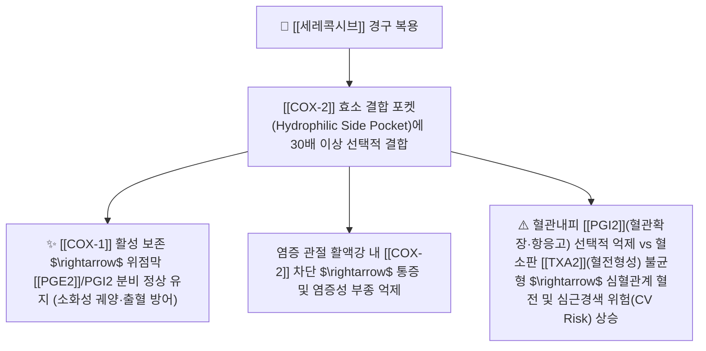

---
aliases:
  - Celecoxib
  - 쎄레브렉스
  - 셀콕스
  - 세레브
  - Celebrex
  - 쎄레브렉스캡슐
tags:
  - 약리/양방약
  - 해열진통소염제
  - NSAIDs
  - COX-2선택적
  - 관절염치료제
---

# 💊 [[세레콕시브]] (Celecoxib, 쎄레브렉스 / Celebrex, M01AH01)

> **핵심 3줄 요약 (Key Summary)**:
> - 🧪 약물 분류 & 표적: 디아릴 치환 피라졸(Diaryl-substituted pyrazole) 구조의 대표적인 **선택적 COX-2 억제제(Coxib 계열)**, [[COX-2]]만을 선택적으로 약 30배 이상 강력 억제하여 위점막 보호 인자([[COX-1]]) 보존.
> - 🎯 주요 적응증 & 원내외 처방 패턴: **고령자, 소화성 궤양 병력자, 항응고제 복용자**의 골관절염, 류마티스 관절염, 강직성 척추염, 성인 급성 통증 만성 유지 요법.
> - 🔬 분자약리 기전 & 약동학(PK/PD): 혈소판 응집 억제 간섭이 없어 수술 전후 출혈 위험이 적고, 위장관 궤양·출혈 발생률을 기존 NSAID 대비 50% 이상 낮춤. 반감기는 약 11시간으로 1일 1~2회 복용.
> - ⚠️ 블랙박스 경고 & 주요 부작용: 혈관내피의 항혈전 인자인 프로스타사이클린([[PGI2]]) 합성을 선택 억제하여 **심근경색·뇌졸중 등 심혈관계 혈전 질환(CV Risk) 위험 증가** 및 설폰아미드(Sulfa) 알레르기 환자 금기.

---

## 📌 목차
1. [기본 약물 정보 & 시판 제품·알약 식별 (Pill Identification)](#1-기본-약물-정보--시판-제품알약-식별-pill-identification)
2. [분자약리학적 작용 기전 (MOA) & 화학 구조](#2-분자약리학적-작용-기전-moa--화학-구조)
3. [약동학적 특성 (ADME: 흡수·분포·대사·배설)](#3-약동학적-특성-adme-흡수분포대사배설)
4. [진료과별 다빈도 처방 패턴 & 임상 적응증 (Sweet Spot vs 금기)](#4-진료과별-다빈도-처방-패턴--임상-적응증-sweet-spot-vs-금기)
5. [약물 상호작용 & 병용 금기 매트릭스](#5-약물-상호작용--병용-금기-매트릭스)
6. [부작용·독성 발현 기전 & 응급 해독 프로토콜](#6-부작용독성-발현-기전--응급-해독-프로토콜)
7. [💡 사용자 진료실 핵심 필기 & 한의 임상 연계·테이퍼링 팁 (원문 보존)](#7--사용자-진료실-핵심-필기--한의-임상-연계테이퍼링-팁-원문-보존)
8. [출처 및 학술 참고 문헌 (References)](#8-출처-및-학술-참고-문헌-references)

---

## 1. 기본 약물 정보 & 시판 제품·알약 식별 (Pill Identification)

| 항목 | 상세 정보 |
| :--- | :--- |
| **일반명 (Generic Name)** | [[세레콕시브]] (Celecoxib, USAN/INN) |
| **약효 분류 (Class)** | 선택적 COX-2 억제제 (Selective COX-2 Inhibitor, Coxib class NSAID) |
| **ATC 코드** | M01AH01 (Coxibs) / 114 해열·진통·소염제 |
| **약국 시판 제품 (OTC 일반약)** | 전문의약품으로 처방전 필요 (일반약 없음) |
| **병원 처방 의약품 (ETC 전문약)** | • **오리지널 경질캡슐**: **쎄레브렉스캡슐(Celebrex Cap, 비아트리스/화이자 오리지널 100mg, 200mg)** • **제네릭 캡슐**: 셀콕스캡슐(200mg), 세레브캡슐, 콕스비캡슐 |
| **상용 용법·용량** | • **골관절염 (퇴행성 관절염)**: 1일 1회 200mg 또는 1회 100mg씩 1일 2회 식후 복용 • **류마티스 관절염**: 1회 100~200mg씩 1일 2회 식후 복용 • **강직성 척추염**: 1일 1회 200mg (효과 불충분 시 최대 400mg/day) |

### 1.1 대표 시판 제품 및 함유 복합제 매핑 (Brand Identification & Combinations)

| 구분 | 대표 제품명 / 브랜드 | 함유 성분 및 1회당 함량 | 제형 및 특징 | 주요 적응증 및 복약 지도 핵심 |
| :--- | :--- | :--- | :--- | :--- |
| **오리지널 단일제 (ETC)** | [[쎄레브렉스]] (비아트리스/화이자) | [[세레콕시브]] 단일 (100mg / 200mg) | 백색/황색 띠 경질캡슐 | 고령자 관절염 1차 처방, 위장관 궤양 예방, 심혈관 위험 모니터링 |
| **제네릭 캡슐 (ETC)** | 셀콕스, 세레브, 콕스비 | [[세레콕시브]] (200mg) | 경질캡슐 | 골관절염, 강직성 척추염, 요통 만성 통증 조절 |

![[세레콕시브_패키지_박스.jpg|400]]
> [그림 1: 전 세계 정형외과 및 류마티스내과에서 고령 관절염 환자에게 가장 널리 처방되는 쎄레브렉스 200mg 패키지 외형]

![[세레콕시브_캡슐_알약.jpg|400]]
> [그림 2: 세레콕시브 경질캡슐 성상 및 식별 각인 성상]

---

## 2. 분자약리학적 작용 기전 (MOA) & 화학 구조

![[세레콕시브_화학구조.png|300]]
> [그림 3: 세레콕시브의 2D 평면 화학 분자 구조식 (4-[5-(4-methylphenyl)-3-(trifluoromethyl)pyrazol-1-yl]benzenesulfonamide, 분자량 381.37 g/mol, PubChem CID 2662)]

### 1) COX-2 선택적 결합의 분자 구조적 원리
* COX-2 효소의 활성 부위는 COX-1보다 곁주머니(Side Pocket)가 더 넓고 친수성입니다.
* 세레콕시브의 부피가 큰 설폰아미드기($-\text{SO}_2\text{NH}_2$)와 트리플루오로메틸기($-\text{CF}_3$)가 COX-2의 곁주머니에 완벽하게 결합하여 **COX-1에는 작용하지 않고 오직 COX-2만을 약 30배 이상 선택적으로 억제**합니다.

### 2) 위장관 보호의 이점 vs 심혈관 위험의 양날의 검
* **위장관 이점**: 위점막을 보호하는 COX-1을 건드리지 않으므로 기존 비선택적 NSAIDs 대비 위궤양, 위출혈 발생률을 50~70% 획기적으로 낮춥니다.
* **심혈관 위험 (CV Risk)**: 혈관내피세포의 항혈전·혈관확장 인자인 $\text{PGI}_2$ 생성을 선택 차단하는 반면, 혈소판의 혈전형성 인자인 $\text{TXA}_2$(COX-1 매개)는 억제하지 못하므로 **혈전 형성 경향이 증가하여 심근경색·뇌졸중 위험을 유발**할 수 있습니다.

---

## 3. 약동학적 특성 (ADME: 흡수·분포·대사·배설)

| 약동학 파라미터 | 수치 및 임상적 의미 |
| :--- | :--- |
| **생체이용률 (Bioavailability, F)** | 고지방 식사와 함께 복용 시 흡수율 증가 (경구 흡수 양호) |
| **최고혈중농도 도달시간 (Tmax)** | **약 2 ~ 4 시간** (서서히 최고농도 도달) |
| **혈장 단백결합률 (Protein Binding)** | **97%** (치료 농도 범위에서 혈청 단백질에 높은 결합) |
| **분포용적 (Volume of Distribution)** | 약 400 L (조직 및 관절낭 내 광범위 침투) |
| **간 대사 효소 (Metabolism)** | 간 마이크로솜 **CYP2C9**에 의해 주로 메틸수산화 및 카르복실화 비활성 대사 |
| **소실 반감기 (Elimination t1/2)** | **약 11.2 시간** (1일 1회 또는 1일 2회 복용으로 24시간 안정적 커버) |
| **주요 배설 경로 (Excretion)** | 투여량의 57%는 분변(담즙)으로, 27%는 신장 소변으로 대사체 배설 |

---

## 4. 진료과별 다빈도 처방 패턴 & 임상 적응증 (Sweet Spot vs 금기)

### 1) 주요 진료과별 처방 패턴
* **정형외과 / 류마티스내과**:
  * 65세 이상 고령 환자, 위궤양 기왕력자, 아스피린/와파린을 복용 중인 퇴행성 관절염 환자에게 1차 처방.
* **마취통증의학과**:
  * 수술 후 출혈 위험을 최소화해야 하는 환자의 진통 관리.

### 2) 최적 적응증 (Sweet Spot) vs 신중 투여 및 금기
* **[✅ 최적 적응증 (Sweet Spot)]**:
  * **위장관 출혈 고위험 관절염 환자**: 고령자, 스테로이드 병용자, 소화성 궤양 병력자.
  * **출혈 경향이 있는 수술 전후 환자**: 혈소판 기능 저해 없음.
* **[⚠️ 신중 투여 및 금기 (Caution / Contraindication)]**:
  * **허혈성 심장질환(협심증, 심근경색), 뇌졸중 기왕력자 절대 금기**: 혈전 위험.
  * **설폰아미드(Sulfa) 알레르기 환자 절대 금기**: 중증 피부 과민반응(스티븐스-존슨 증후군 등) 유발.
  * **중증 간장애(Child-Pugh C) 및 중증 신부전 환자 금기**.

---

## 5. 약물 상호작용 & 병용 금기 매트릭스

| 병용 약물 / 물질 | 상호작용 기전 | 임상적 위험 및 결과 | 처방 및 티칭 가이드 |
| :--- | :--- | :--- | :--- |
| 저용량 [[아스피린]] | COX-1 억제 추가로 위장관 보호 이점 상실 | 위궤양 발생률이 비선택적 NSAID 수준으로 급증 | 병용 시 반드시 PPI([[에스오메프라졸]]) 추가 처방 |
| 플루코나졸 (항진균제) | 간 CYP2C9 효소 강력 억제 | 세레콕시브 혈중 농도 2배 급상승 $\rightarrow$ 독성 위험 | 병용 시 세레콕시브 용량을 절반(100mg)으로 감량 |
| 설파제 계열 약물 | 설폰아미드 교차 과민반응 | 중증 알레르기성 쇼크 및 피부 박탈 | 처방 전 설파제 알레르기력 필수 청취 |
| 관절염 한약 ([[독활기생탕]], [[당귀점통탕]]) | 관절낭 미세순환 촉진 및 어혈 소산 | 쎄레브렉스 투여량 감량 및 심혈관 부작용 방어 | **양약 복용 1시간 후 한약 복용** |

---

## 6. 부작용·독성 발현 기전 & 응급 해독 프로토콜

* **핵심 부작용 프로파일**:
  1. **심혈관계**: 고혈압 악화, 말초 부종, 드물게 심근경색 및 뇌경색 발생 위험.
  2. **위장관계**: 복통, 설사, 소화불량 (비선택적 NSAID 대비 현저히 낮음).
  3. **면역계**: 설파제 교차 과민반응으로 인한 두드러기, 아나필락시스.
* **심혈관 안전성 임상 기준 (PRECISION Trial)**:
  * 24,000명 대상 대규모 PRECISION 임상시험 결과, 적정 용량(200mg/day) 투여 시 심혈관 위험도가 나프록센, 이부프로펜과 유사한 수준으로 통제 가능함이 입증됨.

---

## 7. 💡 사용자 진료실 핵심 필기 & 한의 임상 연계·테이퍼링 팁 (원문 보존)

* **진료실 실전 문진 체크리스트 (3대 핵심 질문)**:
  1. **"관절약으로 '쎄레브렉스'를 하루에 몇 번 드시나요?"**:
     * 1일 1회 200mg 복용인지 1일 2회 복용인지 확인하여 심혈관 리스크 평가.
  2. **"과거에 협심증, 심근경색으로 스텐트 시술을 받으셨거나 뇌졸중이 있으셨나요?"**:
     * 심혈관 질환 병력이 있는 환자에게는 쎄레브렉스 복용의 위험성을 설명하고 담당 주치의와 상의하여 나프록센 계열로 변경하거나 한의 치료로 전환 권고.
  3. **"설파제(설폰아미드) 항생제나 피부약에 알레르기가 있으신가요?"**:
     * 설파제 과민반응 병력 유무를 반드시 사전 확인.

* **한의 치료(침·약침·한약) 연계 및 양약 테이퍼링(감량) 전략**:
  1. **고령 골관절염 환자 심혈관 보호 통합 프로토콜**:
     * 슬안혈 봉약침, 관절강 주위 전침 치료와 함께 [[독활기생탕]], [[대방풍탕]]을 처방하여 관절 연골을 보양하고 혈관 탄력을 개선.
  2. **쎄레브렉스 테이퍼링 가이드**:
     * 한의 집중 치료 2~4주 후 조조강직과 보행 통증이 개선되면 200mg $\rightarrow$ 100mg $\rightarrow$ 격일 복용 $\rightarrow$ 단약으로 유도하여 장기 복용에 따른 심혈관계 혈전 위험을 근원적으로 차단.

---

## 8. 출처 및 학술 참고 문헌 (References)

1. **식품의약품안전처 (MFDS)**. 의약품 품목허가사항 및 안전성 서한: 세레콕시브 제제 (2023).
2. **Silverstein, F. E. et al. (2000)**. *Gastrointestinal toxicity with celecoxib vs nonsteroidal anti-inflammatory drugs for osteoarthritis and rheumatoid arthritis: The CLASS study*. **JAMA**, 284(10), 1247-1255.
   - **[연구 요약]**: 8,000명 대상 대규모 CLASS 연구에서 비선택적 NSAIDs 대비 세레콕시브의 유의미한 위장관 궤양 및 합병증 감소 입증.
3. **Nissen, S. E. et al. (2016)**. *Cardiovascular safety of celecoxib, naproxen, or ibuprofen for arthritis (PRECISION trial)*. **New England Journal of Medicine**, 375(26), 2519-2529.
   - **[연구 요약]**: 24,000명 대상 10년 추적 PRECISION 대규모 무작위 대조 시험에서 세레콕시브의 심혈관 안전성이 나프록센 및 이부프로펜 대비 비열등함을 증명.
4. **Clemett, D. & Goa, K. L. (2000)**. *Celecoxib: a review of its use in osteoarthritis, rheumatoid arthritis and acute pain*. **Drugs**, 59(4), 957-980.
   - **[연구 요약]**: 세레콕시브의 약리학적 특성, COX-2 선택적 억제 메커니즘 및 관절염 환자 삶의 질 개선 효과 총괄 분석.
