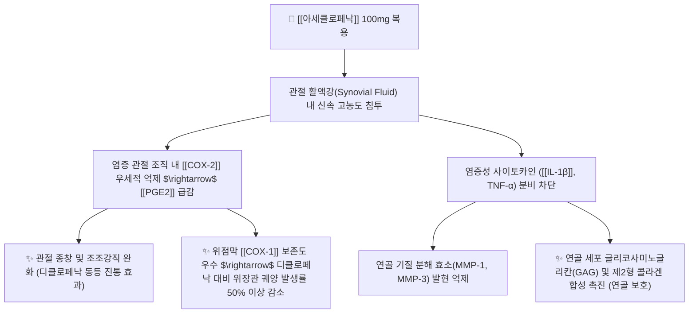

---
aliases:
  - Aceclofenac
  - 에어탈
  - 아클론
  - 에어클로
  - Airtal
  - 대웅아세클로페낙
tags:
  - 약리/양방약
  - 해열진통소염제
  - NSAIDs
  - 아세트산계
  - 관절염다빈도
---

# 💊 [[아세클로페낙]] (Aceclofenac, 에어탈 / Airtal, M01AB16)

> **핵심 3줄 요약 (Key Summary)**:
> - 🧪 약물 분류 & 표적: 페닐아세트산(Phenylacetic acid) 유도체 계열의 비스테로이드성 소염진통제(NSAID), [[COX-2]]에 대해 상대적으로 높은 선택적 억제능 보유, 관절 연골 기질 분해 효소(MMP) 억제 및 프로스타글란딘([[PGE2]]) 차단.
> - 🎯 주요 적응증 & 원내외 처방 패턴: **대한민국 정형외과·신경외과 외래 관절염 처방 1위 약물** (류마티스 관절염, 골관절염, 강직성 척추염, 요통, 견갑상완관절주위염, 치통).
> - 🔬 분자약리 기전 & 약동학(PK/PD): 경구 투여 시 거의 100% 흡수, 관절 활액강(Synovial Fluid) 내로 신속히 침투하여 혈청 농도의 50% 이상을 유지하며, 관절 연골의 글리코사미노글리칸(GAG) 합성을 촉진하는 연골 보호 특성 발휘.
> - ⚠️ 블랙박스 경고 & 주요 부작용: 디클로페낙 대비 위장관 궤양 발생률이 유의하게 낮으나, 장기 복용 시 소화기 궤양, 신혈류 저하 및 간효소 수치(AST/ALT) 상승 모니터링 필요.

---

## 📌 목차
1. [약물 기본 정보 및 시판 제품 (Brand Identification)](#1-약물-기본-정보-및-시판-제품-brand-identification)
2. [분자약리학적 작용 기전 (MOA) & 화학 구조](#2-분자약리학적-작용-기전-moa--화학-구조)
3. [약동학적 특성 (ADME: 흡수·분포·대사·배설)](#3-약동학적-특성-adme-흡수분포대사배설)
4. [진료과별 다빈도 처방 패턴 & 임상 적응증 (Sweet Spot vs 금기)](#4-진료과별-다빈도-처방-패턴--임상-적응증-sweet-spot-vs-금기)
5. [약물 상호작용 & 병용 금기 매트릭스](#5-약물-상호작용--병용-금기-매트릭스)
6. [부작용·독성 발현 기전 & 응급 해독 프로토콜](#6-부작용독성-발현-기전--응급-해독-프로토콜)
7. [💡 사용자 진료실 핵심 필기 & 한의 임상 연계·테이퍼링 팁 (원문 보존)](#7--사용자-진료실-핵심-필기--한의-임상-연계테이퍼링-팁-원문-보존)
8. [출처 및 학술 참고 문헌 (References)](#8-출처-및-학술-참고-문헌-references)

---

## 1. 약물 기본 정보 및 시판 제품 (Brand Identification)

> [!abstract]+ 🧪 3D 약리 분자 구조 (Interactive 3D Viewer)
> <iframe src="https://molecule-viewer-rho.vercel.app/?cid=71771" style="width: 100%; height: 600px; border: none; border-radius: 12px; box-shadow: 0 4px 20px rgba(0,0,0,0.15);" allowfullscreen></iframe>

| 항목 | 상세 정보 |
| :--- | :--- |
| **일반명 (Generic Name)** | [[아세클로페낙]] (Aceclofenac, INN) |
| **약효 분류 (Class)** | 페닐아세트산 유도체 소염진통제 (Phenylacetic acid derivative NSAID) |
| **ATC 코드** | M01AB16 (Acetic acid derivatives and related substances) |
| **약국 시판 제품 (OTC 일반약)** | 전문의약품(ETC) 위주 처방 약물 (일반약 단일제는 거의 없음) |
| **병원 처방 의약품 (ETC 전문약)** | • **단일제 (속방형 100mg)**: **에어탈정(Airtal Tab, 대웅제약 오리지널)**, 아클론정, 에어클로정, 세클로낙정 • **서방정 (CR 200mg)**: **에어탈CR정(1일 1회 제형)**, 아클론CR정, 클로페낙CR정 • **복합제 (위보호 복합)**: 아세클로페낙 + [[레바미피드]] 복합 개량신약 |
| **상용 용법·용량** | • **속방정 (100mg)**: 성인 1회 1정(100mg), 1일 2회(12시간 간격) 아침·저녁 식후 복용 • **서방정 (CR 200mg)**: 성인 1일 1회 1정(200mg) 매일 같은 시간 식후 복용 |

### 1.1 대표 시판 제품 및 함유 복합제 매핑 (Brand Identification & Combinations)

| 구분 | 대표 제품명 / 브랜드 | 함유 성분 및 1회당 함량 | 제형 및 특징 | 주요 적응증 및 복약 지도 핵심 |
| :--- | :--- | :--- | :--- | :--- |
| **오리지널 속방정 (ETC)** | [[에어탈]] (대웅제약) | [[아세클로페낙]] 단일 (100mg) | 백색 원형 필름코팅정 | 정형외과 외래 관절염 1차 처방, 1일 2회 식후 복용 |
| **1일 1회 서방정 (ETC)** | 에어탈CR정, 아클론CR | [[아세클로페낙]] (200mg 서방형) | 서방성 필름코팅정 | 복약 순응도 개선, 쪼개거나 씹지 않고 통째로 복용 |
| **정형외과 3제 세트처방** | 에어탈 + 뮤렉스 + 무코스타 | 아세클로페낙 + [[에페리손]] + [[레바미피드]] | 개별 정제 병용 | 근골격계 통증 + 근이완 + 위점막 보호 표준 처방 |

![[아세클로페낙_패키지_박스.jpg|400]]
> [그림 1: 정형외과 및 신경외과에서 가장 다빈도로 처방되는 아세클로페낙(에어탈) 계열 포장 패키지]

![[아세클로페낙_블리스터_알약.jpg|400]]
> [그림 2: 아세클로페낙 100mg 필름코팅정 알약 성상 및 PTP 블리스터 포장]

---

## 2. 분자약리학적 작용 기전 (MOA) & 화학 구조

![[아세클로페낙_화학구조.png|300]]
> [그림 3: 아세클로페낙의 2D 평면 화학 분자 구조식 (2-[2-[2-(2,6-dichloroanilino)phenyl]acetyl]oxyacetic acid, 분자량 354.18 g/mol, PubChem CID 71771)]

### 1) 관절 연골 보호 (Chondroprotective) 독특한 기전
* 전통적인 NSAIDs 중 일부(인도메타신 등)는 장기 복용 시 오히려 연골 기질 합성을 억제하여 관절 연골 퇴행을 가속화시키는 문제가 있었습니다.
* 아세클로페낙은 관절 활액강 내에서 연골 파괴 물질인 **인터루킨-1($\text{IL}-1\beta$) 및 기질금속단백분해효소(MMP)** 생성을 억제하고, **연골의 주성분인 글리코사미노글리칸(GAG) 합성을 자극**하여 연골 파괴를 방어하는 임상 약리학적 장점을 가집니다.

### 2) COX-2 선택성과 위장관 안전성
* 화학적으로 디클로페낙(Diclofenac)의 에스테르 유도체 구조를 가지며, 체내에서 디클로페낙보다 [[COX-2]]에 대해 약 4~5배 높은 상대적 선택성을 보입니다.
* 따라서 디클로페낙과 동등한 강력한 소염·진통 효능을 나타내면서도 위장관 궤양, 천공 및 출혈 발생률은 절반 수준으로 낮습니다.

---

## 3. 약동학적 특성 (ADME: 흡수·분포·대사·배설)

| 약동학 파라미터 | 수치 및 임상적 의미 |
| :--- | :--- |
| **생체이용률 (Bioavailability, F)** | **거의 100%** (경구 투여 시 지연 없이 완전 흡수) |
| **최고혈중농도 도달시간 (Tmax)** | **1.25 ~ 3.0 시간** (식후 복용 시 흡수율 유지되며 최고농도 도달) |
| **혈장 단백결합률 (Protein Binding)** | **> 99.7%** (혈청 알부민에 강력 결합) |
| **분포 특성 (Distribution)** | **관절 활액강 침투 우수** (활액 내 최고 농도는 혈청 농도의 50~60% 도달, 12시간 지속) |
| **간 대사 효소 (Metabolism)** | 간 마이크로솜 **CYP2C9**에 의해 주요 활성 대사체인 4'-하이드록시아세클로페낙 및 미량의 디클로페낙으로 대사 |
| **소실 반감기 (Elimination t1/2)** | **4.0 ~ 4.3 시간** (관절 활액 내 반감기는 약 6~8시간으로 연장) |
| **주요 배설 경로 (Excretion)** | 투여량의 70~80%가 신장 소변으로 배설 (대사체 및 글루쿠론산 포합체), 약 20%는 담즙/분변 배설 |

---

## 4. 진료과별 다빈도 처방 패턴 & 임상 적응증 (Sweet Spot vs 금기)

### 1) 주요 진료과별 처방 패턴
* **정형외과 / 신경외과 / 마취통증의학과**:
  * 퇴행성 무릎 골관절염, 척추관 협착증, 요추 추간판 탈출증, 오십견(유착성 관절낭염)에 1차 표준 약물로 처방.
  * 단독 처방보다 **'에어탈 + 근이완제([[에페리손]]) + 위점막보호제([[레바미피드]] 또는 스티렌)' 3제 세트** 처방이 가장 보편적.
* **류마티스내과**:
  * 강직성 척추염 및 류마티스 관절염의 관절 강직 완화.

### 2) 최적 적응증 (Sweet Spot) vs 신중 투여 및 금기
* **[✅ 최적 적응증 (Sweet Spot)]**:
  * **만성 퇴행성 관절염 환자**: 연골 기질(GAG) 보존 효과와 관절 활액강 집중 침투.
  * **디클로페낙 복용 후 속쓰림을 겪은 환자**: 우수한 위장관 내약성.
* **[⚠️ 신중 투여 및 금기 (Caution / Contraindication)]**:
  * **활동성 소화성 궤양 및 뇌출혈 기왕력자 금기**: 출혈 위험.
  * **중증 간부전 및 신부전 환자 금기**: CYP2C9 대사 저하 및 체액 저류.
  * **울혈성 심부전(NYHA II-IV) 및 허혈성 심장질환 환자 금기**: 혈관 사건 위험.

---

## 5. 약물 상호작용 & 병용 금기 매트릭스

| 병용 약물 / 물질 | 상호작용 기전 | 임상적 위험 및 결과 | 처방 및 티칭 가이드 |
| :--- | :--- | :--- | :--- |
| 메토트렉세이트 (MTX) | 신세뇨관 배설 경쟁 억제 | MTX 혈중 농도 급상승 $\rightarrow$ **골수 억제 및 혈액 독성** | 류마티스 환자 병용 시 MTX 독성 모니터링 |
| 리튬 (Lithium) | 신장 리튬 청소율 감소 | 리튬 독성(진전, 운동실조, 신독성) 유발 | 혈중 리튬 농도 주기적 측정 |
| 항응고제 ([[와파린]], [[NOAC]]) | 혈소판 기능 억제 + 점막 손상 | 소화관 출혈 위험 증가 | 정형외과 수술 전후 병용 엄격 제한 |
| 관절염 한약 ([[방기황기탕]], [[대강활탕]]) | 활액 순환 촉진 및 비위 기능 보강 | 아세클로페낙 복용량 감량 및 부작용 억제 | **양약 복용 1시간 후 한약 복용** |

---

## 6. 부작용·독성 발현 기전 & 응급 해독 프로토콜

* **유해반응 발현율**:
  * 디클로페낙, 피록시캄, 나프록센 대비 전체 이상반응 발생률 및 복약 중단율이 유의미하게 낮음(유럽 대규모 관찰 연구 SAMM study 입증).
* **주요 부작용**:
  * 소화불량, 복통, 구역(가장 흔함, 약 2~3%).
  * 간기능 효소치(ALT/AST)의 일시적 상승(1~2%).
* **대처 프로토콜**:
  * 소화기 증상 발생 시 레바미피드(무코스타) 용량 조절 및 식후 즉시 복용 철저.
  * 3개월 이상 장기 처방 환자는 6개월 단위로 혈액검사(LFT, RFT) 권고.

---

## 7. 💡 사용자 진료실 핵심 필기 & 한의 임상 연계·테이퍼링 팁 (원문 보존)

* **진료실 실전 문진 체크리스트 (3대 핵심 질문)**:
  1. **"병원에서 처방받으신 관절약 봉투에 '에어탈'이나 '아클론'이 적혀 있나요?"**:
     * 정형외과에서 관절염 약을 처방받은 환자의 과반수가 에어탈을 복용 중이므로 약봉투나 처방전을 확인하여 성분 중복 확인.
  2. **"약을 하루에 한 번 드시나요, 아침저녁 두 번 드시나요?"**:
     * 100mg 속방정(1일 2회)인지 200mg CR 서방정(1일 1회)인지 확인하여 임의로 쪼개먹지 않도록 복약 지도.
  3. **"약 복용 후 소화불량이나 더부룩함이 있으신가요?"**:
     * 점막보호제가 함께 처방되어 있는지 확인하고 비위 허약 상태 평가.

* **한의 치료(침·약침·한약) 연계 및 양약 테이퍼링(감량) 전략**:
  1. **슬관절염 삼출액 및 관절통 통합 치료**:
     * 무릎 관절강 주위 학정, 슬안 혈자리에 봉약침 및 소염약침을 시술하고, [[방기황기탕]], [[대방풍탕]]을 처방하여 관절 부종과 열감을 흡수.
  2. **정형외과 3제 세트 테이퍼링 프로토콜**:
     * 침·약침 치료 2주 경과 후 통증 NRS가 7 $\rightarrow$ 3 이하로 감소하면, 에어탈 1일 2회 $\rightarrow$ 1일 1회 $\rightarrow$ 격일 복용으로 단계적 테이퍼링을 완수하여 위장관 부담 해소.

---

## 8. 출처 및 학술 참고 문헌 (References)

1. **식품의약품안전처 (MFDS)**. 의약품 품목허가사항 및 안전성 서한: 아세클로페낙 제제 (2023).
2. **Henrotin, Y. et al. (2001)**. *In vitro effects of aceclofenac and its metabolites on the production by chondrocytes of inflammatory mediators*. **Inflammation Research**, 50(8), 391-399.
   - [PubMed (PMID: 11556519)](https://pubmed.ncbi.nlm.nih.gov/11556519/) | [DOI](https://doi.org/10.1007/s000110050798)
   - **[연구 요약]**: 아세클로페낙 및 대사체가 연골세포의 염증 매개물질 생성을 억제하고 관절 연골 기질을 보호하는 기전 입증.
3. **Dooley, M. et al. (2001)**. *Aceclofenac: a reappraisal of its use in the management of pain and rheumatic disease*. **Drugs**, 61(9), 1351-1378.
   - [PubMed (PMID: 11511027)](https://pubmed.ncbi.nlm.nih.gov/11511027/) | [DOI](https://doi.org/10.2165/00003495-200161090-00012)
   - **[연구 요약]**: 관절염 및 류마티스 질환 통증 관리에서 아세클로페낙의 우수한 진통 소염 효과 및 소화기계 내약성 종합 재평가.
