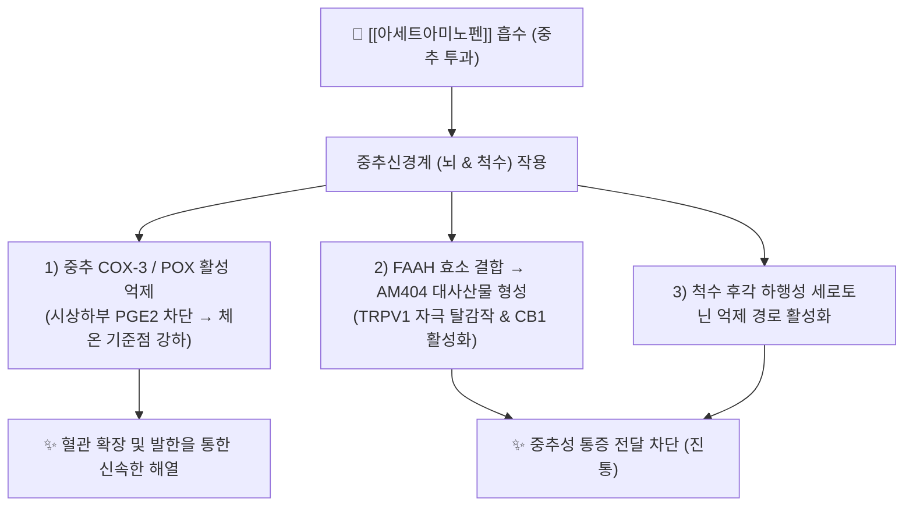

---
aliases:
  - 타이레놀
  - Tylenol
  - AAP
  - Paracetamol
  - 파라세타몰
  - 세토펜
tags:
  - 양방약
  - 해열진통제
  - 중추성진통제
---

# 💊 [[아세트아미노펜]] (Acetaminophen / Paracetamol, AAP, N02BE01)

> **핵심 3줄 요약 (Key Summary)**:
> - 🧪 약물 분류 & 표적: 아닐린계 비마약성 중추성 해열진통제, 중추신경계 COX-3/POX 억제 및 세로토닌 하행 억제 통로 활성화, 내인성 카나비노이드(TRPV1/CB1) 재흡수 억제.
> - 🎯 주요 적응증 & 원내외 처방 패턴: 경도~중등도의 급만성 통증([[두통]], [[근막통증증후군]], 치통, 관절통) 및 발열, 위장관 궤양이나 출혈 위험으로 NSAIDs를 쓰지 못하는 환자의 1차 선택 해열진통제.
> - 🔬 분자약리 기전 & 약동학(PK/PD): 말초 소염 작용은 거의 없으며 중추성 진통·해열 작용 발휘, 간에서 90% 이상 글루쿠론산·황산 포합 대사, 5~10%가 CYP2E1에 의해 독성 대사체 NAPQI로 산화 후 글루타치온에 의해 해독.
> - ⚠️ 블랙박스 경고 & 주요 부작용: 1일 최대 복용량(4,000mg) 초과 시 또는 음주 후 복용 시 CYP2E1 유도 및 글루타치온 고갈로 치명적 급성 간부전(간소엽 중심 괴사) 유발.

---

## 📌 목차
1. [기본 약물 정보 & 시판 제품·알약 식별 (Pill Identification)](#1-기본-약물-정보--시판-제품알약-식별-pill-identification)
2. [분자약리학적 작용 기전 (MOA) & 화학 구조](#2-분자약리학적-작용-기전-moa--화학-구조)
3. [약동학적 특성 (ADME: 흡수·분포·대사·배설)](#3-약동학적-특성-adme-흡수분포대사배설)
4. [진료과별 다빈도 처방 패턴 & 임상 적응증 (Sweet Spot vs 금기)](#4-진료과별-다빈도-처방-패턴--임상-적응증-sweet-spot-vs-금기)
5. [약물 상호작용 & 병용 금기 매트릭스](#5-약물-상호작용--병용-금기-매트릭스)
6. [부작용·독성 발현 기전 & 응급 해독 프로토콜](#6-부작용독성-발현-기전--응급-해독-프로토콜)
7. [💡 사용자 진료실 핵심 필기 & 한의 임상 연계·테이퍼링 팁 (원문 보존)](#7--사용자-진료실-핵심-필기--한의-임상-연계테이퍼링-팁-원문-보존)
8. [출처 및 학술 참고 문헌 (References)](#8-출처-및-학술-참고-문헌-references)

---

## 1. 기본 약물 정보 & 시판 제품·알약 식별 (Pill Identification)

| 항목                      | 상세 내용                                                                                                                                                                         |
| :---------------------- | :---------------------------------------------------------------------------------------------------------------------------------------------------------------------------- |
| **일반명 (Generic Name)**  | Acetaminophen (USAN) / Paracetamol (INN) / [[아세트아미노펜]]                                                                                                                        |
| **약효 분류 (Class)**       | 비마약성 중추성 해열진통제 (Aniline derivative)                                                                                                                                           |
| **ATC 코드**              | N02BE01 (Analgesics, Other antipyretics and analgesics)                                                                                                                       |
| **약국 시판 제품 (OTC 일반약)**  | • **단일제**: 타이레놀정 500mg, 타이레놀 8시간 ER 서방정 650mg, 타세놀정, 세토펜현탁액<br>• **복합제 (진통·감기약)**: 게보린정(AAP+이소프로필안티피린+카페인), 펜잘큐정, 판피린큐액(300mg 함유), 판콜에스/판콜에이, 테라플루                            |
| **병원 처방 의약품 (ETC 전문약)** | • **단일제**: 세토펜정 325mg/500mg, 아세트아미노펜정<br>• **마약성/비마약성 복합제**: **울트라셋정** / **파라마셋정** (트라마돌염산염 37.5mg + AAP 325mg), **울트라셋이알서방정** (트라마돌 75mg + AAP 650mg)                        |
| **상용 용법·용량**            | • **속방정 (500mg)**: 1회 1~2정(500~1,000mg), 4~6시간 간격 (1일 최대 4,000mg)<br>• **서방정 (ER 650mg)**: 1회 2정(1,300mg), 8시간 간격 (1일 최대 6정, 3,900mg)<br>• **울트라셋 복합제**: 1회 1~2정, 1일 최대 8정 이하 |

### 1.1 대표 시판 제품 및 함유 복합제 매핑 (Brand Identification & Combinations)

| 구분 | 대표 제품명 / 브랜드 | 함유 성분 및 1회당 함량 | 제형 및 방출 특성 | 주요 적응증 및 복약 지도 핵심 |
| :--- | :--- | :--- | :--- | :--- |
| **단일제 (OTC/ETC)** | [[타이레놀]] (500mg/ER 650mg), [[세토펜]] | [[아세트아미노펜]] 단일 (500mg / 650mg) | 속방정, 이중서방정, 소아시럽 | 발열·두통 1차 선택, 1일 최대 4,000mg 준수 |
| **복합 진통제 (OTC)** | [[게보린]], 펜잘큐 | [[아세트아미노펜]] (300mg) + [[이소프로필안티피린]] + [[카페인무수물]] | 정제 | 신속한 두통·치통 완화, 15세 미만 금기 |
| **생리통 복합제 (OTC)** | [[우먼스타이레놀]], 게보린소프트 | [[아세트아미노펜]] (500mg) + [[파마브롬]] (25mg) | 속방정 | 원발성 생리통 및 부종·하복부 팽만감 완화 |
| **종합감기약 (OTC)** | [[판피린]], [[판콜]], 타이레놀콜드 | [[아세트아미노펜]] (300~325mg) + 항히스타민 + 비충혈제거제 | 액제, 정제 | 종합 감기, 타이레놀 중복 복용에 따른 간독성 주의 |
| **처방 전문약 (ETC)** | 울트라셋, 파라마셋 | [[아세트아미노펜]] (325mg) + [[트라마돌]] (37.5mg) | 정제, 서방정 | 중등도 이상 급만성 통증, 변비·어지럼 모니터링 |
| **감별 다빈도 일반약** | [[스토파]], [[마그밀정]] | [[탄닌산베르베린]], [[수산화마그네슘]] | 정제 (지사제 / 완하제) | 복약력 청취 시 성분 중복 여부 및 복용 목적 감별 |

![[타이레놀_한국형_패키지.jpg|400]]
> [그림 1: 대한민국 약국 및 편의점에서 가장 널리 유통되는 타이레놀(Tylenol) 500mg 상용 패키지 외형]

![[아세트아미노펜_블리스터_알약.jpg|400]]
> [그림 2: 아세트아미노펜 500mg 정제 알약 외형 및 PTP 블리스터 포장]

---

## 2. 분자약리학적 작용 기전 (MOA) & 화학 구조

![[아세트아미노펜_화학구조.png|320]]
> [그림 3: 아세트아미노펜의 2D 화학 구조식 (N-(4-hydroxyphenyl)acetamide, 분자량 151.16 g/mol)]



### 1) 중추성 COX 효소 POX 부위 억제
* 말초 염증 부위에는 고농도의 지질 과산화물(Peroxide)이 존재하여 아세트아미노펜의 효소 억제능을 무력화하므로 **말초 소염 작용은 거의 없습니다.**
* 반면 과산화물 농도가 낮은 뇌와 척수 등 중추신경계에서는 COX 효소의 과산화효소 활성 부위(POX)를 선택적으로 환원시켜 시상하부 발열 기준점을 정상화하고 통증 신호 전달을 억제합니다.

### 2) AM404 생성 및 카나비노이드/TRPV1 신호 조절
* 뇌세포에서 FAAH 효소에 의해 아라키돈산과 결합하여 활성 대사체인 **AM404**로 전환됩니다.
* AM404는 내인성 카나비노이드 $\text{CB}_1$ 수용체를 활성화하고 통증 수용체인 $\text{TRPV}_1$ 채널을 탈감작시켜 척수 후각에서의 통증 상행 전도를 강력히 차단합니다.

---

## 3. 약동학적 특성 (ADME: 흡수·분포·대사·배설)

* **흡수 (Absorption)**:
  * 경구 투여 시 소장에서 신속히 흡수되며, 생체이용률은 약 88~90%입니다. 최고혈중농도 도달시간($\text{T}_{\text{max}}$)은 속방정 30~60분, ER 서방정 1~2시간입니다.
* **분포 (Distribution)**:
  * 혈장 단백결합률은 10~25%로 매우 낮아 혈액뇌장벽(BBB)을 빠르게 통과하여 중추신경계 전반에 신속히 분포합니다.
* **대사 (Metabolism - 간 대사 경로)**:
  * **정상 포합 대사 (90~95%)**: 간세포 내 제2상 대사 효소에 의해 **글루쿠론산 포합(55~60%)** 및 **황산 포합(30~35%)**을 거쳐 무독성 물질로 대사됩니다.
  * **독성 산화 대사 (5~10%)**: 간 마이크로솜의 **CYP2E1** (및 CYP1A2, CYP3A4) 효소에 의해 반응성 중간체인 **NAPQI (N-acetyl-p-benzoquinone imine)**로 산화됩니다.
  * **간세포 내 정상 해독**: 생성된 독성 물질 NAPQI는 간세포 내 **글루타치온(Glutathione, GSH)**과 신속히 결합하여 무독한 머캅투르산(Mercapturic acid)으로 포합되어 소변으로 배출됩니다.
* **배설 (Excretion)**:
  * 투여량의 90% 이상이 24시간 이내에 뇨로 배설되며, 소실 반감기($\text{t}_{1/2}$)는 2~3시간입니다.

---

## 4. 진료과별 다빈도 처방 패턴 & 임상 적응증 (Sweet Spot vs 금기)

### 1) 주요 진료과별 처방 패턴
* **정형외과 / 신경외과 / 마취통증의학과**:
  * 급성 요추 염좌, 경추통, 퇴행성 관절염 환자에게 NSAIDs(세레콕시브, 에토리콕시브 등)와 함께 1차 처방되거나, 통증이 극심할 때 **울트라셋정(트라마돌+AAP)** 형태로 다빈도 처방.
* **내과 / 가정의학과 / 이비인후과**:
  * 감기몸살, 급성 상기도 감염, 두통, 백신 접종 후 발열에 타이레놀 500mg 또는 ER 서방정 650mg 처방.
* **치과 / 산부인과**:
  * 발치 후 통증, 임산부 및 수유부의 두통, 생리통 1차 선택제.

### 2) 최적 적응증 (Sweet Spot) vs 신중 투여 및 금기
* **[✅ 최적 적응증 (Sweet Spot)]**:
  * **소화성 궤양 및 위장장애 환자**: NSAIDs 복용 시 속쓰림, 위출혈 병력이 있는 환자의 안전한 통증 조절.
  * **출혈 경향 및 항응고제 복용 환자**: 혈소판 응집 억제 기능이 없어 아스피린, 와파린, NOAC 복용 환자에게 적합.
  * **임산부 및 소아 환자**: 태아 기형 및 라이 증후군 위험이 없어 전 연령대 1차 해열진통제로 최적.
* **[⚠️ 신중 투여 및 금기 (Caution / Contraindication)]**:
  * **중증 만성 간질환자 절대 금기**: 간경변, 간부전 환자 투약 금기.
  * **만성 음주자 주의**: 정기적으로 술을 마시는 환자는 CYP2E1이 유도되어 통상 용량에서도 간세포 손상 위험.

---

## 5. 약물 상호작용 & 병용 금기 매트릭스

| 병용 약물 / 물질 | 상호작용 기전 | 임상적 위험 및 결과 | 처방 및 티칭 가이드 |
| :--- | :--- | :--- | :--- |
| [[알코올]] (술) | 간내 CYP2E1 효소 발현 유도 + 간세포 글루타치온 고갈 | 독성 대사체 NAPQI 대량 생성 $\rightarrow$ **급성 간소엽 중심 괴사** | **음주 전후 복용 절대 금기 (최소 24시간 이상 간격)** |
| 종합감기약 (판피린, 판콜 등) | 동일한 아세트아미노펜 성분 중복 투여 | 1일 허용 용량(4,000mg) 초과로 인한 간독성 급증 | **처방 전 복용 중인 모든 일반약 전수 확인** |
| 이소니아지드 (항결핵제) | CYP2E1 효소 활성화 | 간독성 위험 상승 | 병용 시 간기능 수치(AST/ALT) 정기 추적 |
| 간보호 한약 ([[갈근]], [[인진호]]) | 간세포 글루타치온(GSH) 합성 촉진 및 항산화 | 약인성 간 손상 완충 및 해독 시너지 | **양약 복용 1~2시간 후 투약** |

---

## 6. 부작용·독성 발현 기전 & 응급 해독 프로토콜

```mermaid
graph TD
    Overdose["⚠️ [[아세트아미노펜]] 과량 복용 (4g 초과 / 음주 병용)"] --> Sat["정상 글루쿠론산/황산 포합 경로 포화"]
    Sat --> CYP["CYP2E1 산화 대사 경로 급증"]
    CYP --> NAPQI["독성 대사체 NAPQI 과다 생성"]
    NAPQI --> Depl["간내 글루타치온(GSH) 완전 고갈 (70% 이상 소모)"]
    Depl --> Bind["NAPQI가 간세포 미토콘드리아 단백질과 공유 결합"]
    Bind --> Necrosis["🔥 미토콘드리아 ATP 생성 중단 & 급성 간세포 괴사 (전격성 간부전)"]
    
    NAC["💉 특이 해독제: N-아세틸시스테인 (NAC) 투여"] -->|GSH 전구체(Cysteine) 공급 & 직접 결합| Rescue["✨ NAPQI 무독화 & 간세포 괴사 방어"]
```

* **과량 복용 시 급성 간부전 진행 단계**:
  * **초기 (0~24시간)**: 무증상 또는 가벼운 오심, 구토, 무기력, 식은땀.
  * **잠복기 (24~72시간)**: 초기 증상이 일시 완화되는 듯 보이나 우상복부 압통 발생, AST/ALT 및 빌리루빈 급상승.
  * **극기 (72~96시간)**: 황달, 혈액응고장애(PT 지연), 간성뇌증, 급성 세뇨관 괴사(신부전), 사망 위험.
* **응급 해독 프로토콜**:
  * **특이 해독제**: **N-아세틸시스테인 (NAC, N-acetylcysteine)**.
  * **해독 기전**: 글루타치온의 합성 원료인 L-시스테인을 공급하여 간내 글루타치온 농도를 복구하고, NAC 자체가 NAPQI와 직접 결합하여 무독화.
  * **투여 골든타임**: 복용 후 8시간 이내에 NAC 투여 시 100% 간세포 보호 가능.

---

## 7. 💡 사용자 진료실 핵심 필기 & 한의 임상 연계·테이퍼링 팁 (원문 보존)

* **진료실 실전 문진 체크리스트 (3대 핵심 질문)**:
  1. **"하루에 타이레놀을 몇 알 드시나요?"**:
     * 환자가 500mg 정제를 하루 8알(4,000mg) 이상 복용하고 있는지, ER 서방정(650mg)을 6알 이상 복용하고 있는지 확인.
  2. **"약국이나 편의점에서 사신 감기약, 두통약도 같이 드시나요?"**:
     * 판피린, 판콜, 게보린, 테라플루 등에 모두 아세트아미노펜이 함유되어 있어 중복 과다 복용 위험이 매우 높음.
  3. **"어제 술을 드셨거나, 평소 주 3회 이상 음주를 하시나요?"**:
     * 술을 복용하면 간의 CYP2E1 효소가 급증하여 산화된 아세트아미노펜(NAPQI)을 과하게 증가시키므로 숙취 두통 환자에게 타이레놀 복용을 엄격히 금지.

* **한의 치료(침·약침·한약) 연계 및 양약 테이퍼링(감량) 전략**:
  1. **숙취 두통 환자 대체 처방**:
     * 음주 후 두통 환자에게는 타이레놀 대신 [[갈근해기탕]], [[대금음자]], [[반하백출천마탕]]을 처방하여 간내 알코올 대사를 촉진하고 안전하게 두통을 해소.
  2. **근골격계 만성 통증 테이퍼링 프로토콜**:
     * 정형외과에서 울트라셋(트라마돌+AAP)을 장기 복용하여 변비, 오심, 어지럼증을 겪는 환자에게 협척혈 침 치료 및 봉약침/신바로약침을 병행하며, 1주 단위로 울트라셋 복용량을 1/2로 단계적 감량 유도.

---

## 8. 출처 및 학술 참고 문헌 (References)

1. **식품의약품안전처 (MFDS)**. 의약품 품목허가사항 및 안전성 서한: 아세트아미노펜 단일제 및 복합제 (2023).
2. **Prescott, L. F. (2000)**. *Paracetamol: Past, present, and future*. **American Journal of Therapeutics**, 7(2), 143-148.
   - **[연구 요약]**: 아세트아미노펜의 역사, 분자 기전, 중추성 COX 억제 특성 및 간 대사 경로를 집대성한 표준 레퍼런스.
3. **McGill, M. R. & Jaeschke, H. (2013)**. *Metabolism and disposition of acetaminophen: Recent advances in relation to hepatotoxicity and diagnosis*. **Biochemical Pharmacology**, 85(5), 605-610.
   - **[연구 요약]**: CYP2E1에 의한 NAPQI 생성, 미토콘드리아 산화 스트레스 유발 및 NAC의 간세포 보호 분자 기전 상세 규명.
4. **Mallet, C. et al. (2008)**. *The analgesic effect of paracetamol is mediated by the cannabinoid CB1 receptor via AM404*. **Pain**, 135(1-2), 180-188.
   - **[연구 요약]**: 아세트아미노펜의 중추성 진통 효과가 대뇌 대사산물 AM404의 카나비노이드 CB1 수용체 활성화에 의해 매개됨을 증명.
