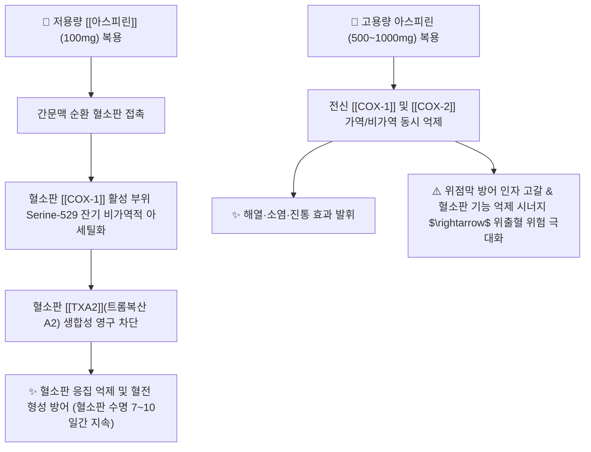

---
aliases:
  - Aspirin
  - 아세틸살리실산
  - 아스피린프로텍트
  - 바이엘아스피린
  - ASA
  - 보령아스트릭스
  - AcetylsalicylicAcid
tags:
  - 약리/양방약
  - 항혈전제
  - 해열진통소염제
  - NSAIDs
  - 살리실산계
---

# 💊 [[아스피린]] (Aspirin / Acetylsalicylic Acid, ASA, B01AC06 / N02BA01)

> **핵심 3줄 요약 (Key Summary)**:
> - 🧪 약물 분류 & 표적: 살리실산(Salicylic acid)의 아세틸화 합성 유도체, **저용량(100mg 장용정, 심혈관 항혈전제)** 및 **고용량(500mg 정제, 해열·소염·진통제)** 이중 적응증.
> - 🎯 주요 적응증 & 원내외 처방 패턴: 심근경색, 허혈성 뇌졸중(뇌경색), 일과성 허혈발작(TIA), 관상동맥 스텐트 시술 후 혈전 예방(100mg 1일 1회 유지요법) 및 급성 통증·관절통(500mg).
> - 🔬 분자약리 기전 & 약동학(PK/PD): 혈소판의 [[COX-1]] Ser529 잔기를 **비가역적으로 아세틸화**하여 혈소판 수명(7~10일) 동안 트롬복산([[TXA2]]) 생성을 영구 차단.
> - ⚠️ 블랙박스 경고 & 주요 부작용: 비가역적 혈소판 억제로 인한 출혈 시간 연장(침·습부항·발치·수술 전 7일 중단 검토), 위장관 출혈, 소아 바이러스 감염 시 치명적 라이 증후군(Reye's syndrome) 위험.

---

## 📌 목차
1. [기본 약물 정보 & 시판 제품·알약 식별 (Pill Identification)](#1-기본-약물-정보--시판-제품알약-식별-pill-identification)
2. [분자약리학적 작용 기전 (MOA) & 화학 구조](#2-분자약리학적-작용-기전-moa--화학-구조)
3. [약동학적 특성 (ADME: 흡수·분포·대사·배설)](#3-약동학적-특성-adme-흡수분포대사배설)
4. [진료과별 다빈도 처방 패턴 & 임상 적응증 (Sweet Spot vs 금기)](#4-진료과별-다빈도-처방-패턴--임상-적응증-sweet-spot-vs-금기)
5. [약물 상호작용 & 병용 금기 매트릭스](#5-약물-상호작용--병용-금기-매트릭스)
6. [부작용·독성 발현 기전 & 응급 해독 프로토콜](#6-부작용독성-발현-기전--응급-해독-프로토콜)
7. [💡 사용자 진료실 핵심 필기 & 한의 임상 연계·테이퍼링 팁 (원문 보존)](#7--사용자-진료실-핵심-필기--한의-임상-연계테이퍼링-팁-원문-보존)
8. [출처 및 학술 참고 문헌 (References)](#8-출처-및-학술-참고-문헌-references)

---

## 1. 기본 약물 정보 & 시판 제품·알약 식별 (Pill Identification)

| 항목 | 상세 정보 |
| :--- | :--- |
| **일반명 (Generic Name)** | [[아스피린]] (Aspirin / Acetylsalicylic Acid, ASA, INN) |
| **약효 분류 (Class)** | 비가역적 COX-1 억제 항혈소판제 (Antiplatelet agent) & 살리실산계 해열진통소염제 (NSAID) |
| **ATC 코드** | B01AC06 (Platelet aggregation inhibitors) / N02BA01 (Salicylic acid and derivatives) |
| **약국 시판 제품 (OTC 일반약)** | • **저용량 항혈전제 (100mg 장용정)**: **아스피린프로텍트정 100mg(바이엘)**, 보령아스트릭스캡슐 100mg, 한미아스피린장용정 100mg • **고용량 해열진통제 (500mg 일반정)**: 바이엘아스피린정 500mg, 아스피린정 500mg |
| **병원 처방 의약품 (ETC 전문약)** | 아스피린프로텍트정 100mg (순환기내과/신경과 외래 항혈전 표준 처방) |
| **상용 용법·용량** | • **심혈관 혈전 2차 예방 (저용량)**: 성인 1일 1회 1정(100mg) 매일 같은 시간 복용 (충분한 물과 함께 통째로 삼킴) • **해열·진통·소염 (고용량)**: 성인 1회 500~1,000mg, 4~6시간 간격 복용 (1일 최대 4,000mg 이하) |

### 1.1 대표 시판 제품 및 함유 복합제 매핑 (Brand Identification & Combinations)

| 구분 | 대표 제품명 / 브랜드 | 함유 성분 및 1회당 함량 | 제형 및 특징 | 주요 적응증 및 복약 지도 핵심 |
| :--- | :--- | :--- | :--- | :--- |
| **저용량 항혈전제 (OTC/ETC)** | [[아스피린프로텍트]] 100mg, 아스트릭스 | 아세틸살리실산 (100mg) | 장용성 코팅정, 장용 캡슐 | 위에서 안 녹고 소장에서 흡수, 부수거나 씹지 말 것 |
| **고용량 해열진통제 (OTC)** | 바이엘아스피린정 500mg | 아세틸살리실산 (500mg) | 일반 속방정 | 두통, 치통, 관절통, 식후 즉시 다량의 물과 복용 |
| **항혈소판 2제 복합제 (ETC)** | 클로피도그렐 + 아스피린 복합제 | 아스피린 (100mg) + [[클로피도그렐]] (75mg) | 복합 캡슐 | 스텐트 시술 후 급성기 혈전 강력 예방 (DAPT 요법) |

![[아스피린_패키지_박스.jpg|400]]
> [그림 1: 전 세계에서 가장 널리 복용되는 바이엘 아스피린 완제의약품 패키지 외형]

![[아스피린_블리스터_알약.jpg|400]]
> [그림 2: 아스피린 정제 알약 성상 및 PTP 블리스터 포장]

---

## 2. 분자약리학적 작용 기전 (MOA) & 화학 구조

![[아스피린_화학구조.png|300]]
> [그림 3: 아스피린의 2D 평면 화학 분자 구조식 (2-acetoxybenzoic acid, 분자량 180.16 g/mol, PubChem CID 2244)]

### 1) 혈소판 COX-1의 비가역적 아세틸화 (Irreversible Acetylation)
* 일반 가역적 NSAIDs와 달리 아스피린은 아세틸기($-\text{COCH}_3$)를 [[COX-1]] 효소의 세린 529번(Ser529) 잔기에 공유 결합으로 전달합니다.
* 무핵 세포인 혈소판은 새로운 단백질을 합성할 수 없으므로, 한 번 아세틸화된 COX-1은 영구히 불활성화되어 **해당 혈소판이 비장에서 파괴될 때까지(수명 약 7~10일) 트롬복산($\text{TXA}_2$) 합성이 완전히 정지**됩니다.

### 2) 저용량(100mg) vs 고용량(500mg) 작용 분리
* **저용량 (100mg)**: 간문맥 순환 단계에서 혈소판 COX-1을 선택적으로 억제하면서, 전신 혈관내피세포의 항혈전 인자인 $\text{PGI}_2$(프로스타사이클린) 생성은 보존하여 최적의 항혈전 효과를 냅니다.
* **고용량 (500~1,000mg)**: 전신 순환계로 널리 분포하여 말초 염증 부위의 [[COX-2]]를 억제함으로써 진통·소염·해열 효능을 발휘합니다.

---

## 3. 약동학적 특성 (ADME: 흡수·분포·대사·배설)

| 약동학 파라미터 | 수치 및 임상적 의미 |
| :--- | :--- |
| **흡수 특성 (Absorption)** | 속방정은 위와 소장에서 급속 흡수(Tmax 30분), **장용정(100mg)은 위를 통과하여 소장에서 흡수(Tmax 3~4시간)** |
| **혈장 단백결합률 (Protein Binding)** | 아스피린 50~70%, 주 대사체인 살리실산 80~90% (알부민 결합) |
| **체내 대사 (Metabolism)** | 혈장 및 간의 **에스테라제(Esterase)** 효소에 의해 수 분 내에 **살리실산(Salicylic acid, t1/2 약 15~20분)**으로 신속 가수분해 후 간 포합 |
| **항혈소판 효과 지속시간** | **7 ~ 10 일 (혈소판 턴오버 기간 전체에 걸쳐 유지)** |
| **주요 배설 경로 (Excretion)** | 신장 소변으로 살리실산 및 글루쿠론산 포합체 형태로 배설 (소변 pH가 알칼리일수록 배설 급증) |

---

## 4. 진료과별 다빈도 처방 패턴 & 임상 적응증 (Sweet Spot vs 금기)

### 1) 주요 진료과별 처방 패턴
* **순환기내과 / 신경과**:
  * 협심증, 심근경색 병력자, 허혈성 뇌졸중(뇌경색) 환자의 재발 방지 1차 표준 약물로 100mg 평생 유지요법.
* **혈관외과 / 신경외과**:
  * 경동맥 협착증, 관상동맥 스텐트 삽입술(PCI) 후 클로피도그렐과 1년간 DAPT 2제 병용.

### 2) 최적 적응증 (Sweet Spot) vs 신중 투여 및 금기
* **[✅ 최적 적응증 (Sweet Spot)]**:
  * **심근경색 및 뇌경색 2차 예방**: 심혈관 질환 재발률 20~25% 감소 입증.
* **[⚠️ 신중 투여 및 금기 (Caution / Contraindication)]**:
  * **소아·청소년 인플루엔자/수두 감염 시 절대 금기**: 치명적 간부전 및 뇌증을 유발하는 **라이 증후군(Reye's syndrome)** 위험.
  * **활동성 위궤양 및 혈우병 등 출혈성 질환자 절대 금기**.
  * **수술, 발치, 한의 습부항 사혈 전 7일간 중단 필요 (주치의 상담 하에 결정)**.

---

## 5. 약물 상호작용 & 병용 금기 매트릭스

| 병용 약물 / 물질 | 상호작용 기전 | 임상적 위험 및 결과 | 처방 및 티칭 가이드 |
| :--- | :--- | :--- | :--- |
| 타 NSAIDs ([[이부프로펜]], [[나프록센]]) | 혈소판 COX-1 결합 부위 가역적 경쟁 차단 | 아스피린의 비가역적 항혈소판 효능 무력화 $\rightarrow$ **심혈관 혈전 위험 증가** | **아스피린 복용 2시간 후 타 NSAID 복용 지도** |
| 항응고제 ([[와파린]], [[NOAC]]) | 혈액응고인자 억제 + 혈소판 억제 시너지 | 대량 위장관 출혈 및 뇌출혈 위험 급증 | 병용 시 출혈 지표(INR, 멍, 혈뇨) 엄밀 추적 |
| 활혈거어 한약 ([[단삼]], [[당귀]], [[천궁]], [[은행엽]]) | 혈소판 응집 억제 및 혈류 촉진 시너지 | 피하 출혈(멍), 잇몸 출혈, 지혈 지연 | **고용량 활혈제 배오 시 환자 모니터링 강화** |

---

## 6. 부작용·독성 발현 기전 & 응급 해독 프로토콜

* **핵심 부작용 프로파일**:
  1. **출혈 경향**: 사소한 상처에서의 지혈 지연, 피하 반상출혈(멍), 비출혈(코피), 흑색변.
  2. **위장관 손상**: 소화불량, 미란성 위염, 소화성 궤양, 위장관 천공.
  3. **호흡기계 (아스피린 천식)**: COX 억제로 류코트리엔(Leukotriene) 경로가 과도 활성화되어 급성 기관지 경련 유발.
* **살리실산 중독(Salicylism) 및 응급 처치**:
  * 과량 복용 시 이명(Tinnitus), 호흡과다, 대사성 산증 유발.
  * 응급 해독: 중탄산나트륨(Sodium bicarbonate) 정맥 투여로 소변을 알칼리화(pH > 7.5)하여 살리실산 배설을 극대화.

---

## 7. 💡 사용자 진료실 핵심 필기 & 한의 임상 연계·테이퍼링 팁 (원문 보존)

* **진료실 실전 문진 체크리스트 (3대 핵심 질문)**:
  1. **"혈전약이나 뇌졸중/심장 예방약으로 '아스피린프로텍트(100mg)'를 매일 드시나요?"**:
     * 한의원 내원 환자의 복약력 청취 시 필수 항목으로, 침 치료 후 지혈 확인 및 습식 부항 여부 결정.
  2. **"약 복용 후 멍이 자주 들거나 잇몸에서 피가 쉽게 나나요?"**:
     * 출혈 경향성이 항진되어 있는지 확인.
  3. **"장용정을 씹거나 쪼개서 드시지는 않으시나요?"**:
     * 아스피린프로텍트정 100mg은 장용 코팅정으로, 쪼개 먹으면 위점막에 직접 접촉하여 위궤양을 유발하므로 반드시 통째로 삼키도록 티칭.

* **한의 치료(침·약침·한약) 연계 및 임상 안전 프로토콜**:
  1. **침구 치료 및 습식 부항 안전 수칙**:
     * 아스피린 복용 환자는 침술 후 알코올 솜으로 1~2분간 직접 압박 지혈 시행.
     * 관절 주위 과도한 사혈(습부항)을 지양하고 건식 부항 위주로 전환.
  2. **심혈관 2차 예방 한약 배오**:
     * [[보양환오탕]], [[통도산]] 등 혈전 및 어혈을 다스리는 처방 투여 시 활혈거어 약재의 용량을 완만하게 조절하여 양약과의 과도한 출혈 시너지를 방지하고 안전한 혈관 탄력 회복 도모.

---

## 8. 출처 및 학술 참고 문헌 (References)

1. **식품의약품안전처 (MFDS)**. 의약품 품목허가사항 및 안전성 서한: 아스피린 제제 (2023).
2. **Patrono, C. et al. (2005)**. *Low-dose aspirin for the prevention of atherothrombosis*. **New England Journal of Medicine**, 353(22), 2373-2383.
   - [PubMed (PMID: 16319386)](https://pubmed.ncbi.nlm.nih.gov/16319386/) | [DOI](https://doi.org/10.1056/NEJMra052717)
   - **[연구 요약]**: 저용량 아스피린(75~100mg)의 혈소판 COX-1 Ser529 비가역적 아세틸화 분자 기전 및 죽상혈전증 예방 표준 지침.
3. **Patrono, C. (2024)**. *Low-dose aspirin for the prevention of atherosclerotic cardiovascular disease*. **European Heart Journal**, 45(27), 2382-2394.
   - [PubMed (PMID: 38839268)](https://pubmed.ncbi.nlm.nih.gov/38839268/) | [DOI](https://doi.org/10.1093/eurheartj/ehae324)
   - **[연구 요약]**: 최신 심혈관 질환 1차 및 2차 예방에서 저용량 아스피린의 임상적 득실 및 출혈 위험 관리 지침 총망라.
