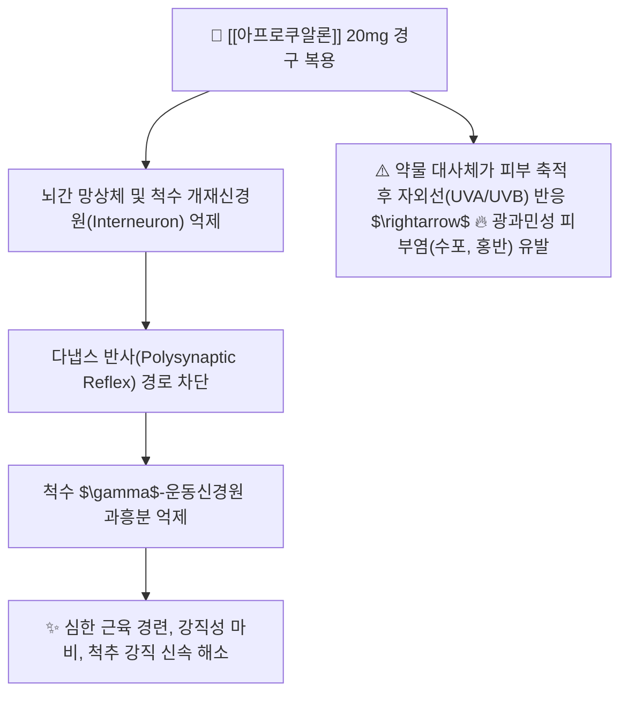

---
aliases:
  - Afloqualone
  - 아로베스트
  - 아프로쿠알론
  - 아프로정
  - Arobest
tags:
  - 약리/양방약
  - 근이완제
  - 중추성근이완제
  - 전문의약품
  - 광과민증주의
---

# 💊 [[아프로쿠알론]] (Afloqualone, 아로베스트 / Arobest, M03BX)

> **핵심 3줄 요약 (Key Summary)**:
> - 🧪 약물 분류 & 표적: 퀴나졸리논(Quinazolinone) 유도체 계열의 **강력한 중추성 골격근이완제**, 뇌간 및 척수의 다냅스 반사(Polysynaptic Reflex)를 직접 차단.
> - 🎯 주요 적응증 & 원내외 처방 패턴: **경추증, 견관절주위염, 요통증, 변형성 척추증, 뇌졸중 후유증 경직 마비** (에페리손으로 조절되지 않는 심한 근육 강직에 2차 선택 처방).
> - 🔬 분자약리 기전 & 약동학(PK/PD): 척수 개재뉴런 억제를 통해 $\gamma$-운동신경 흥분을 진정시키며, 경구 흡수 후 1~2시간 내 최고혈중농도 도달, 간 대사 후 신장으로 배설.
> - ⚠️ 블랙박스 경고 & 주요 부작용: 복용 중 자외선(햇빛) 노출 시 수포성 피부염·발진을 일으키는 **광과민증(Photosensitivity)** 발생률이 매우 높으므로 복용 중 자외선 차단(선크림, 모자, 긴팔 옷) 필수 지도.

---

## 📌 목차
1. [기본 약물 정보 & 시판 제품·알약 식별 (Pill Identification)](#1-기본-약물-정보--시판-제품알약-식별-pill-identification)
2. [분자약리학적 작용 기전 (MOA) & 화학 구조](#2-분자약리학적-작용-기전-moa--화학-구조)
3. [약동학적 특성 (ADME: 흡수·분포·대사·배설)](#3-약동학적-특성-adme-흡수분포대사배설)
4. [진료과별 다빈도 처방 패턴 & 임상 적응증 (Sweet Spot vs 금기)](#4-진료과별-다빈도-처방-패턴--임상-적응증-sweet-spot-vs-금기)
5. [약물 상호작용 & 병용 금기 매트릭스](#5-약물-상호작용--병용-금기-매트릭스)
6. [부작용·독성 발현 기전 & 응급 해독 프로토콜](#6-부작용독성-발현-기전--응급-해독-프로토콜)
7. [💡 사용자 진료실 핵심 필기 & 한의 임상 연계·테이퍼링 팁 (원문 보존)](#7--사용자-진료실-핵심-필기--한의-임상-연계테이퍼링-팁-원문-보존)
8. [출처 및 학술 참고 문헌 (References)](#8-출처-및-학술-참고-문헌-references)

---

## 1. 기본 약물 정보 & 시판 제품·알약 식별 (Pill Identification)

| 항목 | 상세 정보 |
| :--- | :--- |
| **일반명 (Generic Name)** | [[아프로쿠알론]] (Afloqualone, INN) |
| **약효 분류 (Class)** | 퀴나졸리논계 중추성 골격근이완제 (Centrally acting muscle relaxant) |
| **ATC 코드** | M03BX (Other centrally acting muscle relaxants) / 122 골격근이완제 (전문의약품) |
| **약국 시판 제품 (OTC 일반약)** | 전문의약품(ETC)으로 처방전 필수 (일반약 없음) |
| **병원 처방 의약품 (ETC 전문약)** | • **단일 정제 (20mg)**: **아로베스트정(Arobest Tab, 삼진제약 오리지널)**, 아프로정, 아로바정 (20mg) • **상용 포장**: PTP 블리스터 포장 |
| **상용 용법·용량** | • **성인 표준**: 1회 1정(20mg), 1일 3회 식후 복용 (연령 및 증상에 따라 적절히 증감) |

### 1.1 대표 시판 제품 및 함유 복합제 매핑 (Brand Identification & Combinations)

| 구분 | 대표 제품명 / 브랜드 | 함유 성분 및 1회당 함량 | 제형 및 특징 | 주요 적응증 및 복약 지도 핵심 |
| :--- | :--- | :--- | :--- | :--- |
| **오리지널 단일정 (ETC)** | [[아로베스트]] (삼진제약) | 아프로쿠알론 단일 (20mg) | 백색 원형 정제 | 심한 근육 강직, 외출 시 자외선 차단 필수 |
| **제네릭 제제 (ETC)** | 아프로정, 아로바정 | [[아프로쿠알론]] (20mg) | 정제 | 척추관절 질환 및 뇌졸중 후유 경직 조절 |

![[아프로쿠알론_패키지_박스.jpg|400]]
> [그림 1: 정형외과 및 신경과에서 심한 근경직 치료에 처방되는 아프로쿠알론(아로베스트) 패키지]

![[아프로쿠알론_블리스터_알약.jpg|400]]
> [그림 2: 아프로쿠알론 20mg 백색 원형 정제 알약 성상 및 PTP 블리스터 포장]

---

## 2. 분자약리학적 작용 기전 (MOA) & 화학 구조

![[아프로쿠알론_화학구조.png|300]]
> [그림 3: 아프로쿠알론의 2D 평면 화학 분자 구조식 (6-amino-2-(fluoromethyl)-3-(2-methylphenyl)quinazolin-4-one, 분자량 283.30 g/mol, PubChem CID 2038)]

### 1) 척수 다냅스 반사 및 뇌간 억제 기전
* 아프로쿠알론은 척수 및 뇌간 수준에서 신경 전달을 억제하여, 단냅스 반사(신전 반사)보다는 **다냅스 반사(굴곡 반사, 교차 신전 반사)를 선택적으로 차단**합니다.
* 이를 통해 에페리손보다 더욱 강력한 근긴장 완화 및 경직 억제 효능을 나타냅니다.

### 2) 광과민증(Photosensitivity) 발현 기전
* 아프로쿠알론의 퀴나졸리논 구조 및 대사산물은 피부 진피층에 분포하여 햇빛(자외선)에 노출될 때 활성산소종(ROS)을 생성하여 피부 세포막을 파괴합니다.
* 따라서 복용 환자의 약 2~5%에서 **심한 광선 과민성 피부염(가려움, 붉은 반점, 수포)**이 발생합니다.

---

## 3. 약동학적 특성 (ADME: 흡수·분포·대사·배설)

| 약동학 파라미터 | 수치 및 임상적 의미 |
| :--- | :--- |
| **생체이용률 (Bioavailability, F)** | 경구 투여 시 소장에서 양호하게 흡수 |
| **최고혈중농도 도달시간 (Tmax)** | **약 1.0 ~ 2.0 시간** |
| **혈장 단백결합률 (Protein Binding)** | 85 ~ 90% |
| **간 대사 효소 (Metabolism)** | 간에서 아세틸화 및 수산화 대사 |
| **소실 반감기 (Elimination t1/2)** | **약 2.5 ~ 4.0 시간** |
| **주요 배설 경로 (Excretion)** | 신장 소변 및 담즙을 통해 대사체 형태로 배설 |

---

## 4. 진료과별 다빈도 처방 패턴 & 임상 적응증 (Sweet Spot vs 금기)

### 1) 주요 진료과별 처방 패턴
* **정형외과 / 재활의학과**:
  * 만성 경추증, 견관절주위염, 요추 추간판 탈출증으로 근육이 돌처럼 굳은 환자에게 20mg tid 처방.
* **신경과**:
  * 뇌혈관장애(뇌졸중), 척수 손상 후 발생한 상하지 경직성 마비 완화.

### 2) 최적 적응증 (Sweet Spot) vs 신중 투여 및 금기
* **[✅ 최적 적응증 (Sweet Spot)]**:
  * 일반 근이완제(에페리손)에 반응하지 않는 **극심한 척추 주위 근육 경직 환자**.
* **[⚠️ 신중 투여 및 금기 (Caution / Contraindication)]**:
  * **광과민증 기왕력자 절대 금기**.
  * **야외 근로자(건설업, 농업 등) 투약 주의** (자외선 노출 위험).
  * **임산부 및 수유부 투여 금기**.

---

## 5. 약물 상호작용 & 병용 금기 매트릭스

| 병용 약물 / 물질 | 상호작용 기전 | 임상적 위험 및 결과 | 처방 및 티칭 가이드 |
| :--- | :--- | :--- | :--- |
| 타 광과민성 약물 (테트라사이클린, 티아지드) | 광독성 유발 시너지 | 광선 과민성 피부염 위험 급증 | 병용을 피하고 차단제 사용 철저 |
| 중추신경 억제제 (알코올, 벤조디아제핀) | 척수 억제 시너지 | 과도한 졸림, 보행 장애, 무력감 | 복용 중 음주 금지 |
| 경락 소통 한약 ([[갈근]], [[서경탕]]) | 경항부 연축 완화 및 기혈 순환 | 아프로쿠알론 복용 기간 단축 | **양약 복용 1시간 후 한약 복용** |

---

## 6. 부작용·독성 발현 기전 & 응급 해독 프로토콜

* **핵심 부작용 프로파일**:
  1. **피부계 (최우선 주의)**: **광과민성 발진, 홍반, 소양증, 수포**.
  2. **중추신경계**: 비틀거림, 졸림, 어지럼, 권태감.
  3. **소화기계**: 구역, 복통, 설사.
* **광과민증 발생 시 응급 조치**:
  * 즉시 투약을 중단하고 차광 조치 시행.
  * 스테로이드 외용제 및 항히스타민제 처치.

---

## 7. 💡 사용자 진료실 핵심 필기 & 한의 임상 연계·테이퍼링 팁 (원문 보존)

* **진료실 실전 문진 체크리스트 (3대 핵심 질문)**:
  1. **"병원에서 처방받으신 근육이완제(아로베스트)를 드시는 동안 햇빛을 쐬고 피부가 붉어지거나 가렵지 않으셨나요?"**:
     * 광과민증 발생 여부를 최우선 확인.
  2. **"외출하실 때 자외선 차단제(선크림)를 바르시거나 모자, 긴팔 옷을 착용하시나요?"**:
     * 필수 복약 지도 사항 이행 여부 점검.
  3. **"약 복용 후 낮에 다리에 힘이 풀리거나 휘청거리지 않으신가요?"**:
     * 강력한 근이완으로 인한 낙상 위험 평가.

* **한의 치료(침·약침·한약) 연계 및 양약 테이퍼링(감량) 전략**:
  1. **경추증 및 후두하근 경직 통합 치료**:
     * 풍지, 완골, 천주, 견정 혈자리 침도 요법 및 봉약침을 시술하여 만성화된 근막 유착을 안전하게 박리.
  2. **아프로쿠알론 테이퍼링 프로토콜**:
     * [[갈근탕]], [[작약감초탕]]을 처방하여 근방추 긴장을 완화하면서, 광과민증 위험이 높은 아프로쿠알론을 1일 3회 $\rightarrow$ 1일 1회(취침 전) $\rightarrow$ 3~5일 내 조기 중단 유도.

---

## 8. 출처 및 학술 참고 문헌 (References)

1. **식품의약품안전처 (MFDS)**. 의약품 품목허가사항 및 안전성 서한: 아프로쿠알론 제제 (2023).
2. **Ochiai, T. et al. (1981)**. *Pharmacological studies on 6-amino-2-fluoromethyl-3-(o-tolyl)-4(3H)-quinazolinone (afloqualone), a new centrally acting muscle relaxant*. **Japanese Journal of Pharmacology**, 31(4), 491-502.
   - **[연구 요약]**: 아프로쿠알론의 척수 다냅스 반사 차단 메커니즘 및 우수한 골격근 강직 이완 작용 규명.
3. **Ishikawa, T. et al. (1994)**. *Phototoxic dermatitis induced by afloqualone: A clinical and photobiological study*. **Journal of Dermatology**, 21(6), 430-437.
   - **[연구 요약]**: 아프로쿠알론 복용 환자에서 발생하는 광과민성 피부염의 분자 기전 및 예방적 차광 가이드라인 수립.
