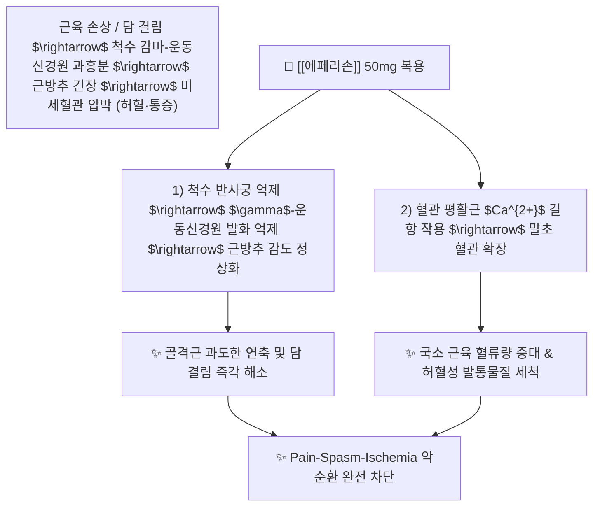

---
aliases:
  - Eperisone
  - 뮤렉스
  - 에페신
  - 에페리손염산염
  - 엑소닌
  - Murex
tags:
  - 약리/양방약
  - 근이완제
  - 중추성근이완제
  - 전문의약품
  - 근막통증증후군
---

# 💊 [[에페리손]] (Eperisone, 뮤렉스 / 에페신, M03BX09)

> **핵심 3줄 요약 (Key Summary)**:
> - 🧪 약물 분류 & 표적: 아미노케톤(Aminoketone) 유도체 계열의 **중추성 골격근이완제**, 척수 반사궁(다냅스·단냅스 반사) 억제 및 혈관 평활근 칼슘 유입 차단.
> - 🎯 주요 적응증 & 원내외 처방 패턴: **경추증, 견관절주위염(오십견), 요통증, 근막통증증후군(MPS)**의 근긴장 완화 (정형외과·신경외과 소염진통제 병용 1위 처방약).
> - 🔬 분자약리 기전 & 약동학(PK/PD): 척수 $\gamma$-운동신경원의 자발 흥분을 억제하여 근방추 감도를 낮추고, 혈관 확장 작용으로 국소 근육 미세순환을 촉진하여 **통증-근연축-허혈(Pain-Spasm-Ischemia) 악순환 고리 차단**.
> - ⚠️ 블랙박스 경고 & 주요 부작용: 벤조디아제핀계 근이완제와 달리 **중추성 진정·졸림 부작용이 현저히 적으나**, 전신 무력감, 어지럼, 위장 장애, 드물게 쇽(Shock) 주의.

---

## 📌 목차
1. [약물 기본 정보 및 시판 제품 (Brand Identification)](#1-약물-기본-정보-및-시판-제품-brand-identification)
2. [분자약리학적 작용 기전 (MOA) & 화학 구조](#2-분자약리학적-작용-기전-moa--화학-구조)
3. [약동학적 특성 (ADME: 흡수·분포·대사·배설)](#3-약동학적-특성-adme-흡수분포대사배설)
4. [진료과별 다빈도 처방 패턴 & 임상 적응증 (Sweet Spot vs 금기)](#4-진료과별-다빈도-처방-패턴--임상-적응증-sweet-spot-vs-금기)
5. [약물 상호작용 & 병용 금기 매트릭스](#5-약물-상호작용--병용-금기-매트릭스)
6. [부작용·독성 발현 기전 & 응급 해독 프로토콜](#6-부작용독성-발현-기전--응급-해독-프로토콜)
7. [💡 사용자 진료실 핵심 필기 & 한의 임상 연계·테이퍼링 팁 (원문 보존)](#7--사용자-진료실-핵심-필기--한의-임상-연계테이퍼링-팁-원문-보존)
8. [출처 및 학술 참고 문헌 (References)](#8-출처-및-학술-참고-문헌-references)

---

## 1. 약물 기본 정보 및 시판 제품 (Brand Identification)

> [!abstract]+ 🧪 3D 약리 분자 구조 (Interactive 3D Viewer)
> <iframe src="https://molecule-viewer-rho.vercel.app/?cid=3294" style="width: 100%; height: 600px; border: none; border-radius: 12px; box-shadow: 0 4px 20px rgba(0,0,0,0.15);" allowfullscreen></iframe>

| 항목 | 상세 정보 |
| :--- | :--- |
| **일반명 (Generic Name)** | [[에페리손]] (Eperisone Hydrochloride, INN) |
| **약효 분류 (Class)** | 중추성 골격근이완제 및 혈관확장제 (Centrally acting muscle relaxant & vasodilator) |
| **ATC 코드** | M03BX09 (Other centrally acting muscle relaxants) / 122 골격근이완제 (전문의약품) |
| **약국 시판 제품 (OTC 일반약)** | 전문의약품(ETC)으로 처방전 필수 (일반약 없음) |
| **병원 처방 의약품 (ETC 전문약)** | • **단일 속방정 (50mg)**: **뮤렉스정(Murex Tab, 대웅제약 오리지널)**, **에페신정(명문제약)**, 엑소닌정, 에페손정 • **서방정 (CR 75mg)**: **에페신서방정, 뮤렉스서방정 (1일 2회 제형)** |
| **상용 용법·용량** | • **속방정 (50mg)**: 성인 1회 1정(50mg), 1일 3회 식후 복용 • **서방정 (CR 75mg)**: 성인 1회 1정(75mg), 1일 2회 아침·저녁 식후 복용 |

### 1.1 대표 시판 제품 및 함유 복합제 매핑 (Brand Identification & Combinations)

| 구분 | 대표 제품명 / 브랜드 | 함유 성분 및 1회당 함량 | 제형 및 특징 | 주요 적응증 및 복약 지도 핵심 |
| :--- | :--- | :--- | :--- | :--- |
| **오리지널 속방정 (ETC)** | [[뮤렉스]] (대웅제약) | 에페리손염산염 (50mg) | 백색 원형 당의정 / 필름코팅정 | 경항부 담 결림, 요통, 정형외과 3제 세트 루틴 |
| **1일 2회 서방정 (ETC)** | 에페신CR정, 뮤렉스CR | 에페리손염산염 (75mg 서방형) | 서방정 | 복약 순응도 개선, 씹거나 부수지 말 것 |
| **정형외과 3제 루틴처방** | 에어탈 + 뮤렉스 + 무코스타 | [[아세클로페낙]] + 에페리손 + [[레바미피드]] | 개별 정제 병용 | 소염진통 + 근긴장 완화 + 위점막 보호 표준 조합 |

![[에페리손_패키지_박스.jpg|400]]
> [그림 1: 정형외과 및 재활의학과에서 근골격계 질환에 가장 널리 처방되는 에페리손 50mg 포장 패키지]

![[에페리손_블리스터_알약.jpg|400]]
> [그림 2: 에페리손 50mg 백색 원형 정제 알약 성상 및 PTP 블리스터 포장]

---

## 2. 분자약리학적 작용 기전 (MOA) & 화학 구조

![[에페리손_화학구조.png|300]]
> [그림 3: 에페리손의 2D 평면 화학 분자 구조식 (1-(4-ethylphenyl)-2-methyl-3-piperidin-1-ylpropan-1-one, 분자량 259.39 g/mol, PubChem CID 3217)]

### 1) 척수 반사궁 억제 및 근방추 감도 저하
* 에페리손은 척수 후각 및 개재신경원에 작용하여 다냅스 및 단냅스 반사를 억제합니다.
* 특히 골격근의 긴장도를 조절하는 **$\gamma$-운동신경원의 자발 발화(Spontaneous discharge)를 억제**하여 근방추(Muscle spindle)의 과민성을 정상화시킴으로써 불수의적인 근육 강직과 경련을 신속히 풀어줍니다.

### 2) 혈관 평활근 이완 및 미세순환 촉진
* 에페리손은 칼슘 길항 작용 및 교감신경 차단 작용을 겸비하여 **골격근 주위 세동맥 평활근을 이완**시킵니다.
* 근육 경직으로 인해 압박받던 미세혈관의 혈류를 증가시켜, 근육 내에 축적된 젖산, 브래디키닌, 세로토닌 등 허혈성 발통물질을 신속히 씻어내어 **'통증 $\rightarrow$ 근긴장 $\rightarrow$ 허혈 $\rightarrow$ 통증 악화'의 악순환을 차단**합니다.

---

## 3. 약동학적 특성 (ADME: 흡수·분포·대사·배설)

| 약동학 파라미터 | 수치 및 임상적 의미 |
| :--- | :--- |
| **생체이용률 (Bioavailability, F)** | 경구 흡수 신속하나 간 초회통과효과(First-pass metabolism) 큼 |
| **최고혈중농도 도달시간 (Tmax)** | **약 1.6 ~ 1.9 시간** (복용 후 빠른 근이완 효과 발현) |
| **혈장 단백결합률 (Protein Binding)** | **> 90%** |
| **간 대사 경로 (Metabolism)** | 간 마이크로솜 효소에 의해 피페리딘 고리의 산화 및 수산화 대사 거침 |
| **소실 반감기 (Elimination t1/2)** | **약 1.6 ~ 1.8 시간** (대사 및 배설이 매우 신속하여 체내 잔류 없음) |
| **주요 배설 경로 (Excretion)** | 투여 24시간 이내에 대부분 신장 소변으로 비활성 대사체 형태 배설 |

---

## 4. 진료과별 다빈도 처방 패턴 & 임상 적응증 (Sweet Spot vs 금기)

### 1) 주요 진료과별 처방 패턴
* **정형외과 / 신경외과 / 마취통증의학과**:
  * 급만성 경항통, 승모근 담 결림, 요추 염좌, 척추 후관절 증후군에 소염진통제([[아세클로페낙]])와 1차 병용 처방.
* **재활의학과 / 신경과**:
  * 뇌졸중 후유증, 뇌성마비, 경성 척수마비 환자의 경직 완화.

### 2) 최적 적응증 (Sweet Spot) vs 신중 투여 및 금기
* **[✅ 최적 적응증 (Sweet Spot)]**:
  * **낮에 일해야 하는 직장인 및 운전자**: 디아제팜 등 타 근이완제 대비 졸림, 진정 작용이 거의 없음.
  * **근막통증증후군(MPS)의 통증유발점(Trigger Point) 완화**.
* **[⚠️ 신중 투여 및 금기 (Caution / Contraindication)]**:
  * **중증 간장애 환자 신중 투여**.
  * **약물 과민반응 기왕력자**: 드물게 발진, 소양감, 혈압 강하 쇼크 주의.

---

## 5. 약물 상호작용 & 병용 금기 매트릭스

| 병용 약물 / 물질 | 상호작용 기전 | 임상적 위험 및 결과 | 처방 및 티칭 가이드 |
| :--- | :--- | :--- | :--- |
| 메토카르바몰 등 타 근이완제 | 척수 억제 경로 중복 | 전신 무력감 및 기립성 어지럼 유발 | 근이완제 중복 처방 지양 |
| 근이완 한약 ([[작약감초탕]], [[갈근탕]]) | 골격근 칼슘 조절 및 경항부 긴장 해소 | 근이완 및 혈류 촉진 시너지 | **양약 복용 1시간 후 한약 복용** |

---

## 6. 부작용·독성 발현 기전 & 응급 해독 프로토콜

* **임상 다빈도 부작용**:
  * 소화기계: 복통, 위부 불쾌감, 구역, 식욕부진 (약 1~2%).
  * 신경계: 드물게 무력감, 나른함, 어지럼, 두통 (졸림 발생률 < 1%).
  * 피부계: 발진, 가려움.
* **부작용 관리**:
  * 위장 장애 호소 시 식후 즉시 복용을 강조하고, 심한 무력감 발생 시 1회 용량을 50mg $\rightarrow$ 25mg으로 감량.

---

## 7. 💡 사용자 진료실 핵심 필기 & 한의 임상 연계·테이퍼링 팁 (원문 보존)

* **진료실 실전 문진 체크리스트 (3대 핵심 질문)**:
  1. **"목이나 허리가 뻐근할 때 병원에서 처방받은 근이완제(뮤렉스, 에페신)를 드셨나요?"**:
     * 정형외과 3제 세트 복용 여부를 확인하여 침구 치료 타깃 설정.
  2. **"약을 드시고 낮에 운전하거나 일하실 때 졸리지는 않으셨나요?"**:
     * 졸림이 없음을 재확인하고 안심하고 복용하도록 지도.
  3. **"약 복용 후 뭉쳤던 어깨나 허리 근육이 얼마나 부드러워지나요?"**:
     * 근막 긴장도 평가.

* **한의 치료(침·약침·한약) 연계 및 양약 테이퍼링(감량) 전략**:
  1. **승모근·견갑거근 담 결림 통합 치료**:
     * 견정, 풍지, 천종 혈자리 침치료 및 습식 부항, 중성어혈약침을 시술하여 근막 발통점(TP)을 물리적으로 파쇄.
  2. **작약감초탕 배오 및 에페리손 테이퍼링**:
     * 골격근 진경에 특효인 [[작약감초탕]], [[갈근해기탕]]을 처방하여 근긴장을 풀면서, 에페리손 복용을 1일 3회 $\rightarrow$ 1일 1회(취침 전) $\rightarrow$ 필요 시 복용(PRN)으로 전환 후 단약.

---

## 8. 출처 및 학술 참고 문헌 (References)

1. **식품의약품안전처 (MFDS)**. 의약품 품목허가사항: 에페리손염산염 제제 (2023).
2. **Hur, G. Y. et al. (2026)**. *Eperisone-induced immediate hypersensitivity reactions*. **The Korean Journal of Internal Medicine**, 41(2), 411-417.
   - [PubMed (PMID: 42128381)](https://pubmed.ncbi.nlm.nih.gov/42128381/) | [DOI](https://doi.org/10.3904/kjim.2025.341)
   - **[연구 요약]**: 근이완제 에페리손 투여 시 드물게 발생하는 즉각형 과민반응 및 아나필락시스의 임상적 위험 관리 가이드라인.
3. **Ruan, J. et al. (2026)**. *Effectiveness of glucosamine hydrochloride and eperisone with exercise therapy on inflammatory factors and knee joint function in patients with knee osteoarthritis*. **Journal of Drug Targeting**, 34, 696-701.
   - [PubMed (PMID: 41063709)](https://pubmed.ncbi.nlm.nih.gov/41063709/) | [DOI](https://doi.org/10.1080/1061186X.2025.2573055)
   - **[연구 요약]**: 무릎 골관절염 환자에서 에페리손과 운동요법 병용이 근긴장 완화, 관절 기능 개선 및 염증 지표 개선에 미치는 시너지 규명.
