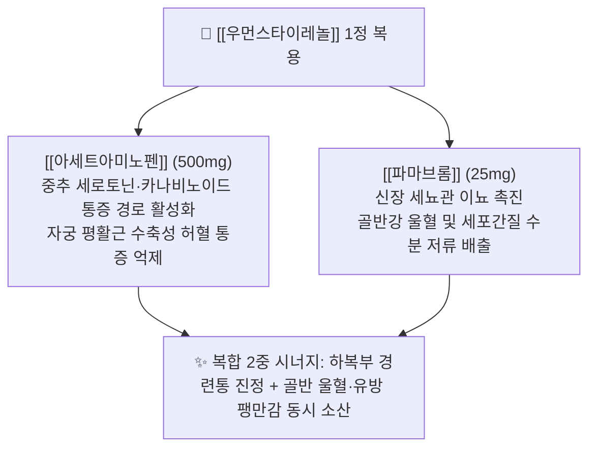

---
aliases:
  - 우먼스타이레놀
  - 우먼스타이레놀정
  - 이지엔6이브
  - 탁센이브
  - 생리통진통제
  - Women's Tylenol
  - 파마브롬복합제
tags:
  - 약리/양방약
  - 복합제
  - 일반의약품
  - 생리통
  - 부인과
  - 해열진통제
---

# 💊 [[우먼스타이레놀]] (Women's Tylenol Tab, 한국얀센 / Kenvue, 생리통·부종 복합 진통제)

> **핵심 3줄 요약 (Key Summary)**:
> 🧪 주성분 배합: [[아세트아미노펜]](500mg, 해열진통) + [[파마브롬]](Pamabrom 25mg, 이뇨소종)의 2중 복합 일반의약품.
> 📍 복합 약리 기전: 아세트아미노펜의 중추성 하복부 진통 작용에 이뇨 성분인 파마브롬이 결합하여 월경 전후 호르몬 변화로 인한 체내 수분 저류, 유방 통증, 하복부 팽만감 및 손발 부종을 동시에 해소.
> 🎯 임상 적응증: 원발성 월경곤란증(생리통), 월경전증후군(PMS), 부종 및 긴장성 두통·요통.
> ⚠️ 주의사항: 다른 아세트아미노펜 제제(종합감기약, 두통약)와의 중복 복용 주의(1일 4,000mg 한도), 이뇨 작용으로 인한 소변색 변화 및 수분 섭취 안내.

---

## 1. 복합 구성 성분 및 제형별 함량 (Active Ingredients & Formulations)

![[타이레놀_한국형_패키지.jpg|350]]
> [그림 1] 타이레놀 브랜드 패밀리의 시판 패키지 외형 디자인

![[타이레놀_블리스터_알약.jpg|350]]
> [그림 2] 무색소 백색 장방형 제형 및 PTP 블리스터 포장 성상

![[파마브롬_화학구조식.png|280]]
> [그림 3] 생리 전후 수분 저류와 부종을 소산시키는 핵심 이뇨 성분인 [[파마브롬]](Pamabrom)의 2D 화학 분자 구조식

![[아세트아미노펜_화학구조식.png|280]]
> [그림 4] 중추성 통증 전달을 차단하는 해열진통 성분인 [[아세트아미노펜]]의 2D 화학 분자 구조식

### 1.1 우먼스타이레놀정 1정당 복합 성분 구성표

| 구성 성분 (한글/영문) | 1정당 함량 | 약효 분류 | 주된 약리 작용 및 복합 시너지 역할 |
| :--- | :--- | :--- | :--- |
| [[아세트아미노펜]] (Acetaminophen) | 500mg | 비마약성 해열진통제 | 시상하부 체온조절중추 작용, 중추 신경계 통증 신호 차단, 위장관 자극 최소화 |
| [[파마브롬]] (Pamabrom) | 25mg | 크산틴계 경구용 이뇨제 | 신장 세뇨관 나트륨·수분 재흡수 억제, 월경 전 체내 수분 저류·유방통·복부 팽만 소산 |

---

## 2. 복합 상승 약리 기전 (Combination Mechanism & Synergy)

* **통증 및 체액 저류의 동시 타깃 (Dual Pain & Fluid Control)**:
  * 배란 후 황체기 및 월경 직전 프로게스테론과 에스트로겐의 급격한 변동으로 알도스테론계가 활성화되어 세포 외액이 저류됩니다.
  * [[파마브롬]]은 크산틴 유도체로서 신장 사구체 여과율을 약하게 상승시키고 근위 세뇨관에서 수분 배설을 유도하여 골반강 울혈성 압박과 유방 통증을 경감시킵니다.
  * 동시에 [[아세트아미노펜]]이 뇌와 척수 레벨에서 자궁 수축으로 유발되는 통각 상행 신호를 차단하여 진통 시너지를 완성합니다.
* **비카페인성 무자극 진통 설계 (Caffeine-free Advantage)**:
  * 전통적인 복합 진통제(게보린, 그날엔 등)에 다용되는 [[카페인무수물]]이 배제되어 있어, 수면 장애, 신경 과민, 심계항진을 유발하지 않으므로 야간 복용에 매우 적합합니다.

---

## 3. 생리통 진통제 브랜드 패밀리 라인업 비교 (Brand Lineup Analysis)

| 제품 라인업명 | 주성분 및 제형 특성 | 차별화 적응증 | 임상 복약 지도 핵심 |
| :--- | :--- | :--- | :--- |
| **우먼스타이레놀정** | [[아세트아미노펜]] 500mg + [[파마브롬]] 25mg (정제) | 위장 장애가 심한 환자의 부종 동반 생리통 | 식사와 무관하게 복용 가능, 간 질환자 주의 |
| **이지엔6이브** | [[이부프로펜]] 200mg + [[파마브롬]] 25mg (액상 연질캡슐) | 강한 염증·자궁 연축 동반 생리통, 부종 | 말초 소염 효과 우수, 공복 복용 피하기 |
| **탁센이브** | [[이부프로펜]] 200mg + [[파마브롬]] 25mg (액상 연질캡슐) | 신속 발현을 요하는 급성 월경통 | 네오솔 특허 연질캡슐로 흡수 가속화 |
| **게보린소프트** | [[이부프로펜]] 250mg + [[파마브롬]] 25mg (고함량 연질캡슐) | 중등도 이상의 심한 원발성 생리통 | 이부프로펜 250mg 증량 설계로 강력한 진통 |

---

## 4. 복합제 특이 위험성 및 특정 성분 금기 (Black Box & Red Flags)

### 4.1 아세트아미노펜 유래 간독성 위험
* **1일 복용 한도 준수**: 1회 1~2정, 4~6시간 간격으로 복용하되, **1일 최대 8정(AAP 4,000mg)을 초과하지 않아야 합니다**.
* **복합 감기약 및 두통약 중복 금기**: 환자가 감기 기운이나 두통으로 판피린, 판콜, 타이레놀 등을 이미 복용 중인 상태에서 우먼스타이레놀을 추가 복용할 경우 급성 간부전 위험이 급증하므로 전수 병용 확인이 필수적입니다.

### 4.2 파마브롬 관련 체액·소변 주의사항
* **소변 색상 변화 안내**: 파마브롬 대사물로 인해 소변 색깔이 일시적으로 황금색이나 형광 연두색으로 짙어질 수 있으나, 이는 인체에 무해한 정상 반응임을 환자에게 미리 설명하여 불안감을 예방합니다.
* **충분한 수분 섭취**: 이뇨 작용으로 인한 경미한 탈수를 방지하기 위해 미온수를 충분히 마시도록 지도합니다.

---

## 5. 한의학적 복합 처방 배오 비교 및 테이퍼링 프로토콜 (Integrative Medicine)

### 5.1 한방 군신좌사(君臣佐使) 배오 원리와의 비교

우먼스타이레놀의 이수삼습(利水滲濕) 및 통경지통(通經止痛) 배오는 한의학 부인과 명방인 [[당귀작약산]]의 배오 원리와 완벽하게 부합합니다.

| 양방 복합제 구성 | 한의 대응 본초 | 한의학적 배오 역할 및 기전 연계 |
| :--- | :--- | :--- |
| **중추성 진통 성분** ([[아세트아미노펜]]) | [[당귀]], [[천궁]], [[현호색]] | 군약(君藥): 활혈행기지통(活血行氣止痛), 자궁 울혈을 통락시키고 통증 완화 |
| **이뇨소종 성분** ([[파마브롬]]) | [[복령]], [[택사]], [[익모초]] | 신약(臣藥): 이수삼습소종(利水滲濕消腫), 하초 골반강 수체(水滯)와 부종 배출 |
| **온경 및 완급지통 성분** | [[작약]], [[감초]], [[육계]] | 좌사약(佐使藥): 자궁 평활근 경련을 완화하고 하복부를 온화하여 제반 약성 조화 |

### 5.2 진료실 실전 문진 및 양약 감량(테이퍼링) 가이드
1. **월경 주기별 수분 저류 문진**:
   * 생리 시작 3~5일 전부터 손발 저림, 체중 1~2kg 증가, 아침 눈꺼풀 부종, 유방 통증이 심해지는 '혈허수체(血虛水滯)' 환자군을 선별합니다.
2. **소화기 궤양 유무에 따른 NSAID 대체 선택**:
   * 평소 위염이나 소화성 궤양이 있어 이지엔6이브나 탁센이브(이부프로펜 계열) 복용 시 속쓰림이 심한 환자에게 우먼스타이레놀은 안전한 1차 대안이 됩니다.
3. **단계적 한의 치료 전환 프로토콜**:
   * **급성기 배오 시술**: 생리 시작 당일 하복부 온열 요법과 함께 삼음교, 혈해, 관원, 중극, 족삼리 침·전침 시술을 시행하여 자궁 동맥 혈류 저항을 낮춥니다.
   * **근본 치법 처방 전환**: 월경 전 부종과 하복냉증이 현저한 경우 [[당귀작약산]] 또는 [[오적산]]을 생리 시작 7일 전부터 복용시켜, 양방 진통제 의존 없이 자연스러운 월경 배출을 유도합니다.

---

## 6. 출처 및 학술 참고 문헌 (References)

* 식품의약품안전처 의약품안전나라 - 우먼스타이레놀정 공식 허가사항 및 제품 설명서.
* Ortiz, M. I. et al. (2023). Effect of nitric oxide-cyclic GMP-K(+) channel pathway blockers, naloxone and metformin, on the antinociception induced by the diuretic pamabrom. *Canadian Journal of Physiology and Pharmacology*, 101(1), 41-51.
  * [PubMed (PMID: 36318824)](https://pubmed.ncbi.nlm.nih.gov/36318824/) | [DOI](https://doi.org/10.1139/cjpp-2022-0277)
  * `[연구 요약]` 이뇨제 파마브롬(Pamabrom)의 산화질소-cGMP 경로 매개 진통 효과 및 항통각 시너지 기전 입증.
* ACOG Committee on Adolescent Health Care. (2018). Dysmenorrhea and Endometriosis in the Adolescent. *Obstetrics & Gynecology*, 132(6), e249-e258.
  * [PubMed (PMID: 30461694)](https://pubmed.ncbi.nlm.nih.gov/30461694/) | [DOI](https://doi.org/10.1097/AOG.0000000000002978)
  * `[연구 요약]` 청소년 및 가임기 여성의 월경곤란증에서 비마약성 진통제 치료 가이드라인 및 골반강 통증 관리 지침.
