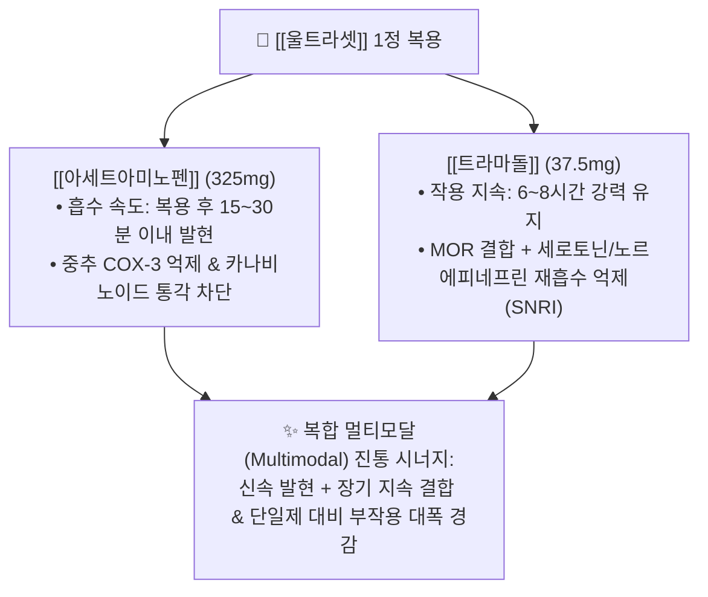

---
aliases:
  - 울트라셋
  - 울트라셋정
  - 파라마셋
  - 파라마셋정
  - Ultracet
  - 울트라셋이알
  - 울트라셋이알서방정
  - 울트라셋세미정
  - 트라마돌아세트아미노펜
tags:
  - 약리/양방약
  - 복합제
  - 전문의약품
  - 중추성진통제
  - 오피오이드
  - 근골격계
---

# 💊 [[울트라셋]] (Ultracet Tab, 한국얀센, 중추성 복합 진통제)

> **핵심 3줄 요약 (Key Summary)**:
> 🧪 주성분 배합: [[트라마돌]](37.5mg, 합성 오피오이드) + [[아세트아미노펜]](325mg, 비오피오이드)의 상호보완적 1:8.67 황금비 복합 전문의약품.
> 📍 복합 약리 기전: 신속 발현 해열진통([[아세트아미노펜]])과 지속성 중추 진통([[트라마돌]])의 결합으로 진통 시너지를 극대화하고 트라마돌 단일제 대비 용량을 줄여 오심·어지럼 부작용 경감.
> 🎯 임상 적응증: **정형외과·신경외과 외래 중등도~중증 근골격계 통증 처방 1위** (추간판탈출증 요통, 척추관협착증, 퇴행성 관절염, 수술 후 통증).
> ⚠️ 특정 성분 금기: 오심, 구토, 변비, 어지럼증, 고령자 섬망 및 낙상 주의, 1일 최대 8정(AAP 2,600mg / 트라마돌 300mg) 초과 금지.

---

## 1. 복합 구성 성분 및 제형별 함량 (Active Ingredients & Formulations)

![[트라마돌_패키지_박스.jpg|350]]
> [그림 1] 중추성 통증 억제제인 트라마돌 및 복합 진통제 패키지 외형

![[울트라셋_블리스터_알약.jpg|350]]
> [그림 2] [[울트라셋]] 정제의 담황색 타원형 제형 성상 및 PTP 블리스터 포장

![[트라마돌_화학구조.png|280]]
> [그림 3] 뮤-오피오이드 수용체 결합 및 세로토닌/노르에피네프린 재흡수를 억제하는 [[트라마돌]](Tramadol)의 2D 화학 분자 구조식

![[아세트아미노펜_화학구조식.png|280]]
> [그림 4] 중추 신경계 통증 전달을 신속하게 완화하는 [[아세트아미노펜]]의 2D 화학 분자 구조식

### 1.1 울트라셋 제품군별 제형 및 성분 구성표

| 제품명 (라인업) | 1정당 복합 성분 함량 | 제형 및 방출 특성 | 상용 용법 및 최대 한도 |
| :--- | :--- | :--- | :--- |
| **울트라셋정** (속방형 오리지널) | [[트라마돌]] 37.5mg + [[아세트아미노펜]] 325mg | 담황색 타원형 필름코팅정 | 초기 1~2정, 4~6시간 간격 (1일 최대 8정) |
| **울트라셋세미정** (절반 용량) | [[트라마돌]] 18.75mg + [[아세트아미노펜]] 162.5mg | 소형 원형 필름코팅정 | 고령자 초기 투여, 용량 미세 조절 및 테이퍼링용 |
| **울트라셋이알서방정** (ER) | [[트라마돌]] 75mg + [[아세트아미노펜]] 650mg | 12시간 지속 2중층 서방정 | 1회 1정, 1일 2회 (12시간 간격 복용, 1일 최대 4정) |
| **울트라셋이알세미서방정** | [[트라마돌]] 37.5mg + [[아세트아미노펜]] 325mg | 12시간 지속 저용량 서방정 | 만성 통증 유지 요법 및 경증 고령자용 |

---

## 2. 복합 상승 약리 기전 (Combination Mechanism & Synergy)

* **약동학적 상호보완 (PK Synergy)**:
  * [[아세트아미노펜]]은 복용 직후 15~30분 내에 신속히 흡수되어 최고 혈중 농도에 도달하므로 급성 통증의 초기 급격한 진정을 유도합니다.
  * [[트라마돌]]은 흡수 및 대사([[M1 대사체]])를 거치며 2~3시간 후 최대 효과에 도달하여 6~8시간 동안 지속적인 억제 신호를 유지합니다.
* **약력학적 멀티모달 차단 (Multimodal Analgesia)**:
  * 비오피오이드 중추 진통 경로(아세트아미노펜)와 오피오이드-모노아민 억제 경로(트라마돌)를 동시 차단함으로써, 트라마돌의 단독 투여 용량을 대폭 낮추면서도 강력한 진통 효과를 산출합니다.

---

## 3. 정형외과 처방 복합 진통제 라인업 비교 (Brand Lineup Analysis)

| 제품 라인업명 | 주성분 및 제형 특성 | 차별화 적응증 | 임상 복약 지도 핵심 |
| :--- | :--- | :--- | :--- |
| **울트라셋정** | [[트라마돌]] 37.5mg + [[아세트아미노펜]] 325mg | 급만성 디스크 통증, 수술 후 통증 | 공복 복용 시 구역감 심함, 식후 즉시 복용 |
| **울트라셋세미정** | [[트라마돌]] 18.75mg + [[아세트아미노펜]] 162.5mg | 고령자 관절통, 감량 테이퍼링 단계 | 부작용 민감 환자의 초기 적응용 |
| **울트라셋이알서방정** | [[트라마돌]] 75mg + [[아세트아미노펜]] 650mg | 야간 통증이 심한 만성 척추관협착증 | 씹거나 부수지 말고 통째로 복용 |
| **파라마셋정** (제네릭) | [[트라마돌]] 37.5mg + [[아세트아미노펜]] 325mg | 동일 성분 제네릭 처방약 | 오리지널과 동등한 약효 및 부작용 모니터링 |

---

## 4. 복합제 특이 위험성 및 특정 성분 금기 (Black Box & Red Flags)

### 4.1 트라마돌 유래 오피오이드계 부작용
* **오심 및 구토 (Nausea & Vomiting)**: 화학수용체 유발대(CTZ)를 자극하여 초기 복용 환자의 20~30%에서 심한 울렁거림과 구토가 발생합니다.
* **장운동 억제성 변비 (Constipation)**: 장관 평활근의 연동운동을 둔화시켜 만성적인 변비를 초래하므로 장기 복약 시 완하제 병용이 흔히 필요합니다.
* **중추 진정 및 어지럼증**: 고령 환자에서 보행 실조, 낙상, 어지럼증, 섬망(Delirium)을 유발할 수 있습니다.

### 4.2 병용 금기 및 세로토닌 증후군
* **세로토닌성 약물 병용 주의**: 항우울제인 SSRI, SNRI([[둘록세틴]]), 삼환계 항우울제(TCA)와 병용 시 시냅스 내 세로토닌 과잉 축적으로 고열, 진전, 근강직을 특징으로 하는 **세로토닌 증후군(Serotonin Syndrome)**이 발생할 수 있습니다.
* **아세트아미노펜 과량 투여 주의**: 울트라셋 8정 복용 시 아세트아미노펜 2,600mg을 섭취하게 되므로, 타 감기약이나 해열진통제를 무심코 추가 복용하면 일일 허용량인 4,000mg을 초과하여 치명적인 급성 간괴사가 발생할 수 있습니다.

---

## 5. 한의학적 복합 처방 배오 비교 및 테이퍼링 프로토콜 (Integrative Medicine)

### 5.1 한방 군신좌사(君臣佐使) 배오 원리와의 비교

울트라셋의 멀티모달 진통과 부작용 억제 설계는 한의학 척추관절 명방인 [[독활기생탕]] 및 [[서경탕]]의 배오 원리와 구조적으로 일치합니다.

| 양방 복합제 구성 | 한의 대응 본초 | 한의학적 배오 역할 및 기전 연계 |
| :--- | :--- | :--- |
| **강력 중추 진통 성분** ([[트라마돌]]) | [[독활]], [[두충]], [[우슬]] | 군약(君藥): 거풍습강근골(祛風濕强筋骨), 척추 심부 신경근 포착과 마비성 통증 완화 |
| **신속 해기진통 성분** ([[아세트아미노펜]]) | [[천궁]], [[당귀]], [[작약]] | 신약(臣藥): 활혈통락(活血通絡), 허혈성 신경근 주위 미세혈류 개선 및 근막 연축 이완 |
| **부작용 완충 성분** (위장 보호/윤장) | [[반하]], [[생강]], [[마자인]] | 좌사약(佐使藥): 화위강역(和胃降逆)으로 오심을 억제하고 장관을 윤활하여 변비 예방 |

### 5.2 진료실 실전 문진 및 양약 감량(테이퍼링) 가이드
1. **정형외과 만성 처방 환자 문진**:
   * "병원에서 처방받은 노란색 타원형 알약(울트라셋)을 하루 몇 알 드시는지", "복용 후 속이 울렁거리거나 변비가 심해지지 않는지"를 필수 확인합니다.
2. **소화기 부작용에 대한 한방 완충 치료**:
   * 울트라셋 복용으로 인한 극심한 구역감 환자에게 [[반하사심탕]] 또는 [[이진탕]] 엑스제를 병용 투여하여 위장관 불내성을 즉각 개선합니다.
3. **3단계 체계적 테이퍼링(감량) 프로토콜**:
   * **1단계 (협진 적응기)**: 기존 울트라셋 복용량(1일 2~3회)을 유지하면서 협척혈, 신수, 대장수, 위중 혈위에 침·전침 치료 및 봉약침/신경포착 약침 시술을 병행하여 신경근 염증 부종을 흡수시킵니다.
   * **2단계 (용량 감량기)**: 침 치료 후 야간 방사통이 VAS 4 이하로 호전되면 정형외과 주치의와 상의하여 울트라셋정을 **울트라셋세미정(절반 용량)**으로 변경하고, 척추 지지 한약인 [[독활기생탕]]을 투여합니다.
   * **3단계 (완전 중단 및 PRN 전환)**: 통증이 일상생활에 지장이 없는 수준(VAS 1~2)에 도달하면 정규 복용을 중단하고 '통증이 심할 때만 필요시 복용(PRN)'으로 전환한 뒤 최종 단약을 완성합니다.

---

## 6. 출처 및 학술 참고 문헌 (References)

* 한국얀센 울트라셋정 / 울트라셋이알서방정 공식 의약품 허가사항 및 제품 설명서.
* McClellan, K. & Scott, L. J. (2003). Tramadol/paracetamol. *Drugs*, 63(11), 1079-1086.
  * [PubMed (PMID: 12749738)](https://pubmed.ncbi.nlm.nih.gov/12749738/) | [DOI](https://doi.org/10.2165/00003495-200363110-00007)
  * `[연구 요약]` 트라마돌과 파라세타몰 고정용량 복합제의 상호보완적 다중 표적 진통 시너지 및 이상반응 감소 효과 총괄 분석.
* Grond, S. & Sablotzki, A. (2004). Clinical pharmacology of tramadol. *Clinical Pharmacokinetics*, 43(13), 879-923.
  * [PubMed (PMID: 15509185)](https://pubmed.ncbi.nlm.nih.gov/15509185/) | [DOI](https://doi.org/10.2165/00003088-200443130-00004)
  * `[연구 요약]` 트라마돌의 오피오이드 및 모노아민 재흡수 차단 이중 작용 기전, CYP2D6 대사 M1 활성체 특성 및 임상 안전성 총괄 리뷰.
* Kim, S. H. et al. (2025). Analgesic effects of preemptive celecoxib or tramadol/acetaminophen added to standard postoperative pain management: a multicenter, randomized, double-blind, placebo-controlled trial. *The Journal of Evidence-Based Dental Practice*, 25(3), 102135.
  * [PubMed (PMID: 40716830)](https://pubmed.ncbi.nlm.nih.gov/40716830/) | [DOI](https://doi.org/10.1016/j.jebdp.2025.102135)
  * `[연구 요약]` 급성 수술 후 통증 관리에서 트라마돌/아세트아미노펜 복합제의 우수한 진통 효능 및 위약 대비 유의미한 통증 경감 효과 검증.
