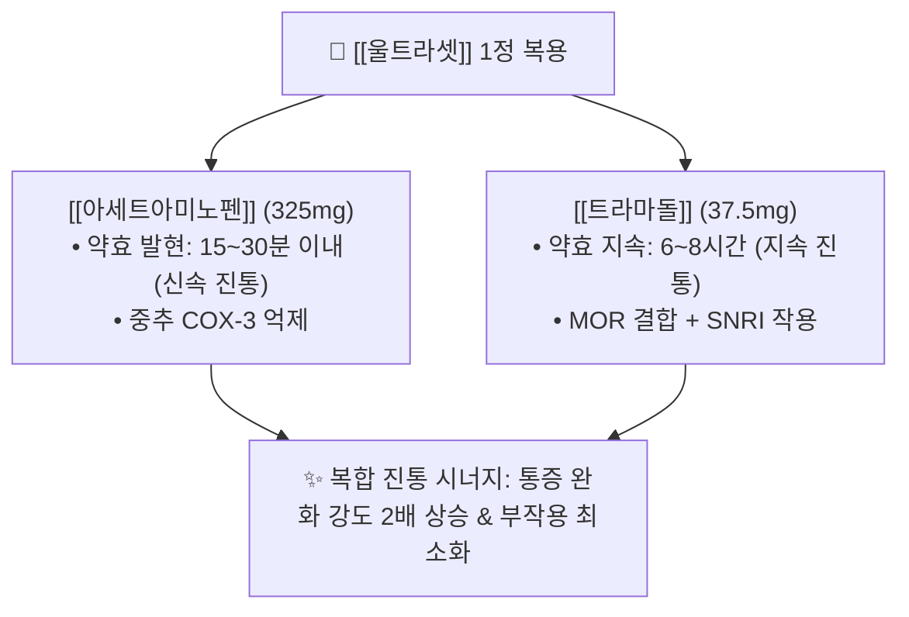

---
aliases:
  - 울트라셋
  - 울트라셋정
  - 파라마셋
  - 파라마셋정
  - Ultracet
  - 울트라셋이알
tags:
  - 약리/양방약
  - 복합제
  - 중추성진통제
  - 전문의약품
---

# 💊 [[울트라셋]] (Ultracet Tab, 한국얀센, 중추성 복합 진통제)

> **핵심 3줄 요약 (Key Summary)**:
> 🧪 주성분 배합: [[트라마돌]](37.5mg, 오피오이드성) + [[아세트아미노펜]](325mg, 비오피오이드성)의 상호보완적 1:8.67 황금비 복합 제제.
> 📍 복합 약리 기전: 신속 발현 해열진통([[아세트아미노펜]]) + 지속성 중추성 진통([[트라마돌]])의 다중 타깃 결합으로 진통 시너지를 극대화하고 트라마돌 단일제 대비 용량을 줄여 오심·어지럼 부작용 완화.
> 🎯 임상 적응증: **정형외과·신경외과 외래 중등도~중증 통증 처방 1위** (디스크 요통, 퇴행성 관절염, 수술 후 통증).
> ⚠️ 특정 성분 금기: 트라마돌로 인한 오심, 구토, 변비, 졸림 및 고령자 섬망 주의, 아세트아미노펜 함유로 1일 최대 8정(AAP 2,600mg) 초과 금지.

---

## 1. 복합 구성 성분 및 제형별 함량 (Active Ingredients & Formulations)

### 1.1 울트라셋 제품군별 구성표

| 제품명 | 구성 성분 및 1정당 함량 | 제형 및 방출 특성 | 상용 용법·용량 |
| :--- | :--- | :--- | :--- |
| **울트라셋정** (오리지널 속방형) | [[트라마돌]] 37.5mg + [[아세트아미노펜]] 325mg | 필름코팅정 (노란색 타원형) | 1회 1~2정, 4~6시간 간격 (1일 최대 8정) |
| **울트라셋세미정** (절반 용량) | [[트라마돌]] 18.75mg + [[아세트아미노펜]] 162.5mg | 소형 정제 | 고령자 초기 투여 및 미세 용량 조절용 |
| **울트라셋이알서방정** (ER) | [[트라마돌]] 75mg + [[아세트아미노펜]] 650mg | 12시간 지속 서방정 | 1회 1정, 1일 2회 (12시간 간격 복용) |

---

## 2. 복합 상승 약리 기전 (Combination Synergy)

---

## 3. 부작용 및 한의 치료 연계

* **진료실 다빈도 복약 환자**: 정형외과나 마통과에서 디스크나 무릎 관절염으로 울트라셋을 하루 2~3회 정기 복용 중인 환자가 매우 많음.
* **소화기 부작용 완충**: 울트라셋 복용으로 인한 극심한 구역감·변비에 대해 [[반하사심탕]], [[마자인환]]을 병용하여 완충.
* **한의 감량(테이퍼링) 프로토콜**: 침·약침 치료로 통증 역치가 개선되면 울트라셋 1일 3회 $\rightarrow$ 울트라셋세미정 1일 2회 $\rightarrow$ 필요 시 복용(PRN)으로 단계적 테이퍼링.

---

## 4. 출처 및 학술 참고 문헌 (References)

* McClellan K, Scott LJ. Tramadol/paracetamol. *Drugs*. 2004;64(7):759-772.
