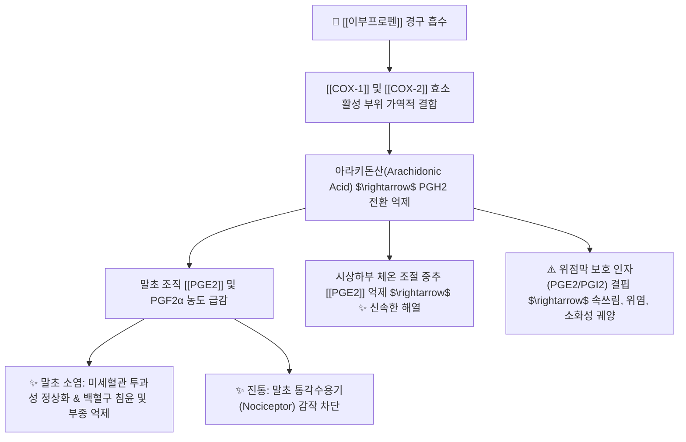
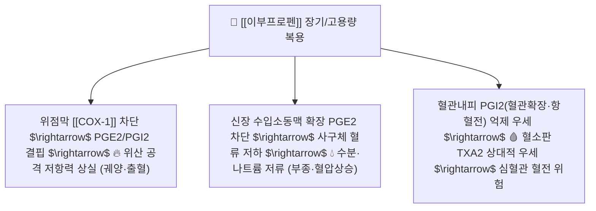

---
aliases:
  - Ibuprofen
  - 부루펜
  - 애드빌
  - 이지엔6애니
  - 브루펜
  - 대웅이부프로펜
  - Brufen
  - Advil
tags:
  - 약리/양방약
  - 해열진통소염제
  - NSAIDs
  - 프로피온산계
---

# 💊 [[이부프로펜]] (Ibuprofen, 부루펜 / 애드빌 / 이지엔6애니, M01AE01)

> **핵심 3줄 요약 (Key Summary)**:
> - 🧪 약물 분류 & 표적: 프로피온산(Propionic acid) 유도체 계열의 비선택적 비스테로이드성 소염진통제(NSAID), [[COX-1]] 및 [[COX-2]] 효소 가역적 동시 억제, 프로스타글란딘([[PGE2]]) 생합성 차단.
> - 🎯 주요 적응증 & 원내외 처방 패턴: 급만성 염좌, 골관절염, 류마티스 관절염, 요통, 치통, 두통, 월경곤란증, 소아 급성 발열의 1차 선택제 (말초 소염 작용이 필수적인 통증에 다빈도 처방).
> - 🔬 분자약리 기전 & 약동학(PK/PD): 경구 생체이용률 80~90%, 단백결합률 99%, 간내 CYP2C9에 의해 대사 후 신장으로 신속 배설되며, 소실 반감기가 1.8~2.0시간으로 짧아 체내 축적 위험이 적음.
> - ⚠️ 블랙박스 경고 & 주요 부작용: COX-1 억제에 따른 위점막 방어 인자 감소로 속쓰림·소화성 궤양·위장관 출혈 위험, 신혈류량 감소로 인한 급성 신손상 및 심혈관계 혈전 질환자 신중 투여.

---

## 📌 목차
1. [기본 약물 정보 & 시판 제품·알약 식별 (Pill Identification)](#1-기본-약물-정보--시판-제품알약-식별-pill-identification)
2. [분자약리학적 작용 기전 (MOA) & 화학 구조](#2-분자약리학적-작용-기전-moa--화학-구조)
3. [약동학적 특성 (ADME: 흡수·분포·대사·배설)](#3-약동학적-특성-adme-흡수분포대사배설)
4. [진료과별 다빈도 처방 패턴 & 임상 적응증 (Sweet Spot vs 금기)](#4-진료과별-다빈도-처방-패턴--임상-적응증-sweet-spot-vs-금기)
5. [약물 상호작용 & 병용 금기 매트릭스](#5-약물-상호작용--병용-금기-매트릭스)
6. [부작용·독성 발현 기전 & 응급 해독 프로토콜](#6-부작용독성-발현-기전--응급-해독-프로토콜)
7. [💡 사용자 진료실 핵심 필기 & 한의 임상 연계·테이퍼링 팁 (원문 보존)](#7--사용자-진료실-핵심-필기--한의-임상-연계테이퍼링-팁-원문-보존)
8. [출처 및 학술 참고 문헌 (References)](#8-출처-및-학술-참고-문헌-references)

---

## 1. 기본 약물 정보 & 시판 제품·알약 식별 (Pill Identification)

| 항목 | 상세 정보 |
| :--- | :--- |
| **일반명 (Generic Name)** | [[이부프로펜]] (Ibuprofen, USAN/INN) |
| **약효 분류 (Class)** | 비선택적 비스테로이드성 소염진통제 (Non-selective NSAID, Propionic acid derivative) |
| **ATC 코드** | M01AE01 (Antiinflammatory and antirheumatic products, non-steroids) |
| **약국 시판 제품 (OTC 일반약)** | • **단일제**: 부루펜정(200mg), 애드빌정/리퀴겔(200mg), 이지엔6애니(200mg), 대웅이부프로펜, 어린이부루펜시럽(20mg/mL) • **복합제**: 이지엔6이브(이부프로펜 200mg + [[파마브롬]] 25mg), 모드콜S(이부프로펜 복합 감기약), 코스펜 |
| **병원 처방 의약품 (ETC 전문약)** | • **단일제**: 부루펜정 400mg, 삼일이부프로펜정 600mg, 파마이부프로펜정 400mg/600mg |
| **상용 용법·용량** | • **경도~중등도 진통·해열 (OTC)**: 성인 1회 200~400mg, 1일 3~4회 식후 즉시 복용 (1일 최대 1,200mg) • **관절염·강직성척추염 (처방)**: 성인 1회 400~600mg, 1일 3~4회 식후 복용 (1일 최대 3,200mg) • **소아 발열**: 1회 체중 kg당 5~10mg, 6~8시간 간격 경구 투여 |

### 1.1 대표 시판 제품 및 함유 복합제 매핑 (Brand Identification & Combinations)

| 구분 | 대표 제품명 / 브랜드 | 함유 성분 및 1회당 함량 | 제형 및 특징 | 주요 적응증 및 복약 지도 핵심 |
| :--- | :--- | :--- | :--- | :--- |
| **단일제 (OTC/ETC)** | 부루펜정, 애드빌, 이지엔6애니 | [[이부프로펜]] 단일 (200mg / 400mg / 600mg) | 정제, 가용화 액상 연질캡슐 | 해열·진통·소염 1차제, 위점막 보호를 위해 식후 즉시 복용 |
| **생리통 복합제 (OTC)** | [[우먼스타이레놀]], 이지엔6이브, 탁센이브 | [[이부프로펜]] (200mg) + [[파마브롬]] (25mg) | 액상 연질캡슐 | 프로스타글란딘 억제 + 이뇨 작용으로 하복부 팽만·유방통 완화 |
| **감기 복합제 (OTC)** | 모드콜S, 코스펜, 씨콜드이부 | [[이부프로펜]] + 비충혈제거제 + 항히스타민제 | 연질캡슐, 정제 | 발열, 두통, 코막힘, 목통증 동반 몸살 감기 조절 |
| **소아 시럽제 (OTC)** | 어린이부루펜시럽 | [[이부프로펜]] (20mg/mL) | 현탁시럽 | 소아 발열, 아세트아미노펜 시럽과 2~3시간 간격 교차 복용 다빈도 |

![[이부프로펜_패키지_박스.jpg|400]]
> [그림 1: 전 세계 및 국내 약국에서 가장 대표적으로 처방·판매되는 이부프로펜 400mg 포장 패키지 외형]

![[이부프로펜_블리스터_알약.jpg|400]]
> [그림 2: 이부프로펜 200mg/400mg 백색 원형 정제 및 PTP 블리스터 포장 성상]

---

## 2. 분자약리학적 작용 기전 (MOA) & 화학 구조

![[이부프로펜_화학구조.png|300]]
> [그림 3: 이부프로펜의 2D 평면 화학 분자 구조식 (2-(4-isobutylphenyl)propanoic acid, 분자량 206.28 g/mol, PubChem CID 3672)]

### 1) 비선택적 COX 억제 및 프로스타글란딘 합성 차단
* 손상 조직에서 인지질로부터 유리된 아라키돈산이 사이클로옥시게나제(COX)에 의해 프로스타글란딘으로 전환되는 경로를 차단합니다.
* [[COX-1]]을 억제하여 위점막 보호 및 혈소판 응집을 저해하고, [[COX-2]]를 억제하여 염증 국소의 통증, 발열, 부종을 억제합니다.

### 2) 아세트아미노펜과의 임상 약리학적 차별점
* [[아세트아미노펜]]은 중추신경계에서 주로 작용하여 말초 항염증 효과가 거의 없는 반면, 이부프로펜은 **손상 국소의 발적, 부종, 염증성 삼출물을 직접 억제하는 강력한 말초 소염 작용**을 발휘합니다.
* 따라서 관절의 활액막염, 활액낭염, 건초염, 심한 근막 염좌에는 아세트아미노펜보다 이부프로펜이 우선 선택됩니다.

---

## 3. 약동학적 특성 (ADME: 흡수·분포·대사·배설)

| 약동학 파라미터 | 수치 및 임상적 의미 |
| :--- | :--- |
| **생체이용률 (Bioavailability, F)** | 80 ~ 90% (경구 흡수율 매우 우수) |
| **최고혈중농도 도달시간 (Tmax)** | 정제 1~2시간, 가용화 액상 연질캡슐 30~45분 (신속한 진통 발현) |
| **혈장 단백결합률 (Protein Binding)** | 99% (혈청 알부민에 강력 결합) |
| **분포용적 (Volume of Distribution)** | 약 0.12 ~ 0.2 L/kg (주로 세포외액 및 관절 활액낭에 고농도 분포) |
| **간 대사 효소 (Metabolism)** | 간 마이크로솜 **CYP2C9** (주 경로) 및 CYP2C8에 의해 산화 및 글루쿠론산 포합 |
| **소실 반감기 (Elimination t1/2)** | **1.8 ~ 2.0 시간** (체내 축적 위험이 매우 적고 대사가 신속함) |
| **주요 배설 경로 (Excretion)** | 투여량의 90% 이상이 24시간 이내에 신장 소변으로 배설 (대사체 및 포합체) |

---

## 4. 진료과별 다빈도 처방 패턴 & 임상 적응증 (Sweet Spot vs 금기)

### 1) 주요 진료과별 처방 패턴
* **정형외과 / 마취통증의학과 / 재활의학과**:
  * 급성 발목 염좌, 견관절 회전근개 건염, 요추 추간판 탈출증 초기 염증기, 무릎 퇴행성 골관절염 환자에게 400~600mg tid 처방.
* **치과**:
  * 매복 사랑니 발치 후 부종 및 치수염 통증 억제를 위해 항생제와 함께 1차 처방.
* **소아청소년과 / 이비인후과**:
  * 급성 편도선염, 인후두염, 중이염 발열 시 아세트아미노펜과 2~3시간 간격으로 교차 투여.
* **산부인과**:
  * 자궁 평활근의 과도한 수축을 유발하는 자궁내막 프로스타글란딘을 차단하기 위해 원발성 월경통에 1차 선택.

### 2) 최적 적응증 (Sweet Spot) vs 신중 투여 및 금기
* **[✅ 최적 적응증 (Sweet Spot)]**:
  * **염증성 부종 및 열감이 동반된 근골격계 급성 손상**: 염좌 24~48시간 이내 부종 억제.
  * **치통 및 발치 후 통증**: 잇몸 국소 염증 및 통증 신속 차단.
  * **원발성 생리통**: 자궁 수축 통증 완화.
* **[⚠️ 신중 투여 및 금기 (Caution / Contraindication)]**:
  * **활동성 소화성 궤양 및 위장관 출혈 환자 절대 금기**: 위천공 및 대량 출혈 위험.
  * **중증 심부전, 관상동맥 우회로술(CABG) 전후 환자 금기**: 체액 저류 및 심혈관 혈전 사건 위험 증가.
  * **중증 신부전 환자(GFR < 30 mL/min) 금기**: 신혈류 저하로 급성 무뇨 및 신부전 악화.
  * **아스피린 천식(Aspirin-induced asthma) 병력자 절대 금기**: 기관지 경련 유발.

---

## 5. 약물 상호작용 & 병용 금기 매트릭스

| 병용 약물 / 물질 | 상호작용 기전 | 임상적 위험 및 결과 | 처방 및 티칭 가이드 |
| :--- | :--- | :--- | :--- |
| [[아스피린]] (저용량 100mg) | 혈소판 COX-1 결합 부위 경쟁적 선점 | 아스피린의 비가역적 항혈소판 작용 무력화 $\rightarrow$ **심혈관 혈전 위험 증가** | **아스피린 복용 2시간 후에 이부프로펜을 복용하도록 지도** |
| 항응고제 ([[와파린]], [[NOAC]]) | 혈소판 기능 억제 + 위점막 궤양 유발 | 중증 위장관 출혈 위험 급증 | 병용을 피하고 [[아세트아미노펜]]으로 대체 |
| 항고혈압제 (ACEI, ARB, 이뇨제) | 신장 내 혈관확장성 PGE2/PGI2 합성 억제 | 혈압 강하 효과 감소 및 **급성 신부전(Triple Whammy) 유발** | 신기능 및 전해질 정기 모니터링 |
| 알코올 (술) | 위점막 직접 자극 + COX-1 억제 시너지 | 급성 위점막 출혈 및 궤양 유발 | 복용 기간 중 금주 필수 |
| 위점막 보호 한약 ([[평위산]], [[반하사심탕]]) | 위점막 혈류 개선 및 점액 분비 촉진 | NSAID 유발성 속쓰림 및 점막 손상 완충 | **양약 식후 복용 1시간 후 한약 복용** |

---

## 6. 부작용·독성 발현 기전 & 응급 해독 프로토콜

* **주요 부작용 프로파일**:
  1. **위장관계**: 소화불량, 속쓰림, 오심, 위염, 소화성 궤양, 위장관 출혈.
  2. **신장계**: 신혈류량 감소로 인한 크레아티닌 상승, 부종, 고칼륨혈증.
  3. **심혈관계**: 혈압 상승, 울혈성 심부전 악화, 심근경색 위험 소폭 증가.
* **대처 및 응급 프로토콜**:
  * 소화불량 호소 시 즉시 PPI([[에스오메프라졸]]) 또는 점막보호제([[레바미피드]]) 병용 투여.
  * 흑색변(Melena), 토혈 발생 시 즉시 투약 중단 후 내시경 지혈술 시행.

---

## 7. 💡 사용자 진료실 핵심 필기 & 한의 임상 연계·테이퍼링 팁 (원문 보존)

* **진료실 실전 문진 체크리스트 (3대 핵심 질문)**:
  1. **"약을 빈속에 드셨을 때 속이 쓰리거나 쓰린 증상이 있었나요?"**:
     * 위장관 궤양 기왕력이 있거나 속쓰림이 심한 환자에게는 단일 이부프로펜 대신 [[덱시부프로펜]]으로 전환하거나 식후 즉시 복용을 지도.
  2. **"혈압약이나 아스피린, 심장약을 드시고 계신가요?"**:
     * 저용량 아스피린 복용 환자는 복용 순서(아스피린 먼저, 2시간 뒤 이부프로펜)를 정확히 티칭.
  3. **"발목이나 허리가 부었을 때 얼음찜질과 함께 약을 드셨나요?"**:
     * 급성기 부종에는 소염 작용이 있는 이부프로펜이 적합함을 설명하고, 한의원 소염약침 치료와 병행 시 빠른 회복이 가능함을 안내.

* **한의 치료(침·약침·한약) 연계 및 양약 테이퍼링(감량) 전략**:
  1. **위장 장애 극복 한약 병용 배오**:
     * NSAIDs 복용으로 인한 만성 소화불량 및 속쓰림 환자에게 [[평위산]], [[반하사심탕]], [[내소화중탕]]을 병용 투여하여 위점막 점액 분비를 촉진하고 소화기 증상을 방어.
  2. **급성 염좌 및 근막염 소염약침 연계**:
     * 황련해독탕약침, 봉약침, 중성어혈약침을 환부에 직접 시술하여 염증성 사이토카인을 국소 억제함으로써 이부프로펜 복용 기간을 3~5일 이내로 단축.
  3. **만성 관절염 테이퍼링 프로토콜**:
     * 퇴행성 관절염 환자가 이부프로펜을 매일 3회 복용 중인 경우, [[대방풍탕]], [[독활기생탕]], [[당귀수산]]을 처방하면서 1주차 1일 2회 $\rightarrow$ 2주차 1일 1회 $\rightarrow$ 3주차 필요 시 복용(PRN)으로 단계적 테이퍼링 완수.

---

## 8. 출처 및 학술 참고 문헌 (References)

1. **식품의약품안전처 (MFDS)**. 의약품 품목허가사항 및 안전성 서한: 이부프로펜 제제 (2023).
2. **Rainsford, K. D. (2009)**. *Ibuprofen: pharmacology, efficacy and safety*. **Inflammopharmacology**, 17(6), 275-342.
   - **[연구 요약]**: 이부프로펜의 COX 억제 약력학, 체내 흡수 및 대사 경로, 타 NSAIDs 대비 우수한 위장관 및 심혈관 안전성 프로파일 집대성.
3. **Catella-Lawson, F. et al. (2001)**. *Cyclooxygenase inhibitors and the antiplatelet effects of aspirin*. **New England Journal of Medicine**, 345(25), 1809-1817.
   - **[연구 요약]**: 이부프로펜이 혈소판 COX-1 활성 부위를 가역적으로 선점함으로써 저용량 아스피린의 심혈관 보호 작용을 방해하는 상호작용 기전 입증.
4. **Davies, N. M. (1998)**. *Clinical pharmacokinetics of ibuprofen: The first 30 years*. **Clinical Pharmacokinetics**, 34(2), 101-154.
   - **[연구 요약]**: 이부프로펜의 짧은 반감기, 관절 활액낭 내 지속 농도 유지 및 광학이성질체 대사 역학 총괄 분석.
