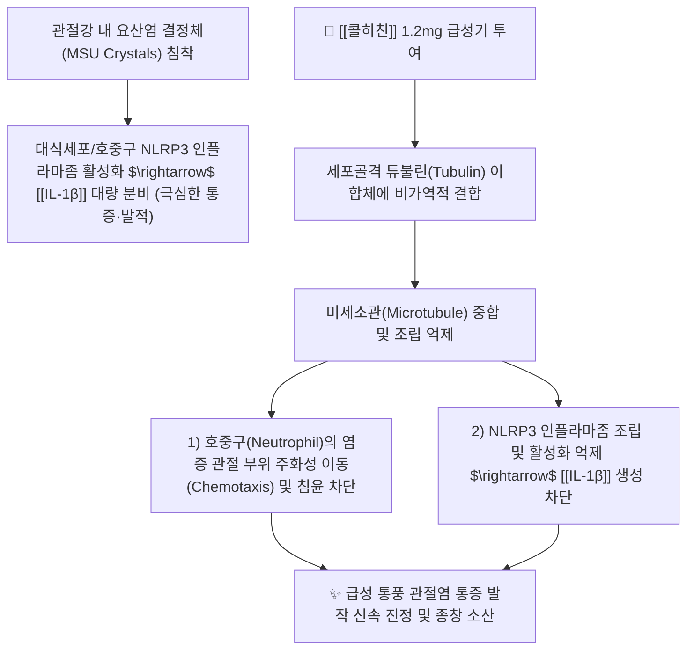

---
aliases:
  - Colchicine
  - 콜키신
  - 콜히친정
  - 유유콜키신
  - Colchicum
tags:
  - 약리/양방약
  - 통풍치료제
  - 항염증제
  - 미세소관억제제
  - 전문의약품
---

# 💊 [[콜히친]] (Colchicine, 콜키신 / Colchicine, M04AC01)

> **핵심 3줄 요약 (Key Summary)**:
> - 🧪 약물 분류 & 표적: 백합과 가을사프란(*Colchicum autumnale*)에서 유래한 천연 알칼로이드계 **급성 통풍 항염증제**, 튜불린(Tubulin)에 결합하여 **미세소관(Microtubule) 중합을 억제**.
> - 🎯 주요 적응증 & 원내외 처방 패턴: **급성 통풍 관절염 발작의 1차 치료 및 발작 예방 요법**, 가족성 지중해열(FMF), 재발성 심낭염 (발작 시작 12시간 이내 투여 시 극적 효과).
> - 🔬 분자약리 기전 & 약동학(PK/PD): 요산염 결정체에 의한 호중구 주화성(Chemotaxis), 탐식 및 NLRP3 인플라마좀 활성화를 차단하며, 간 CYP3A4 대사 및 P-당단백질(P-gp)을 통해 배설.
> - ⚠️ 블랙박스 경고 & 주요 부작용: **치료역이 매우 좁아(Narrow Therapeutic Index)** 과량 복용 시 심각한 수양성 설사·구토, 골수 억제, 횡문근융해증 및 다발성 장기부전 위험 (강력한 CYP3A4/P-gp 억제제 병용 금기).

---

## 📌 목차
1. [기본 약물 정보 & 시판 제품·알약 식별 (Pill Identification)](#1-기본-약물-정보--시판-제품알약-식별-pill-identification)
2. [분자약리학적 작용 기전 (MOA) & 화학 구조](#2-분자약리학적-작용-기전-moa--화학-구조)
3. [약동학적 특성 (ADME: 흡수·분포·대사·배설)](#3-약동학적-특성-adme-흡수분포대사배설)
4. [진료과별 다빈도 처방 패턴 & 임상 적응증 (Sweet Spot vs 금기)](#4-진료과별-다빈도-처방-패턴--임상-적응증-sweet-spot-vs-금기)
5. [약물 상호작용 & 병용 금기 매트릭스](#5-약물-상호작용--병용-금기-매트릭스)
6. [부작용·독성 발현 기전 & 응급 해독 프로토콜](#6-부작용독성-발현-기전--응급-해독-프로토콜)
7. [💡 사용자 진료실 핵심 필기 & 한의 임상 연계·테이퍼링 팁 (원문 보존)](#7--사용자-진료실-핵심-필기--한의-임상-연계테이퍼링-팁-원문-보존)
8. [출처 및 학술 참고 문헌 (References)](#8-출처-및-학술-참고-문헌-references)

---

## 1. 기본 약물 정보 & 시판 제품·알약 식별 (Pill Identification)

| 항목 | 상세 정보 |
| :--- | :--- |
| **일반명 (Generic Name)** | [[콜히친]] (Colchicine, INN/USAN) |
| **약효 분류 (Class)** | 미세소관 중합 억제 항통풍제 (Antigout agent, Microtubule disruptor) |
| **ATC 코드** | M04AC01 (Preparations with no effect on uric acid metabolism) / 394 통풍치료제 (전문의약품) |
| **약국 시판 제품 (OTC 일반약)** | 전문의약품(ETC)으로 처방전 필수 (일반약 없음) |
| **병원 처방 의약품 (ETC 전문약)** | • **단일 정제 (0.6mg)**: **콜키신정(0.6mg, 유유제약 오리지널)**, 이연콜키신정 (0.6mg) • **해외 시판 제품**: 콜크리스(Colcrys 0.6mg) |
| **상용 용법·용량** | • **급성 통풍 발작 초기 요법 (Low-dose regimen)**: 최초 발작 인지 시 **1.2mg(2정) 즉시 복용 $\rightarrow$ 1시간 후 0.6mg(1정) 추가 복용** (1회 발작당 1.8mg 한도, 3일간 재투여 금지) • **통풍 발작 예방 요법**: 1일 0.6mg을 1~2회 분할 복용 (요산 저하제 시작 시 3~6개월 병용) |

### 1.1 대표 시판 제품 및 함유 복합제 매핑 (Brand Identification & Combinations)

| 구분 | 대표 제품명 / 브랜드 | 함유 성분 및 1회당 함량 | 제형 및 특징 | 주요 적응증 및 복약 지도 핵심 |
| :--- | :--- | :--- | :--- | :--- |
| **오리지널 단일정 (ETC)** | [[콜키신정]] (유유제약) | 콜키신 단일 (0.6mg) | 담황색 원형 소형 정제 | 급성 통풍 발작 1차약, 설사 발생 시 즉시 중단 |
| **급성 통풍 2제 병용** | 콜키신 + NSAIDs 병용요법 | [[콜히친]] (0.6mg) + [[나프록센]] (500mg) | 개별 제제 병용 | 극심한 통증기 호중구 침윤 및 프로스타글란딘 동시 제어 |

![[콜히친_패키지_박스.jpg|400]]
> [그림 1: 류마티스내과 및 정형외과에서 급성 통풍 발작 치료에 1차로 처방되는 콜키신정 0.6mg 패키지]

![[콜히친_블리스터_알약.jpg|400]]
> [그림 2: 콜히친 0.6mg 담황색 소형 정제 알약 성상 및 PTP 블리스터 포장]

---

## 2. 분자약리학적 작용 기전 (MOA) & 화학 구조

![[콜히친_화학구조.png|300]]
> [그림 3: 콜히친의 2D 평면 화학 분자 구조식 (N-[(7S)-1,2,3,10-tetramethoxy-9-oxo-5,6,7,9-tetrahydrobenzo[a]heptalen-7-yl]acetamide, 분자량 399.44 g/mol, PubChem CID 6167)]

### 1) 미세소관(Microtubule) 중합 억제 기전
* 콜히친은 가용성 튜불린(Tubulin) 이합체와 복합체를 형성하여 미세소관 단백질의 중합(Polymerization)을 억제합니다.
* 미세소관은 세포의 골격과 물질 수송을 담당하므로, 콜히친에 의해 미세소관이 붕괴되면 **호중구가 염증 부위로 이동하는 아메바 운동(주화성, Chemotaxis)과 식세포 작용이 완전히 마비**됩니다.

### 2) NLRP3 인플라마좀 차단
* 관절강 내 요산염 결정체(MSU)가 대식세포를 자극하여 인터루킨-1($\text{IL}-1\beta$)을 생성하는 핵심 경로인 **NLRP3 인플라마좀(Inflammasome)의 조립을 직접적으로 억제**하여 폭발적인 염증 반응을 조기에 진화합니다.

---

## 3. 약동학적 특성 (ADME: 흡수·분포·대사·배설)

| 약동학 파라미터 | 수치 및 임상적 의미 |
| :--- | :--- |
| **생체이용률 (Bioavailability, F)** | 약 45% (개인차 큼) |
| **최고혈중농도 도달시간 (Tmax)** | **약 0.5 ~ 2.0 시간** (백혈구 내 농도는 혈청 농도의 수배로 장시간 유지) |
| **혈장 단백결합률 (Protein Binding)** | 약 39% (주로 알부민 결합) |
| **간 대사 효소 (Metabolism)** | 간 마이크로솜 **CYP3A4**에 의해 2-O-탈메틸콜히친 및 3-O-탈메틸콜히친으로 탈메틸화 대사 |
| **수송체 (Transporter)** | **P-당단백질(P-gp)**의 주요 기질 (소화관 배출 및 담즙/신장 배설 관여) |
| **소실 반감기 (Elimination t1/2)** | **약 20 ~ 40 시간** (백혈구 내 반감기는 60시간 이상으로 매우 길어 체내 축적 주의) |
| **주요 배설 경로 (Excretion)** | 투여량의 65%는 신장 소변으로, 나머지는 담즙/분변으로 배설 (신부전 환자 축적 독성 극심) |

---

## 4. 진료과별 다빈도 처방 패턴 & 임상 적응증 (Sweet Spot vs 금기)

### 1) 주요 진료과별 처방 패턴
* **류마티스내과 / 정형외과 / 응급의학과**:
  * 급성 통풍 발작 환자에게 발작 시작 12시간 이내 1차 표준 약물로 처방.
  * 요산 저하제([[페북소스탯]]) 시작 후 3~6개월간 발작 예방 목적으로 0.6mg qd 병용.
* **순환기내과**:
  * 급성 및 재발성 심낭염(Pericarditis) 환자의 재발률 감소를 위해 처방.

### 2) 최적 적응증 (Sweet Spot) vs 신중 투여 및 금기
* **[✅ 최적 적응증 (Sweet Spot)]**:
  * **통풍 발작 발생 12~24시간 이내의 초급성기 환자**.
  * **NSAIDs 복용이 불가능한 소화성 궤양·심부전 통풍 환자**.
* **[⚠️ 신중 투여 및 금기 (Caution / Contraindication)]**:
  * **중증 간장애 및 말기 신장애 환자 절대 금기**: 치명적 약물 축적 독성.
  * **강력한 CYP3A4/P-gp 억제제 복용 환자 절대 금기**.
  * **임산부 및 수유부 금기** (최기형성 위험).

---

## 5. 약물 상호작용 & 병용 금기 매트릭스

| 병용 약물 / 물질 | 상호작용 기전 | 임상적 위험 및 결과 | 처방 및 티칭 가이드 |
| :--- | :--- | :--- | :--- |
| 클라리스로마이신 (마크로라이드계) | CYP3A4 및 P-gp 동시 강력 억제 | **콜히친 혈중 농도 3~4배 폭증 $\rightarrow$ 치명적 독성(사망 사례 다수)** | **병용 절대 금기 (Contraindicated)** |
| 아졸계 항진균제 (케토코나졸, 이트라코나졸) | CYP3A4 효소 억제 | 콜히친 청소율 급감 및 골수 억제 유발 | 병용 금기 또는 콜히친 75% 감량 |
| 스타틴계 지질강하제 ([[아토르바스타틴]]) | 근육 독성 시너지 | **횡문근융해증(Rhabdomyolysis) 및 급성 신부전** | 병용 시 근육통 및 CK 수치 모니터링 |
| 청열사습 한약 ([[사묘환]], [[청열사습탕]]) | 관절 습열(濕熱) 배출 및 요산 억제 | 급성 통풍 염증 완화 및 콜히친 조기 단약 | **양약 복용 1시간 후 한약 복용** |

---

## 6. 부작용·독성 발현 기전 & 응급 해독 프로토콜

* **치료역이 좁은 약물의 독성 진행 단계**:
  1. **초기 위장관 독성 (중독의 첫 징후)**: **심한 설사(수양성 설사 80%), 구토, 복통** (위장관 상피세포 유사분열 억제).
  2. **다발 장기 독성 (24~72시간)**: 혈관 허탈, 패혈성 쇼크, 급성 신부전, 횡문근융해증.
  3. **골수 억제 (7일 이후)**: 백혈구 감소증, 혈소판 감소증, 재생불량성 빈혈, 탈모.
* **응급 처치**:
  * 복용 중 설사나 복통이 시작되면 **즉시 복용을 중단**해야 하며, 특이 해독제가 없으므로 대증 치료(수액 공급 및 위세척) 시행.

---

## 7. 💡 사용자 진료실 핵심 필기 & 한의 임상 연계·테이퍼링 팁 (원문 보존)

* **진료실 실전 문진 체크리스트 (3대 핵심 질문)**:
  1. **"엄지발가락 관절이 빨갛게 붓고 아파서 콜키신을 하루에 몇 알 드셨나요?"**:
     * 과거 고용량 복용법(시간당 1알씩 설사할 때까지)은 절대 금기이며, 최초 2알(1.2mg) + 1시간 뒤 1알(0.6mg)로 총 3알만 복용하도록 지도.
  2. **"약 복용 후 물 설사를 하거나 배가 심하게 아프지 않으셨나요?"**:
     * 설사가 시작되면 콜히친 독성의 신호이므로 즉각 복용 중단 지도.
  3. **"무좀약(항진균제)이나 항생제(클라리스로마이신), 고지혈증약을 드시고 계신가요?"**:
     * 치명적인 CYP3A4 상호작용 전수 스크리닝.

* **한의 치료(침·약침·한약) 연계 및 양약 테이퍼링(감량) 전략**:
  1. **급성 통풍 발작 부위 약침 치료**:
     * 환부 직접 자침을 피하고, 은백, 대도, 태충 혈자리 원위 취혈 및 황련해독탕약침, 중성어혈약침을 시술하여 관절강 열독(熱毒)을 소산.
  2. **통풍 습열(濕熱) 해소 한약 배오 및 콜히친 조기 단약**:
     * 급성기 염증 완화 후 [[당귀점통탕]], [[사묘환]], [[대강활탕]]을 투여하여 체내 요산 대사를 개선하고 독성이 강한 콜히친 복용을 2~3일 내 신속 단약 유도.

---

## 8. 출처 및 학술 참고 문헌 (References)

1. **식품의약품안전처 (MFDS)**. 의약품 품목허가사항 및 안전성 서한: 콜키신 제제 (2023).
2. **Terkeltaub, R. A. et al. (2010)**. *High versus low dosing of oral colchicine for early acute gout flare: Twenty-four-hour outcome of the first multicenter, randomized, double-blind, placebo-controlled, parallel-group, dose-comparison colchicine study*. **Arthritis & Rheumatism**, 62(4), 1060-1068.
   - [PubMed (PMID: 20131255)](https://pubmed.ncbi.nlm.nih.gov/20131255/) | [DOI](https://doi.org/10.1002/art.27327)
   - **[연구 요약]**: 대규모 AGREE 임상시험에서 초기 저용량 요법(1.2mg + 1시간 후 0.6mg)이 고용량 요법과 동등한 진통 효과를 내며 설사 부작용을 대폭 줄임을 증명.
3. **Tardif, J. C. et al. (2019)**. *Efficacy and Safety of Low-Dose Colchicine after Myocardial Infarction*. **New England Journal of Medicine**, 381(26), 2497-2505.
   - [PubMed (PMID: 31733140)](https://pubmed.ncbi.nlm.nih.gov/31733140/) | [DOI](https://doi.org/10.1056/NEJMoa1912388)
   - **[연구 요약]**: 4,700명 대상 COLCOT 대규모 3상 임상시험에서 저용량 콜히친(0.5mg/일)이 심근경색 후 심혈관계 사건 위험을 유의미하게 감소시킴을 입증.
